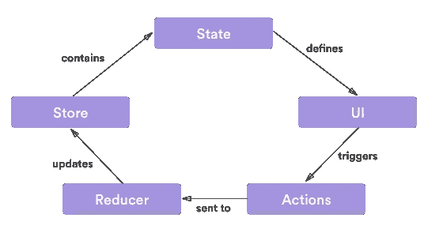

# 在 Android 上实施 Redux 的经验教训

> 原文：<https://medium.com/hackernoon/lessons-learned-implementing-redux-on-android-cba1bed40c41>

当许多人想到 Redux 架构时，他们会想到 web。这并不奇怪，因为它起源于那里，并在那里广受欢迎。其核心是一个简单的应用程序架构，描述了一个组织和操作状态的系统。这意味着它可以应用于任何类型的应用程序开发，包括移动应用程序。

对于那些不熟悉的人来说，Redux 架构以严格的单向数据流为中心。应用程序中的所有数据通过组件单向流动。在高层次上，Redux 旨在确保确定性视图渲染以及确定性状态转换和再现。这里的确定性指的是知道在任何给定的时间点，您的应用程序状态总是有效的，并且可以转换为另一个可预测的有效状态的能力。然后，您的 UI 组件会根据给定的状态进行更新。

Redux 架构围绕三个主要组件展开:

# 1.商店

这只是一个保存应用程序状态的状态容器。它保存了一个不可变的引用，表示应用程序的整个状态，并且只能通过向它发送一个动作来更新。

# 2.行动

动作包含要发送到商店的信息。它们代表了我们希望我们的状态如何改变。例如，考虑以下操作:

```
data class AddTodoAction(val text: String)
```

它将被分派到给定的存储以更新应用程序状态:

```
store.dispatch(AddTodoAction("Write blog post"))
```

# 3.还原剂

因为动作和存储更新本身都没有状态，所以我们需要一个专门做这件事的组件。这就是减速器的用武之地。他们只是采取一个行动和状态，并发出一个新的状态。

```
fun reduce(oldState: AppState, action: Action) : AppState {
    return when (action) {
        is AddToDoAction -> {
            oldState.copy(todo = ...)
        }
        else -> oldState
    }
}
```

现在我们已经了解了组件，让我们看看它们是如何组合在一起的。Redux 流程非常简单。您的应用程序会在视图图层上渲染应用程序状态的内容。用户交互*分派*动作，这些动作被转发给 Reducers，后者操作并发出新的应用状态。



我最近着手在一个相当大的项目中实现 Redux 架构，所以我想就我在这个过程中学到的一些经验给出一个观点。

# 1.不要在你的应用中有多个商店

一开始，在你的应用中拥有多个商店似乎是个不错的主意，尤其是当你的目标是关注点分离的时候。然而，每个存储及其数据流可以被认为是一个闭环系统，使得它们之间的状态很难同步。尝试这样做通常需要您尝试调度状态更改以响应其他状态更改，这可能会导致无限循环。

```
mainStore.dispatch(FetchGridItemsAction())
...override fun onNewState(newState: MainState) {
    // FIXME: You should never dispatch an event in response to a state change.
    // This can potentially create an infinite loop.
    homeStore.dispatch(UpdateHomeGridAction(newState.gridState));
    ...
}
```

以这种方式拥有多个商店会使您的架构非常僵化，从长远来看很难改变。在需求随时可能变化的环境中，这尤其成问题。

更好的方法是维护一个包含多个子状态的全局应用程序状态。

```
data class AppState(val LoginState,
                    val HomeScreenState,
                    val GridState )
```

# 2.让你的应用程序状态尽可能的平坦

深度嵌套的状态导致了大量的样板代码，并且很难更新，因为一切都是不可变的，并且需要您为每个状态更新创建一个新的应用程序状态。虽然让状态数据模型与 UI 的层次结构相匹配看起来很直观，但这使得更新状态的深层嵌套部分变得非常困难。例如，考虑以下数据模型类:

```
data class State(val sections: List<Section>)open class Section(val articles: List<Article>)
class Home(articles: List<Article>) : Section(articles)
class Discover(articles: List<Article>) : Section(articles)class Article
```

实例化和更新状态对象将如下所示:

```
val state = State(sections = listOf(
                  Home(listOf(article1, article2)),
                  Discover(listOf(article1, article2))))
```

即使使用 Kotlin 出色的复制机制，更新深度嵌套的属性(如本文中的文章)也会非常繁琐:

```
val newHome = Home(listOf(newArticle, state.sections[0].articles[1]))
state.copy(sections = listOf(newHome, state.sections[1]))
```

这里的解决方案是尽可能避免嵌套。对于包含集合的状态对象来说尤其如此。

> 你的应用程序状态不需要匹配你的用户界面的层次结构。

```
val state = State(sections = listOf(
                 Home(refs=listOf(0, 1),
                 Discover(refs=listOf(0, 1))),
                 articles = listOf(article1, article2))
```

# 3.你可以拥有动作创作者和中间件的健康组合

动作创建者基本上是动作的工厂类。它们允许您在分派动作之前封装您可能想要做的事情，例如发出网络请求或访问共享偏好设置等，并在完成任务后返回一个动作:

```
class TodoActionCreator {
    fun createAddTodoAction(content: String): Action {
        ... // do stuff
        return AddTodoAction(transformedContent)
    }
}
```

另一方面，中间件很像 Reducers，除了它们不创建新的应用程序状态。相反，它们执行任务并选择将动作转发给 Reducers，丢弃它们，或者一起分派新的动作。中间件的一个重要用途是在流程中处理动作时记录动作:

```
class LoggerMiddleware {
    fun interact(store: Store, action Action) {
        logDebug { action.toString() }
    }
}
```

中间件最适用于您希望在整个应用程序中全局地做一些事情的情况。日志、分析和持久性等东西是中间件的绝佳候选。然而，倾向于特定于用例的动作，比如 API 调用，通常应该委托给动作创建者。

# 4.减速器应该是纯函数

Redux 架构鼓励使用函数式方法来组合纯函数。纯函数是本质上确定的基本函数。这意味着如果用相同的输入调用，给定函数的输出将总是产生相同的结果。这是因为纯函数没有内部状态，不会留下副作用。

减速器应体现这一理念。它们应该总是接受一个状态和一个动作，然后返回一个新的状态。

```
class Reducer {
    fun reduce(state: State, action: Action) : State {
        ...
    }
}
```

还原器正确还原状态所需的任何附加信息都应该在操作中传递，还原器应该考虑状态的不变性并总是返回一个新状态。

> *如果你需要一个副作用来响应一个动作，考虑使用一个中间件来代替。*

# 5.单元测试拯救生命和头发

在我看来，单元测试是 Redux 架构真正闪光的地方。因为归约器是没有内部状态的纯函数，所以它们在本质上是确定性的。对于给定的输入状态和动作，它们总是返回相同的输出状态。这使得它们非常容易测试。

此外，假设状态和动作是轻量级的数据对象，您不需要对测试进行任何模拟。简单地构造你的状态和动作的实例。测试一个减速器看起来像这样:

```
val reducer = MyReducer()
val state = MyState(...)
val action = MyAction(...)val newState = reducer.reduce(state, action)assert(newState …)
```

如果您需要通常从外部 API 或数据存储等不同位置获取的数据。您可以通过为您的操作创建一个“哑”构造函数以及一个提供您需要的数据的智能构造函数/工厂来保持您的 reducer 测试简单。

```
class MyAction(val data1: String, val data2: String) { companion object {
    fun create(apiResponse: Response, datastore: Datastore): MyAction {
      val data1 = apiResponse…
      val data2 = datastore…
      return MyAction(data1, data2)
    }
  }}
```

因此，您的减速器仍然非常容易测试。

```
val action = MyAction(data1 = "data1", data2 = "data2)
val newState = reducer.reduce(state, action)
```

您可以单独测试工厂，在那里您可能想要使用模拟。

```
val response = mock<Response>()
val datastore = mock<Datastore>()
...
val action = MyAction.create(response, datastore)assert(action.data1 …)
```

# 6.用科特林就行

Redux 架构当然有很多关于构造组件的仪式。虽然这些有助于随着项目的增长保持事情的清晰和一致，但是您对语言的选择可能决定了您能够管理样板文件的程度。

数据类、when 语句、多个顶级类和高阶函数等特性极大地提高了代码的清晰度。例如，当试图匹配减速器中的动作时，可以选择使用`instanceof`检查；

```
if (action instanceof AddTodoAction) {
    return reduceAddTodoAction(oldState, action);
} else if (action instanceof RemoveTodoAction) {
    return reduceRemoveTodoAction(oldState, action);
} else if (...) {
    ...
}
return oldState;
```

这可能会很快变得非常笨拙。另一种选择是在开关中使用字符串常量作为动作以及字符串匹配，但这并没有好到哪里去。Kotlin `when`语句给出了一个不错的解决方案。

```
return when (action) {
    is AddTodoAction -> reduceAddTodoAction(oldState, action)
    is RemoveTodoAction -> reduceRemoveTodoAction(oldState, action)
    else -> oldState
}
```

# 结论

虽然 Redux 可能起源于网络，但它的架构背后有许多非常好的想法，我们可以从中学习并将其引入 Android。虽然我们的平台、语言和[工具](https://hackernoon.com/tagged/tools)可能不同，但我们有很多相同的基本问题，比如努力将我们的观点和业务逻辑之间的关注点完全分离。

Redux 绝不是一个完美的银弹，但在一天结束时；没有建筑是真正的。它仍然相对较新，但显示出很大的前景，我们很高兴看到它在 Android 上成熟。如果你对 Redux 感兴趣，我推荐你去看看 Evan Tatarka 的 [Redux](https://github.com/evant/redux) 库或 [ReKotlin](https://github.com/ReKotlin/ReKotlin) ，这是一个 ReSwift 的端口。

> 最初发表于[推手博客](https://blog.pusher.com/lessons-learned-implementing-redux-on-android/)。