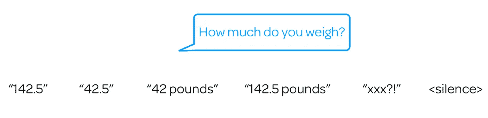
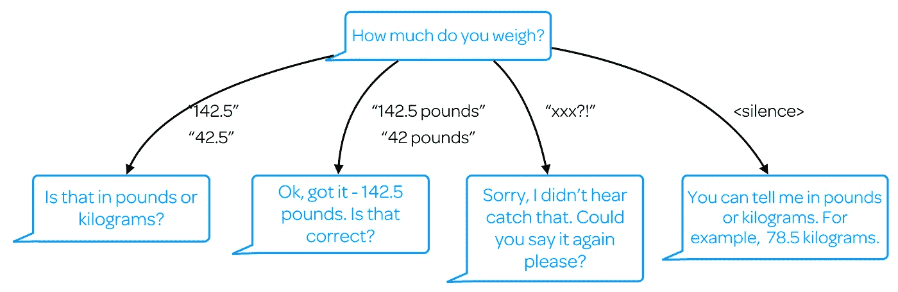
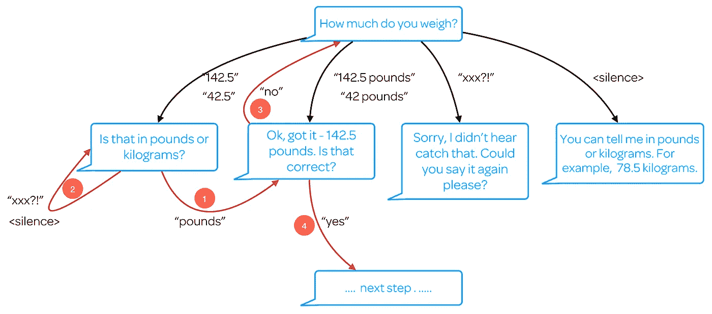
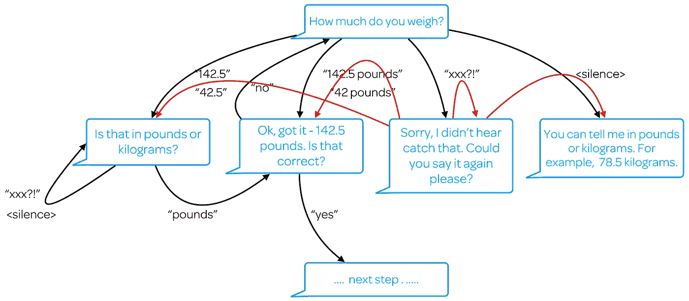
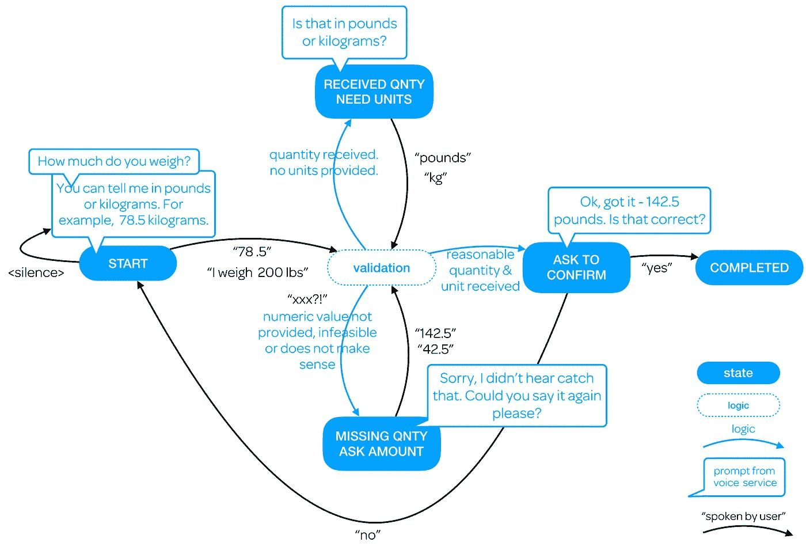
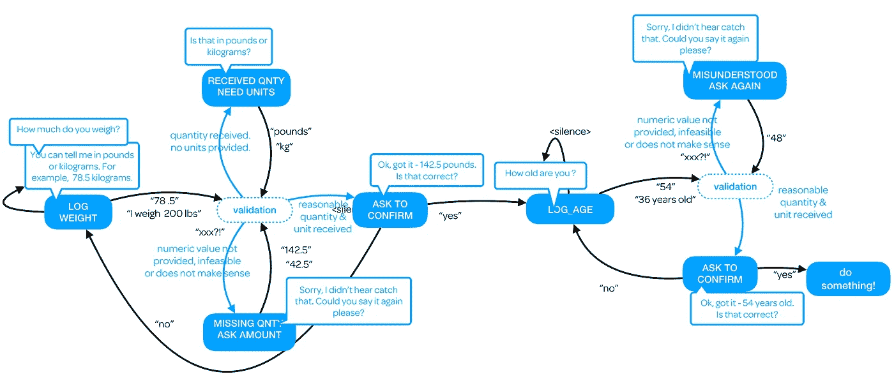

# 从网络到语音开发的经验教训。

> 原文：<https://medium.com/hackernoon/lessons-learned-moving-from-web-to-voice-development-35daa1d301db>

*NLU(自然语言理解)并不一定是从 web 转移到* [*语音开发*](https://hackernoon.com/tagged/voice-development)*——想想受限输入，语境&验证的主要挑战。*

考虑这个非常基本的 web 表单:

加入一些客户端验证来检查数值，就大功告成了。这个问题已经解决了几十年了。

现在，让我们假设你正在建立一个 Alexa 技能，并希望提示相同的信息。你希望它像这样……

Alexa (blue) prompting & user (black) replying.

您创建了一个意图，该意图使用几个实体(也称为“槽”)来获取数量和单位(公制与英制)，并提供一些示例话语:

> 我重{数量} {单位}
> 我重{数量}
> {数量} {单位}
> {数量}
> 关于{数量} {单位}
> 关于{数量}
> 等。等等。

让 Alexa 或任何 NLU 系统理解这一点非常简单。

但这不是工作所在。用户和 Alexa 有其他计划…

# 声音的发展很难预测

实际上，你可以收到几样东西:

用户可以说出他们的体重而不指定单位(“142.5”)，或者 Alexa 可能无法正确听到他们的体重(“42.5”)，或者可能正确识别了单位但没有识别数量(“42 磅”)。

Alexa 可能会检测到一些甚至不是数字，在这种情况下没有意义的东西(用“xxx？!')尽管这也可能是用户故意切换话题。或者，如果用户根本不回复，或者 Alexa 无法检测到他们的声音，可能会出现沉默。

很快你就会了解到，在声音开发中，你不断地围绕输入的不可预测性和不受约束的本质进行构建。通过 web，您可以将用户的输入限制为一个数值(他们的体重)和两个选择选项中的一个(“lbs”或“kg”)。有了声音，就无界了。

您可以通过在初始提示中为用户提供更多指导来减轻一些风险:

至少我们提供了我们想要单位(指定的磅或千克)的指导，小数也是可以接受的。这并不意味着用户必须提供它们。

任何事情都可能发生，也确实会发生:人们会不断给你惊喜，而技术也不是 100%。嘿，就连我们人类也会听错。

因此，让我们回到我们的对话流程，并考虑对我们的影响:

# 繁重的工作——数据验证

从左至右:

*   如果我们收到一个数字量，但没有单位，我们提示输入单位(磅或千克)
*   如果我们得到了数字和数量，我们可能需要向用户确认我们所听到的是正确的。(“大概”取决于犯错的代价。)
*   如果我们收到的既不是数量也不是有效单位，请重试。
*   如果有必要，我们可以在报告中提供更多的指导。

实际上，还有另一种可能性:

*   如果发送给我们的数字太小或太大(例如 2500 或 2.5)以至于不管单位是什么都不正确，要求用户确认单位是没有意义的…我们可以先检查数字是否正确。

这可能是一个提醒我们自己的好时机，所有这些本质上都是 web 上的一个表单域:

是啊。

# 那么我们该如何处理呢？

依次参考红色的编号箭头:

1.  如果用户告诉我们单位，我们已经知道数量，我们现在可以寻求确认我们是否听到他们的重量是正确的。
2.  与 Alexa 的任何输入一样，我们收到的内容可能根本无法识别。在这种情况下，我们可以再问一次(经常重新措辞)。但是如果这种情况再次发生呢？您需要记录您询问任何提示的次数，如果超过一个合理的数目(3)，就优雅地退出。这是更费力不讨好的工作——这就是为什么有那么多糟糕的技能让自己陷入无尽的循环。
3.  我们可以了解到我们听错了用户，在这种情况下，我们又回到了起点。
4.  在最好的情况下，我们拥有正确的信息—成功！

但是考虑一下其他的选择…

我不想在这种混乱的基础上写代码。你也不知道。当在[设计](https://hackernoon.com/tagged/design)阶段考虑主要路径时，对话流是有用的，但是开发者需要一种更好的方式来表示事物。

# 输入状态

让我们根据状态重新绘制:

虽然这看起来更容易管理，但这并不否定进行大量验证的必要性。

顺便说一句，这也代表了像 [Dialogflow](http://www.dialogflow.com) 这样的对话引擎是如何工作的:通过将话语映射到意图，同时考虑输入上下文(即即将到来的状态)。

只有一个问题…它们的伸缩性不好。

让我们加大赌注，向 web 表单添加另一个字段:

喔。

猜猜它对你的对话流程图或者状态图意味着什么？好了，时间到了，这是我之前烤的一个:

这还没有考虑到像“帮助”、“重新开始”、“返回”、“取消”这样的全局意图，我们在网络上不需要这些东西，因为，你知道，用户有一个后退按钮，可以滚动，并且不需要在 8 秒内回复。

在这个阶段，任何来自成熟 web 框架的开发人员都会问自己，他们是否真的想为每一个可能发生的事情付出这么多努力，这是可以原谅的。

# 准备好管理上下文

Dialogflow 可能会基于传入状态进行路由，但 Alexa 不会这样工作。

Alexa 本质上是一个扁平的意向列表。当它听到“是”时，它不知道用户是在确认他们的年龄还是体重。当它听到“78”时，它不知道你刚才是问了他们的体重还是年龄..

底线是，如果你正在为 Alexa 开发，那么管理所有的上下文和路由完全取决于你。

# 快乐不止于此——内容管理

还记得这个提示吗？

先不说这不是很自然的说话方式，很长。第一次听的时候可能会被接受，但是你不需要第二次就全听完。因此，如果您正在构建将被重复使用的服务，基于用户的体验来提供内容(包括提示)是很好的。

你不需要在网站上这样做，因为高级用户会快速/快捷地到达他们想去的地方，沿着他们通常的路径点击，而只是略读文本。网络是非线性的，而音频流不是。

即使你为高级用户准备了一个简短的版本，他们也不想每天都听到完全相同的措辞。所以你可能会提供一些措辞上的变化。

谢天谢地，这是框架可以提供帮助的一个领域。不过话说回来，你也可以自己卷这个。

有些人可能认为这是一个乏味的家务，但不是你，你坏蛋，你爱你的手艺。

# 那么你从中学到了什么呢？

首先，不要绝望。如果你正在创建一个简单的技能，仅仅是按照用户发出的命令来操作，你将会避开大部分这种情况。另外，随着时间的推移，它会变得更容易——随着语音识别、NLU 和开发人员框架的进一步改进。

同时:

1.  **约束输入**——这是对话式 UI 中游戏的名字。你想把不可预测性降到最低。一些好声音 UX 设计可以帮助，但只是接受事情不会是可预测的。
2.  **管理上下文**——你会花很多时间做这件事！网站有很多隐含的上下文:用户在网站的什么位置，他们点击了哪些链接——这些都让你知道他们在旅程中的什么位置。在语音上，一切都在你的掌握之中。
3.  **验证。**您正在使用 web 表单约束输入:使用选择列表和客户端验证来约束对服务器的输入……但是您仍然必须将任何请求视为潜在的可疑请求。输入验证并不困难，只是有点乏味。比如 1996 年的 CGI 剧本很乏味。
4.  个性化:我们在网上谈论了很多，但有多少人真正做到了呢？有了语音你别无选择——为新手、中级和高级用户构建内容；因为你已经了解他们了。这可能是有趣的事情。
5.  **测试**，测试再测试！测试网站要容易得多，因为路径的数量是有限的。你不必考虑到 Alexa 将某人的体重误解为“4”或“堡垒”。网站出现这种情况的唯一方式是，如果有人篡改了你提交的表单或者输入了错误的 URL 在这种情况下，他们会得到 404 或 500 分……他们可以摆脱这种情况。在声音中，就像在生活中一样，任何事情都可能发生。

祝你好运，谢谢你读到这里。

附言:如果你在让 Alexa 搜索用户话语时遇到困难，[这些提示可能会有所帮助](/voiceflow/tips-and-gotchas-using-alexa-custom-slots-b88f97f26b06)。