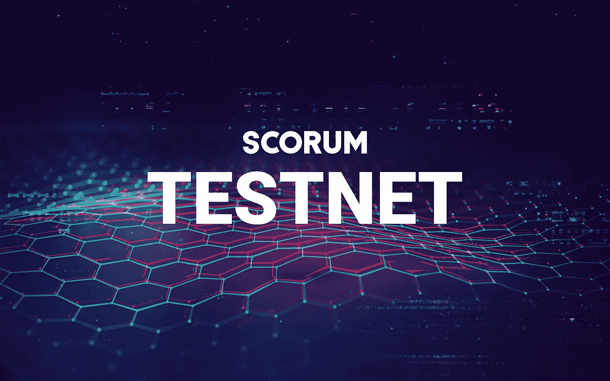

# 让游戏开始:Scorum 推出测试网！

> 原文：<https://medium.com/hackernoon/let-the-games-begin-scorum-launches-testnet-1135c927a422>

## Scorum 公开众筹不到三周，开发团队已经实现了 Scorum 项目的一个重要里程碑。

Scorum 区块链的第一个测试网现已在 Github 上上线[。在上个月发布了用于在石墨烯框架上实现**原子交换**的](https://github.com/scorum/scorum/wiki/Live-test-net) [Scorum 解决方案](https://hackernoon.com/development-update-scorum-executes-atomic-swap-between-litecoin-and-scr-f91ddebb4269)之后，我们的团队一直在努力工作，为 Scorum 区块链的测试网首次亮相做准备。

对于那些已经加入众筹的人来说，这将是一个关于 Scorum 生存能力的好消息。对于那些刚刚接触这个将为全世界球迷重塑体育娱乐的项目的人来说，欢迎来到一个认真对待实现其目标并付诸行动而不是简单炒作的区块链项目。

## **第一个测试网包括的内容:**

Scorum 区块链的第一个版本以注册和奖励池为基础，当新用户注册并为 Scorum 博客平台的奖励生态系统奠定框架时，将向他们分发**Scorum Power token**。关于奖励系统设计的全部细节，请看白皮书。

此外，还有重大的重构和原子交换功能到测试网的集成。Scorum 的 Github repo 现在概述了如何运行自己的见证节点并将其连接到 Testnet。注册委员会是一群人，他们可以从注册池中提取 SCR 来创建帐户。

## **近期发展:**

在接下来的日子里，Scorum 开发团队将专注于在 Testnet 中添加**点对点投注交换功能。与此同时，奖励系统的功能将被进一步更新，熔渣能量和熔渣硬币之间的价值关系将被精确定义。**

Scorum 开发团队邀请任何对测试、学习和更好地理解为 Scorum 区块链实现的**石墨烯开发协议**感兴趣的人来设置一个节点，亲自看看它是如何运行的。如果你有兴趣成为 Scorum 区块链的街区签名代表，请加入我们在 Telegram 上的[街区制作人聊天](https://t.me/scorum_BLOCK_Producers)。

Scorum 的区块链和钱包将于三月**在主网**推出！

[众筹](http://www.scorumcoins.com)仍然开放，因此您还有时间通过[的加盟计划](/@scorum/believe-in-blockchain-tech-and-love-sports-a5daaf051f89)获得您的 SCR 代币并获得奖金 SCR。