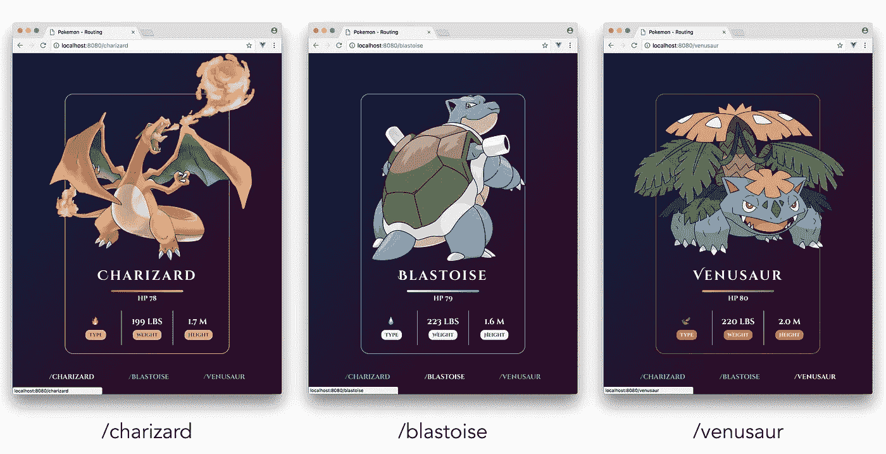

# 让我们构建一个定制的 Vue.js 路由器

> 原文：<https://medium.com/hackernoon/lets-build-a-custom-vue-js-router-7de634be87c4>

## 作者[哈桑·吉尔德](https://twitter.com/djirdehh)


*本文交叉发布于 CSS-Tricks-*[*https://css-tricks.com/build-a-custom-vue-router/*](https://css-tricks.com/build-a-custom-vue-router/)

有大量的教程[在解释 Vue 的官方路由库](https://alligator.io/vuejs/intro-to-routing/)`[vue-router](https://router.vuejs.org/en/)`如何集成到现有的 Vue 应用中做了大量的工作。`vue-router`非常出色，它为我们提供了将应用程序组件映射到不同浏览器 URL 路径所需的项目。

但是，简单的应用程序通常不需要像`vue-router`这样成熟的路由库。在本文中，我们将使用 Vue 构建一个简单的定制客户端路由器。通过这样做，我们将了解构建客户端路由需要处理什么，以及哪里可能存在潜在的缺点。

虽然本文假设了 Vue.js 中的基础知识；当我们开始写代码时，我们将彻底地解释事情！

# 按指定路线发送

首先也是最重要的:让我们为那些可能不熟悉这个概念的人定义一下**路由**。

在 web 开发中，路由通常是指根据浏览器 URL 派生的规则来分割应用程序的 ui。想象一下，点击一个链接，网址从`https://website.com`转到`https://website.com/article/`。那是路由。

路由通常分为两个主要类别:

*   **服务器端路由:**每次 URL 改变时，客户端(即浏览器)都会向服务器发出请求*。*
*   **客户端路由:**客户端*只有*在初始页面加载时向服务器发出请求。基于 URL 路由对应用程序 UI 的任何更改都在客户端处理。

客户端路由是术语**单页面应用**(或简称 SPA)出现的地方。spa 是只加载*一次*的 web 应用，并且可以通过用户交互*动态更新*，而无需向服务器发出后续请求。有了 SPAs 中的路由， *JavaScript 就是动态呈现不同 UI 的驱动力*。

现在我们已经对客户端路由和 spa 有了一个简单的了解，让我们对将要做的事情有一个大致的了解！

# 案例研究:神奇宝贝

我们旨在构建的应用程序是一个简单的神奇宝贝应用程序，它根据 URL 路由显示特定神奇宝贝的详细信息。


该应用程序将有三个唯一的 URL 路由:`/charizard`、`/blastoise`和`/venusaur`。根据输入的 URL 路径，将显示不同的神奇宝贝:



此外，页脚链接位于应用程序的底部，通过单击将用户引导至各个路线:


# 我们需要路由吗？

对于像这样的简单应用，我们不一定需要客户端路由器来使我们的应用正常工作。这个特定的应用程序可以由一个简单的父子组件层次结构组成，该层次结构使用 Vue `[props](https://vuejs.org/v2/guide/components.html#Props)`来指定应该显示的信息。这里有一支[笔](https://codepen.io/itslit/full/yvymJL)显示的就是这个:

尽管这款应用在功能上是可行的，但是它缺少了一个大部分网络应用都应该具备的重要特性——响应浏览器导航事件。我们希望我们的神奇宝贝应用程序是可访问的，并显示不同路径名的不同细节:`/charizard`、`/blastoise`和`/venusaur`。这将允许用户刷新不同的页面，并保留他们在应用程序中的位置，将 URL 标记为书签以便以后返回，并可能与其他人共享 URL。这些是在应用程序中创建路线的一些主要好处。

既然我们已经有了要做什么的想法，让我们开始建造吧！

# 准备应用程序

一步一步来的最简单的方法(如果你愿意的话)是克隆我建立的 GitHub repo:

> [**GITHUB 回购**](https://github.com/djirdehh/pokemon-routing)

克隆后，安装项目依赖项，包括:

```
npm install
```

让我们简单地看一下项目目录。

```
$ ls
README.md
index.html
node_modules/
package.json
public/
src/
static/
webpack.config.js
```

项目支架中还存在隐藏文件`.babelrc`和`.gitignore`。

这个项目是一个简单的 webpack 配置的应用程序，使用 Vue 命令行界面`[vue-cli](https://github.com/vuejs-templates/webpack-simple)`搭建。

`index.html`是我们声明 DOM 元素的地方——`#app`——我们将使用它来挂载我们的 Vue 应用程序:

```
<!DOCTYPE html>
<html lang="en">
  <head>
    <meta charset="utf-8">
    <link rel="stylesheet"
      href="https://cdnjs.cloudflare.com/ajax/libs/bulma/0.5.3/...">
    <link rel="stylesheet"
      href="../public/styles.css" />
    <title>Pokémon - Routing</title>
  </head>
  <body>
    <div **id="app"**></div>
    <script src="/dist/build.js"></script>
  </body>
</html>
```

在`index.html`文件的`<head>`标签中，我们引入了[布尔玛](https://bulma.io/)作为我们应用程序的 CSS 框架和我们自己的`styles.css`文件，该文件位于`public/`文件夹中。

因为我们的重点是 Vue.js 的使用，所以应用程序已经有了所有定制的 CSS 布局。

`src/`文件夹是我们直接工作的地方:

```
$ ls src/
app/
main.js
```

`src/main.js`代表我们 Vue 应用的起点。这是我们的 Vue 实例被实例化的地方，在这里我们声明要被渲染的父组件，以及我们的应用要被挂载到的 DOM 元素`#app`:

```
import Vue from 'vue';
import App from './app/app';new Vue({
  el: '#app',
  render: h => h(App)
});
```

我们从`src/app/app.js`文件中指定组件`App`作为应用程序的主要父组件。

在`src/app`目录中，存在另外两个文件- `app-custom.js`和`app-vue-router.js`:

```
$ ls src/app/
app-custom.js
app-vue-router.js
app.js
```

`app-custom.js`表示使用定制 Vue 路由器完成应用程序的实现(即我们将在本文中构建的内容)。`app-vue-router.js`是使用`vue-router`库完成的路由实现。

对于整篇文章，我们将只介绍`src/app/app.js`文件的代码。说了这么多，我们来看看`src/app/app.js`内的起始代码:

```
**const CharizardCard** = {
  name: 'charizard-card',
  template: `
    <div class="card card--charizard has-text-weight-bold
                has-text-white">
      <div class="card-image">
        <div class="card-image-container">
          
        </div>
      </div>
      <div class="card-content has-text-centered">
        <div class="main">
          <div class="title has-text-white">Charizard</div>
          <div class="hp">hp 78</div>
        </div>
        <div class="stats columns is-mobile">
          <div class="column">&#x1f525;<br>
            <span class="tag is-warning">Type</span>
          </div>
          <div class="column center-column">199 lbs<br>
            <span class="tag is-warning">Weight</span>
          </div>
          <div class="column">1.7 m <br>
            <span class="tag is-warning">Height</span>
          </div>
        </div>
      </div>
    </div>
  `
};**const App** = {
  name: 'App',
  template: `
    <div class="container">
      <div class="pokemon">
        <pokemon-card></pokemon-card>
      </div>
    </div>
  `,
  components: {
    'pokemon-card': CharizardCard
  }
};export default App;
```

目前存在两个组件:`CharizardCard`和`App`。`CharizardCard`组件是一个简单的模板，显示了 Charizard 神奇宝贝的详细信息。`App`组件在其`components`属性中声明了`CharizardCard`组件，并在其`template`中将其呈现为`<pokemon-card></pokemon-card>`。

我们目前只有静态内容，如果运行我们的应用程序，我们将能够看到这些内容:

```
npm run dev
```

并发射`localhost:8080`:


首先，让我们介绍两个新组件:`BlastoiseCard`和`VenusaurCard`，分别包含 Blastoise 和 Venusaur Pokémon 的详细信息。我们可以在`CharizardCard`之后布置这些组件:

```
const CharizardCard = { 
  // ... 
};

**const BlastoiseCard** = {
  name: 'blastoise-card',
  template: `
    <div class="card card--blastoise has-text-weight-bold
               has-text-white">
      <div class="card-image">
        <div class="card-image-container">
          
        </div>
      </div>
      <div class="card-content has-text-centered">
        <div class="main">
          <div class="title has-text-white">Blastoise</div>
          <div class="hp">hp 79</div>
        </div>
        <div class="stats columns is-mobile">
          <div class="column">&#x1f4a7;<br>
            <span class="tag is-light">Type</span>
          </div>
          <div class="column center-column">223 lbs<br>
            <span class="tag is-light">Weight</span>
          </div>
          <div class="column">1.6 m<br>
            <span class="tag is-light">Height</span>
          </div>
        </div>
      </div>
    </div>
  `
};

**const VenusaurCard** = {
  name: 'venusaur-card',
  template: `
    <div class="card card--venusaur has-text-weight-bold
               has-text-white">
      <div class="card-image">
        <div class="card-image-container">
          
        </div>
      </div>
      <div class="card-content has-text-centered">
        <div class="main">
          <div class="title has-text-white">Venusaur</div>
          <div class="hp hp-venusaur">hp 80</div>
        </div>
        <div class="stats columns is-mobile">
          <div class="column">&#x1f343;<br>
            <span class="tag is-danger">Type</span>
          </div>
          <div class="column center-column">220 lbs<br>
            <span class="tag is-danger">Weight</span>
          </div>
          <div class="column">2.0 m<br>
            <span class="tag is-danger">Height</span>
          </div>
        </div>
      </div>
    </div>
  `
};

const App = { 
  // ... 
}

export default App;
```

建立了应用程序组件后，我们现在可以开始考虑如何在这些组件之间创建路由。

# `router-view`

为了建立路由，我们将首先构建一个新的组件，它负责根据应用程序的位置呈现指定的组件。我们将在一个名为`View`的常量变量中创建这个组件。

在我们创建这个组件之前，让我们看看如何使用它。在`App`组件的`template`中，我们将删除`<pokemon-card>`的声明，转而呈现即将到来的`router-view`组件。在`components`属性中；我们将把`View`组件常量注册为要在模板中声明的`<router-view>`。

```
const App = {
  name: 'App',
  template: `
    <div class="container">
      <div class="pokemon">
 **<router-view></router-view>**
      </div>
    </div> 
  `,
  components: {
 **'router-view': View**
  }
};export default App;
```

`router-view`组件将根据 URL 路由匹配正确的神奇宝贝组件。这种匹配将在我们将要创建的`routes`数组中指定。我们将在`App`组件的正上方创建这个数组:

```
const CharizardCard = { 
  // ... 
};
const BlastoiseCard = { 
  // ... 
};
const VenusaurCard = { 
  // ... 
};**const routes** = [
  {path: '/', component: CharizardCard},
  {path: '/charizard', component: CharizardCard},
  {path: '/blastoise', component: BlastoiseCard},
  {path: '/venusaur', component: VenusaurCard}
];const App = { 
  // ... 
};export default App;
```

我们已经将每个神奇宝贝路径设置为它们各自的组件(例如，`/blastoise`将渲染`BlastoiseCard`组件)。我们还将根路径`/`设置为`CharizardCard`组件。

现在让我们开始创建我们的`router-view`组件。

`router-view`组件实质上是一个*安装点*，用于在组件之间动态切换。在 Vue 中我们可以这样做的一个方法是使用保留的`<component>`元素来建立[动态组件](https://vuejs.org/v2/guide/components.html#Dynamic-Components)。

让我们为`router-view`创建一个起点来了解它是如何工作的。如前所述；我们将在名为`View`的常量变量中创建`router-view`。也就是说，让我们在路由声明之后立即设置`View`:

```
const CharizardCard = { 
  // ... 
};
const BlastoiseCard = { 
  // ... 
};
const VenusaurCard = { 
  // ... 
};

const routes = [
  // ...
];

**const View** = {
  name: 'router-view',  
  template: `<component :is="currentView"></component>`,  
  data() {  
    return {  
      currentView: CharizardCard  
    }
  }
};

const App = {
// ... 
};

export default App;
```

保留的`<component>`元素将呈现`is`属性绑定到的任何组件。上面，我们已经将`is`属性附加到了一个`currentView`数据属性，该属性简单地映射到了`CharizardCard`组件。到目前为止，我们的应用程序通过显示`CharizardCard`类似于起点，而不管 URL 路由是什么。

虽然`router-view`在`App`中被适当地渲染，但它目前不是动态的。我们需要`router-view`在页面加载时根据 URL 路径名*显示正确的组件。为此，我们将使用`created()`钩子来过滤`routes`数组，并返回具有与 URL 路径匹配的`path`的组件。这将使`View`看起来像这样:*

```
const View = {
  name: 'router-view',  
  template: `<component :is="currentView"></component>`,  
  data() {  
    return {  
      **currentView: {}**  
    }
  },
  **created()** {
    this.currentView = routes.find(
      route => route.path === window.location.pathname
    ).component;
  }
};
```

在`data`中，我们现在用一个空对象实例化`currentView`。在`created()`钩子中，我们使用 JavaScript 的本地`find()`方法从`routes`返回第一个匹配`route.path === window.location.pathname`的对象。然后我们可以得到带有`object.component`的组件(其中`object`是从`find()`返回的对象)。

在浏览器环境中，`window.location`是一个包含浏览器当前位置属性的特殊对象。我们从这个对象中获取`pathname`,它是 URL 的路径。

现阶段；我们将能够根据浏览器 URL 的状态看到不同的神奇宝贝卡组件！


The `**BlastoiseCard**` component now renders at the `**/blastoise**` route.

我们还应该考虑别的事情。如果输入一个随机的 URL `pathname`,我们的应用程序将会出错，并且不会向视图显示任何内容。

为了避免这种情况，让我们引入一个简单的检查，如果 URL `pathname`与`routes`数组中存在的任何`path`都不匹配，就显示一个“未找到”模板。为了避免重复，我们将把`find()`方法分离成一个名为`getRouteObject()`的组件方法。这会将`View`对象更新为:

```
const View = {
  name: 'router-view',
  template: `<component :is="currentView"></component>`,
  data() {
    return {
      currentView: {}  
    }
  },
  created() {
    if (this.getRouteObject() === undefined) {
      this.currentView = {
        template: `
          <h3 class="subtitle has-text-white">
            Not Found :(. Pick a Pokémon from the list below!
          </h3>
        `
      };
    } else {
      this.currentView = this.getRouteObject().component;
    }
  },
  methods: {
    getRouteObject() {
      return routes.find(
        route => route.path === window.location.pathname
      );
    }
  }
};
```

如果`getRouteObject()`方法返回`undefined`，我们显示一个“未找到”模板。如果`getRouteObject()`从`routes`返回一个对象，我们将`currentView`绑定到该对象的组件。现在，如果输入一个随机的 URL，用户将会收到通知:


The “Not Found” view is rendered if the URL `pathname` does not match any of the values in the routes array.

“未找到”模板告诉用户从列表中选择一个神奇宝贝。这个列表将是我们创建的链接，允许用户导航到不同的 URL 路由。

厉害！我们的应用程序现在正在响应一些外部状态，即浏览器的位置。`router-view`根据应用程序的位置决定显示哪个组件。现在，我们需要构建一些链接来*改变浏览器的位置，而不需要发出 web 请求*。随着位置的更新，我们想要重新渲染我们的 Vue 应用程序，并依靠`router-view`来适当地确定渲染哪个组件。

我们将这些链接标记为`router-link`组件。

# `router-link`

在 web 界面中，我们使用 HTML `<a>`标签来创建链接。这里我们想要的是一种特殊类型的`<a>`标签。当用户点击这个标签时，我们希望浏览器跳过默认的发出 web 请求获取下一页的例程。相反，我们只想手动更新浏览器的位置。

让我们组成一个`router-link`组件，它产生一个带有特殊`click`绑定的`<a>`标签。当用户点击`router-link`组件时，我们将使用浏览器的[历史 API](https://developer.mozilla.org/en-US/docs/Web/API/History) 来更新浏览器的位置。

就像我们对`router-view`所做的一样，让我们在构建之前看看我们将如何使用这个组件。

在`App`组件的模板中，让我们在一个父`<div class="pokemon-links"></div>`元素中创建三个`<router-link>`元素。我们不使用`<router-link>`中的`href`属性，而是使用`to`属性指定链接的期望位置。我们还将在`App` `components`属性中注册即将到来的`router-link`组件(来自`Link`常量变量):

```
const App = {
  name: 'App',
  template: `
    <div class="container">
      <div class="pokemon">
        <router-view></router-view>

        **<div class="pokemon-links has-text-centered">
          <router-link to="/charizard"></router-link>
          <router-link to="/blastoise"></router-link>
          <router-link to="/venusaur"></router-link>
        </div>**
      </div>
    </div>
  `,
  components: {
    'router-view': View,
    **'router-link': Link**
  }
};
```

我们将在`App`组件的正上方创建表示`router-link`的`Link`对象。我们已经确定了`router-link`组件应该总是被赋予一个具有目标位置值的`to`属性(即 prop)。我们可以像这样强制执行这个适当验证要求:

```
const CharizardCard = { 
 // ... 
};
const BlastoiseCard = { 
  // ... 
};
const VenusaurCard = { 
  // ... 
};const routes = [ 
  // ... 
];const View = { 
  // ... 
};**const Link** = {
  name: 'router-link',
  props: {
    to: {
      type: String,
      required: true
    }
  }
};const App = { 
  // ... 
};export default App;
```

我们可以创建`router-link`的`template`来包含一个带有`@click`处理程序属性的`<a>`标签。一旦触发，`@click`处理程序将调用一个组件方法，标记为`navigate()`，将浏览器导航到所需的位置。这种导航将通过使用`[history.pushState()](https://developer.mozilla.org/en-US/docs/Web/API/History_API#The_pushState()_method)`方法来实现。也就是说，`Link`常量对象将被更新为:

```
const Link = {
  name: 'router-link',
  props: {
    to: {
      type: String,
      required: true
    }
  },
  template: `<a @click="navigate" :href="to">{{ to }}</a>`,
  methods: {  
    navigate(evt) {  
      evt.preventDefault();  
      window.history.pushState(null, null, this.to);  
    }
  }
};
```

在`<a>`标签中，我们用`{{ to }}`将`to`属性的值绑定到元素文本内容。

当`navigate()`被触发时，它首先调用事件对象上的`preventDefault()`来阻止浏览器对新位置的 web 请求。然后调用`history.pushState()`方法将用户指引到所需的路线位置。`history.pushState()`需要三个参数:

*   传递序列化状态信息的状态对象
*   一个标题
*   目标 URL

在我们的例子中，没有需要传递的状态信息，所以我们将第一个参数保留为`null`。一些浏览器(例如 Firefox)目前忽略了第二个参数`title`，因此我们也将它保留为`null`。

目标位置`to` prop 被传递给第三个也是最后一个参数。由于`to`属性包含相对状态的目标位置，所以它将相对于当前 URL 进行解析。在我们的例子中，`/blastoise`将解析为`[http://localhost:8080/blastoise](http://localhost:8080/blastoise.)` [。](http://localhost:8080/blastoise.)

如果我们现在点击任何链接，我们会注意到我们的浏览器更新到正确的位置，而无需重新加载整个页面。但是，我们的应用程序不会更新和呈现正确的组件。


这种意外行为的发生是因为当`router-link`正在更新浏览器的位置时，**我们的 Vue 应用程序没有收到关于这一变化的警报**。每当位置改变时，我们需要触发我们的应用程序(或者仅仅是`router-view`组件)来重新渲染。

虽然有几种方法可以实现这种行为，但是我们将通过使用自定义的`[EventBus](https://alligator.io/vuejs/global-event-bus/)`来实现。一个`EventBus`是一个 Vue 实例，负责允许独立的组件在彼此之间订阅和发布[自定义事件](https://vuejs.org/v2/guide/components.html#Custom-Events)。

在文件的开头，我们将`import`库`vue`并创建一个带有新`Vue()`实例的`EventBus`:

```
import Vue from 'vue';const EventBus = new Vue();
```

当一个链接被点击，我们需要通知应用程序的必要部分(即`router-view`)用户正在导航到一个特定的路线。第一步是在`router-link`的`navigate()`方法中使用`EventBus`的 events 接口创建一个事件发射器。我们将这个自定义事件命名为`navigate`:

```
const Link = {
  // ...,
  methods: {
    navigate(evt) {
      evt.preventDefault();
      window.history.pushState(null, null, this.to);
      **EventBus.$emit('navigate');** 
    }
  }
};
```

我们现在可以在`router-view`的`created()`钩子中设置事件监听器/触发器。通过在`if/else`语句之外设置自定义事件监听器，`View`的`created()`钩子将被更新为:

```
const View = {
  // ...,
  created() {  
    if (this.getRouteObject() === undefined) {
      this.currentView = {
        template: `
          <h3 class="subtitle has-text-white">
            Not Found :(. Pick a Pokémon from the list below!
          </h3>
        `
      };
    } else {
      this.currentView = this.getRouteObject().component;
    } **// Event listener for link navigation
    EventBus.$on('navigate', () => {
      this.currentView = this.getRouteObject().component;
    });**
  },
  .. ///
};
```

当浏览器的位置通过点击一个`<router-link>`元素而改变时，这个监听函数将被调用，重新呈现`router-view`以匹配最新的 URL！


太好了！当我们点击每个链接时，我们的应用程序现在可以正确导航。

我们还需要考虑最后一件事。如果我们尝试使用浏览器的后退/前进按钮来浏览浏览器历史，我们的应用程序当前将无法正确地重新呈现。虽然这是意料之外的，但这是因为当用户点击`browser back`或`browser forward`时**没有事件通知程序发出**。

为了实现这一点，我们将使用`[onpopstate](https://developer.mozilla.org/en-US/docs/Web/API/WindowEventHandlers/onpopstate)`事件处理程序。

每次活动的历史条目改变时，触发`onpopstate`事件。通过点击`browser back`或`browser forward`按钮，或通过编程调用`history.back()`或`history.forward()`调用历史变更。

就在我们的`EventBus`创建之后，让我们设置`onpopstate`事件监听器，以便在调用历史更改时发出 navigate 事件:

```
window.addEventListener('popstate', () => {  
  EventBus.$emit('navigate');  
});
```

即使使用了浏览器导航按钮，我们的应用程序现在也会做出适当的响应！


我们做到了！我们刚刚使用`EventBus`和动态组件构建了一个定制的 Vue 路由器。即使我们的应用程序很小，我们也可以享受到显著的性能提升。避免全页面加载也节省了数百毫秒，并防止我们的应用程序在页面变化期间“闪烁”。

# 结论

我爱 Vue。其中一个原因是——正如我们在本文中看到的，使用和操作 Vue 组件非常简单。

在简介中，我们提到了 Vue 如何提供`vue-router`库作为框架的官方路由库。我们刚刚创建了在`vue-router`中使用的相同主项目的简单版本:

*   `routes`:负责将组件映射到各自 URL 路径名的数组。
*   `router-view`:基于应用的位置呈现指定应用组件的组件
*   `router-link`:允许用户改变浏览器位置而无需发出 web 请求的组件。

对于*非常*简单的应用程序，我们构建的路由(或者它的变体[像这个](https://github.com/chrisvfritz/vue-2.0-simple-routing-example)由 [Chris Fritz](https://github.com/chrisvfritz) 构建)可以做路由我们的应用程序所需的最少量的工作。

另一方面,`vue-router`库以更复杂的方式构建，并引入了非常有用的功能，这些功能通常在大型应用程序中需要，例如:

*   不同浏览器之间的一致性
*   [嵌套路线](https://router.vuejs.org/en/essentials/nested-routes.html)
*   [导航护板](https://router.vuejs.org/en/advanced/navigation-guards.html)
*   [过渡效果](https://router.vuejs.org/en/advanced/transitions.html)

尽管`vue-router`库确实附带了额外的样板文件，但是一旦你的应用程序由隔离良好的不同组件组成，集成起来就相当容易了。如果你感兴趣，你可以在这里看到`vue-router`的组件被用来在这个应用[中启用路由。](https://github.com/djirdehh/pokemon-routing/blob/master/src/app/app-vue-router.js)

希望这能让你感到愉快，就像我在编辑这篇文章时一样！感谢阅读！

—————————♥———
本文是从[书](https://hackernoon.com/tagged/book)、 **Fullstack Vue 改编(并总结)的片段。** Fullstack Vue 是一种学习[Vue . js 的项目驱动方法，因为一切都是在构建更大的应用程序的背景下解释的。Fullstack Vue 目前可用，你可以从主网站](https://hackernoon.com/tagged/learning)[https://www.fullstack.io/vue](https://www.fullstack.io/vue)免费下载*的第一章*