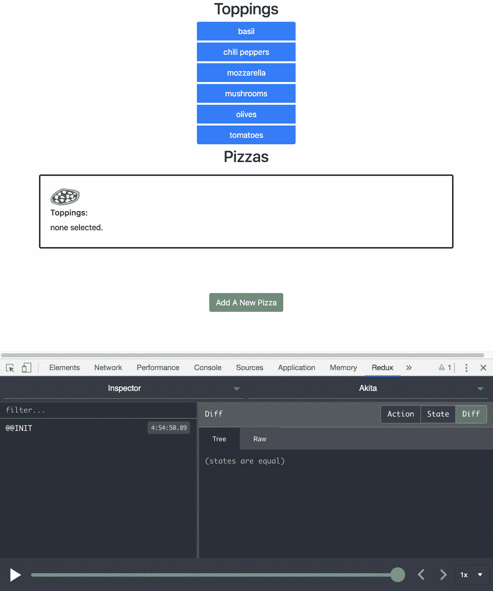

# 让我们用 Akita 建立一个比萨饼店——角度应用的状态管理

> 原文：<https://medium.com/hackernoon/lets-build-a-pizza-store-with-akita-state-management-for-angular-applications-de6ced65024d>

pictured: research 😋

# 秋田是什么？

Akita 是一种构建在 RxJS 之上的状态管理模式，它采用 Flux 中的多个数据存储和 Redux 中的不可变更新的概念，以及流数据的概念，来创建可观察的数据存储模型。

秋田鼓励简单。它省去了创建样板代码的麻烦，并提供了具有适度学习曲线的强大工具，适合有经验和无经验的开发人员。

在其众多功能中，Akita 允许您管理多个实体，同时保持单个实体处于活动状态，作为我们当前正在处理的实体的指示。

在本文中，我们将学习如何使用这一功能，以及有什么比创建一个页面来处理所有菜肴中最好的，受到世界喜爱的，比萨饼更好的方法。

# 披萨店

我们从创建模型和实体存储开始。它将保存实体，在这种情况下，这些实体代表披萨——每个实体都有一个 id 和一个配料列表(在这个理想世界中，所有的披萨都是家庭大小的)。

这是比萨饼的示意图:

接下来，我们将创建一个 Akita 实体店来管理披萨。注意，管理商店所需的几乎所有方法都是内置的。要创建它，您可以使用附带的 [CLI](https://github.com/NetanelBasal/akita-cli) :

除了基本的实体存储，它还包含了`addNewPizza()`方法。它创建一个新的 pizza，添加它，并将其设置为活动的。由于这需要不止一个 store 动作，我们通过添加 Akita 的 transaction decorator 来优化该方法——它确保订阅 store 值的任何人都只会被触发一次。

商店中添加的另一个方法是主题切换功能，它允许我们添加或删除选定的浇头。我们还添加了一个扩展 Akita 的 EntityState 接口的接口。这将表示我们当前正在“编辑”哪个比萨饼实体(即，添加或删除浇头)。

我们还添加了扩展 Akita 的`EntityState`接口的`PizzasState`接口和`getInitialActiveState()`。这是表示哪个比萨饼当前是活动的状态。

为了与商店通信，我们使用一个服务和一个查询:

# 披萨查询

该查询扩展了 Akita 的内置查询，该查询用于从商店获取实体(正如 Akita 的[文档](https://netbasal.gitbook.io/akita/)所指出的，该实体带有各种选择函数、一些返回实体和一些可观察对象)。我们需要添加的唯一方法是`selectPizzaToppings()`，它将允许我们获得一个包含当前活动的比萨饼配料的可观察值。

# 披萨服务

该服务允许我们修改商店的内容以及访问它的置顶功能。在数据来自外部数据源的应用程序中，该服务还负责调用数据服务并将其响应传递给存储。

# 披萨的成分

最后，我们在一个组件中使用查询和服务，该组件在页面上显示商店内容，以及添加比萨饼和编辑活动比萨饼浇头的控件:

总之:**通过 Akita，我们不仅可以存储实体，还可以更有效地管理它们，因为它还内置了对管理活动状态的支持。不再给错误的披萨添加配料**🍕

以下是更多关于秋田的文章:

 [## 💣Angular 在秋田的新功能:我们已经添加了您最需要的功能🔥

### 距离 Akita 的最新发布只有三周时间，我们已经推出了热门的新功能！(1.2.0 版)

engineering.datorama.com](https://engineering.datorama.com/whats-new-in-akita-for-angular-we-ve-added-your-top-requested-features-f4a9c4c0e68a)  [## 🚀Akita 简介:一种新的角度应用状态管理模式

### 每个开发人员都知道状态管理很困难。持续跟踪已更新的内容、原因和…

netbasal.com](https://netbasal.com/introducing-akita-a-new-state-management-pattern-for-angular-applications-f2f0fab5a8)  [## 👷使用 Akita 在 Angular 中构建购物车

### 这是秋田介绍的第二部分(第一部分可以在这里找到)。在这一部分，我们将创建…

engineering.datorama.com](https://engineering.datorama.com/building-a-shopping-cart-in-angular-using-akita-c41f6a6f7255)  [## 在 Akita 和 Angular 中使用归一化数据

### 在本文中，我们将构建一个 Angular 应用程序，它列出来自嵌套 API 响应的电影。我们会…

netbasal.com](https://netbasal.com/working-with-normalized-data-in-akita-e626d4c67ca4)  [## 🚀秋田 1.1.0 版的新功能🔥

### 从秋田公司最初宣布到现在才过了两个星期，反响是巨大的。我们要感谢…

engineering.datorama.com](https://engineering.datorama.com/whats-new-in-akita-v1-1-0-a9ec885ebfdc)  [## 拿督拉马/秋田

### 秋田-🚀面向角度应用的简单有效的状态管理

github.com](https://github.com/datorama/akita) 

*好吧，至少是我和忍者神龟。

*关注我上* [*中*](/@inbalsinai) *阅读更多关于 Angular，Akita，JS！*