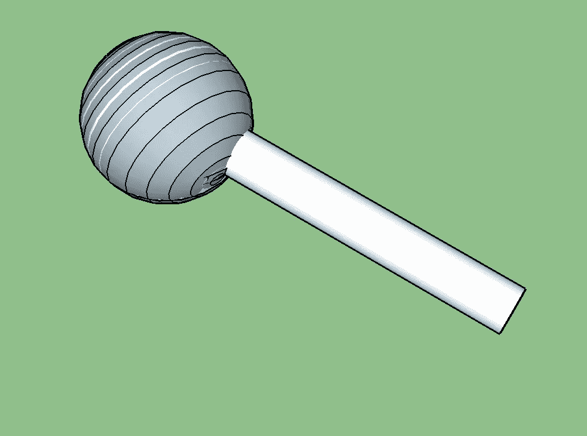

# 让我们用 ARKit 造一个水分子

> 原文：<https://medium.com/hackernoon/lets-build-a-water-molecule-with-arkit-be12261d86e5>


水形成了一个简单的分子结构，我们将利用苹果的 [arKit](https://hackernoon.com/tagged/arkit) 在 AR 中构建这个结构。我们将学习 [ARKit](https://hackernoon.com/tagged/arkit) 的基础知识，比如处理和操作节点。

*   在 XCode 中启动一个新的 AR 项目，使用 [SceneKit](https://hackernoon.com/tagged/scenekit) 作为内容[技术](https://hackernoon.com/tagged/technology)
*   构建并运行以确保一切正常——您应该能够看到默认的飞船
*   现在，删除下面几行不需要的飞船

```
// Create a new scene
   let scene = SCNScene(named: "art.scnassets/ship.scn")!
// Set the scene to the view
   sceneView.scene = scene
```

作为参考，x、y 和 z 轴如下。相机在原点。


氧比氢大。所以，我们先放一个氧原子。从现在开始我们将和`ViewController.swift`一起工作。

*   给氧气加一个锚。

```
func getMainAnchor() -> ARAnchor { // Creates an anchor at a distance 0.1m in front of you .    var anchorPosition = matrix_identity_float4x4 anchorPosition.columns.3.z = -0.1 let mainAnchor = ARAnchor(transform: anchorPosition) return mainAnchor}
```

*   将以下代码添加到`viewDidLoad`函数中。

```
let sphere = SCNSphere(radius: 0.01)let oxygenNode = SCNNode(geometry: sphere)oxygenNode.geometry?.firstMaterial?.diffuse.contents = UIColor.redsceneView.session.add(anchor: self.getMainAnchor())sceneView.scene.rootNode.addChildNode(oxygenNode)oxygenNode.position = SCNVector3(0.0, 0.0, Float(-0.1))
```

上面的代码为氧原子创建了一个球体几何体和一个 SCNNode。然后，将 AR 锚添加到 sceneView 的会话，然后将 Oxygen atom 节点作为子节点添加到 sceneview 的根节点。这将在您前方 0.1 米处放置一个红色球体。


Fig 1\. Oxygen Atom

现在我们应该考虑如何通过分析结构来构建分子。


Fig 2\. Top view of the molecule

从我们这里的结构来看，我们需要三个原子(球体)和两个以指定角度分开的管/圆柱体。此外，管的轴需要在 X-Z 平面内(管的轴在这里是指穿过管长度方向中心的假想线)。现在这可以通过各种平移和旋转以多种方式实现。我会选一个相对容易的。

1.  首先放置氧原子
2.  添加最初指向+Y 方向的管/圆柱体(结合)


Fig 3\. Tube(O-H bond) on top of Oxygen

3.现在，沿 Z 轴旋转管 90 °,将管放置在 X-Z 轴上


Fig 4\. OH bond rotated by 90 degrees

4.再次旋转指定角度，形成水分子。对其他 O-H 键也这样做



Fig 5\. OH bond rotated by 37.775 degrees along Y axis

5.加入氢原子，你就得到了水分子。

现在让我们将它写入代码…

下面的代码在已经存在的氧原子的头部添加了两个管子，如图 3 所示。

默认情况下，管状体的轴心位于中心。我们改变它，把它放在试管的下端。

```
let tube = SCNTube(innerRadius: 0.001, outerRadius: 0.0015, height: 0.05)let OHbondOne = SCNNode(geometry: tube)
OHbondOne.geometry?.firstMaterial?.diffuse.contents = UIColor.bluelet OHbondTwo = SCNNode(geometry: tube)
OHbondTwo.geometry?.firstMaterial?.diffuse.contents = UIColor.blueOHbondOne.position = SCNVector3(0.0, 0.025, -0.1)
OHbondOne.pivot = SCNMatrix4MakeTranslation(0, -0.025, 0)
OHbondOne.position.y = OHbondOne.position.y - 0.025OHbondTwo.position = SCNVector3(0.0, 0.025, -0.1)
OHbondTwo.pivot = SCNMatrix4MakeTranslation(0, -0.025, 0)
OHbondTwo.position.y = OHbondTwo.position.y - 0.025sceneView.scene.rootNode.addChildNode(OHbondOne)
sceneView.scene.rootNode.addChildNode(OHbondTwo)
```

现在我们需要顺时针旋转管子 90 度，使它们在 X-Z 轴上，如图 4 所示。

```
let rotateAlongZAxis = SCNAction.rotateBy(x:0 , y: 0, z: -CGFloat(Float.pi/2), duration: 1)OHbondOne.runAction(rotateAlongZAxis)
OHbondTwo.runAction(rotateAlongZAxis)
```

现在，我们需要沿 Y 轴旋转试管，以获得分子结构(图 5)。但是我们需要确定它需要旋转到什么角度。对这些角度的简单分析给了我们以下结论。


我们需要将第一个管旋转 37.755，将第二个管旋转 142.205 (37.755 +104.45)。

```
let rotateOHBondOneAlongYAxis = SCNAction.rotateBy(x:CGFloat(self.degreesToRadians(degrees: 37.755)), y: 0, z: 0, duration: 0.1)let rotateOHBondTwoAlongYAxis = SCNAction.rotateBy(x:CGFloat(self.degreesToRadians(degrees: 142.205)), y: 0, z: 0, duration: 0.1)OHbondOne.runAction(rotateOHBondOneAlongYAxis)OHbondTwo.runAction(rotateOHBondTwoAlongYAxis)
```

函数将角度转换为弧度

```
func degreesToRadians(degrees: Float) -> Float {
    return (degrees * .pi) / 180.0
}
```


Fig 6\. OH bonds after rotation along Y axis

现在我们需要添加氢原子。我们知道在哪里添加——在债券的另一端。但问题是我们具体如何做呢？


Fig 7\. Hydrogen atom displacement calculation

所以对 H1 来说，把氢原子和氧原子放在一起，然后

*   在-X 方向移动“b”距离(将节点放置在氧气的左侧)
*   在-Z 方向移动“a”的距离

对于 H2，把氢原子放在氧原子的位置，然后

*   在+X 方向移动“b”距离(将节点放置在氧气的右侧)
*   在-Z 方向移动“a”的距离

下面是实现这一点的代码，

*   创建氢节点

```
let hSphere = SCNSphere(radius: 0.007)let hOneNode = SCNNode(geometry: hSphere)
hOneNode.geometry?.firstMaterial?.diffuse.contents = UIColor.graylet hTwoNode = SCNNode(geometry: hSphere)
hTwoNode.geometry?.firstMaterial?.diffuse.contents = UIColor.grayhOneNode.position = SCNVector3(0.0, 0.0, Float(-0.1))
hTwoNode.position = SCNVector3(0.0, 0.0, Float(-0.1))sceneView.scene.rootNode.addChildNode(hOneNode)
sceneView.scene.rootNode.addChildNode(hTwoNode)self.placeHOneAtom(hone: hOneNode)
self.placeHTwoAtom(htwo: hTwoNode)
```

*   执行图 7 中提到的 x 和 z 位移的两个函数

```
// 0.05m is the bond(tube) length herefunc placeHOneAtom(hone: SCNNode) { hone.position.x = hone.position.x -cos(self.degreesToRadians(degrees: 37.755)) * 0.05 hone.position.z = hone.position.z + sin(self.degreesToRadians(degrees: 37.755)) * 0.05}func placeHTwoAtom(htwo: SCNNode) { htwo.position.x = htwo.position.x +    cos(self.degreesToRadians(degrees: 37.755)) * 0.05 htwo.position.z = htwo.position.z + sin(self.degreesToRadians(degrees: 37.755)) * 0.05}
```

最后，一旦所有的代码都被添加，我们就有了分子…


已完成的项目在处[可用。](https://github.com/sandeepjoshi1910/WaterInAR)

注意:

*   不用改变管子的枢轴来旋转它们，我们可以像以前一样，只沿着 Z 和 Y 轴旋转它们，然后像氢原子一样沿着 X 和 Z 轴移动。那也会产生同样的效果。