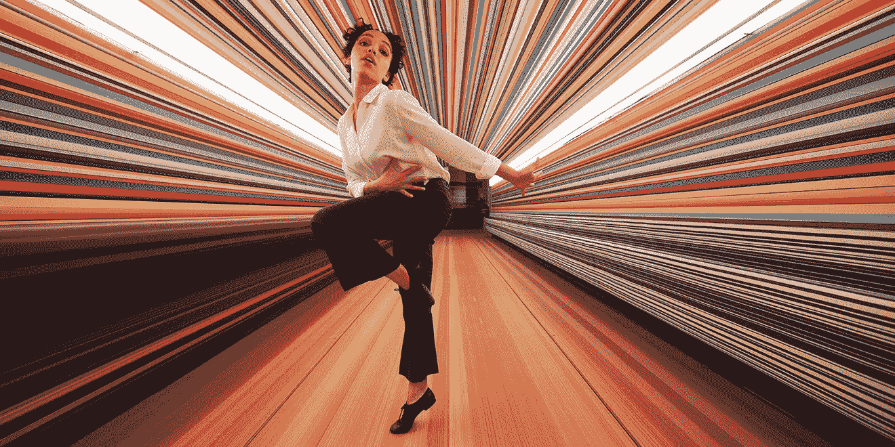

# 让我们跳舞…进入反乌托邦的监视状态

> 原文：<https://medium.com/hackernoon/lets-dance-into-the-dystopian-surveillance-state-25cff1b32f4e>

## 这部短片最“聪明”的地方在于，它传达的信息是如何进入不知情的千禧一代麻木的头脑中的。

FKA Twigs dances to Anderson .Paak in the Spike Jonze ad for Apple

我会在我正在写的一篇文章中详细阐述这个主题。但是现在，我感到不得不面对对这个琼斯/FKA 树枝项目的一致赞扬，大声疾呼:***‘大家到底怎么了？!'***

众所周知，斯派克·琼斯为苹果公司的 HomePod 智能音箱制作了一个四分钟的广告，由音乐家和舞蹈家 FKA·斯普格斯主演。这个视频有太多的错误，在这个简短的咆哮中很难适应一切，但我会尝试一个简短的总结。

通过利用消费者更喜欢使用他们的家庭助手来播放音乐，苹果已经利用了我们都知道的沉浸在歌曲节奏中的快乐。

> **The Verge 说:**“我无法停止播放苹果公司聪明的新 HomePod 广告”
> 
> **Adweek:** “斯派克·琼斯和 FKA·威格斯为苹果公司的 HomePod 制作了一部令人瞠目结舌的短片”
> 
> **Nerdist:** “斯派克·琼斯的新苹果广告是一个令人惊叹的音乐视频”
> 
> **创意在线:**“在斯派克·琼斯为苹果 HomePod 公司拍摄的电影中，FKA·细枝跳舞走出抑郁”

我们是不是应该相信，在你的公寓里跳舞就足以对抗令人衰弱的抑郁症了？Jonze 在 4 分钟内概括了当今西方文化的所有问题。被她当代的城市生活方式挫伤了士气，缺乏为自己选择音乐的能力，这位失败的年轻女子询问最终将成为标准人工智能家庭监控系统的东西，以选择她应该随着哪首音乐跳舞来消除她的担忧——在一个短暂的，实际上虎头蛇尾的幸福无知状态中。

**“苹果聪明的新 HomePod 广告”真的那么聪明吗？还是索然无味？**

将这个广告与雷德利·斯科特现在传奇性的“1984”苹果广告进行对比是很重要的。可以说，这个新广告的空洞代表了自 1984 年超级碗期间播出的 1 分钟广告以来的几十年里，苹果和流行文化中相对创造性创新的明显下降。**具有明显讽刺意味的是，1984 年的广告向世界介绍了一种新产品，从字面上展示了对专制权力的粉碎，代表了对一致性的拒绝；2018 年的广告介绍了一种新产品，同时暗中描绘了消费者对监视状态的投降。从这个角度评估 Jonze 的视频时，今天倒退的现实变得相当惊人。**

Jonze 的高明之处(不仅代表苹果，也代表亚马逊和谷歌)在于用一种幻觉迷惑他的观众，而监控行为正常化的信息却无人问津。

这则广告只有一点真正聪明，那就是信息是如何进入毫无戒心的千禧一代被麻醉和灌输的头脑的。这部电影预示着一个新的反乌托邦现实，我们必须学会驾驭它。

到目前为止，我找不到任何人对这篇文章进行批判性分析。我所发现的就是不停地滔滔不绝地说这显然是多么令人惊奇。人们难道不容易意识到该视频的目的是让西方监控国家的独裁行为正常化吗？**大家真的忘记了爱德华·斯诺登揭露的美国国家安全局监控吗？**

除了这真的不是开创性的事实——从创造性的角度来说，多年来设计师们一直在尝试将物体扩展成千变万化的线条和图案的有趣方式——我们必须超越背景，看到更严重的问题。

首先，如果你看了令人不安的冷漠的 Alexa 奖决赛[视频](https://www.youtube.com/watch?v=WTGuOg7GXYU)，你会了解到研究人员正在如何推进对话式人工智能，以便我们在不久的将来能够更舒适地与 ***机器*** 对话:

> "[亚马逊](https://developer.amazon.com/alexaprize)宣布 2018 年被选中角逐 Alexa 奖的团队，这是一项 350 万美元的大学挑战，旨在促进人机交互。这些团队将创造社交机器人，它们可以就一系列时事和热门话题，如娱乐、体育、政治、技术和时尚，与人类进行连贯而生动的对话。”

你必须考虑到这一点，最近的[研究](https://arxiv.org/pdf/1802.06006.pdf)来自百度在[样本](https://audiodemos.github.io/)中的声音克隆。在未来，他 2013 年的电影《她》(由斯嘉丽·约翰逊配音)中的斯派克·琼斯版人工智能操作系统将真正成为现实。此外，我们的人工智能助手可能会为我们选择的任何公众人物、女演员或男演员配音——因为他们的声音经常被记录下来。

**接下来，记住这一点，让我们看看这项技术的发展方向。**

在苹果发布新品之前，亚马逊和谷歌已经申请了专利——它们与美国情报界的联系有据可查——新的[技术](https://hackernoon.com/tagged/technology)将极大地扩大通过智能扬声器市场对消费者信息的监控和数据共享。

[这份来自 2017 年 12 月的](http://www.consumerwatchdog.org/sites/default/files/2017-12/Digital%20Assistants%20and%20Privacy.pdf)消费者监督报告揭示了数字助理和智能家居设备的技术能力将不可避免地提高到何种程度。专利申请中的许多细节包括:

> “用于从**环境语音**中导出情绪和行为的系统，即使用户没有对设备讲话”
> 
> “多个系统用于**识别对话中的发言人**并为每个人建立兴趣档案。”
> 
> “谷歌可能会与包括企业在内的第三方分享智能家居设备的数据，然后第三方可以使用这些数据来推断用户的睡眠、烹饪、娱乐和淋浴时间表
> 
> “…通过声音指纹识别来识别儿童的存在，通过运动传感器来检测活动，并在儿童既活跃又安静时报告**推断的恶作剧。**

处于被动收听状态的智能扬声器系统将捕捉并分析附近发生的所有语音。他们将能够识别那些发言的人，并建立一个超越营销数据收集的档案，正如这里的[所指出的](https://theintercept.com/2018/01/19/voice-recognition-technology-nsa/):“前国家安全局承包商爱德华·斯诺登提供的文件显示，国家安全局不仅开发了记录和转录私人谈话的技术，还开发了自动识别发言人的技术。”这些设备的制造商与政府直接相关:比如说，杰夫·贝索斯与政府签订了云计算合同。

这个月，苹果公司把他们的智能音箱变成了一个非常受欢迎的产品。或者我应该说，斯派克·琼斯和 FKA 树枝已经实现了这一点？甚至像我这样的愤世嫉俗者在前些年也非常钦佩这两位艺术家，尤其是 90 年代后期的 Jonze。在看到这个最新的创意项目后，我的建议是永远不要购买智能音箱，永远不要怀疑那些卖给大公司的创意类型。

更多内容请关注…

*艾德·汉南(Ed Hannan)是一位独立的媒体和文化分析师、摄影师、设计师、音乐学家，在这里可以找到***&***。***

** [## 艾德·汉南(@ed_hannan) |推特

### 艾德·汉南的最新推文(@ed_hannan)。媒体和文化分析师、摄影师、设计师、音乐学家…

twitter.com](https://twitter.com/ed_hannan)**