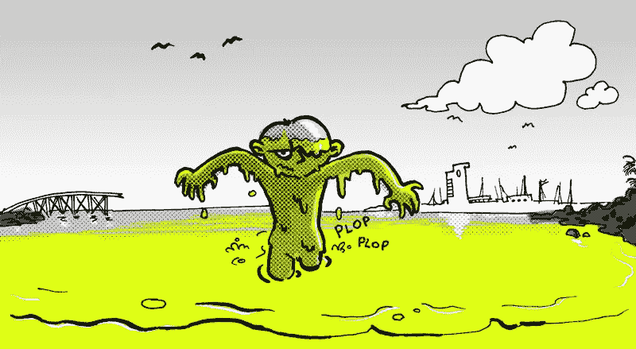
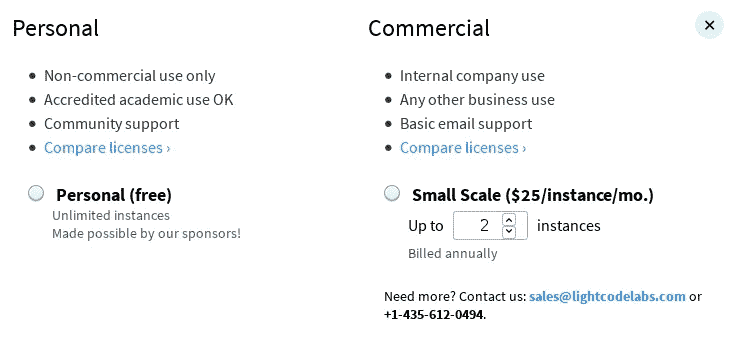
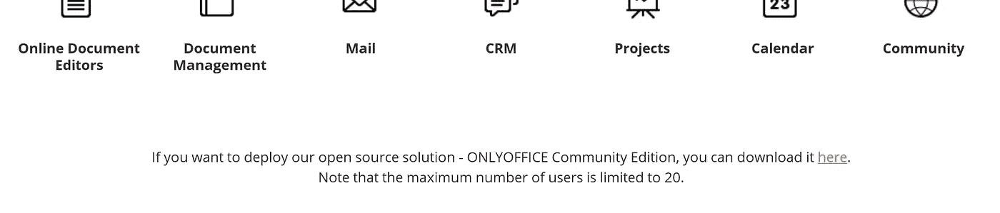
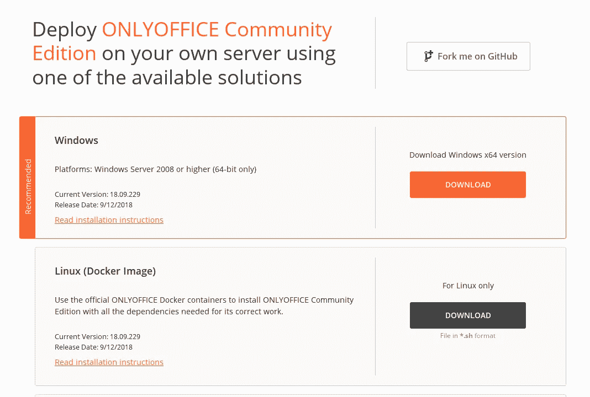

# 让我们远离粘液来源

> 原文：<https://medium.com/hackernoon/lets-get-away-from-slime-sourcing-95fcfd4f8da9>

粘液来源:这符合自由许可证的字面意思，但肯定不符合精神。先说一个自由开源软件中让我不舒服的一个趋势。

[Luis Daniel Carbia Cabeza,](https://www.flickr.com/photos/luisdcarbia/4901872291/) cc-by

> *粘液来源(名词)1。一个受开放(libre)许可的项目，但它通过非许可方式对官方编译的二进制文件或在商业环境中的使用加以限制 2。一个满足自由软件要求但违背自由软件精神的项目。*
> 
> 粘液来源(动词)1。在开放(libre)许可下发布一个项目，但是对免费提供的二进制文件的使用设置了限制。隐藏开放(libre)许可项目的源代码，使用商标或其他手段试图阻止用户分发他们自己编译的二进制文件或在商业环境中使用它 3。狡猾地使用你的方式进入公共条款，例如通过程序的行为

我第一次在自由软件中看到这种反模式是在 Birdfont 项目的字体设计领域。 [Birdfont](https://hackernoon.com/tagged/bridfont) 是一个用 Vala 写的字体编辑器，用于 Windows、OSX 和 Linux 这三大系统。这是一个非常有能力的程序，但是有…一些棘手的地方。源代码可以通过 GPLv3 获得，但是作者故意隐藏源代码库，并要求用户付费。事实上，*告诉用户禁止商业使用:*当你第一次启动 Birdfont 时，它会问你你的意图是什么。如果你回答说你把它用于商业目的，它会通知你去买一个许可证，要么让你退出，要么回答说你没有把它用于商业目的。

这需要一些争论，但是你可以去掉检查，添加一些你自己没有公开的特性，并运行你自己的 Birdfont 分支。但是，当可以找到一个合适的中间点时，为什么要创建不必要的项目分支呢？

另一个粘液来源的例子是球童。Caddy 是一个高性能的、Apache2 许可的、用 Go 编写的 https-auto http/2 服务器。这是一款非常棒的软件，我本来准备使用它，但我注意到他们对发布的编译后的二进制文件进行了(人为的)限制:

What you see when you go to download Caddy

他们完全可以自由地这样做，但是感觉很粘(因此我称之为粘源。)这里有一个暗示:商业使用超出了 Caddy 的许可范围(Apache2 没有任何限制，明确允许软件的商业使用)。matt Holt——也是开源 CSV 解析器库 Papa Parse 的作者——在这里提出了这样的论点，即[自由软件的整个概念本身就是一个骗局](https://caddyserver.com/blog/is-caddy-free):

> 今天你会注意到[下载](https://caddyserver.com/download)页面增加了一个“付款”部分。Caddy 不再是自由软件了吗？
> 
> 事实是，从来都不是。没有自由软件这种东西。问题是，“谁来付出代价？”

*(更正:之前，我说过马特致力于崇高的文本；他之前的工作是关于 Papa Parse，一个 CSV 解析器，我误解了“我的”——我的错！)*

Matt 决定在 2016 年推动 Caddy 服务器的商业许可。他的论点围绕着这样一个事实:有账单要付，有张嘴要喂。他没有错:活着要花钱，软件需要活着的、会呼吸的人来开发。如果软件自己开发，我们将处于一个完全不同的世界(在这个世界里，我和 Matt 将会失业！)

当 Matt 决定改变演示文稿的一些内容时，Hacker News 得到了风声，并发表了一些有趣的评论:

> 哇，在这个 HN 线程的过程中，我从[学习](https://hackernoon.com/tagged/learning)关于球童，到决定不使用它。分叉后立即威胁采取法律行动绝对不酷。强行头球绝对不酷。我会坚持使用 nginx。[ [来源](https://news.ycombinator.com/item?id=15238993)

一个潜在用户刚从“我觉得这个对我有用”到走开。另一位评论者提到了这一变化的隐蔽性:

> 在对网站做了更多的检查后，我觉得有必要再写一篇评论来表达这件事处理得有多糟糕。该网站非常具有误导性——在下载页面上，它现在要求您选择一个许可证，并表示“个人”版本仅供个人使用，您需要为商业版本付费。没有任何迹象表明，直到你点击进入完整的定价页面，开源版本甚至存在。在那个页面上，你有相同的个人/商业分类，也声明个人版本严格用于非商业用途，但是有一个侧边栏提到开源。它假设您理解 Apache 2.0 许可证，并且没有试图阐明企业可以使用开源版本。
> 
> 作者们也没有浪费时间去找福克斯投诉商标侵权，所以如果你想分发你自己的补丁球童，你可以期待听到他们的律师。完全没有阶级。[ [来源](https://news.ycombinator.com/item?id=15238969) ]
> 
> [艾德。注意:一个名为 Wedge 的分支因为在源代码中使用了 caddy 这个名字而受到威胁]

第三个例子来自另一个我几乎想用的项目:OnlyOffice。OnlyOffice 是一个非常好的构建，商业支持的群件套件，包括一个桌面客户端，在功能和可用性方面确实可以挑战微软套件。

购买一年后，他们的云服务可以以 4 美元/用户/月的价格获得，但当您想要内部选项时，会有一些令人困惑的选项:有企业许可证、开发许可证、社区许可证…

他们的企业内部许可证是专有的，但是当你向下滚动时，你会看到一个指向 GPL/AGPL3 源代码的二进制分发集的小链接(这里，*放大了细节*)。这也不在他们的“下载”页面上，隐藏在企业*定价*页面的脚注中。

OnlyOffice 在其来源的“社区”表单中将主动打开的文档数量(人为地)限制为 20 个，尽管值得称赞的是，该页面链接到他们的 GitHub 组织，并包括一个非常方便的 Docker 脚本来帮助您进行操作:

Yes, they suggest Windows. Their installer is actually quite nice, which is impressive for free software.

# 然而，这不是*的自由*

添加这些种类的限制*本质上并不使其成为非自由软件——版权所有者被允许对他们的源代码做任何他们想做的事情，理论上用户可以在他们认为合适或不合适的时候修补它们，并且这些种类的做法在自由软件基金会的眼中并不是不道德的；引用*什么是自由软件，* Stallman [写道](https://www.gnu.org/philosophy/free-sw.en.html):*

> 因此，“自由软件”是自由的问题，而不是价格的问题。为了理解这个概念，你应该把“免费”理解为“言论自由”，而不是“免费啤酒”。我们有时称之为“libre 软件”，借用法语或西班牙语中的“自由”一词，以表明我们并不意味着软件是免费的。

同样，在商业使用的背景下，Stallman 也有类似的想法，通过 [GPL 异常](https://www.gnu.org/philosophy/selling-exceptions.html):

> 销售例外意味着代码的版权所有者在自由软件许可下将其发布给公众，然后让客户付费以获得在不同条款下使用相同代码的许可，例如允许其包含在专有应用程序中。

这里的三个项目:BirdFont、Caddy 和 OnlyOffice，在他们各自的许可下和 GNU 项目的理念下(在 BirdFont 和 OnlyOffice 的情况下),都有出售软件使用的权利:源代码是可用的，可以自由分发，如果有人愿意，他们可以根据自己的喜好修改软件。我抱怨的不是这个。我所反感的是欺骗和秘密的限制。让我生气的是软限制、额外许可限制和反对*灵活行使用户权利的社会压力*。我相信应该有一个*暗示*某人应该能够免费运行自由授权的、公开的开源软件，如果他们把工作投入到工作中，以及共享那些可执行文件、包等等。在同样的许可下。

Caddy 通过锁定商标后面的名称来阻止 Caddy 自身构建的分发:README 在最底部包含了文本

> **“球童”这个名字是注册商标:**软件的名字是“球童”，不是“球童服务器”或者“球童服务器”。请称之为“球童”，或者，如果你想澄清，“球童网络服务器”。参见[品牌指南](https://caddyserver.com/brand)。Caddy 是 Light Code Labs，LLC 的注册商标。

球童的来源是自由。名字不是，这是 Apache 许可证允许的做法，这也是促使 Debian 项目将 Firefox 更名为 Iceweasel，GNU 项目将 hard fork Firefox 和其他 Mozilla 项目更名为 icecat、GNUZilla 等的原因。在我看来，这使得像 Caddy slime 这样的软件具有了来源:你可以自由地使用和编译它，但是为了分发你从该来源构建的东西，隐含着大量的工作。

这些只是现代的例子。在过去，我们有一个相当著名的 XChat 的例子。XChat 是根据 GPL 条款发布的 IRC 客户端，但在 Windows 上使用需要付费。像 XChat-wdk(现在的 HexChat)这样的免费啤酒变体被定期构建和分发，经常驳斥 XChat 开发者的说法，即免费做这项工作“太难了”——据我所知，免费啤酒变体的维护者经常提供帮助。

# 那又怎样？

虽然我同意自由软件需要有一个商业空间，但是现在有一些不可避免的内涵。Libre 软件背后的想法是，因为我有源代码，而且源代码是在免费许可下与我共享的，所以我可以按照自己的意愿自由使用它(Stallman 的 *freedom zero* 阐明了这一点，OSI 定义明确指出了这一点)。有一个缺口已经被我开始称之为粘液源的东西填补了。

让我再次澄清一下:我对 Matt、OnlyOffice 或 BirdFont 的维护者没有任何问题，他们希望/需要将他们的月租金和费用从软件的商业*支持*中扣除，甚至在商业版本中拥有只在付费版本中可用的功能(这就是企业所说的*增值*功能)，只要这些增加的功能不会归结为纯粹的人为限制，如用户数。我甚至不介意他们有点小气——账单必须支付——我只是发现隐藏在只有*开发者*会从源代码运行东西的伪装下，或者仅仅因为他们从源代码构建就在用户面前设置障碍(比如 BirdFont 的情况)是不诚实的。)

# 减肥:事情不一定是这样的

正如我们所见，这些项目在技术上是自由的。它们是在 libre 许可下授权的，并且是源代码提供的。在 Caddy 的例子中，在源代码及其许可证之外设置了限制，以防止您在商业上使用某些东西，而在另外两个例子中，源代码本身，在许可证之外，防止您按照自己的意愿使用软件。

像 Caddy、OnlyOffice 和 Birdfont 这样的项目应该考虑看看其他人的成功:ntop [为需要的用户提供商业](https://www.ntop.org/support/need-help-2/commercial-support/)支持。ActiveState 已经建立了支持 Libre 语言的生命线，包括 Python、Perl 和 Go。 [Digium](https://www.digium.com/) 维持着 [Asterisk](https://www.asterisk.org) ，这是最流行的在家烘焙 VoIP 解决方案。甚至还有其他 web 服务器也采用了相同的模式！Nginx 是免费的，但是开发者提供商业支持和收费培训。Wordpress 是部署最多的 Libre 网络软件，其插件之一 WooCommerce 也是如此。两者在 BuiltWith 的排名中都位列第三和第四，并为拥有它们的 Automattic 公司提供了稳定的收入流。

换句话说:不要把你的软件许可为自由软件，然后闪烁其词地加入公共条款，或者更糟，加入完全公共条款。这样做是卑鄙地采购你的软件，最终，它限制了你的客户群，伤害了整个社区。

如果 Asterisk 需要超过一定数量的活跃 SIP 会话的商业许可，那么没有人会使用它。如果 Wordpress 尝试了 Caddy 所拥有的，它也不会大幅度超过 Ghost。值得注意的是，Ghost 是在许可许可下授权的，并且对从源代码使用它没有任何限制，只是注意到必须进行维护和保养以保持顺利运行。Ghost 从他们的支持和放手解决方案中赚钱。

如果你已经有了粘液来源，联系你的社区，开始去除粘液的过程。佩戴“We ' s*libre*”作为骄傲的徽章，并保持真实:显示源代码是可用的，告诉人们他们为你的软件付费得到了什么，帮助人们在自己运行它、有一只指导手或让你做所有艰苦的工作之间做出明智的选择。坚持自由 0 的*精神*和 OSI 定义的第 6 点，不要通过自由源代码中纯粹的软件限制，基于努力进行歧视，无论是商业还是个人。设法让你的软件足够好，让人们愿意为它付费，并回馈 T4。为商业实体提供一个双许可版本或者添加一个例外，允许 libre 变体加载你在商业上生产和支持的非 libre 库可能是有意义的。我相信这样做将会扩大你的软件的受众范围，超过现在，就像已经看到的开放构建的产品，如 Wordpress、Nginx，甚至是 QGIS 这样的软件，这表明[有许多不同的商业支持来源](https://qgis.org/en/site/forusers/commercial_support.html)。

自由软件可以赚钱。价值来自于在更大的商业规模上有意义的支持和特性。真正成功的自由软件进入每个人的手中——这是 Apache、Wordpress 和 Nginx 的故事——当用户需要帮助的时候，你将是最有资格提供企业需要的东西的人。