# 让我们一劳永逸地解决这个问题

> 原文：<https://medium.com/hackernoon/lets-get-this-this-once-and-for-all-f59d76438d34>


Credits: Pixabay.com

你对 JavaScript 的了解可以通过你对*这个*的理解得到很好的判断。人们觉得难以理解的事实是，因为它在多种多样的场景中使用。

让我们一劳永逸地纠正他们。

如果我从字面意义上来谈论这个*这个*，它仅仅意味着——我面前的这个东西。“这件夹克很酷”，我妹妹手里拿着那件夹克说道。我回答说，“不，这个更好！”我指的是我身边的夹克，她指的是她身边的那件，因此在各自的陈述中使用了 *this* 。

该值取决于
1。执行上下文
2。祈祷

**执行上下文**

执行上下文是代码运行的环境。例如，一个函数的局部变量只能在该函数内部访问，而不能在函数外部访问。这被称为功能级作用域或本地执行上下文。在全局范围(任何函数之外)声明的变量在所有底层函数中都是可访问的。这被称为*全局执行上下文*。

让我们考虑这个例子来理解他们两个之间的区别-

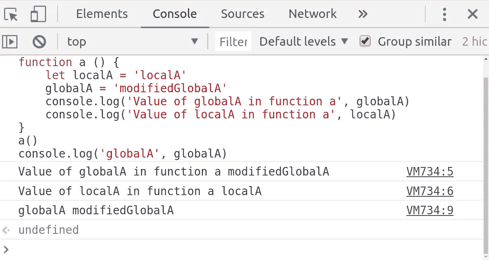

全局执行上下文中*这个*的值默认为*窗口*对象。

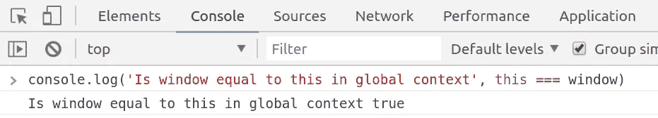

任何本地上下文中的值都取决于函数被调用的方式。

**I .在全局上下文中调用函数会将其 *this* 值作为** `**window**`

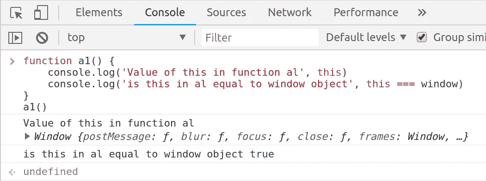

**二。调用在严格模式下运行 JavaScript 语句的函数会使 *this* 成为 *undefined***

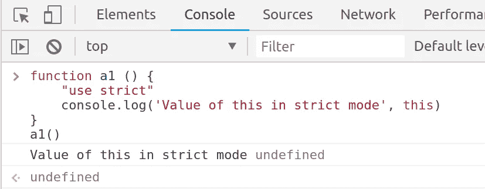

**III。调用对象内部的函数**

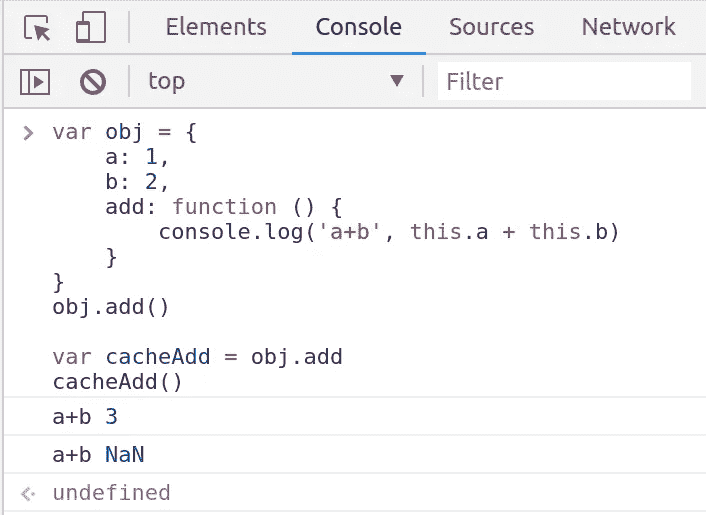

功能`add` 是对象`obj`上的属性之一。当我们引用`obj` 作为`obj.add()`来调用 *add* 时，它在`obj`的上下文中被调用。属性`a` & `b`在`obj` *、*的上下文中具有确定的值，从而定义了`obj.add()`的结果。

`cacheAdd`变量存储`add`函数的引用。如果我们在稍后阶段执行这个函数，它将在调用它的上下文中运行。在我们的例子中，我们在全局上下文中调用`cacheAdd`，所以它将有一个全局对象作为`this`引用。由于`a`和`b`没有在全局上下文中定义，我们将`a+b`的值作为`NaN`。

为了证明这一点，我们先在全局背景下定义一下`a`和`b`。

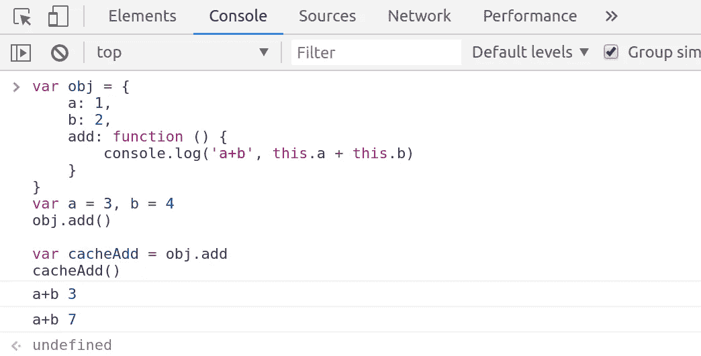

当 obj 中定义的`a`和`b`的值分别为 1 & 2 时，`obj.add()`的计算结果为 3。当我们将`add`缓存在一个变量中然后在全局上下文中执行它之后运行它时，由于全局上下文中 a & b 的值分别为 3 & 4，所以它的计算结果为 7。因此，使用`this`的函数可能会给出不同的结果，这取决于它执行的上下文。

让我们试试另一个有趣的例子——

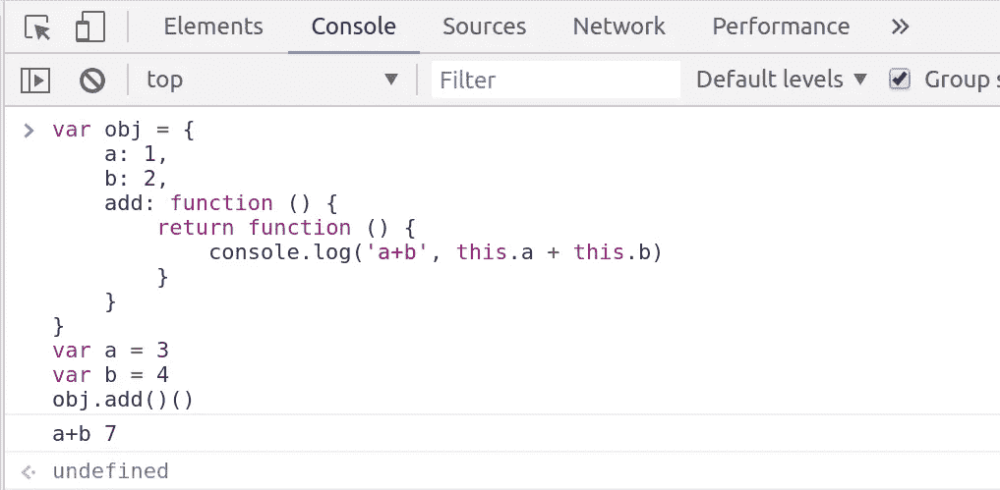

在这种情况下，add 函数返回另一个函数，并且在这个内部函数中执行`a+b`的值。`obj.add()`将返回一个有一个`console`语句的函数。因此，我们必须执行这个返回的函数，以便获得 a & b 的和。但是这个返回的函数(在执行`*obj.add()*`时返回)将在全局上下文中运行，因此 a+b 的值计算为 7(全局上下文中 a & b 的值分别为 3 & 4)。

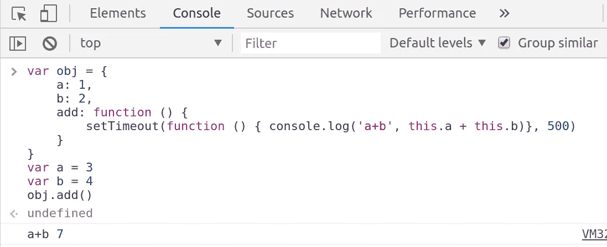

这里，add 函数在 500ms 超时后打印 a & b 的值。`setTimeout`在全局环境下运行。

为什么 setTimeout 在全局上下文中运行？(我会在下一篇文章中详细解释。)

***这个*引用了调用函数**的即时对象

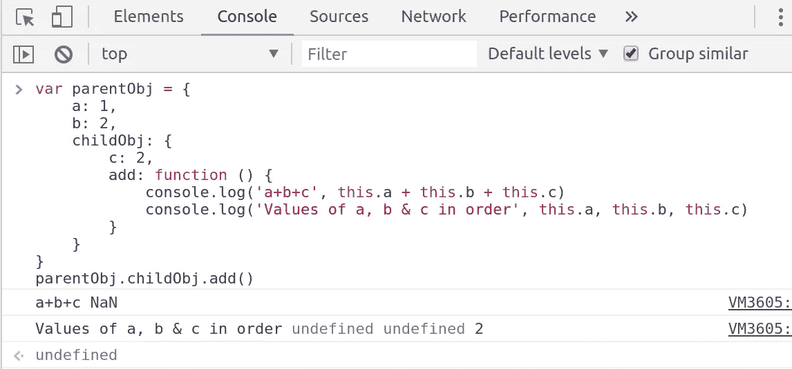

这里， *parentObj* 有 *childObj* 作为属性之一，add 函数是在 *childObj* 上定义的。当我们调用 add 作为*parent obj . child obj . add()*时，add 函数接受 *childObj* 的 *this* 引用，并且变量 a & b 不能从 *childObj* 的本地上下文中访问。因此 a & b 的值是*未定义的*。

**链接到原型链**

如果我们实例化 *parentObj* 来创建 *childObj* ，那么它的属性将可以在 *childObj* 上下文中访问。

**使用*object . create***

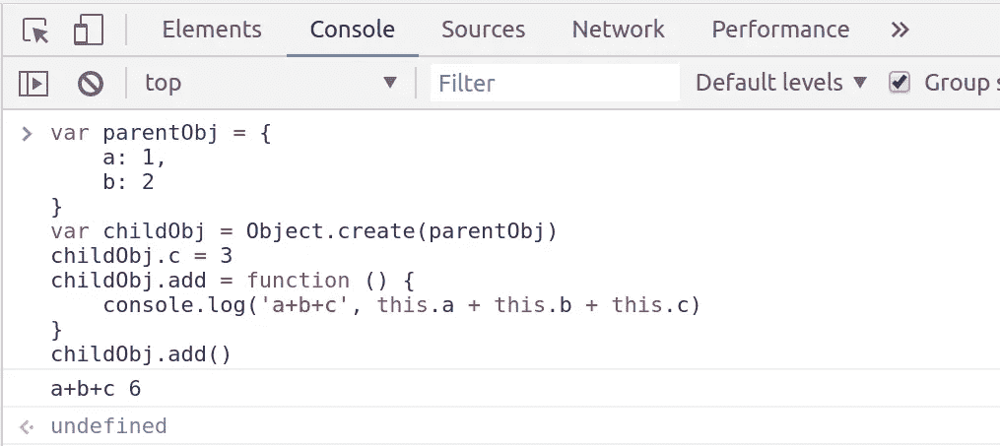

当 add 函数在 *childObj* 的上下文中被调用时，它首先尝试在 *childObj* 的上下文中寻找 a，b & c 的值，如果这些值中的任何一个是*未定义的*，它将查找其父上下文，在本例中是 *parentObj* 。

**使用*新的*操作符**

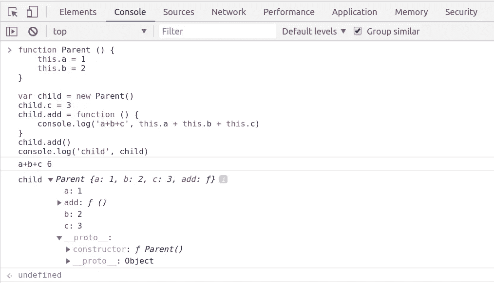

在这种情况下，父属性在子上下文中可用。正如我们在后面的控制台语句中看到的，子级的构造函数被定义为父级。因此，它首先检查被调用的上下文中的值，然后查找它的原型链。

这不是火箭科学！

默认情况下，代码在全局上下文中运行，即它可以访问在`window`对象的上下文中定义的变量。在上面的每一个例子中，我们只是将上下文限制在对象上。与此相关的所有操作都将以与上下文为`window`时完全相同的方式执行。即使在全局上下文中，如果没有定义任何值，它也会查找原型链。

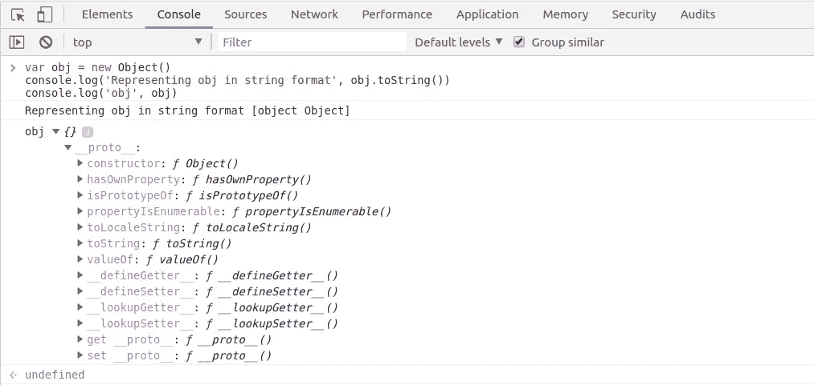

我们可以看到，`toString`函数是在`*obj*`的`*__proto__*` 属性中定义的，这意味着它是在*对象*的原型上定义的(因为`obj`是通过将`new`运算符应用于*对象*而创建的)。由于`toString` 没有在`obj`的上下文中定义，所以它查找其原型链。

让我们来解决一个有趣的问题——

我姐姐顽固地拒绝与我分享糖果，并支持她的主张，她说，她是这块糖果的主人。

这是她的糖果—

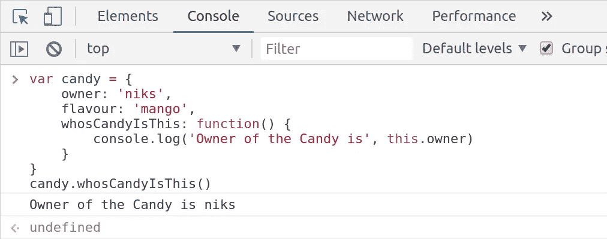

所以，我不得不修改她的函数`whosCandyIsThis`正在使用的`this`引用。这个蹒跚学步的小孩不知道 JavaScript 是一种非常规的语言。你总是可以按你想要的方式修补它。

**调用，应用&绑定—我来了！**

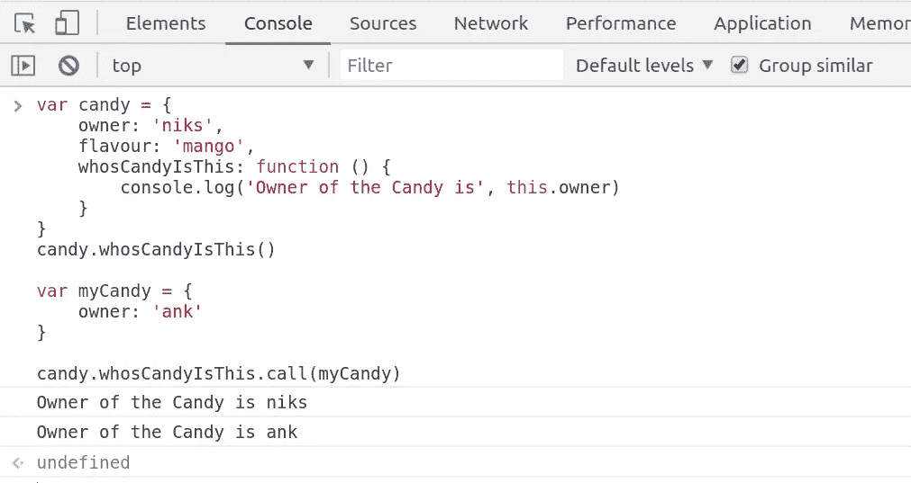

有了这 3 个漂亮的函数，你可以修改*这个*引用的值。在上例中，`candy.whosCandyIsThis.call(myCandy)`将`whosCandyIsThis`函数的`this` 引用修改为`myCandy`。

**打电话是怎么回事？**
`call`显式传递`this`对函数的引用。在这种情况下，它告诉`whosCandyisThis`函数使用`this`作为`myCandy`。

调用的第一个参数是`this`引用，如果我们必须传入任何额外的参数，你可以这样做

```
*candy.whosCandyisThis.call(myCandy, true)`*
```

让我们再考虑一个例子:

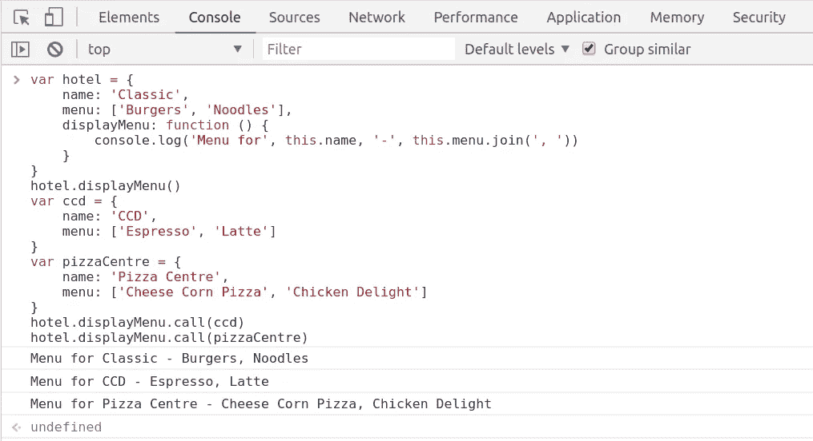

这里，我们将`this`引用显式传递给在 hotel 对象中定义的`displayMenu`函数，以相应地显示菜单。(这不是很酷吗？)

但是如果我想根据用户的位置显示菜单呢？为此，我们将传递一个额外的参数`location`给`displayMenu`函数。让我们修改上面的代码来适应我们的需求。

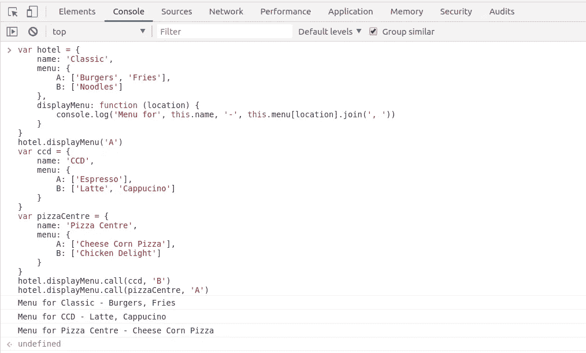

`call`的第一个参数是`this`引用，然后您可以传入任意数量的参数。`displayMenu`功能现在可以很好地按照*位置*参数显示菜单项列表。(听起来不错？)

`apply`的操作方式与`call`相同，唯一的区别是我们传递参数的方式。Apply 将第一个参数作为*接受，这个*引用与 call 的引用相同，但其他参数将作为数组传递。

另一个可以修改`this` 参照的功能是`bind`。与返回函数结果的`call`和`apply` 不同，`bind`返回函数。并且这个返回的函数可以在以后的任何阶段被调用。它将在显式传递的有界参数的上下文中运行。

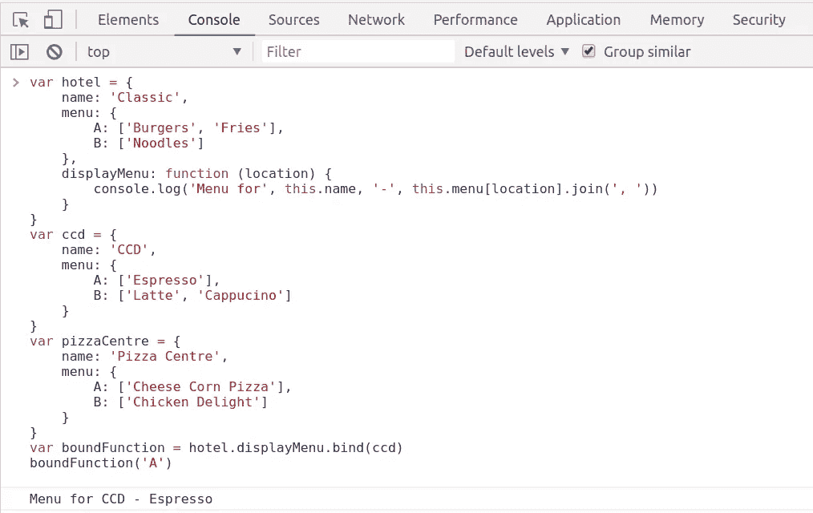

`*hotel.displayMenu.bind(ccd)*`返回具有`ccd`的`this`引用的函数。当我们运行`boundFunction`时，它在`ccd` 的上下文中运行，因此打印位置 a 的 Espresso

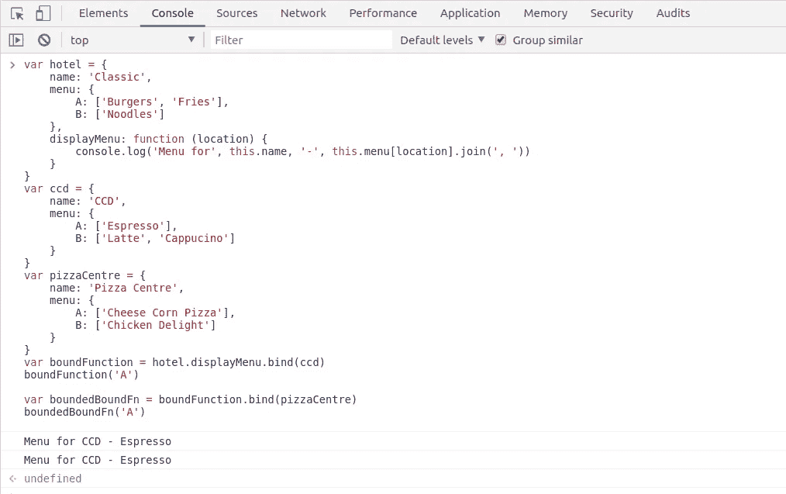

我试着用我的直觉做实验。如果我将一个已经绑定的函数绑定到其他引用，这个函数会在后面绑定的上下文中运行吗？如果这是真的，我可以无休止地这样做，用我所有的力量不断改变这个参照物！这不是真的。一个函数只能绑定一次。在上面的例子中，我试图用 *pizzaCentre* 再次绑定有界函数，但是当我执行这个函数时，它打印了之前的结果，这意味着它的引用仍然指向第一个绑定(`ccd`)。

同样，JavaScript 是一种非常规的语言。如果有按照你的意愿修改任何东西的自由，就有守卫保护完整性。一个这样的杰作是我们可爱的箭头功能。

这就是它的工作原理。简单明了。

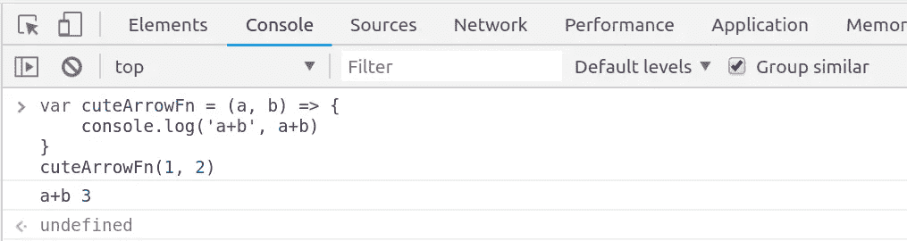

为什么我们要在这篇文章中讨论箭头函数呢？他们有什么特别之处？

在 arrow 函数中，`this`的值是其封闭词法上下文
*的值，词法上下文是块级作用域。*
它不随`call`、`apply`或`bind` *而变化。*

箭头函数维护其封闭词法上下文的绑定。

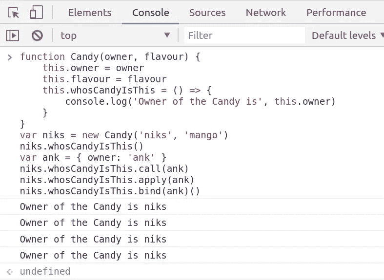

黑纱！这只肥箭拿走了我的糖果。

可以看到，`whosCandyIsThis`被定义为箭头函数。因此它将保持其*词汇上下文*的绑定。在实例化糖果时，`niks`为她的糖果设置所有者和口味。`whosCandyIsThis` 函数以`niks`引用为界。

因此，当我试图通过使用 call、apply 或 bind 传递这个引用来显式调用它时，它不起作用。无论如何，不能更改`niks.whosCandyIsThis`函数的绑定！

你可能会喜欢我以前写的关于服务人员的文章—

**服务人员基础**——[https://hackernoon.com/service-workers-62a7b14aa63a](https://hackernoon.com/service-workers-62a7b14aa63a)

**构建口袋妖怪 App 评估浆果的力量&服务人员**—[https://hacker noon . com/Building-Pokemon-App-to-evaluate-the-power-of-Berries-Service-Worker-176 D7 C4 e 70 e 3](https://hackernoon.com/building-pokemon-app-to-evaluate-the-power-of-berries-service-worker-176d7c4e70e3)