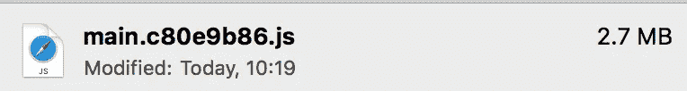
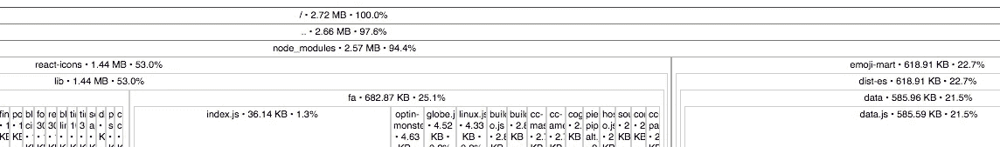
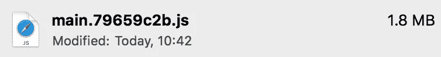
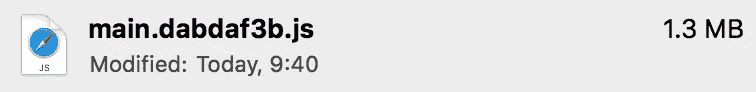
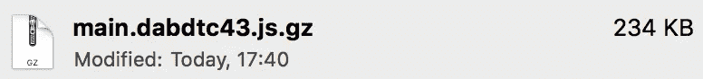

# 让我们使我们的包更小

> 原文：<https://medium.com/hackernoon/lets-make-our-bundle-size-even-smaller-7a5727bb110>


如果你曾经在 Angular、React、Vue 或其他平台上开发过 SPA(单页应用程序)，你可能会注意到你为应用程序付出的所有努力都白费了。js 文件和一个。css 文件。这些文件包含了应用程序的所有依赖项和功能。

有时候，这些文件可能会变得很大，增加应用程序的加载时间，这是我在工作中偶然发现的。

以 Webpack 为例，文件是经过“摇树”和丑化后制作的。

树抖动是从代码中删除所有不用的函数和变量的过程，这使得我们的应用程序小了很多(基本上我们只使用了一小部分依赖项，而大部分代码甚至没有被调用)。

丑化(听起来像是)是把你漂亮的 javascript 代码变成难看的、完全不可读的缩小代码的过程，为什么我们需要它？因为一个变量把它的名字从“isUserConfirmed”改成“x”会占用更少的内存，所以所有的制表符和空格都被删除了。

在这个例子中，我使用了 React，但是在所有框架中，减小包的大小基本上是一样的。所以我使用了 [create-react-app](https://github.com/facebook/create-react-app) ，这是一个简单的工具，无需自己配置 webpack 就可以开始使用 react 框架。这是我在我的项目上运行`npm run build`后得到的结果



First minified JS file 2.7MB

文件看起来很大，所以让我们分析一下，看看是什么占用了这么大的空间。source-map-explorer 是一个 npm 包，它分析捆绑的 JS 文件并告诉你文件是由什么组成的(依赖项和大小)。

```
npm install -g source-map-explorersource-map-explorer bundle.min.js bundle.min.js.map
```

这是结果:



正如我之前提到的，节点模块占用了文件的大部分大小，从分析中引起我注意的前两件事是，react-icons 和 emoji-mart 相当大(可能是因为它们使用了大量的媒体资产)。

通过快速搜索代码，我找到了这一行:

```
import { FaUpload } from 'react-icons’;
```

React-icons 是一个简单的 UI 模块，用于将通用图标导入到应用程序中。

在这种特定情况下，这种导入会将所有图标导入到我们的应用程序中，这没有意义，因为我只想使用一个图标，通过快速查找文档，我最终使用了这种导入。

```
import FaUpload from 'react-icons/lib/fa/upload'
```

因为 react-icons 被分成子文件夹，所以它允许我们只导入所需的代码。还有其他使用相同方法的包的例子，比如“ [lodash](https://github.com/lodash/lodash) ”，这是最流行的实用函数 javascript 库之一。



这样就成功了，我们的包变小了，一点也不费力。

我们的第二个问题是对表情符号市场的依赖。我不会说太多细节，因为这个例子太具体了，但我设法减少了表情集市包，只是用更小的东西来代替它，以满足我的应用程序的需求。如果您有一个大的软件包，那么在存储库中一定有关于它的讨论，所以值得看一看，甚至为它贡献一个解决方案。



现在来说说 gzip。gzip 是一种用于压缩数据的文件格式。几乎所有浏览器都支持它，这使得在客户端使用[“内容编码”头](https://developer.mozilla.org/en-US/docs/Web/HTTP/Headers/Content-Encoding#Compressing_with_gzip)很容易实现。

通过这种方式，客户端获得压缩的数据，并在运行时将其解压缩。我使用了 [gzip-all](https://www.npmjs.com/package/gzip-all) 包来生成压缩版的 javascript & CSS 文件。



我们设法让我们的文件大小非常小，我们现在可以改变文件类型回。js 并将其发送到世界各地，减少应用程序加载的时间。

# 结论

这是一个很好的实践，要记住，最终会有一个用户等待从互联网上加载东西，特别是在低速连接的情况下。

一件重要的事情是跟踪你的依赖，考虑开发你自己的一些东西的实现，而不是依赖你可能不需要的大的包。最后将数据压缩到尽可能小。