# crypto 101 |如何入门？基础知识、交易、购买和销售的综合指南

> 原文：<https://medium.com/hackernoon/lets-start-crypto-trading-36303d010b5c>

《密码世界》的受欢迎程度正以令人难以置信的速度上升。比特币出现在主流电视频道、新闻和报纸上..然而，对许多人来说，这是一个模糊的空白。

我最近一直收到“我该如何开始？”来自家人、朋友、陌生人、邮递员、屠夫、理发师的问题……如果你已经加入了加密世界，想想开始的时候，你愿意开始，但它看起来像一个艰难、复杂的世界，充满了焦虑。所以，我决定为那些愿意加入加密世界的人写文章，让他们对这个过程感到舒服。加密世界是容易的，简单的世界，没有什么可怕的。

Let’s Start! — giphy

本文将是一篇让外行人学习本质，让加密人复习基本面的综合文章。又会是 ELI5。我希望你会喜欢！下面是将要经历的事情:

1.  **基础知识**

a.什么是交换？

b.订单簿——价格如何变动？

c.理解图表

d.如何从字面上理解价格？

**2。交流**

a.波洛涅克斯

b.币安

c.比特雷克斯

d.库科恩

**3。基本来源**

a.共同市场资本

b.共同市场

c.新闻

d.推特/电报/不和

# **1。基础知识**

**a .什么是交换？**

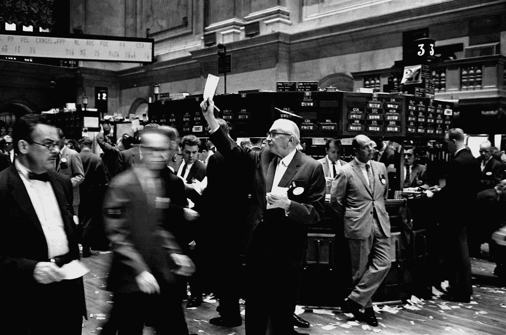

NY Stock Exchange Trading Floor — Forbes

一个*交易所*是一个交易金融工具的市场。例如，在纽约证券交易所，你可以交易期权、股票等。在外汇市场，你可以交易外汇、商品、指数。在密码交易所，你可以交易硬币和代币。

市场是一群特定商品或服务的买家和卖家。

类比总是更好地理解概念，所以让我们用一个。(我会具体说一下加密交易所，股票在某些方面是不同的)想想你生活在一个疯狂的小镇里，这里有几个加密商场，叫做 Polneix，Binenace，KoCoin，Bitirex，CoinBese … swh。那些商场只有密码商店，比如一个卖以太坊换比特币，一个卖 ZCash 换比特币，一个卖 Monero 换美元，一个卖比特币换美元……所以，对于购买比特币，你需要逛商场，去比特币/美元商店。然后你会通过交易你的美元来购买比特币。为了出售它，你将再次访问商店，这次你将用美元交易你的比特币。在这种情况下，我们的购物中心是体现商店的交易所，而商店是买方和卖方聚集的市场。

上面这张照片是我在一家资产管理公司工作期间，我的经理首先想到的。这是纽约证券交易所早期的照片之一，也是理解交易动态的关键照片。让我们想想我们的例子。照片实际上类似于我们的例子。照片中的交易大厅就是我们示例中的购物中心。人们试图通过直接互动来买卖股票。电话和邮件是与外界联系的方式。这些图表是用粉笔在黑板上手工绘制的。这就是交易所的运作方式，就像一个集市，一个购物中心。今天，我们有计算机和互联网以同样的心态运行交易所。

b .订单簿——价格如何变动？

Shell with a pearl — weheartit.com

首先，一些经济 101

*   *供应量*是卖家愿意并能够生产/推向市场的商品数量。*卖家*决定*货源。*
*   *需求量*是购买者愿意并且能够(有资源——金钱)购买的数量。*购买者*确定*需求*。
*   *价格*是市场出清的工具。它会进行调整，使供应量和需求量达到平衡。
*   如果*需求数量* > *供给数量*那么*价格就会上涨，*反之亦然，价格就会下跌。

—想象一下珍珠市场。有人想卖珍珠，有人想买珍珠。每个卖家只拥有一颗珍珠。

场景 1: 有两个卖家和十个买家。买主们将竞相购买珍珠。一个会说 10 美元，另一个会说 15 美元，另一个会说 100 美元。因为珍珠很珍贵。

场景 2:有十个卖家和两个买家。卖家将会竞相出售珍珠。一个人会说它值 10 美元，另一个人会说 9 美元，另一个人会说 1 美元。因为珍珠并不珍贵。

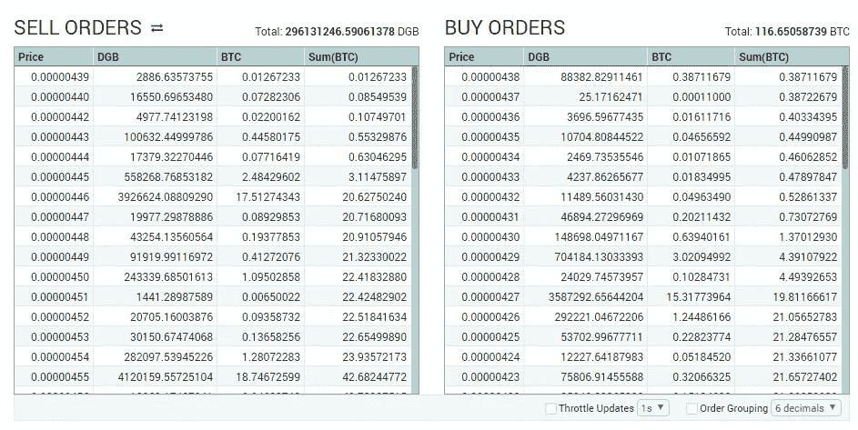

orderbook snapshot of DGB from Poloniex

*   价格显示 BTC 1 DGB 的报价。
*   DGB 显示了该价格下 DGB 的累计量。(是总价值，不是单个人的报价)
*   BTC 显示了该价格下 BTC 的累计量。(是总价值，不是单个人的报价)
*   Sum 显示在该价格下 BTC 的累计量。

—让我们回到我们的购物中心类比；我们正在参观 Polneix 购物中心，进入 DGB/BTC 商店。上图向我们展示了买家和卖家。在卖单上，我们看到有人试图用 DGB 换 BTC，在买单上，我们看到有人试图用 BTC 买 DGB。最便宜的 DGB 售价 439 satoshis，只有 2886 的 DGB 以这个价格出售。另一方面，最高购买报价是 438 satoshis 的价格，在该价格下的总需求 DGB 是 88362。所以，不会有交换，因为卖家不想在 439 sats 以下卖，买家不想在 438 sats 以上买。让战争开始吧！！对我来说，这是交易中最有趣的部分。互不认识的人会在网上争着买或卖。为了达成妥协，需要做出让步。

*在价格上涨场景*中，市场需要一些环境因素来触发它，使 DGB 看起来更“迷人”。因此，买家会认为价格会上涨，如果他们在 439 买入，他们可以在未来卖得更高。所以，有人会说，“我会在 439 买入”，另一个人会过来说“我会在 440 买入”。人们会相信价格会回升，并试图尽快买入 DGB，因此他们会将买入订单置于之前的订单之上。与此同时，卖方将把他们的卖单放在更高的价格上，买方将追逐最低的上涨卖单，以保证他们的交易，DGB 将抽水，直到市场达到平衡。440, 442, 450…

*在价格下降的场景*中，市场需要一些环境因素来触发它，使 DGB 看起来“没有吸引力”。因此，DGB 车主会认为价格会下降，并希望尽快出售他们的 DGB。一个卖 438，另一个卖 437..与此同时，买家会降低他们的报价，认为价格会低于当前价格的卖家会以越来越低的价格出售他们的 DGB。所以 DGB 会抛售，直到市场达到平衡。437, 435, 420…

**c .理解图表**

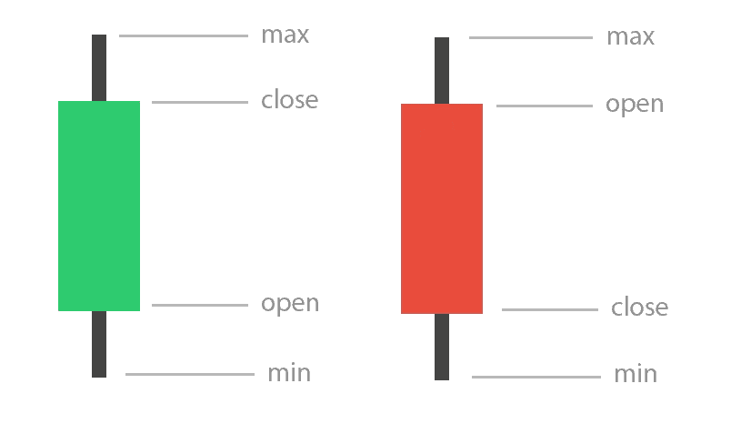

Japanese Candlesticks — just simple Photoshop

图表可能一开始看起来很复杂，你可能会想起好莱坞的交易电影或前面有几十个屏幕的交易者，看起来他们正在解决宇宙的秘密。不，相信我，图表真的，真的很容易阅读和理解，一旦你熟悉了它们，你就掌握了交易的精髓。交易是管理你的风险和理解价格行为。

让我们从图表的基本单位*烛台*开始。图表向我们展示了一个目标市场的交易数据。为了表现价格行为，人们可以使用各种工具，但日本烛台是最可靠的工具之一，以显示价格行为。它不同于统计学上的须盒烛台，日本烛台更简单。它显示了期望范围内的最高价、最低价、开盘价和收盘价。触须显示最高价和最低价，矩形显示所需时间段内的开盘价和收盘价。如果开盘价低于收盘价，这意味着价格已经上涨，因此主要使用绿色来识别蜡烛。如果收盘价低于开盘价，这意味着价格已经下降，所以主要使用红色来识别蜡烛。

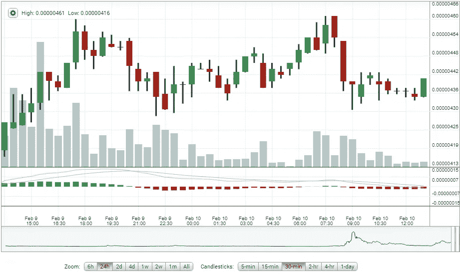

DGB/BTC chart from Poloniex

现在我们已经准备好了解图表上发生了什么。上图是 Poloniex 的 DGB/BTC 图表的快照。图表的主题在不同的平台上可能会有所不同，但通常看起来应该是这样的。这张图表用日本烛台来显示价格。我们首先要看的图表应该是*的时间表*。时间范围决定烛台的间隔。在我们的图表中，我选择了 30 分钟，所以每个蜡烛线显示 30 分钟的间隔。我最喜欢的加密时间框架是 4 小时，1 天和 30 分钟。较大的时间范围会给你更好的总体趋势，较慢的时间范围可能会有偏差，因为加密市场非常不稳定。在 Poloniex 中我们有*缩放*选项，它决定图表中显示的时间段，有些图表自动决定它，有些图表允许您手动放大和缩小。同样，短时间周期不会给出中长期趋势的准确结果。灰色矩形显示的是*音量*。体积是进行分析的重要参数。例如，价值 10 个比特币的交易价格可能上涨%5，价值 1 个比特币的交易价格也可能上涨相同的百分比。重要的是确定价格运动的动力和强度，以预测可能性。我会在以后的文章里详细讲成交量，价格动作，TA。卷下面的红色和绿色矩形显示的是 MACD 指标，我们将在以后的文章中详细讨论。

如何从字面上理解价格？

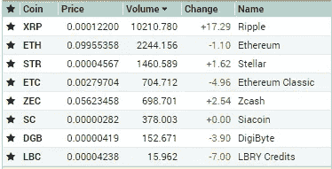

Some Markets From Poloniex

这可能看起来太基础了，但是阅读价格在开始时是令人困惑的。比特币可分为 8 位数，最后一位数称为 1 Satoshi/Sat，就像 1 美分一样。我的建议是为每种货币创造你自己的阅读风格。价格越高，最后一位数就越容易移动，因此最后一位数就变得越不必要。当你跟踪一枚硬币一段时间后，你会习惯它的价格，并决定有用的数字。我们来看一个案例研究。

下面是我内心的声音如何读这些例子；XRP 是一万二千二百，ETH 是九百九十五，STR 是四千五百六十七，ETC 是二百七十九，ZEC 是五百六十二，SC 是二百八十二，DGB 是四百一十九，LBC 是四千二百。

# 2.**交易所**

这一部分将涵盖用户界面，买卖，跟踪和几个主要的密码交易所的提示。大多数交换工作在相同的逻辑模式上，所以如果你愿意在不同的交换上工作，我相信，这一部分仍然有助于你理解工作流程。

我们将涉及的交易所不直接支持法定货币(政府货币)/ BTC 货币对，因此，您应该从支持法定交易的当地交易所购买加密货币。例如，我使用土耳其交易所购买密码，以便从我的银行账户交易菲亚特，美国居民可以使用罗宾汉，比特币基地或 Bitstamp 或任何其他你喜欢使用的。你可以看看下面的买入/卖出说明，动态是一样的。

我将在(a)部分介绍一些基本概念，所以我不会在其他部分重复它们，如果你有任何问题，你可能想回到(a)部分。

**波洛涅克斯**

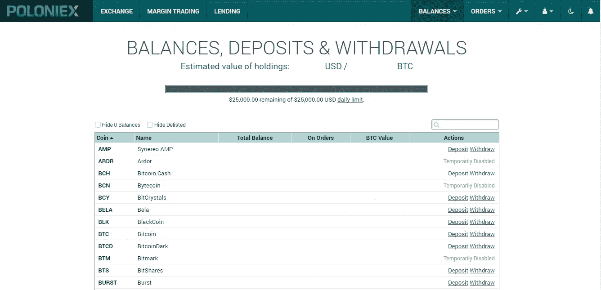

Balances, Poloniex

Poloniex 是一家总部位于美国的交易所。制作*的人*需要支付 0.15%的费用，接受*的人*需要支付 0.25%的费用。(制造商将订单放在订单簿中，接受者直接从订单簿中的订单购买或出售)

在你注册了 Poloniex 之后，你需要*用合法的交易文件来验证*你的账户。(在“我的个人资料”页面内)为了做到这一点，你需要一个浏览器摄像头，如果你的电脑不支持它，你可以使用你的智能手机来验证。验证后交易前，出于安全考虑，我强烈建议您启用*双因素认证*。您可以在“扳手图标”下的下拉菜单中的“二元身份验证”页面中启用它。

建立帐户后，是时候将*加密硬币存入您的 Poloniex 帐户开始交易了。您应该打开位于“余额”下拉菜单中的“存款&提款”页面。在这个页面中，您可以看到您的余额，您可以存入或提取密码。如我所说，首先你需要用政府的钱从你的本地交易所购买密码，然后存款，你需要点击想要的密码旁边的存款按钮。然后你的钱包地址就会出现。你可以从你当地的交易所转账到那个钱包地址。反之亦然，为了*从 Poloniex 撤回* crypto，你需要点击撤回并输入你想要发送的地址和金额。*

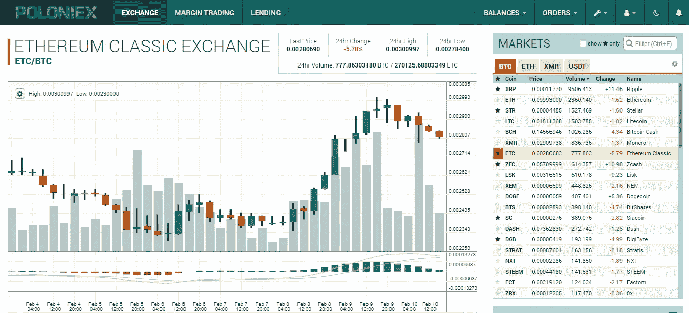

Exchange, Poloniex

这是我们的主页。让我们从上到下开始，涵盖几乎所有的内容。

*   *交易所*页面是你的主页面，在这里你可以看到图表、市场和订单。
*   *融资融券*和*借贷*简单来说就是让你用借来的钱进行交易，借你的钱。在我看来不适合初学者，所以建议不要从那些入手。
*   在*余额下*；*转账余额*是你把钱转到保证金交易账户的地方，*存款&取款*是你可以存、取款的地方，*历史*显示你的存款&取款历史。
*   在*命令下*；*我的未平仓订单*显示你的等待订单(如果你有)，*你的交易历史&分析*显示你在波洛涅克斯完成的每笔交易。
*   *扳手*和*档案*图标是关于安全和档案设置的，*月亮*图标切换到黑暗主题。
*   在左侧我们看到了*图表*。在 1.3 中已经解释过了。
*   在右边，我们看到了*市场。在顶部，您可以选择交换对，如 BTC、瑞士联邦理工学院、XMR 和 USDT (Tether USD)。选择交易对后，你会在第一栏看到硬币符号，第二栏是最新价格，第三栏是 24 小时交易量，第四栏是 24 小时变化，最后一栏是硬币名称。您可以选择最喜爱的硬币，并使用“仅显示星星”来仅显示最喜爱的硬币。(更少的硬币会使兑换更快)*

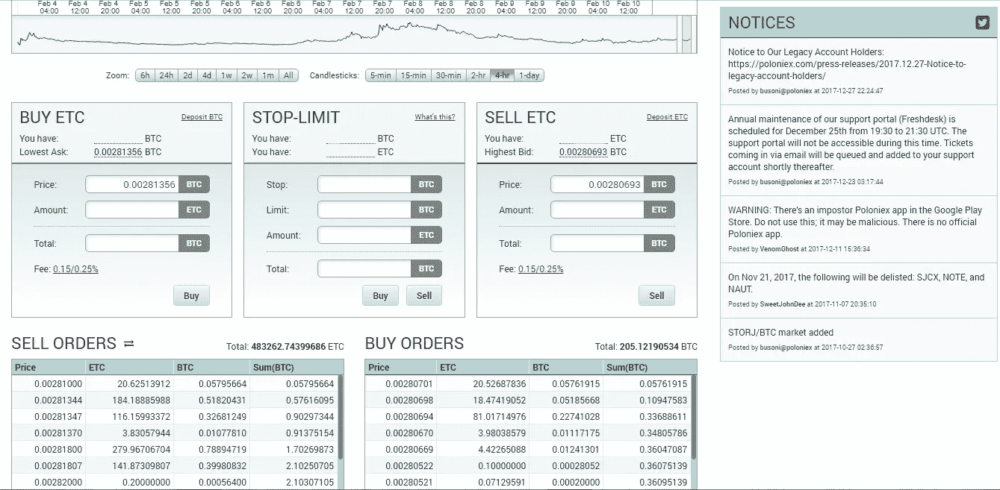

Buying and Selling, Poloniex

我们介绍了基础知识、订单簿、价格变动和图表，现在是时候学习如何*买卖*。有一个简单的规则，低买高卖。在这里，我点击了 ETC/BTC 市场。如你所见，最低卖单是 0.00281，最高买单是 0.00280。“买入 ETC”和“卖出 ETC”面板用于限价订单。限价单允许您在订单簿中下单。例如，你可以以 1 美元的价格购买 btc，希望它能达到这个价格。订单将出现在订单簿的底部。反之亦然，你可以以 10 万美元的价格下一个卖单，希望它能达到 10 万美元。

*价格*是你想买入或卖出的价格。*数量*和*总计*显示你想卖出或买入的 ETC 或 BTC 的数量，你可以两者都玩。如果你想直接买入或卖出，你可以把价格放在最高买入订单之下或最低卖出订单之上，它将直接与顶部的订单相匹配。

*止损限价*功能允许您为订单创建“if-then 函数”。它让你在离开平台的时候也能安全交易。让我们用例子来学习。

*   止损卖出；

止损:0.0024 BTC
限价:0.0023 BTC
金额:10 等

如果最高出价下降到或低于 0.0024 BTC，则以 0.0023 BTC 的价格卖出 10 个 ETC。(你也可以设置高于止损点的限价。)

*   止损买入；

止损:0.0035 BTC
限额:0.0036 BTC
金额:10 等

如果最低要价上升到或高于 0.0035 BTC，那么将发出以 0.0036 BTC 的价格购买 10 个 ETC 的订单。(你也可以设置低于止损点的限价。)

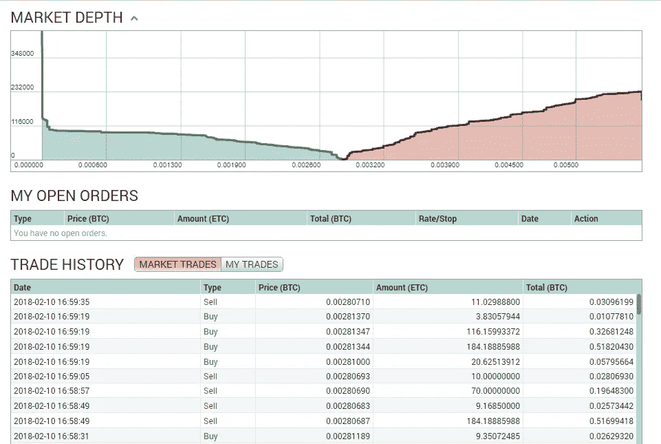

Market Depth and Orders, Poloniex

*   *市场深度*图表对于理解特定硬币的累积和分布非常有用。这是订单量与价格的关系图，可以用来分析卖出或买入墙。(*第一条*)图中陡峭的倾角意味着在那个价格上的累积，这意味着在那个特定的价格上有一堵墙的订单要越过。
*   *我的未结订单*允许您跟踪特定市场的未结订单。
*   *交易历史*显示即时更新的市场交易历史以及您在该特定市场的交易历史。

**币安**

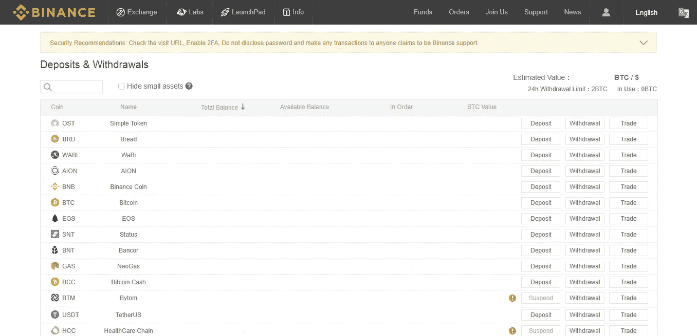

Deposits & Withdrawals Page, Binance

币安目前是一家国际注册公司，以前总部设在香港。这是一种新生的交流方式，其流行速度令人难以置信。推出三个月后，它就进入了交易量前十的交易所。现在是 24 小时交易量的第一笔交易。他们一直使用的秘方是代销商+客户服务。他们有很好的会员服务，所以一开始每个人都在分享，而且他们的客户服务也很棒，人们都和交易所有联系。另外，他们有移动应用程序和桌面应用程序作为交换。

与波洛涅克斯不同，在币安，你可以在不验证账户的情况下进行交易。如果你没有验证你的帐户，你一天最多可以提取 2 个 BTC。如果您想一天提取超过 2 个 BTC，您需要按照类似 Poloniex 验证的流程，从“*账户*”页面验证您的账户。你应该再次激活你的双因素认证。在开始交易前，您也可以在“*账户*页面激活该账户。

当你准备好将 crypto 存入你的币安账户时，就该在这个页面的“*人物图标*下的下拉菜单中进入*存款&取款*页面了(点击*预估值*)，这个过程将类似于 Poloniex。为了存入密码，您应该点击您想要存入的硬币/代币旁边的*存款*，您将看到存款地址。反之亦然，为了提取硬币/代币，您应该点击*提取*并输入转账地址和金额。

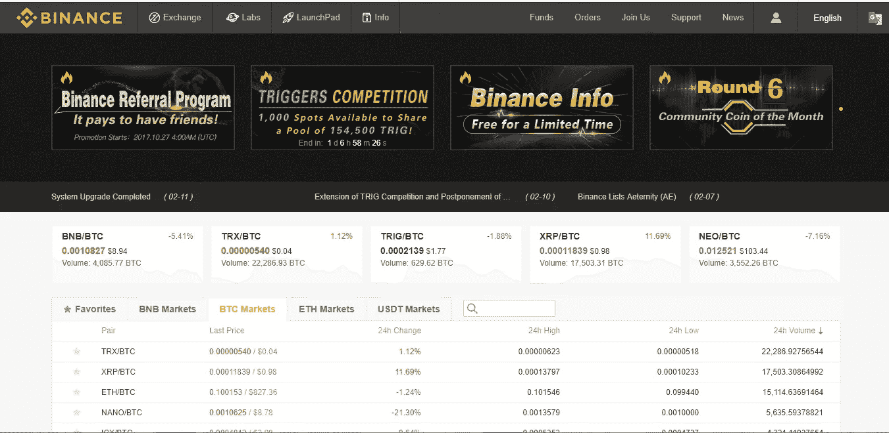

Home Page, Binance

这是主页。让我们从头开始涵盖一切。

*   *交易所，*就是你交易的地方。币安有两个交换界面选项，*基本*和*高级。我们将详细介绍它们。*
*   实验室是区块链的一个前 ICO 技术孵化器。这与普通交易者无关。他们提供；建议、资金、列表、启动平台、想法、资源等..(比如创业孵化器)
*   *Launchpad* 是一种投资在币安 Launchpad 上市的 ICO 的方式，这些 ICO 以后会在币安交易所上市。
*   信息是一个太新的功能(昨天刚刚发布，我猜，swh)我对它的第一印象是，它看起来真的和硬币市值网站一模一样，而且有很多错误。让我们看看会发生什么。
*   *资金*简单地向您显示您的*余额*、*存款&提款*和您的*存款&提款*历史记录。
*   *订单*显示您的*未平仓订单*、*订单历史*(所有订单，甚至是已取消的订单)和*交易历史*。
*   *加入我们* —招聘、*支持* —常见问题解答和提交请求、*新闻* —公告、*人物图标—* 账户、设置、账户余额、存款&取款(他们放了很多链接才能到达那个页面，swh)
*   在*横幅中，*您可以看到重要的公告、新闻、比赛等...
*   在横幅下方，您可以跟踪市场数据。

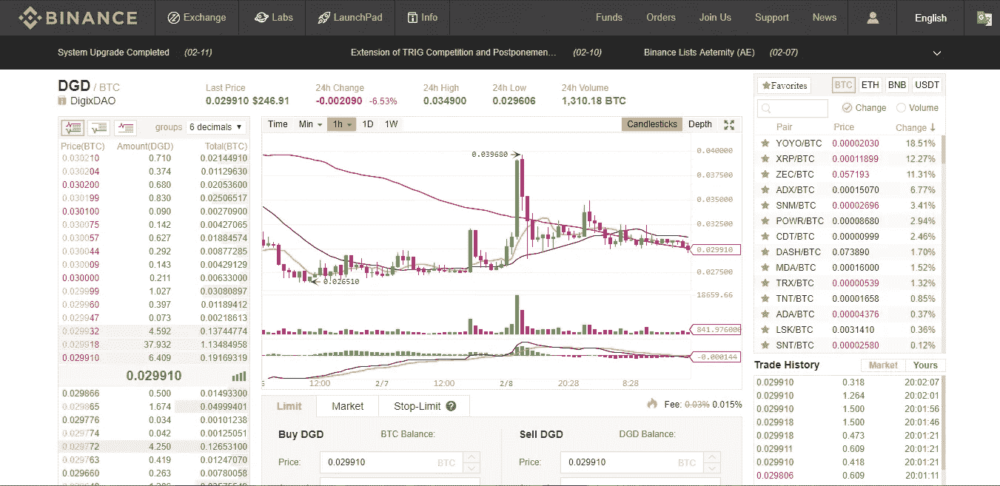

Basic Exchange, Binance

Binances 包括两个不同的交换页面，分别为*基本*和*高级*。它们在功能上几乎是相同的平台(advance 包括技术分析工具)，它们之间唯一的主要区别是 UI。你可以用你喜欢的来交易，没区别。

在右侧，我们可以看到*市场*面板。从面板顶部，可以选择 BTC、瑞士联邦理工学院、BNB、USDT 配对。你可以看到加密货币的符号，当前价格和变化。您可以将硬币标上星号并仅显示它们。在市场面板下面，你可以看到市场和你自己的交易历史。在这一页中，我们以 DGD、广州/ BTC 市场为例。左边是秩序册。红色和绿色在视觉上显示了积累。图表放在中间。您可以在顶部调整烛台时间。您也可以从顶部打开体积深度图。粉色和紫色线是被称为“指数移动平均线”的指标，我们将在以后的文章中讨论。在烛台下面，我们可以看到体积。在成交量下面，我们还有另一个指标，我们将在另一篇文章中再次讨论。

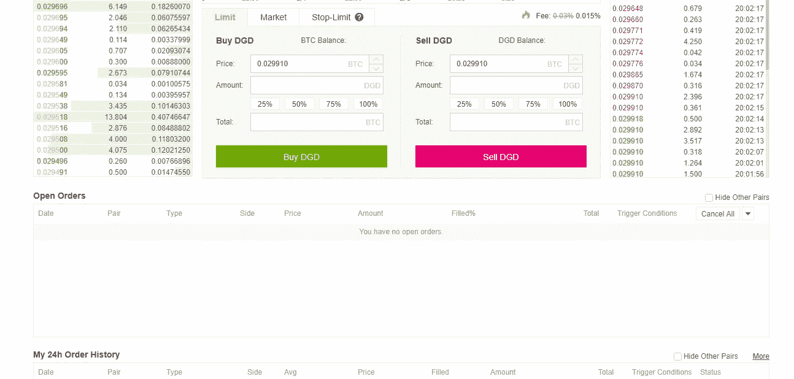

Buying and Selling, Binance

尽管各交易所的订单机制有细微差别，但在我们将涉及的所有交易所中，*限价单*、*市场*和*限价单*将具有相同的基本动态。因此，我将主要关注细微差别，而不是基本面。(您可以参考第 2.a 节了解基础知识)

首先是费用和规则...币安收取 0.1%的交易费，如果您使用 BNB(币安硬币)支付费用，在币安的第一年您将享受 50%的折扣，在币安的第二年将享受 25%的折扣。币安的市场包括 BTC、USDT、瑞士联邦理工学院和 BNB 的交易对。它有令人恼火的交易规则，例如，BTC 对的最小订单价值为 0.001BTC，瑞士法郎对的最小订单价值为 0.01 ETH，USDT 对的最小订单价值为 10USDT，BNB 对的最小订单价值为 1BNB。为此，我选择 BNB 在币安交易替代币，主要是因为替代币/BTC 和替代币/BNB 对之间没有套利。

*   *限价单*允许您以理想的价格和理想的金额进行买卖。
*   *市价单*会直接买入最高卖单或者卖出到最低买单。你只需要输入一个金额。
*   *止损限价单*允许您创建 if，然后与订单一起运行。(秒。2.a)

*未结订单*将列出您的未结订单(除非它们已被完全成交),在下方您将看到您的*24 小时订单历史*。

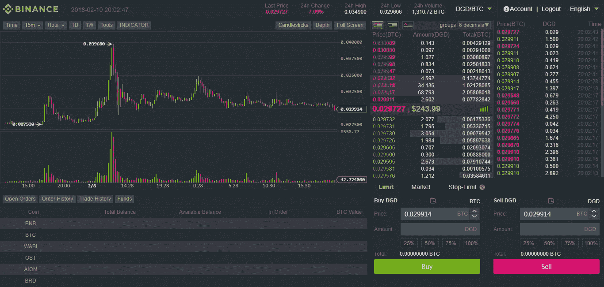

Advance Exchange, Binance

让我们快速浏览一下高级视图。

主要的区别是用户界面和图形。我们有一个更大的图表，包括指标和技术分析工具，我们将在技术分析文章中深入讨论。您可以通过点击当前配对的名称来监控*市场*；在这种情况下，DGD/BTC(在左上角)在左边，我们有一个订单簿和当前交易。在底部，我们可以监控我们的*资金、交易历史、订单历史*和*未结订单。**订单面板*位于屏幕右下方，与基本视图类似。(一个细微差别:你不能在预先视图中以限价单输入比特币价值，但你可以在基本视图中输入两个交易对的价值)

**c. Bittrex**

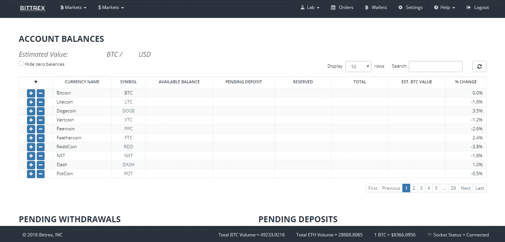

Account Balances, Bittrex

Bittrex 是一家受欢迎的美国交易所。关于手续费，所有的交易都有 0.25%的佣金。您可以在没有验证的情况下在 Bittrex 中存款和交易，但要取款，您需要验证。因此，强烈建议在开始 Bittrex 交易之前验证您的帐户(否则，如果验证不被接受，您的钱将被锁在里面)。为了帐户安全，强烈建议设置 2FA。

设置帐户后，您可以点击*钱包存款。*该页面显示您的账户余额，允许您向账户存入或从账户中提取加密货币。对于存款，您应点击“+”并生成新地址。对于取款操作，您应点击“-”并填写地址和金额。在该页面中，您还可以监控*未决提款/存款*和*提款/存款历史*。

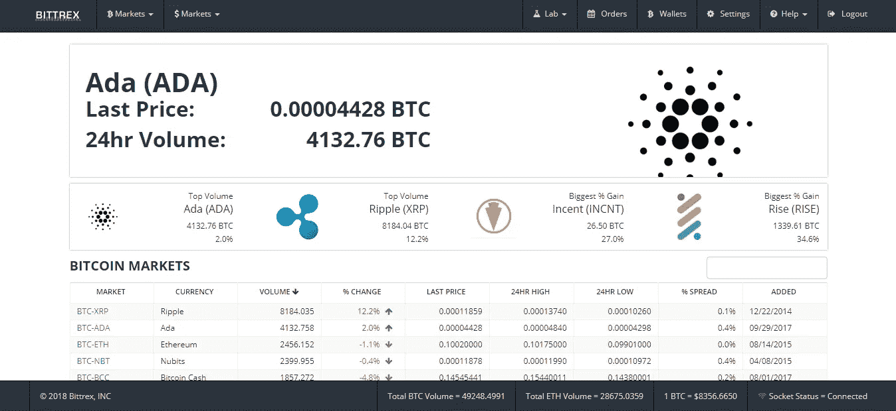

Home Page, Bittrex

在加密交换中，Bittrex 有一个独特的用户界面。每次使用时，我都会对用户界面感到“不同”。没关系，让我们回到主题，这里是 Bittrex 的主页。还是那句话，首先，让我们从上到下涵盖所有内容。

*   点击 *฿市场，*打开一个下拉菜单，允许您监控 BTC 市场。
*   点击 *$ Markets，*打开一个下拉菜单，允许您监控 USDT 市场。
*   Bittrex 的概念与币安不同。它允许用户成为他们计划的新功能的测试用户。因此，他们与候选测试用户一起测试新想法、新功能，如果反馈是积极的，就在将来使用它们。
*   *订单*显示您的*打开*和*完成*订单。
*   钱包页面用于监控*账户余额*、*待提 W*ith draw*als/**存款*、*取款/存款历史*。您也可以在此页面存款或取款。
*   *设置* —设置，*帮助*—新闻，关于，费用，杂事..

作为一个横幅，Bittrex 以幻灯片的形式展示了四个主要市场。最高音量 x2，最大%增益 x2。在横幅下方，您可以监控市场。Bittrex 包括 BTC、瑞士联邦理工学院和 USDT 市场。从左到右你可以监控；市场符号、货币名称、成交量、变化百分比、当前价格、24 小时最高价、24 小时最低价、价差百分比(买卖差价%)和添加日期。

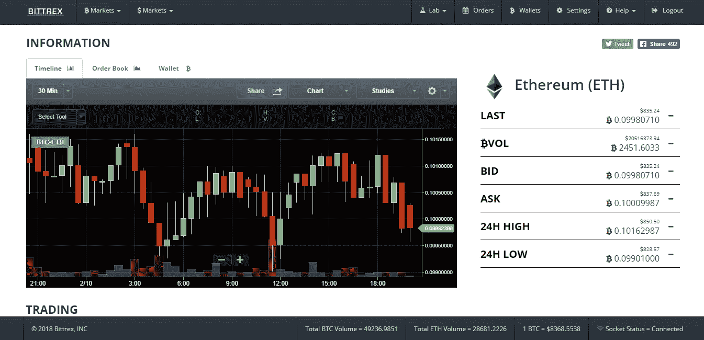

Information-Trading, Bittrex

让我们继续看图表。Bittrex 的图表包括足够的功能来做一个体面的 TA，通过选择*时间线，*你会看到图表。从图表顶部开始；

*   *时间*，可以调整烛台时间
*   *图表*，可以自定义图表样式(表示价格)并激活对数刻度
*   *病历报告，*您可以激活各种指示器
*   *设置*您可以更改图表主题(亮/暗)
*   *选择工具，*您可以在图表上绘制趋势线/级别。

选择*订单簿*将显示市场深度图，选择*钱包*将打开加密货币的存款和取款窗口。

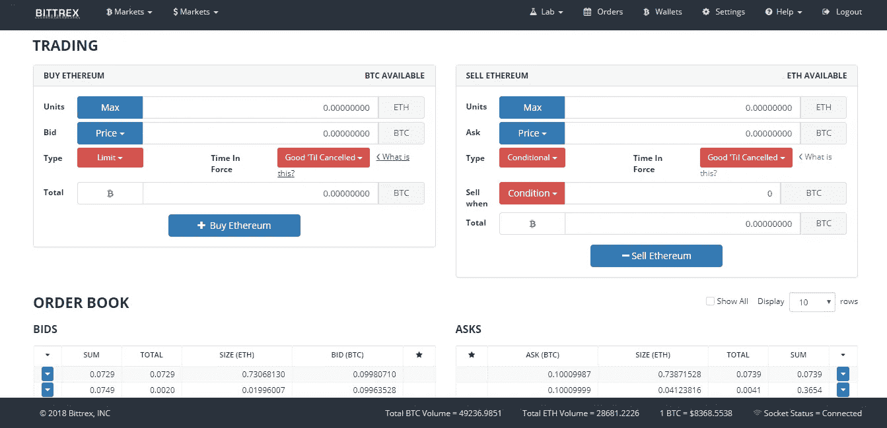

Trading, Bittrex

Bittrex 中的交易面板是紧凑的，它允许您通过下拉选择菜单输入不同的订单类型。让我们从上到下；

*   *单位*，是你想发行的加密货币的数量，点击最大，它将选择你的所有余额为该货币
*   *出价/要价，*是您希望创建订单的价格。
*   *类型，限价*是限价订单，*条件订单*允许您创建止损订单。
*   *生效时间，*“有效直至取消”将执行订单，直到订单被完全执行，除非您这样做，否则不会被取消，“立即”或“取消”不接受您订单的部分执行，如果您的订单不能被完整执行，它将被取消。
*   Total 是您要发行的 BTC、瑞士联邦理工学院或 USDT 的数量，您可以用它或单位来选择数量。

在交易面板的下方，有一个详细的*订单簿*，在它的下方，有*未平仓订单*、*行情历史*和*我的订单历史。*

**d .库科恩**

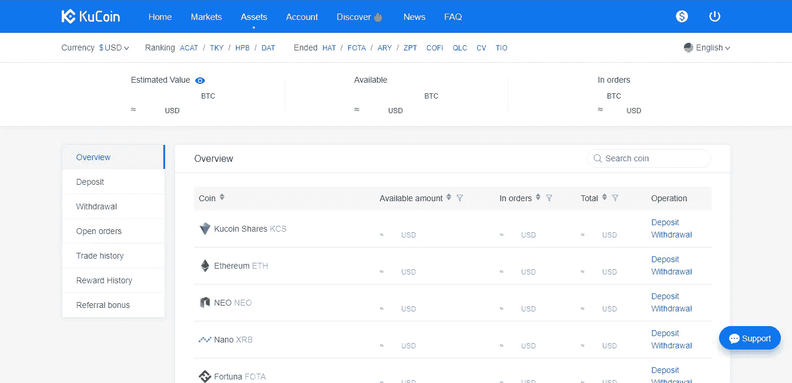

Assets, KuCoin

KuCoin 是一家总部设在中国的加密交易所，交易费用为%0.1。这是一个真正的新交易所，与其他交易所相比，它的总交易量相当小。对我来说，它就像是币安的小弟弟。(可能是因为 UI 和类似的营销)一开始，像币安一样，他们优先考虑参考系统和客户服务，他们的策略相当成功。此外，KuCoin 经常列出新的加密货币，他们列出的货币大多是具有良好中期潜力的后 ICO 货币。总的来说，我认为这是一个与当前市场和未来潜力的很好的交流，所以我想把它也包括在文章中。

KuCoin 交易或提现不需要验证。所以设置好 2FA 就可以开始了。*资产*页面显示用户的资产概况、账户的估计价值、可用价值(未按顺序)、按顺序价值、存款、取款、未结订单、交易历史、奖励历史和推荐奖金。为了存款，您应该点击货币右侧的存款并生成地址。反之亦然为了取款，你应该点击货币右侧的取款，并填写金额和地址。

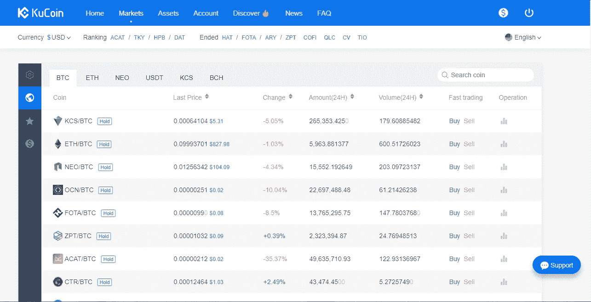

Markets, KuCoin

这里是*市场*页面。让我们从左到右覆盖所有内容。

*   *主页*是主页，显示公告、新闻、比赛等。以一种奇特的方式。它还可以在卡片视图中预览市场。
*   *市场*显示了库科恩的市场。库币包括，BTC，瑞士联邦理工学院，尼奥，USDT，KCS 和 BCH 市场对。在设置中，您可以安排监控哪些参数。当您在资产中持有的货币大于或等于您在设置中确定的价值时，会出现“持有”符号。作为一个预置，值为 0，所以每个市场都有持有符号。您只能显示最喜欢的和最不喜欢的。
*   *资产，*我们在本节开始时谈到过。简单来说，就是你的账户余额。
*   *账户*显示账户设置和 2FA 等杂项。
*   *Discover* 有两个特点: *KuCoin Bonus* 是一个程序，当你在 KuCoin 上持有 KCS 时，它会给你奖金，(就像一个利率一样)你可以计算出你从 kucoinshares dot com 上赚了多少钱。 *Vote for your Coin* 是一个程序，KuCoin 通过这个程序询问社区他们应该将哪种硬币列在下一个列表中，这样您就可以决定新的列表。
*   *新闻*显示交易所公告。
*   常见问题解答是 KuCoin 帮助台，你可以在这里找到在线支持、常见问题解答、提交请求或查找 API 文档。

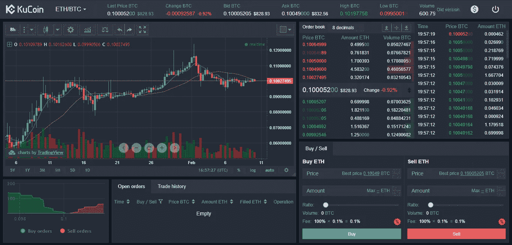

Exchange, KuCoin

这是 KuCoin 的交易页面，我喜欢它的界面，简洁，有用，更重要的是，他们使用 TradingView 图表。TradingView 图表是你能找到的最专业的加密交易图表，我正在考虑写一篇关于如何使用 TradingView 的文章，所以我现在不写了。对于初学者来说，它基本上是基于我们已经介绍过的其他图表的相同动态。(烛台、音量等..)您可以通过点击左侧的当前市场名称(在本例中为 ETH/BTC)来监控市场。您可以监控订单簿和最近的交易。在底部，放置市场深度图、未平仓交易和市场历史。交易面板位于屏幕的右下方。KuCoin 不包含止损单，这是交易所最大的缺陷之一。您只能通过输入价格和金额在 KuCoin 中限制订单。

# **3。基本面来源**

密码交易者必须监控密码市场的动向。除了监控，一个密码交易者还应该掌握新闻和谣言以获得成功。你需要冲浪，你不能逆流而上。所以，我会分享我最喜欢的来源来跟踪 feed，我保证当你开始跟踪他们并创建你的收藏列表时，他们将足以让你成为一个更自信的交易者，对市场有更多的控制。

我将在这篇文章中概述这些平台，因为我计划写一篇关于 FA 的综合文章，我们将在那篇文章中深入讨论它们。

**a. Coinmarketcap**

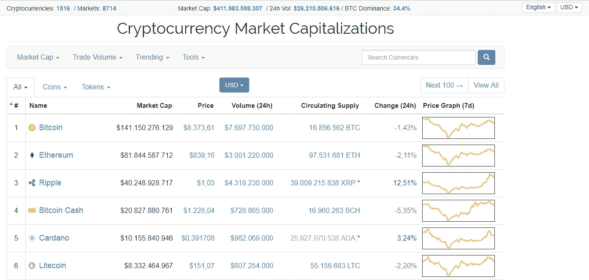

CoinMarketCap

这个网站是我们加密货币的主要来源。如果你看到一枚硬币或一个代币，如果你想了解更多，这个网站将是你应该去看看的第一个网站。该网站包括关于市场、总体情况、交易所以及硬币和代币的非常有用的信息。在密码学中，市值意味着，流通供应量×价格。因此，当你想比较一种加密货币和其他加密货币时，或者当你想发现它被高估或低估时，你应该看看它的市值。你也可以找到一个硬币的图表数据，从这些交易所你可以交易硬币，交易量信息，供应信息和关于硬币的各种链接。

**b .共同市场**

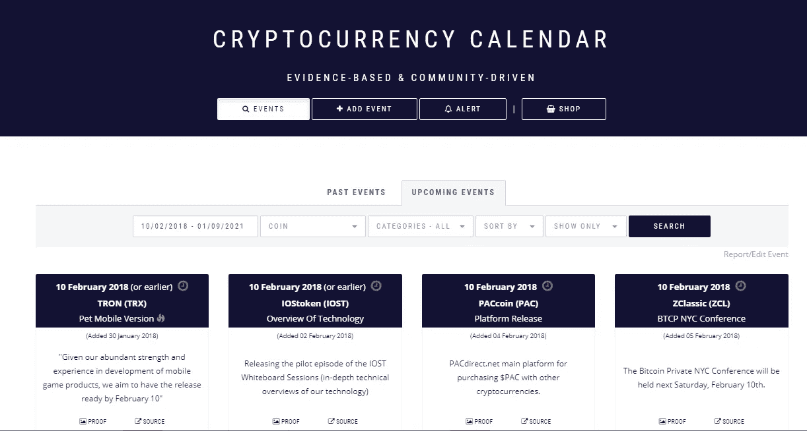

CoinMarketCal

CoinMarketCal 是一个可爱的社区驱动的网站，用于跟踪加密货币事件。帖子由社区创建，并经过投票、证据和来源的验证。您可以按日期、硬币、类别和热门事件对事件进行排序。从我的经历来看；空投(免费宣传)、合作伙伴关系(增加潜力和知名度宣传)、交换(新买家即将到来宣传)、硬分叉、“令人兴奋的、伟大的、惊人的公告”可能会造成宣传和价格反弹。所以继续关注他们。

**连续组合/增量**

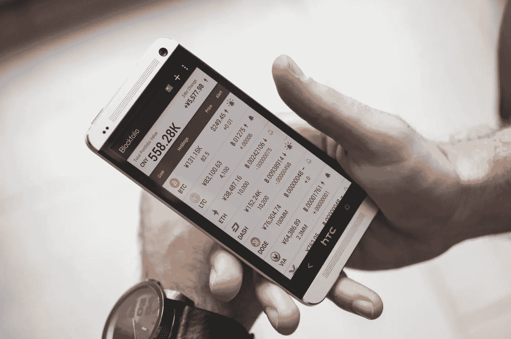

Stock image, Blockfolio

在某个点的 Blockfolio 变成了我的器官之后，我发现自己在随机的地点、随机的时间检查 Blockfolio。我醒来的第一件事是检查 Blockfolio，睡觉前的最后一件事是检查 Blockfolio。Blockfolio 是一个不错的应用程序，用于跟踪你的投资组合和设置价格警报。我不喜欢 shilling，所以我也添加了它的竞争对手 Delta app，你也可以看看。

*—如何使用 Blockfolio？*

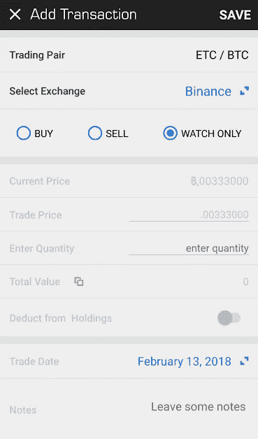

*   为了给*添加一个市场，*在主页中点击“+”并选择市场。如果您只想监视市场，请选择“仅监视”。
*   为了*添加一笔交易，在市场页面中点击*+。手动填写交易详情。如果您想保持您的持股连续性，请选择“从持股中扣除”或“加入持股”。
*   可以添加*音符*。如果交易会出错，笔记会让你知道自己的错误，这很重要。
*   为了*添加提醒，*在市场页面中选择*提醒*。点击“添加提醒”填写提醒设置，并按保存。(1 次将在条件为真时发送一次警报，持续将在条件为真时每次发送)

**c .新闻**

你可以在网上找到各种区块链/加密货币新闻网站。我个人关注投币电报和投币台，每天浏览文章。

**d .推特/电报/不和**

尤其是 Twitter 和 Telegram 对于密码世界至关重要。它们允许社区相互协作，此外它们还连接了开发者、商业成员、商人和投资者。加密社区的可访问性是独一无二的，如果你有任何关于 ICO 的问题，你可以直接向 CEO 提问，如果你有任何交易问题，你可以把你的图表发给大家。我相信社区会在各种技能上提高你很多。此外，我喜欢 crypto 社区有趣的部分，不像任何其他金融社区，高质量的迷因和 gif 的数量是巨大的。

*   *推特*；当你关注 Twitter 社区时，最重要的心态是保持怀疑。不可能知道未来会发生什么(就我们的技术发展而言，swh)，所以 Twitter 上的人们会做出很多错误的预测。让我们来理解一下我们在 crypto Twitter 上的主要目标，“对正在发生的事情发表意见，并引发思考。”你需要过滤人员和信息。我所做的是，我创建了一个过滤的 feed，我通过使用一些过滤器来过滤人们，例如，hilling，在没有暗示或解释的情况下共享引用链接，将有偏见的知识作为纯知识共享，不尊重他人。然后我用我的反馈来获取灵感。如果我在不同的人身上看到相同的东西，我会去寻找。如果我看到令人兴奋的东西，我会去寻找它。如果我看到不同的 TA 技术，我会去搜索它。对于关注谁，我不想在这篇文章中推诿，所以你可以登录我的 Twitter 账户(写在底部),看看我关注的人。不应该是我，你可以找到一个你喜欢的个人资料，并在它的追随者中寻找灵感。
*   *电报*；首先，我喜欢加密电报贴纸包。在我看来，电报是加密最腐败的地方，有引用链接、先令、虚假新闻等。电报上有很多你可以加入的群组，如硬币群组、ico 群组、信号群组、泵群组(不要加入)、先令群组、空投群组、社区群组…在加密电报之后需要极高的思想过滤。最有用的群是官方 ico，coin，token 群，你可以在那里获取新闻。你可以从网上找到这些小组。(我真的不想在这篇文章中 shill 电报组，swh)
*   *不和；*不和谐、懈怠等。也被密码社区大量使用。付费群体大多用不和来沟通。此外，不和谐群体更像是 crypto 中的一个子社区。如果你在网上搜索，你也能找到它们。同样，有许多有偏见的内容围绕着不和谐的群体流动。

farewell time

**感谢**的阅读！我希望这是有帮助的，你喜欢！

那么，**接下来呢？**打算写的文章有烛台模式，积累-分布-成交量分析，常见反转和延续图模式，常用指标，如何看 TA，投资组合-资金-风险管理，系统，基本面分析。如果你对这些话题感兴趣，可以关注我。

你可以从[这里](https://hackernoon.com/crypto-101-the-glossary-645765878bc9)阅读我的**第一篇文章***“crypto 101 | The Glossary”*。

最后，你可以在 **Twitter** 上关注我，我会很感激- > [@cryptorocket_](https://twitter.com/cryptorocket_)