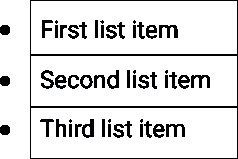
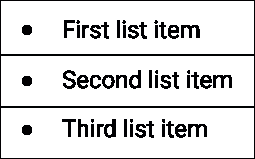

# 我们来谈谈项目符号:CSS 项目符号样式

> 原文：<https://medium.com/hackernoon/lets-talk-about-bullets-css-bullet-style-310b9df1fcb0>

你喜欢列很多很多的清单吗？我也不是。但是，这里我不是在谈论家务或购物清单。我说的是制作现代网站和应用时不可避免的有序和无序列表(T4)。

如前所述，在 HTML 和 CSS 中创建列表时，有两种类型:**有序和无序**。

在**有序列表的情况下，编号出现**。另一方面，**在无序列表的情况下，不存在编号**，这就是为什么这种类型的列表的常见名称是项目符号列表。

使用列表时，正确设置文本的格式很重要。

本文的重点是无序列表，以及项目符号的类型和属性。

无序列表使用了`<ul></ul>`标签。让我们看一个简单的例子。

*HTML*

```
<ul>
  <li>First item</li>
  <li>Second item</li>
  <li>Third item</li>
<ul>
```

# 类型属性

**类型**属性可用于确定列表中将使用哪种类型的项目符号。该属性可以由三个不同的值组成:

可以在`<ul></ul>`或`<li></li>`元素上设置项目符号类型，这意味着您可以在**总列表**上设置样式，或者**分别为每个列表项设置样式**。

列清单时，知道使用哪种[字体大小](https://kolosek.com/css-relative-font-size/)是一件好事。

# 项目符号样式

要更改项目符号样式，可以使用两个属性。**列表样式类型**属性或**列表样式**。不同之处在于，通过使用第二个选项，您可以同时更改多个属性。但我稍后会讲到。

*CSS*

```
.ul {
  list-style-type: square;
}
```

在这里，您可以看到列表样式设置为方形。

# 使用自定义图像

借助 CSS 的力量，可以使用一个**自定义图像作为子弹**。通常，它是一个简单的小图标。为此，我将使用**列表样式图像**。

*CSS*

```
ul {
 list-style-image: url(‘images/sample-bullet.png’);
}
```

# 项目符号位置

还可以使用 **list-style-position** 属性设置项目符号的位置。它可以有两个值:**外部和内部。**

*CSS*

```
ul {
 list-style-position: outside;
}
```

*CSS*

```
ul {
 list-style-position: inside;
}
```



第一幅图显示了在外部设置为**的值，第二幅图显示了在**内部设置为**的值。**

当将该值设置为 outside 时，意味着项目符号将位于列表项之外**。并且，当将值设置为 inside 时，项目符号将位于列表项**内的**。**

不要忘记给列表添加一些[样式](https://kolosek.com/10-ways-to-improve-your-website-design/)。

如果这种样式还不够，你可以[改变项目符号的颜色](https://www.w3.org/Style/Examples/007/color-bullets.en.html)。

# 组合属性

正如我之前提到的，您可以通过设置**列表样式**来组合多个属性。

*CSS*

```
ul {
 list-style: square inside url("element.gif");
}
```

有了这个简写，你可以同时设置**列表样式类型、列表样式位置和列表样式图像**。

开发网站和应用程序时经常使用列表，所以你应该知道如何设计它们的样式。我希望这个简短的解释能对你的项目有所帮助。

*感谢您的阅读！*

*原载于 2018 年 4 月 19 日*[*kolosek.com*](https://kolosek.com/css-bullet-style/)*。*