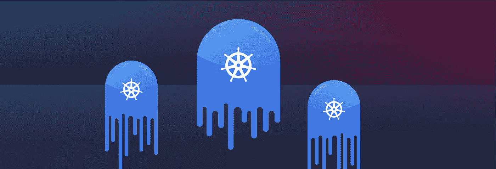
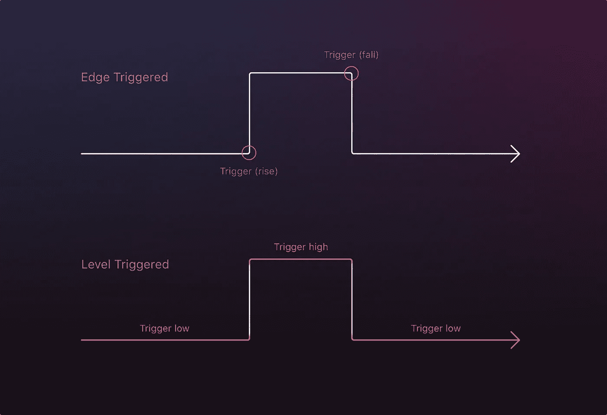
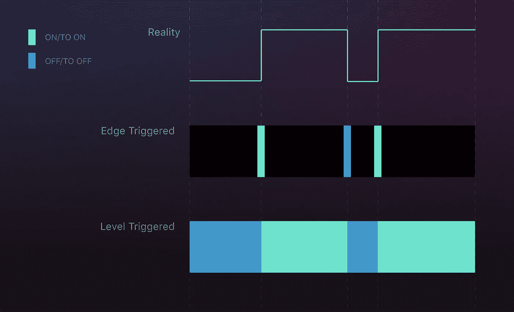
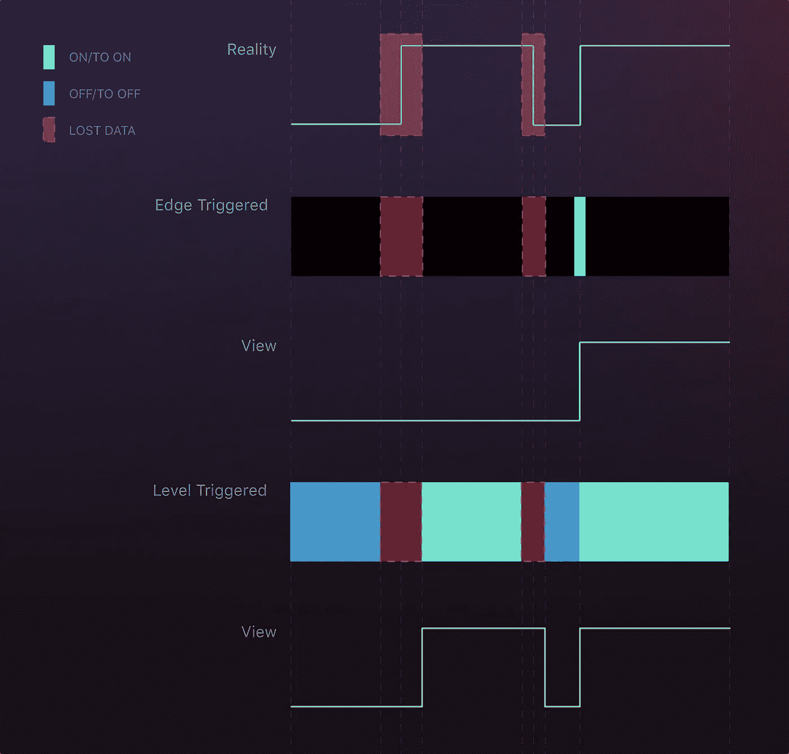
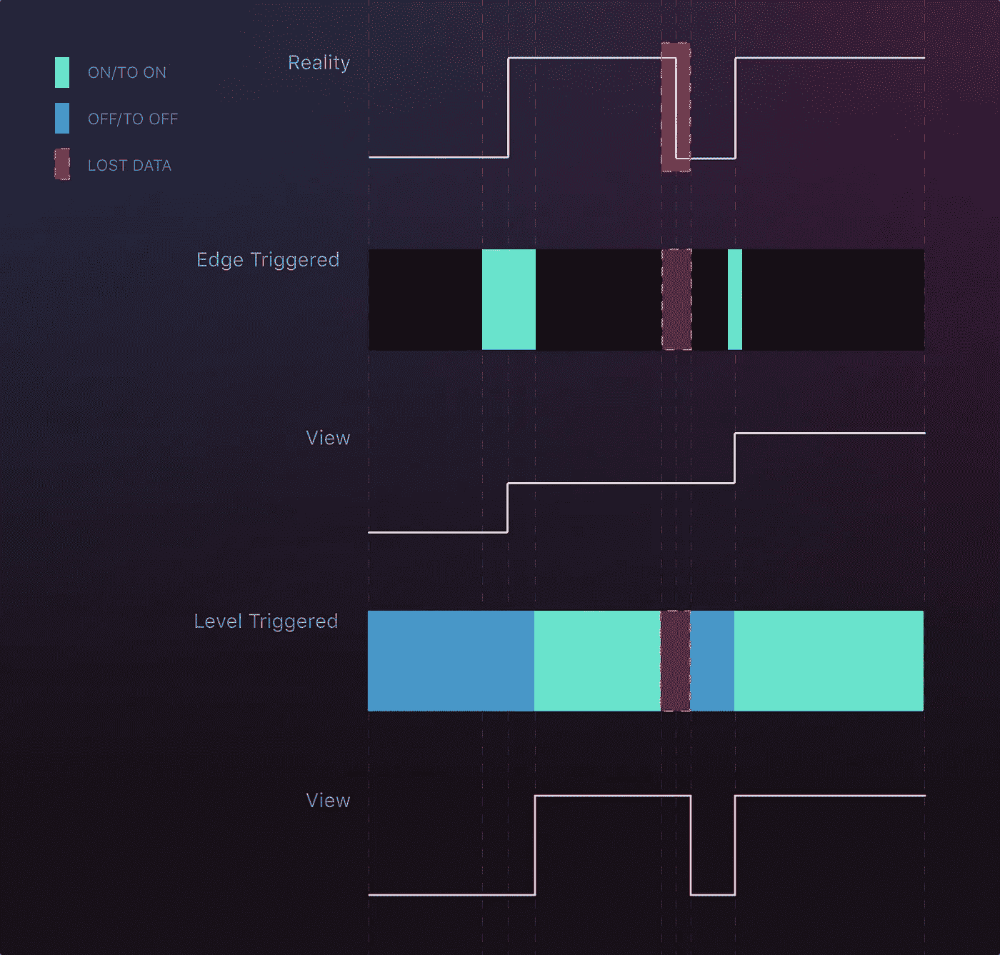
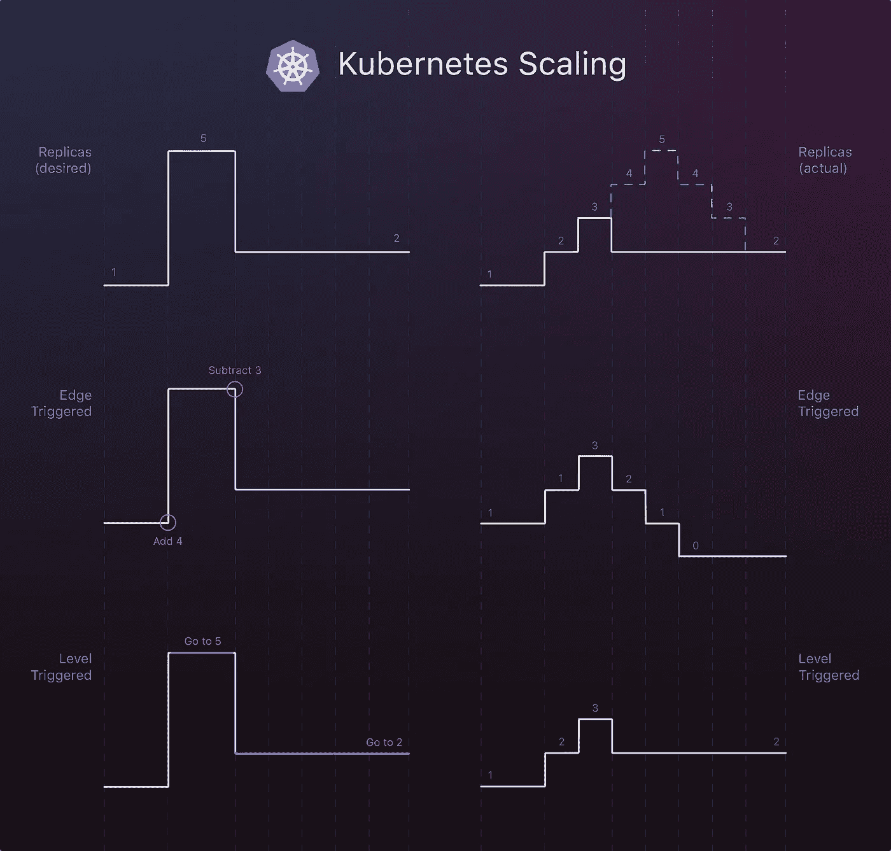
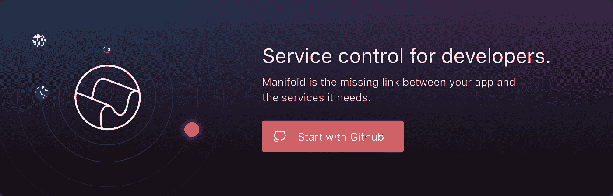

# Kubernetes 中的级别触发和协调

> 原文：<https://medium.com/hackernoon/level-triggering-and-reconciliation-in-kubernetes-1f17fe30333d>

## Kubernetes 如何用系统编程概念管理您的集群



> *揭秘:* [开发者集市流形](https://goo.gl/BtueKD) *之前赞助过黑客正午。* [使用 code HACKERNOON2018 获得任何服务 10 美元优惠。](https://goo.gl/BtueKD)

到目前为止，Kubernetes 是最受欢迎的容器编制器。它的成功很大程度上来自于它的可靠性。所有的软件都有缺陷。在运行容器时，Kubernetes 比其他选择更容易出错。

Kubernetes 最终会及时达到您期望的运行容器数量。它坚持不懈地保持着这个数字。 [Kubernetes 文档](https://kubernetes.io/docs/concepts/overview/what-is-kubernetes/)将此称为 Kubernetes 正在**自愈。**这种行为源自 Kubernetes 设计中的一个核心理念。

> “控制回路的目标寻找行为非常稳定。这一点已经在 Kubernetes 中得到证明，我们有一些未被注意到的错误，因为控制循环基本上是稳定的，并且会随着时间的推移自行纠正。
> 
> 如果你处于边缘触发状态，你将面临危及自身状态的风险，并且永远无法重新创建状态。如果你是水平触发的模式是非常宽容的，并允许组件的行为不应该被纠正的空间。这就是 Kubernetes 如此出色的原因。"
> 
> Heptio 首席技术官 Joe Beda(引自 Justin Garrison 和 Kris Nova 的[云原生基础设施](http://shop.oreilly.com/product/0636920075837.do)

# 中断:边沿和电平触发



Edge and level triggering for the same signal.

边沿和电平触发是来自电子和[系统编程](https://en.wikipedia.org/wiki/Interrupt#Types_of_interrupts)的概念。它们指的是系统应该如何随着时间的推移对电信号(或数字逻辑)的形状做出响应。当信号从低变高和从高变低时，系统应该关心**，还是应该关心**信号是否为高？

换一种方式来解释，给出下面的简单加法:

```
> let **a** = **3**;
> **a** += **4**;
< **7**
```

在操作的边缘触发视图中，我们会看到:

```
add **4** to **a**
```

这将在添加时发生一次。

在操作的级别触发视图中，我们会看到:

```
**a** is **7**
```

从添加开始，我们会不断看到这种情况，直到下一个事件发生。

# 分布式系统中的边沿和电平触发

理论上，边沿触发和电平触发没有明显的区别。在现实世界中，即使在系统编程级别，我们也必须处理实际的限制。一个常见的限制是[采样率](https://en.wikipedia.org/wiki/Sampling_(signal_processing)#Sampling_rate)。如果系统对信号的采样不够频繁，它可能会错过一个触发信号，要么是边沿跳变，要么是电平的短暂变化。

在更大规模的全计算机和大型网络上，有更多的问题需要[去解决。](https://en.wikipedia.org/wiki/Fallacies_of_distributed_computing)[网](http://www.cbc.ca/news/canada/nova-scotia/cellular-service-outage-bell-mobility-tellus-1.4235624)不靠谱。人[笨拙](https://hothardware.com/news/dont-trip-over-the-power-cord-human-error-caused-massive-time-warner-network-outage)。松鼠是不屈不挠的。在某种程度上，这些问题就像一个坏的或不一致的采样率。它们遮住了我们对信号的视线。

# 中断会改变感知

让我们看看信号中断如何影响在边沿和电平触发系统中的观察:

## 理想条件



How edge and level triggered systems interpret a signal.

在理想条件下，边沿触发和电平触发系统都能观察到正确的信号。在信号从开转变为关之后，它们都立即将信号视为处于关状态。

## 两次中断



Disrupting the rise and fall loses the high signal for the edge triggered system, but arrives at the correct end state.

由于信号状态的前两次变化周围有两次中断，边缘触发系统和水平触发系统之间的差异很明显。信号的边沿触发视图错过了第一次上升。水平触发系统假定信号处于其最后观察到的状态，直到它看到其他情况。这导致观察到的信号大部分是正确的，但是延迟到中断之后。

## 一次中断



A single well-placed disruption can have a large impact on the edge triggered system.

更少的干扰并不总是带来更好的结果。随着一个单一的干扰掩盖了从高回落到低，水平触发系统基本上又是正确的。边沿触发系统只看到两次上升，导致原始信号从未出现的状态。

为了再次用加法来表达这一点，信号表达为:

```
> let **a** = **1**;
> **a** += **1**;
> **a** -= **1**;
> **a** += **1**;
< **2**
```

但是边缘触发系统观察到:

```
> let **a** = **1**;
> **a** += **1**;
> **a** += **1**;
< **3**
```

# 调和期望状态和实际状态

Kubernetes 观察的不仅仅是一个信号，而是两个信号:集群的期望状态和实际状态。期望的状态是使用集群的人希望它处于的状态(*“运行我的应用程序容器的两个实例”*)。理想情况下，实际状态与期望状态相匹配，但是它会受到许多硬件故障和恶意攻击的影响。这些会使它偏离理想状态。甚至时间也是一个因素，因为不可能立即让实际状态与期望状态相匹配。容器映像必须从注册表中下载，应用程序需要时间来正常关闭，等等。

Kubernetes 必须获取实际状态，然后**将它与期望的状态进行协调**。它连续地这样做，取两种状态，确定它们之间的差异，并应用任何必须进行的改变，以使实际状态接近期望状态。

## 在 Kubernetes 扩展部署



In an edge triggered system, we could diverge wildly from our desired outcome.

即使网络没有中断，尝试协调两种状态的 edge 触发系统也可能以不正确的结果结束。

如果我们从单个容器副本开始，并希望扩展到 5 个副本，然后减少到两个副本，则边缘触发的系统将看到以下期望状态:

```
> let **replicas** = **1**;
> **replicas** += **4**;
> **replicas** -= **3**;
```

系统的实际状态不能对这些命令立即做出反应。如图所示，当只有 3 个副本运行时，它可能会终止 3 个副本。这给我们留下了 0 个副本，而不是所需的 2 个。

在电平触发系统中，我们总是比较完整的期望状态和实际状态。这减少了状态不同步的机会(一个错误)。

# 拉平

边沿触发本身并不坏；它确实比电平触发有优势。边沿触发仅在发生变化时传输发生变化的内容。

可以减轻与边缘触发系统中的中断相关的问题。这通常通过与完整状态的定期协调来完成，就像水平触发系统如何工作一样。还可以通过事件的显式排序和版本控制来减轻中断。

对于 Kubernetes 来说，将问题视为一个级别触发的系统已经导致了一个干净、简单的体系结构，并且尽管分布式计算中存在固有的问题，但它还是做了用户想要的事情。

*特别感谢*[*Meg Smith*](https://medium.com/u/5a7755145e53?source=post_page-----1f17fe30333d--------------------------------)*为本文提供的图表。*

[](https://goo.gl/BtueKD)