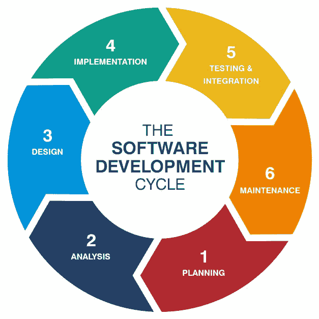

# 通过数据驱动的开发提升您的开发技能

> 原文：<https://medium.com/hackernoon/level-up-your-development-skills-with-data-driven-development-192ba59e9b71>

credit: [Splash](https://unsplash.com/photos/FlPc9_VocJ4)

随着*人工智能*、[T3、大数据](https://hackernoon.com/tagged/big-data)、*物联网*的炒作浮出水面，所以很多人都有兴趣进入数据领域，要么是数据工程师，要么是数据分析师，要么是数据科学家。其中一种方法是从在线课程中学习，通过互联网上免费提供的几个教程进行练习，或者采用传统的方法——回到学校。

如果你是一名开发人员，你可以通过在工作中使用[方法](https://hackernoon.com/tagged/method)来激发你学习这个领域的热情:*数据驱动开发(DDD)* 。

这到底是什么？它们之间有什么关联？

# TL；博士

> 数据驱动开发(DDD)是一种基于数据开发和维护服务的方法。

作为一个掌握*生命周期开发*思想的技术公司的开发人员，我们需要进行*系统开发生命周期的思想。*

credit: [Husson University Online](https://online.husson.edu/software-development-cycle/)

为了重复这个循环并不断改进我们的服务，我们需要维护我们的系统，避免任何类型的*愚蠢的*或*致命的错误*；与我们的队友一起计划改进我们的服务，并分析出现在我们面前的每一个业务挑战。

作为开发人员，我们可以接受经理交给的任何任务。我们也可以基于我们应该建立什么样的系统，我们应该制造什么样的特性，或者基于我们的直觉来做出任何决定。当错误率高到足以引起我们的注意时，我们也可以处理任何错误。

> 然而…小心使用它。那可能会花你很多钱。

生产环境中的任何错误都是不可接受的。还记得当你在餐馆时，你被提供了糟糕的食物，只是因为厨师试图即兴发挥它的味道。你感觉怎么样？

作为开发人员，我们应该关心我们的利益相关者。不仅仅是我们的客户，还有我们的团队，他们的系统与我们的系统集成在一起。我们需要确保我们的利益相关者满意。

通过进行*数据驱动的开发*，你试图最小化基于无效预测做出任何决定的倾向。相反，我们需要根据数据来强化我们的决策。

这让我想起了我处理的一个 API 性能非常差的时候，我需要提高性能——从 3 秒的平均响应时间缩短到 1 秒。如果我用*试错法*或者任何一种*非系统方法*来解决这个问题，那就很难解决。

> 相反，你可以试着用一种整体的方式来进行——评估你的数据，并运用你出色的分析技巧！

分析平台的存在，如 [New Relic](https://newrelic.com) 、 [Grafana](https://grafana.com) ，或者你自己构建的系统，可以用来实时评估我们的系统。此外，我们可以了解哪个部分降低了整体性能，以及哪种请求收到了缓慢的响应。在我们开始清楚地理解那个 API 的当前行为之后，我们可以很容易地注意到根本问题— **更快更精确地**。

在那之后，你需要的是一些重构系统的技能。结果呢？我的团队，包括我自己，都被这个结果震惊了。我们只希望将响应时间减少到平均 1 秒。相反，我们得到了**平均** **3 毫秒**！这完全出乎我们的意料！

因此，无论你是前端开发人员、后端开发人员、系统开发人员，还是任何类型的开发人员，如果你想体现你对数据领域的热情，实际上——你可以通过进行*数据驱动开发*来立即练习你的分析技能。作为一名数据人员，你需要具备一种敏锐的眼光，利用现有的数据来评估问题。

Surya 在职业生涯中是一名后端工程师，在个人生活中是一名技术传播者。今年，他制定了一个计划，名为“成为应用人工智能科学家之路”。如果你感兴趣，或者想跟踪他的进展，你可以访问他的个人网站，[soensurya.com](http://soensurya.com)，或者在 [LinkedIn](https://linkedin.com/in/weisurya) 上。