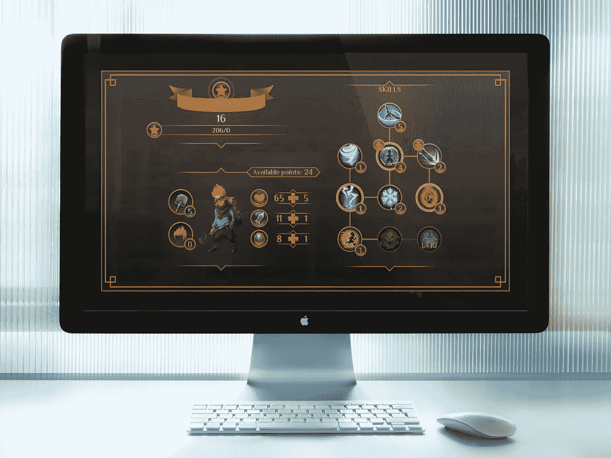

# 升级你的黑客技能树

> 原文：<https://medium.com/hackernoon/leveling-up-your-hack-skill-tree-bf977683e808>

黑客的生活通常是一次孤独的旅程，走在一条布满方钉和圆孔的蜿蜒道路上。我们面临的问题缺乏吸引学术界的优雅解决方案。我们的解决方案遭到了嘲笑、怀疑和挖苦。

> "可爱的黑客"
> 
> “当然，这次你做的方钉很合适，但它能在冰点以下的温度下工作吗？”
> 
> “这行得通。但是它会扩展吗？”

见鬼，我们甚至被教导问自己这些问题来测试我们自己的解决方案。这就是为什么你会经常听到黑客提出一个解决方案以及一系列注意事项。

这听起来像是我在建议我们重新绘制比赛场地上的线，以鼓励更多的黑客行为。我认为这是一件好事。但是黑客是一个有弹性的群体，他们会继续低调地提出解决方案。发现是我们最渴望得到的东西。

一个问题是，我们已经创造了一个环境，通过不把它作为学术界的一个正式学科来对待，使黑客变得不那么容易接近。

当然，也有不太相关的选修课，比如车间课。但是这些课程不会向你展示一个有缺陷的系统，并要求你以积极的方式利用这些缺陷。你从来没有得到一个为一种环境设计的系统，并被要求修改它以在另一种环境中运行。

艺术只是教我们创造性地思考。运用这种创造力是我们必须自己解决的事情。

Photo by [Brooke Lark](https://unsplash.com/@brookelark)

像黑客一样，我们已经为学习问题创造了一系列自己的解决方案。我们已经系统地将网络作为分享想法的平台。

当我在 2003 年左右开始学习编码的时候，我非常依赖于[的书籍](https://hackernoon.com/tagged/books)、谷歌、 [Sitepoint](https://www.sitepoint.com/) 、 [Lynda](https://www.lynda.com) 以及试错法。除了技术，所有伟大的资源都在进化。

今天有[代码学校](https://www.hackreactor.com/)，数百万博客，社交媒体，更好的发布平台，[堆栈溢出](https://stackoverflow.com/)， [Udemy](https://www.udemy.com/) ， [Twitch](https://www.twitch.tv/programming) ， [Codepen](https://codepen.io/) ，更好的文档和许多其他值得支持的工具。今天学习新技能比历史上任何时候都要容易得多。

我们还没有解决这个问题。总是有机会从新的角度来学习。每个新角度都会有自己的优缺点。

我认为当今大多数解决方案的主要缺点是缺乏个性化。当然，有些代码学校是为了利用特定框架的能力而建立的，比如 Rails 或 T2 React。但是学生们进入这些学校时都有自己独特的技能树作为背景。这就迫使学校在开始有趣的部分之前，花大部分时间让每个人都有一个共同的基础。

如果我们能创造一种学习工具，跳过庞大的基础训练，直接跳到人们真正想学的东西，会怎么样？为什么不呢？技术几乎无所不能。它是粘土，等着被塑造成我们认为合适的形状。

Photo by [Quino Al](https://unsplash.com/@quinoal)

这是这种工具的一个想法。这可能不是一个新的想法，很少有人是。但也许我有独特的视角。

首先，想象一下，找到 10 个人，他们的技能树与你的非常相似，并且都有兴趣获得一种你也感兴趣的新技能。你们都有一个共同的基础，并可能以相似的方式接触新技能。在你学习的过程中，你也可能会遇到同样的问题。

接下来，你们都需要一个工具来定期与团队交流你们的障碍和发现。你也会想对其他成员发布的内容做出反应。

[懈怠](https://slack.com/)行不通。它太开放了。把 10 个黑客聚集在一个房间里，试着让他们专注于一项任务。不可能的。对话会离题，而那些对话也会离题。这不可避免地演变成关于代码编辑器的争论。

团队真正需要的是一个习惯培养的循环任务，以保持专注并推动成员改进。这么说让我很痛苦，因为我讨厌站着开会……但是像站着一样的日常任务可以达到目的。

连续 30 天，这个小组都有一个异步的 ***展示和讲述*** 会议，集中在新技能上。每个人回答 3 个问题:

*   我完成了什么？应该鼓励截图和 gists。
*   **我发现了什么？**
*   什么让我沮丧？

就是这样。🙌

没有老师或者死板的课程。只是一群人合作学习一项新技能 30 天。如果更容易找到有匹配技能树的人，我个人会很有兴趣加入这样的团队。

你有兴趣加入这样的团体吗？我很想听听你的想法。如果有足够多的人感兴趣，就不难组装一个简单的 [v1 应用程序](https://v1labs.com)来看看它是否有效。