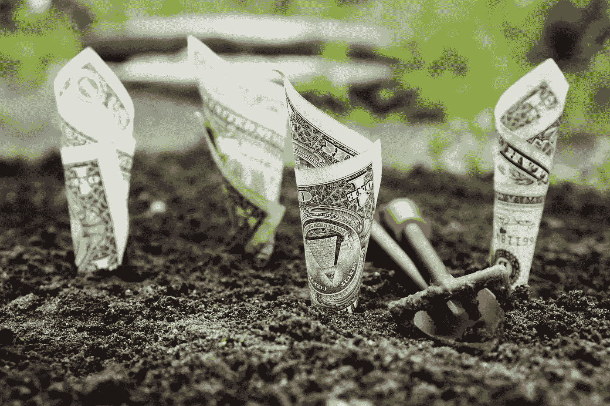
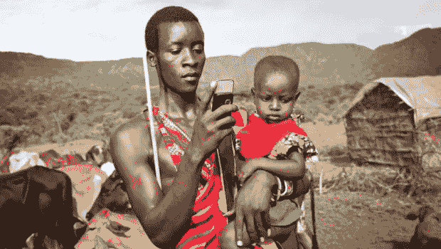

# 利用区块链解决繁荣悖论

> 原文：<https://medium.com/hackernoon/leveraging-blockchain-to-solve-the-prosperity-paradox-84af37b09eb2>

Source: [https://www.pexels.com/photo/u-s-dollar-bills-pin-down-on-the-ground-164474/](https://www.pexels.com/photo/u-s-dollar-bills-pin-down-on-the-ground-164474/)

目前世界人口已经超过 70 亿。与此同时，维持人口所需的基础设施并没有以类似的速度发展。其实是停滞的！即使在今天，仍有大约 20 亿人没有金融服务，他们没有任何银行账户。仅女性就占了这些无银行账户人口的 55%。在我的国家印度，大约 21%的人口(目前印度总人口为 12 亿)没有银行账户。其中一些人说，他们没有银行账户，因为他们挣得太少，或者因为金融机构不让他们这样做。

## 让我们清楚地说明如果个人没有银行账户会发生什么:

1.  人们将不得不依靠非正规机构来获得贷款。这些机构(中间人)通过索取非常高的利率来剥削借款人。他们利用了借款人的绝望和无助。
2.  一个人将完全被排除在经济之外。即使一个人有体面的收入，也不能增加国家的增长，因为他没有任何记录。
3.  没有银行账户，一个人的身份是不完整的。其他机构，如电信，教育，要求一个人有某种收入证明，没有正式的银行账户是无法证明的。
4.  没有银行账户的人将无法访问传统的数字金融系统。他们将不得不管理纯粹的流动性货币。
5.  他们将无法享受银行给他们账户存款的利息。

今天，世界上最富有的 1%的人拥有一半的财富，而剩下的 99%的人每天挣不到 2 美元。我们不能责怪一个收入如此之低的人认为没有银行账户是务实的，因为他们无法维持账户中的最低余额！为什么这个世界上的大多数公民都想为社区做贡献，却做不到？世界失业率停滞在 30%左右。一个没有工作的人不仅会失去部分自尊，还会失去身心健康。即使这个人有像裁缝、烹饪、唱歌这样的才能，他/她不知何故没有被包括在经济中。

Source: [canaleenergia.com](https://www.huffingtonpost.com/entry/can-blockchain-solve-the-prosperity-paradox_us_59edfa93e4b092f9f24193d2)

## 在找到解决方案之前，让我们花些时间来认识一下什么是繁荣悖论。

当今世界创新的速度令人难以置信！然而，受益的人口比例非常低。数字企业正在膨胀，但仍有很大一部分人没有工作。这意味着有权力的人在进步，没有权力的人在退步。富人越来越富，不是因为他们工作更努力，而是因为他们的钱变得更好(因为他们的经济正在蓬勃发展)。这就是为什么我们现在看到更多的百万富翁和亿万富翁。这也是为什么我们现在看到越来越多的穷人。这是什么[悖论](https://hackernoon.com/tagged/paradox)！

# 区块链来拯救！

> ***(本帖不会定义什么是*******以及如何运作。)****

*让我们记住，世界上超过 65%的人拥有手机，51%的人使用互联网。我们知道，由于区块链技术，我们可以建立点对点(P2P)通信。想象一个世界，一个普通人用他/她的移动电话连接到一个网络，他/她可以直接与其他人游说，而不需要任何中间人。例如，一个没有银行账户的贫困农民需要 10，000 印度卢比的小额贷款。如果农民将自己与区块链网络连接起来，他/她就可以与小额贷款人互动。农民可以选择利率最低的贷款。这不仅会在贷款人之间形成良性竞争，还会创造农民的记录，这些记录可以用来在以后获得更高数额的贷款。在金融术语中，农民的“信用评分”将根据农民偿还贷款的效率来计算。*

*如果我们从鸟瞰的角度来看，这个解决方案不仅从根源上解决了个人的问题，而且解决了宏观经济问题。一个人现在将拥有自己创造的、独立的数字身份。这意味着认同危机问题将在一定程度上得到解决。金融机构不会因为没有“官方”ID 而拒绝提供服务。区块链解决的另一个问题是小额融资。作为一个概念，小额融资使小企业和个人能够过上有尊严的生活。*

*拥有权力和财富的人和公司应该有义务赋予那些有需要的人权力。XinFin 公司通过使用他们的平台 TradeFinex 已经采取了类似的高尚举措。他们接近印度的偏远地区，将失业人员与潜在的贷款人联系起来，这些贷款人可以借给他们一些钱，这样这些人就可以实现他们的梦想。有些女人有刺绣的天赋，所以她们有了缝纫机。这些妇女现在可以接受裁缝订单，优雅地开始她们的生活。一些学生想上电脑课，但是学校没有电脑，这些学校有电脑。*

*Source: [https://www.youtube.com/watch?v=bYIJETgOY_g](https://www.youtube.com/watch?v=bYIJETgOY_g)*

*从商业角度来看，这是一个很好的机会。客户群将扩大到大约 20 亿人，这种想法的高贵之处有可能改变几代人的生活！*

*上述解决方案表明，任何有才能的人都可以融入全球经济，过上体面的生活。在当今时代，金融服务不是奢侈品。相反，它应该是一项基本权利。只有当人们被赋予权力和包容时，经济才会真正繁荣。*