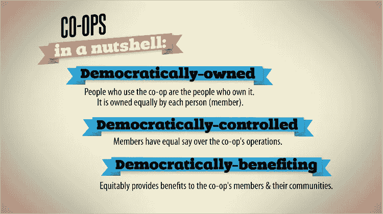

# 利用区块链技术和平台合作主义发展分散的食品网络和短食品供应链

> 原文：<https://medium.com/hackernoon/leveraging-platform-cooperativism-and-blockchain-technologies-for-decentralized-food-networks-and-28dc5e7c42f1>

民主治理、集体所有制和循环代币经济学如何被用来创建分散的食物网络——一个研究提案。

Various forms of networks. Blockchains can facilitate in creating more peer-to-peer decentralized networks.

# **简介**

可以说，向分散和区域粮食经济的可持续粮食过渡是人类最紧迫的挑战之一(Satterthaite 等人，2010 年)。**像能源转型一样，能源生产和消费正在从集中生产和分配模式转变为分散的智能微型电网，农业食品行业也出现了类似的趋势。**当前工业化的农业食品体系可以说是不可持续的(Johnson，2015；波伦，2009；萨特思泰等人，2010 年；塞德吉，2013 年；van Staalduinen，2014 年)，特别是考虑到预计到本世纪中叶全球人口增长和快速城市化(Alexandratos & Bruinsma，2012 年，联合国 DESA，2014 年；联合国 DESA，2015 年，瓦格纳，2008 年)。因此，**通过分散的粮食网络和区域粮食经济的短粮食供应链(SFSC)被提出作为可持续农业食品工业的一个可能的解决方案** (De Schutter，2010；Groesbeek，2009；Kneasfey 等人，2013 年；麦金太尔等人，2009 年)。

**创新可以定义为现有想法、流程、服务和产品的新颖组合** (Keeley & Pikkel，2013)。因此，本研究的目的是了解**循环食品创新的三种互补和新颖的发展:平台合作社、分散式食品网络和基于区块链的信息系统**。通过更多地了解这些技术发展的综合影响，该研究项目可以产生有价值的见解，有助于在合作网络中实现循环和分散的食品创新。

Cooperativism is about democratization of ownership, governance and value. Credit: [https://open.coop](https://open.coop)

# **平台合作主义**

Scholz (2014)提出了*平台合作主义*的概念，作为对现代社会中数字工具和平台依赖性的反应。**自 2000 年代末智能手机问世以来，在线平台和应用促进了职业环境和私人生活中的许多互动。**这种数字经济主要是由一系列平台实现的，这些平台由利润最大化的公司和收集数据的政府所有、管理、运营和监管**(Hill，2016；丰塞卡，2016)。通过这些基础数字环境产生的价值流向少数公司及其股东，以及政府情报机构，本质上是剥削使网络成为可能的用户。**

作为对这种形式的数字资本主义的回应，**平台合作主义“是关于克隆在线平台的技术核心，并将其用于合作模式，这种模式将工人、所有者、社区和城市置于一种团结之中，从而导致政治权力”**(马蒂亚斯，2015)。Scholz (2016a)认为，“[平台合作主义]将 135 名工人的自我管理与 170 年的合作运动结合在一起[…]将基于商业的同行生产与数字经济结合在一起”。

Scholz 在平台合作范例中提出了两个主要原则:*公有*和*民主治理。*在实践中，这指的是**通过一个数字界面创造*共享价值*和社区财富，该数字界面由用户**、社区和区域网络拥有和自我管理。因此，在这种去中心化经济中获得的利润流回了社区和平台用户，而不是硅谷的少数公司。

> *“平台合作社——作为对以数字工业主义为特征的平台垄断的直接冒犯——提供了一种手段，既可以回收我们创造的价值，又可以打造我们为集体利益而努力所需的团结。* ***我们不是提取价值并交付给远方的股东，而是一次又一次地收获、循环、再利用价值。***

A great book on Platform Cooperativism

# **区块链技术和数字共享**

在分散式(食品)网络中发挥重要作用的第二项创新是**区块链技术，因为它允许*通过互联网***转移价值(tap Scott&tap Scott，2016)。Bollier (2016)认为，已经融入私人和工作生活的开放平台应该转变为 ***数字公共资源*来管理共享财富**。数字共享指的是信息资源和技术的分配和公共所有权(Stalder，2010)。

> “将开放平台转化为数字共享的一个工具是区块链账本。 ***【区块链分类账】意义重大，因为它可以在开放网络上实现高度可靠、多用途的集体行动形式。*** *它通过验证数字对象(例如比特币)的真实性来做到这一点，而不需要银行或政府机构等第三方担保人* (Bollier，2016)。

食品供应链中基于区块链的协作数据系统*可以说是实现可持续和透明食品行业的重要贡献者。沃尔玛正在实施 IBM 的私人区块链解决方案 Hyperledger，以提高其供应链的效率、可追溯性和食品安全(Yiannas，2017)。此外，欧盟正在积极致力于“食品互联网”，其中利用物联网(IoT)技术连接和数字化复杂的食品系统(IoF2020，2017)。**通过整合同一供应链中数十个网络参与者的数据流，食品商品可以变得可追溯、质量可控、配送更高效，从而实现更公平、更安全、更循环的食品经济**(ambroses，2018；布拉尼米尔等人，2017；Te-Food，2017)。*

# **记号化和循环记号经济学**

此外，基于区块链的分散式网络可以通过*循环令牌经济*中的令牌化来推动。令牌化可以定义为数字资产中的价值表示，即令牌。用 Sneider (2017)的话说:**“数字代币被设计成稀缺的；它们在交易时不会被复制[……]它们奖励用户的参与，并使他们能够用这种奖励换取利益”**。Kelly (2008)认为互联网是用来复制信息的。然而，“当副本超级丰富时，它们就变得毫无价值。**当复制品超级丰富时，不可复制的东西就变得稀缺而有价值**(Kelly，2008)。

因此，**由于区块链技术的内部运作，可以转让但不能复制的数字令牌的有限供应，可以导致共享的价值创造和新的循环经济模式**。这种方法还允许代币中所代表的价值的再循环，从而产生循环代币经济。与上面 Rushkoff (2016)的引用相联系，循环经济学的概念可以应用于可持续发展，其中有价值的“废物”和资源通过行动者网络不断流动(Sneider，2018)。

[The Theory of a Blockchain Circular Economy](https://www.coindesk.com/the-theory-of-a-blockchain-circular-economy-and-the-future-of-work/), by William Mougayar

# **分散的粮食经济**

可持续营养、区域粮食经济和短供应链的愿景可以通过分散的粮食网络实现。根据 McNamara (2016 年)的说法，**分散式食品网络“通过将小型食品中心分散到全球各地，将食品生产带到区域社区，从而使食品行业民主化**。最大限度地缩小消费者和生产者之间的差距是实现环境和经济上可持续的粮食体系的关键一步”。

分散式网络，如开源运动，通常依靠志愿者的**组合来创造社区财富和市场中的商业活动**。“我们在开源软件革命中也看到了这一点，那里有数十、数百个程序依赖于社区志愿创建新的有趣的代码，通常是与专有软件公司合作。因此，这不是一个非此即彼的命题，它可以在创造价值方面发挥相当**的协同作用；一个在市场上工作，通过一个社区**”。(博利尔，2016，12:13)。

# **农业食品区块链应用**

许多项目旨在实现更短的食物链和点对点(P2P)经济，如 Delicia，一家位于爱沙尼亚的区块链初创企业，旨在将区域食品生产商、餐厅、超市和消费者连接在网络中，主要目标是减少食品浪费(2018)。其他欧洲初创企业，如 Ambrosus、OriginTrial 和 Te-Food，正在创建区块链支持的数据基础设施，用于供应链中的可追溯性和食品安全，荷兰初创企业 fruit 旨在创建一个区块链市场，农民可以在那里直接与消费者互动(fruit，2018)。此外，Backfeed 和 Odyssey 正在分别为分散合作和分散共享经济创建区块链平台和协议，这些工具可用于创建开放式粮食合作社网络。因此，可以说**农业食品部门的各个方面正在迅速数字化，促成了分散的食品网络和较短的食品供应链**。

# **文献综述**

关于平台合作主义以及基于区块链的食品供应链和分散式食品网络的大量文献仍处于早期阶段。Goodman 等人(2012 年)指出，欧盟正在制定政策，以促进农业行业的权力下放，例如在政策制定、多功能性和属地性方面，并认为*替代粮食网络* (AFNs)对于更加公平、可持续和有弹性的粮食系统非常重要。根据 Sauvée (2012)关于分散式网络治理的研究，“运营决策可能分散在网络内的不同层级，而控制和激励机制则依赖于完全分散的手段”(第 11 页)。然而，随着时间的推移，建议对战略资产进行集中决策，以保持战略一致性。此外，关于传统粮食合作社的研究也很多(Knupfer，2013；杨& Woods，2014)，而关于平台合作主义的文献正在兴起(【Scholz】Schneider，2016；Scholz，2016b)。然而，**缺乏关于循环经济、平台合作主义、粮食合作社和区块链分散式粮食网络的知识**。

# **研究目的和问题**

**因此，本研究旨在通过研究平台合作社内创建具有共享价值的可持续粮食经济**的各种方法和层面来填补这一知识空白，例如其民主治理结构、集体所有制和商业模式，以及基于区块链的短供应链分散粮食网络的形成。可能的研究问题现在可以表述如下:

*   *哪些类型的传统粮食合作社模式可以在分散的粮食网络中形成平台合作社？*
*   *区块链技术在创建分散式食品网络中的作用是什么？*
*   *自组织数字共享在创建分散式食品网络中的作用是什么？*
*   *令牌化和循环令牌经济学如何在创造共享价值的网络中发挥作用？*

通过开展这项研究，可以获得关于未来几十年粮食经济分散化的更好的学术理解。此外，由于本研究采用了*参与式奖学金*方法，本研究旨在通过半访谈的方式让荷兰乌得勒支地区现有区域食品网络中的各利益相关方参与进来，从而实现社会和实践相关性，在半访谈中可以分享知识。**提议的研究旨在为分散式食品网络、区块链技术和平台合作主义的互补领域提供有价值的见解，以实现短食品供应链**。

## 你喜欢这篇文章吗？

给我鼓掌，鼓掌！:)

—

我是否忘记了趋势、有趣的初创企业或发展？或者你在我的故事和推理中发现了缺陷或偏见？请告诉我，我欢迎讨论、反馈和批评。

# 参考

Alexandratos 和 j . bru insma(2012 年)。2030/2050 年的世界农业。212 修订版。欧空局工作文件第 12–03 号。从联合国粮食及农业组织网站上检索自[http://www.fao.org/docrep/](http://www.fao.org/docrep/)016/AP 106 e/AP 106 e . pdf

安布罗斯。(2018).安布罗斯白皮书。从 https://ambrosus.com/assets/Ambrosus-White-Paper-V8-1.pdf[取回](https://ambrosus.com/assets/Ambrosus-White-Paper-V8-1.pdf)

德利西亚。(2018).白皮书。从 https://delicia.io/delicia_wp.pdf[取回](https://delicia.io/delicia_wp.pdf)

德舒特(2010 年)。*农业生态学和食物权*[报告编号 A/HRC/16/49]，提交给联合国人权理事会第十六届会议。检索自[http://www2 . OHCHR . org/English/issues/food/docs/A-HRC-16-49 . pdf](http://www2.ohchr.org/english/issues/food/docs/A-HRC-16-49.pdf)

m .丰塞卡(2016 年 9 月 21 日)。为什么平台合作社可以成为更公平的共享经济的答案。检索自[https://www.intelligenthq.com/innovation-](https://www.intelligenthq.com/innovation-)管理/为什么-平台-合作社-能回答更公平的问题-分享经济/

水果。(2018).白皮书。从 http://fructus.io/WHITEPAPER.pdf[取回](http://fructus.io/WHITEPAPER.pdf)

古德曼博士、杜普斯博士和古德曼博士(2012 年)。*替代食品网络:知识、实践和政治*。劳特利奇。

m . j . groes beek(2009 年)。Duurzamer ondernemen。Uitgeverij 业务联系人。

希尔，S. (2016 年)。非共享经济如何威胁工人？由 t . Scholz 和 n . Schneider 编辑。*我们的黑客和所有者。平台合作主义的兴起，对未来工作和更公平的互联网的新愿景。或者书。*

IoF2020。(2017).食品和农场的互联网。D1.3 详细的工作计划。检索自[https://www . iof 2020 . eu/deliverables/d 1.3 .-detailed-work-plan . pdf](https://www.iof2020.eu/deliverables/d1.3.-detailed-work-plan.pdf)

新泽西州约翰逊(2015 年 2 月 10 日)。那么我们真的能养活这个世界吗？是的——以下是方法。谷物。从 http://grist.org/food/so-can-we-really-feed-the-world-yes-的[取回](http://grist.org/food/so-can-we-really-feed-the-world-yes-)

基利和皮克尔(2013 年)。*十种创新。建筑突破的纪律*。约翰·威利父子公司。

凯莉(2008 年 1 月 31 日)。总比免费好。检索自[http://kk.org/thetechnium/](http://kk.org/thetechnium/)优于频率/

Kneasfey，m .，Venn，l .，Schmutz U .，Balázs B .，Trenchard L .，Eyden-Wood T .，Bos E .，Sutton G .，& Blackett，M. (2013 年)。欧盟的短食品供应链和本地食品系统。他们的社会经济特征的发挥状态。JRC 科学与政策报告。报告欧元 25911 元。

a . m . KNU pfer(2013 年)。美国的食品合作社:社区、消费和经济民主。康奈尔大学出版社。

n .马蒂亚斯(2015 年 11 月 13 日)。什么是平台合作主义，为什么它很重要？检索自[https://civic . MIT . edu/2015/11/13/what-is-platform-cooperativism-and-why-it-important/](https://civic.mit.edu/2015/11/13/what-is-platform-cooperativism-and-why-is-it-important/)

B. D .麦金太尔、H. R .赫伦、Wakhungu、j .和 R. T .沃森(编辑。).(2009).处于十字路口的农业。国际农业知识、科学和技术促进发展评估。综合报告。检索自[http://www . UNEP . org/dewa/aga assessment/reports/ia astd/EN/Agriculture % 20 at % 20a % 20 crossroads _ Synthesis % 20 report % 20(英文)。pdf](http://www.unep.org/dewa/agassessment/reports/IAASTD/EN/Agriculture%20at%20a%20Crossroads_Synthesis%20Report%20(English).pdf)

麦克纳马拉，B. (2016 年 7 月 11 日)。检验分散式食物系统的必要性。检索自[https://medium.com/@CarFreeBrad/examining-the-need-for-a-](/@CarFreeBrad/examining-the-need-for-a-)分散式食品系统-fc06420ba9c7

波伦，M. (2009 年)。杂食者的困境:在快餐世界中寻找完美的一餐。从 http://books.google.com 取回。

Rakic，b .，Levak，t .，Drev，z .，Savic，S. & Veljkovic，A. (2017 年)。OriginTrail 白皮书。基于区块链的第一个供应链专用协议。从[https://origintrail.io/storage/documents/](https://origintrail.io/storage/documents/)OriginTrail-White-Paper.pdf 取回

拉什科夫博士(2016)。现在文艺复兴。由 t . Scholz 和 n . Schneider 编辑。我们的侵入和拥有。平台合作主义的兴起，未来工作的新愿景和更公平的互联网。或者书。

城市化及其对粮食和农业的影响。*伦敦皇家学会哲学汇刊。系列 B* ，365(1554)，第 2809–2820 页

茨韦塔纳·舒尔茨(2016 年 b)。*平台合作主义。挑战企业共享经济*。罗莎·卢森堡基金会。

茨韦塔纳·舒尔茨[关于:公共机构]。(2016 年 5 月 3 日)。re:publica 2016 — Trebor Scholz:平台合作主义如何释放网络[视频文件]。从 https://www.youtube.com/watch?v=bkSTgAucRqE[取回](https://www.youtube.com/watch?v=bkSTgAucRqE)

Scholz 和 n . Schneider 编辑。(2016) *我们的去黑，去拥有。平台合作主义的兴起，对未来工作和更公平的互联网的新愿景。或者书。*

Sedghi，A. (2013 年 1 月 10 日)。生产食物需要多少水，我们浪费了多少水？卫报。检索自[http://www.theguardian.com/news/datablog/](http://www.theguardian.com/news/datablog/)2013/1/10/how-amount-水-食品-生产-废物

斯奈德博士(2017 年 9 月 12 日)。比免费更好:应用程序的新商业模式(可能还有其他一切)。从[https://medium.com/deconet/better-than-](/deconet/better-than-)免费的新商业模式-应用程序-和可能的一切-a343e97ba706 检索

斯奈德博士(2018 年 4 月 17 日)。“企业 Hodl”与循环代币经济。检索自[https://medium . com/de conet/enterprise-hodl-and-circular-token-economies-b394c 4056 ECD](/deconet/enterprise-hodl-and-circular-token-economies-b394c4056ecd)

f . stalder(2010 年)。数字共享。在:哈特，k .，拉维尔，j .，卡塔尼，A. D .(编辑)。人类经济:世界公民指南。政治出版社，第 313-324 页。

tap Scott d .和 tap Scott a .(2016 年)。*区块链革命:比特币背后的技术如何改变货币、商业和世界*。企鹅。

Te-Food。(2017).通过解决社会问题来获取商业利润。从 https://ico.tefoodint.com/te-food-white-paper.pdf 取回

联合国经济和社会事务部人口司。(2014).《世界城市化前景:2014 年修订版，概要》( ST/ESA/SER。A/352)。从[http://esa.un.org/unpd/wup/Publications/Files/](http://esa.un.org/unpd/wup/Publications/Files/)WUP2014-Highlights.pdf 取回

联合国经济和社会事务部人口司。(2015).《世界人口前景:2015 年订正本、主要调查结果和预先表格》(ESA/P/WP.241)。检索自[http://esa.un.org/unpd/wpp/publications/files/](http://esa.un.org/unpd/wpp/publications/files/)key _ findings _ WPP _ 2015 . pdf

Van Staalduinen，van L. C. (2014 年 7 月 28 日)。专栏— Grond，een 热点问题[博客帖子]。从 http://www.wageningenur.nl/nl/blogpost/Column-Grond-[een-hot-issue.htm](http://www.wageningenur.nl/nl/blogpost/Column-Grond-)取回

瓦格纳(编辑)。(2008).*城市化:21 世纪的问题和挑战*。新星出版社。

杨，s &伍兹，2014 年。定义本地食品的分歧——消费者合作社与传统杂货店购物者。检索自[https://ageconsearch.umn.edu/](https://ageconsearch.umn.edu/)bitstream/170480/2/AAEA % 202014% 20 manuscript . pdf

Yiannas，F. [IBMBlockchain]。(2017 年 8 月 22 日)。沃尔玛使用 IBM Food Trust 建立在 IBM 区块链平台上的食品安全解决方案[视频文件]。从 https://youtu.be/SV0KXBxSoio[取回](https://youtu.be/SV0KXBxSoio)