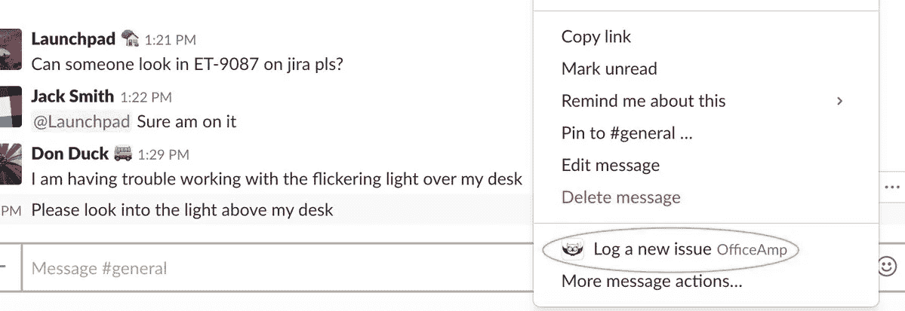

# Slack 刚刚推出了自定义操作，我们很喜欢

> 原文：<https://medium.com/hackernoon/leveraging-slack-custom-actions-in-officeamp-25c5b4b44715>

在上周 Slack 的第一次开发者大会 Spec 期间，引入了一种直接从 Slack 中的消息创建跟进的新方法。通过[动作](/slack-developer-blog/introducing-actions-a-simple-shortcut-attached-to-every-slack-message-e2404414ece)，你可以将任何信息转化为一项任务、一张罚单或一次跟进。

这是一个简单而伟大的新工具，将人们从记住斜杠命令中解放出来。它还允许任何用户对任何其他用户的消息采取行动。

Right click on any message and log a new issue in OfficeAmp

我们喜欢这个新概念，并很快在 [OfficeAmp](http://www.officeamp.com) 中实施。现在，我们的用户可以通过右键单击任何频道上的任何消息来记录票证。当他们这样做时，OfficeAmp 会直接向他们发送一条消息来确认票证的详细信息。

*对于外行来说，*[*office amp*](http://www.officeamp.com?utm_source=actions_post&utm_medium=medium)*是一款专为 Slack 打造的轻量级服务台。有了 OfficeAmp，您的团队成员就不会在记录或解决票证方面有丝毫懈怠。有兴趣了解更多信息吗？继续操作* [*将其添加到您的时差中*](http://www.officeamp.com?utm_source=actions_post&utm_medium=medium) *或* [*安排一次演示*](https://calendly.com/anaek/oa-demo) *。*