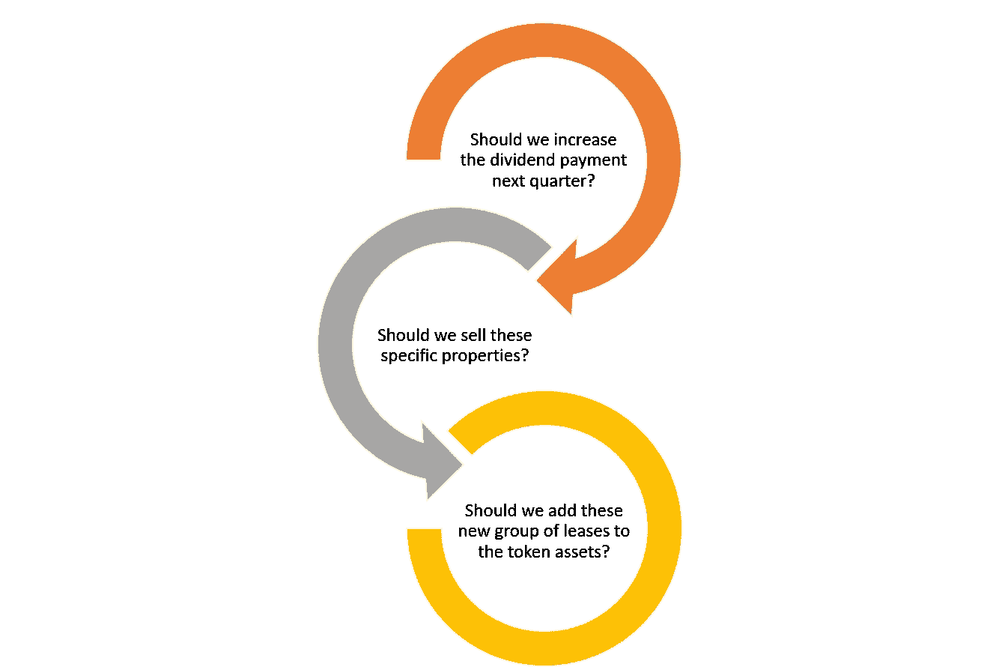
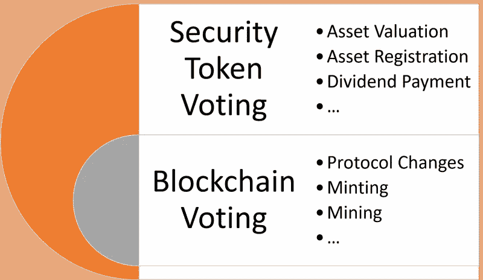
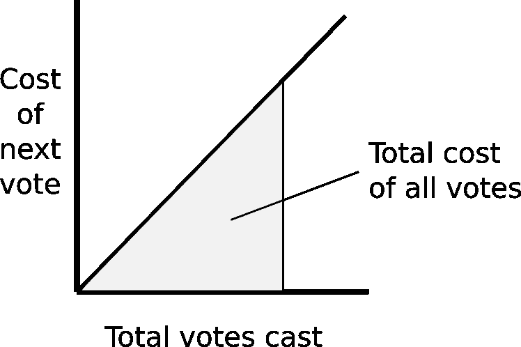
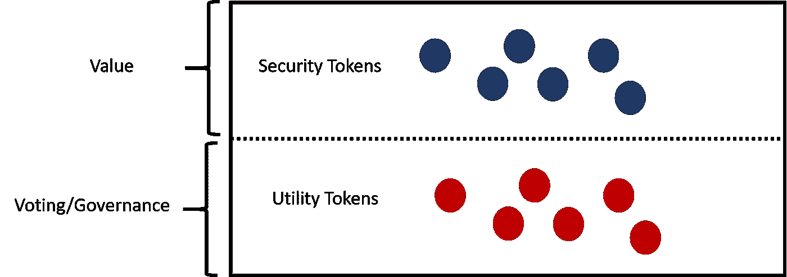

# 自由激进主义和安全令牌:作为治理协议的二次投票

> 原文：<https://medium.com/hackernoon/liberal-radicalism-and-security-tokens-part-i-quadratic-voting-as-a-governance-protocol-10705af3697a>

几个月前，我通过微软研究员 Glen Weyl 的精彩演讲发现了激进市场的概念，这些演讲现在收录在 T2 的同名书籍 T3 中。随着维塔利克·布特林在博客文章中接受了这个概念，激进市场背后的一些概念已经渗透到了区块链世界。上周，Butterin 和 Weyl 与哈佛大学经济学家 zohitzig[发表了一篇论文](https://papers.ssrn.com/sol3/papers.cfm?abstract_id=3243656)，对激进市场理论的许多观点进行了更深入的探讨。标题为“[自由激进主义:社区中立社会的正式规则](https://papers.ssrn.com/sol3/papers.cfm?abstract_id=3243656)”的方法使团体能够分配资金用于维护公共产品和服务，而不会受到传统挑战的影响，如“搭便车”问题。Buterin-Weyl 论文的中心思想是二次投票(QV)作为社会决策的一种机制。虽然 QV 背后的原理在数学上很吸引人，但我发现它们在当前这一代实用令牌协议中很难实现。然而，我发现 QV 与新生的安全令牌空间有着难以置信的关联。

我周六的大部分时间都在浏览 Buterin-Weyl 论文中的数学，并与安全令牌领域的几位思想领袖交换电子邮件，讨论 QV 与加密证券的相关性。事实证明，QV 背后的原则可以用来解决一些迫在眉睫，但往往被忽视的治理挑战，这些挑战是我们迫切需要在安全令牌领域解决的。[我在](/coinmonks/voting-and-governance-in-security-tokens-1e3d041dabb8)之前已经写过关于治理和安全令牌的话题，我认为这是阻止大型机构投资者接受安全令牌的主要障碍之一。

# 投票、治理和安全令牌

就公共股票而言，激进投资者是投票动态中最极端的例子之一。华尔街的一些名人，如伊坎企业(卡尔·伊坎)、艾略特管理公司(保罗·辛格)或绿光资本公司(大卫·艾因霍恩)都是通过开展维权活动而成名致富的。在维权模式中，投资者悄悄地在一家公司获得一个小但有影响力的职位，然后公开提出一系列有利于公司股东的变革。最终，激进分子的目标是迫使股东对提案进行投票，以便在目标公司实施重大变革。虽然我不是激进投资者的狂热粉丝，但他们是充分利用公共股票投票机制的市场细分的一个例子。类似地，为了吸引主流投资者，安全令牌需要支持作为平台一等公民的投票。

投票动态在安全令牌的生命周期中起着关键作用。让我们以一个典型的加密证券为例，它代表一个房地产租赁池，并根据基础资产的表现按季度向令牌持有者支付股息。如果设计得当，关于该安全令牌行为的许多决定将受到令牌持有者的投票的影响。

虽然第 1 层区块链协议在协议变更或交易验证等领域面临投票决策，但安全令牌协议应该能够实现反映市场、行业和监管动态的投票和治理规则。

# 身份是伟大的均衡器

使效用令牌协议中的投票如此具有挑战性的部分原因是它们在假名或匿名条件下操作的事实。在令牌持有者缺乏真实身份表示的情况下，共识协议需要依靠复杂的数学难题来确保交易的完整性。安全令牌不存在这个问题，因为身份是以法规形式发行证券的一个关键要求，如了解您的客户(KYC)。

安全令牌持有者的身份在任何给定时间都是已知的，这一事实为实现更简单的投票协议(如[授权证明(PoA ))打开了大门。](https://en.wikipedia.org/wiki/Proof-of-authority)然而，PoA 背后的许多想法依赖于投票决策中的各方诚实行事，我们知道在涉及安全令牌时并非总是如此。

# 二次投票

二次投票(QV)背后的思想简单而优雅。从概念上讲，QV 试图量化每一张选票的强度或偏好，而不是仅仅关注它的定性方面(赞成或反对)。在 QV 的场景中，每个投票人都有一组“声音信用”，他们可以用这些信用来影响投票决定的结果。当面临投票决定时，每个人都可以通过向一个基金支付他或她购买的票数的平方来购买支持或反对某项提案的选票。该模型在投票成本和决策结果之间分配了一个非线性关联。例如，让我们以一个 QV 的场景为例，在这个场景中，每个投票者被发放 10 个投票积分。第一次投票的成本将是 1 信用点，两次投票的成本将是 4 信用点，三次投票的成本将是 9 信用点，并且成本将继续与投票数成二次相关地增加。如果一个投票者有兴趣购买 3 张以上的选票，那么他们需要购买额外的积分。投票是“二次”的，因为你为 *n* 张选票支付的总金额会与 *n* 成比例上升。

二次投票的美妙之处在于，购买选票的成本增长非常快，这可以防止各种恶意行为。此外，二次投票在投票者的身份已被很好地建立的环境中运行，这强加了各种各样的社会声誉约束。

# 二次投票和安全令牌

二次投票(QV)提供了许多与安全令牌协议相关的有趣想法。在基本层面上，我们可以设想一种模型，其中向安全令牌持有者发放一个额外的实用令牌，可用于投票目的。发行者将向网络提交投票提案，拥有投票权的令牌持有者可以使用他们的公用令牌来表达他们的意图。为了购买特定数量的选票，安全令牌持有者将不得不花费该数量的平方来购买实用令牌。

有许多不同的模型可用于在安全令牌架构中实现 QV。双重安全/令牌结构是我喜欢的一种结构，因为它保持了安全令牌网络的治理方面，与安全令牌本身相隔离。

# 避免二次投票中的共谋

二次投票(QV)无疑防止了对效用令牌模型的一些传统攻击，例如双重投票或同一个人使用多个匿名地址。然而，QV 仍然容易受到其他形式的攻击，如多个选民合谋实现特定结果的勾结。例如，房地产证券代币的持有者可以合谋在任何给定的季度获得更高的股息。

我认为有两种方法可以有效地解决 QV 情形下的共谋问题。借用 DFINITY 等共识协议的一些思想，我们可以实现一个模型，在这个模型中，网络为每个投票提案提名一个随机数量的投票者。在这种情况下，串通各方无法确定他们是否被允许就某项具体决定投票。

几年前，Glen Weyl 在芝加哥大学 Becker Friedman Institute 的一次演讲中提出了一个更简单的解决 QV 共谋问题的方法。Weyl 认为有两个因素可以防止 QV 情景下的共谋:

a)投票的二次性质将使任何串通行为立即变得明显。

b)串通的选民的数量很可能比总人口数量少得多。

考虑到这两个因素，Weyl 认为选民可以发现串通行为，并投票支持相反的结果。这种方法是行为经济学的银行，而不是投票算法。当然聪明。

QV 是我见过的在区块链场景中启用复杂投票规则的最简单也是最有趣的算法之一。虽然 QV 可能在实用令牌中有一些应用，但我相信它在安全令牌领域有足够大的潜力。希望我们能看到一些 QV 的想法被整合到下一代安全令牌平台中。