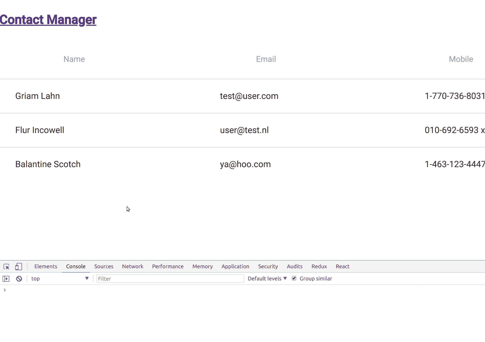

# 解放您的 UI 开发:设置一个模拟 API

> 原文：<https://medium.com/hackernoon/liberate-your-ui-development-setup-a-mock-api-9b6167d06ffa>

你在工作场所听到过这些说法吗:

*   我不能。API 又停机了。
*   我被封锁了。我需要更新 API，然后才能继续。
*   我没能完成多少工作。VPN 坏了，我连不上 API。
*   我花了半天时间反复让应用程序进入一个特定的状态。开枪打我。

对正常运行的 API 的依赖是一种拖累。它会减缓发展。它迫使你在有网络连接的地方工作。这会让你的应用程序很难进入特定的状态。如果 API 下降，你就完了。

您可以通过使用模拟 API 来解决所有这些问题。模拟 API 是一个拦截`XHR`和/或`fetch`请求并返回模拟数据的实用程序。通过在应用程序中引入模拟 API，您将:

*   再也不会被损坏或不可用的 API 阻止。
*   在开始开发之前，永远不需要等待 API 的特性更新。一旦您与 API 团队就 API 合同达成一致，您就可以与他们并行工作。
*   让您可以轻松地在应用程序中模拟特定的状态。

听起来很棒？确实是！

## 分为四个步骤的模拟 API

建立一个模拟 API 非常容易。你可以这样做:

1.  安装一个`fetch`和/或`XHR`模拟工具——安装什么将取决于你的应用程序的需求。
2.  创建模拟数据。
3.  配置 API 模拟。
4.  配置您的应用程序打开和关闭 API 模拟。

一点术语:*夹具*。夹具是一种允许您处理样本数据的工具。我们将使用术语 *fixtures* 来指代模拟 API 和它返回的数据。

## 示例应用程序

在本教程中，我们将采用一个现有的应用程序——Contact Manager——并添加装置来模拟它的 API。联系人管理器仅使用`fetch.`。我们将使用`fetchMock`，这是一个模拟使用`fetch`发出的 http 请求的实用程序。

联系人管理器使用公开可用的 JSONPlaceholder API 的`users`资源。更多细节你可以去见 https://jsonplaceholder.typicode.com/。

你可以从这里克隆这个应用:[https://github.com/joe-crick/contact-manager](https://github.com/joe-crick/contact-manager)。克隆完成后，通过运行以下命令下载依赖项:

`yarn`或`npm i`

## 装置

`fetchMock`的安装是标准的:
`yarn add fetchMock -D`或`npm i fetchMock -D`

*注意*:标志`-D`将模块保存为一个 devDependency。

## 创建模拟数据

您的模拟数据必须与从 API 返回的结果的数据定义相匹配。联系人管理器使用一种资源— `users`。`users`资源返回一组`user`对象。

首先，我们将创建一个名为`fixtures`的文件夹来保存夹具数据和 API 模拟。在这个文件夹中，我们将创建一个名为`users.js`的文件。`users.js`将包含一小组与`users`资源定义的数据形式相匹配的用户数据:

## 配置 API 模拟

接下来，我们将添加一个名为`fixtures.js`的文件。在这个文件中，我们将定义我们的设备将模拟哪些资源:

创建一个简单的 API 模拟需要三样东西:

1.  HTTP 方法
2.  URI 匹配器
3.  响应数据

**HTTP 方法** `fetchMock`为所有 HTTP 方法(GET、POST、PUT、& c .)提供嘲讽。要使用特定的方法，只需从`fetchMock`对象中调用它——例如`fetchMock.get`或`fetchMock.post`。

**URI 匹配器**
`fetchMock`也有几种不同的方式可以匹配一个资源 URL，包括:

*   字符串文字
*   全球
*   正则表达式
*   还有更多…

上面，我使用了正则表达式。

**响应数据**
我们从`users.js`导入我们创建的响应数据。对于对`users`的`GET`调用，我们返回所有用户。对于来自`PUT`更新用户的响应，我们返回第一个用户。

**特定应用状态**
实现一个模拟 API 可以让你完全控制模拟 API 返回的响应。这个很厉害。例如，它可以帮助您更轻松地针对特定情况(独特的应用程序状态和错误)开发应用程序。

让我们通过一个例子来说明如何使用错误状态来实现这一点。在`fixtures`文件夹中，添加一个名为`error-fixtures.js`的文件。

`fetchMock`允许你传入一个`[Response](https://developer.mozilla.org/en-US/docs/Web/API/Response)`对象作为它的返回值。通过传入一个状态为 500 的`Response`对象，我们可以生成一个服务器错误。

现在，无论何时您想要测试您的应用程序将如何响应用户更新的 API 错误，您都可以很容易地做到。使用这种设置，每次尝试更新用户时都会产生一个错误。

关于如何使用`fetchMock`的完整细节，请参见其[文档](http://www.wheresrhys.co.uk/fetch-mock/api)。

## 配置您的应用程序来打开和关闭 API 模拟

该过程的最后一步是配置您的应用程序，以便您可以轻松地打开和关闭设备。有很多方法可以做到这一点。我们将采取一种简化的方法。在`fixtures`文件夹下，创建一个名为`set-fixtures.js`的文件。

上面的代码在 window 对象上设置了一个函数`toggleFixtures,`,允许您轻松地打开或关闭设备。`toggleFixtures`依赖于`localStorage`中设置的项目`fixtures`。如果`fixtures`项为真，我们打开设备，反之亦然。最后，所有这一切只有在环境不是生产的情况下才会发生。

## 其他选项

如果你的应用程序只使用`fetch`，那么`fetchMock`是很棒的。如果你需要其他东西，或者其他东西，还有其他选择。以下是一些例子:

*   `can-fixture`是 Bitovi 的人们开发的实用程序。他们开发了 CanJS 和 DoneJS 框架。`can-fixture`专为与 XHR 合作而设计。你可以在这里找到更多信息:[https://canjs.com/doc/can-fixture.html](https://canjs.com/doc/can-fixture.html)
*   `xhr-mock`是另一个嘲笑 XHR 的工具。它是由詹姆斯·纽维尔开发的。你可以在这里找到更多关于`xhr-mock`的信息:【https://www.npmjs.com/package/xhr-mock】T21。

**图表 QL**

*   `graphql-tools`。模仿 GraphQL api 是一个有点不同的过程。阅读这篇文章以获得更多关于创建 GraphQL 模拟的信息:[https://www . apollographql . com/docs/graph QL-tools/mocking . html](https://www.apollographql.com/docs/graphql-tools/mocking.html)

## 摘要

为您的应用程序创建一个模拟 API 使您能够在没有后端实现的情况下构建 UI 组件和特性。这个:

*   将您的 UI 开发从后端依赖和问题中解放出来。
*   使在应用程序中模拟特定的情况变得容易。
*   允许您脱机工作和测试应用程序。