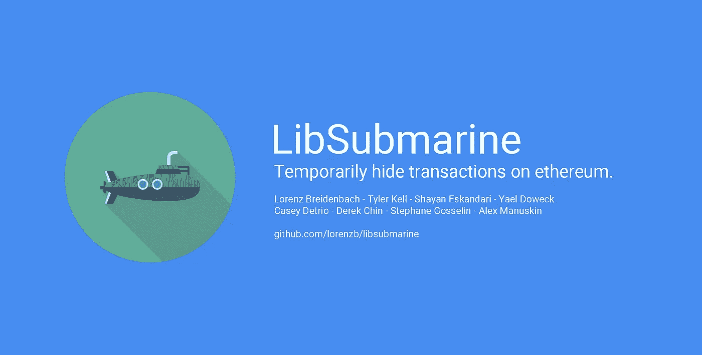
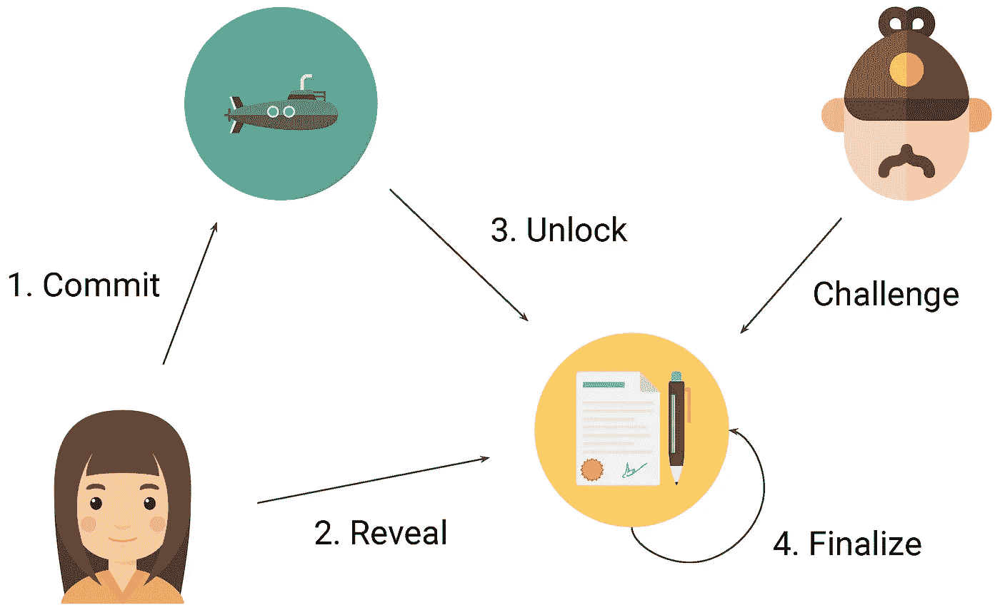
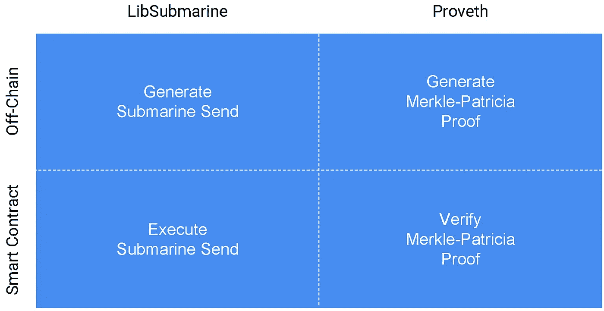

# LibSubmarine:暂时隐藏以太坊上的交易(便宜！)

> 原文：<https://medium.com/hackernoon/libsubmarine-temporarily-hide-transactions-on-ethereum-cheaply-6910191f46f2>

[github.com/lorenzb/libsubmarine](https://github.com/lorenzb/libsubmarine/)

# 隐私的状态

隐私是区块链的一大挑战，尤其是以太坊。有无数的用例需要私下交易的能力，以避免向可能对所披露的信息采取行动的其他方发出信号。

一个显著的例子是连锁投票。如果在投票期结束前可以公开计票，新选民就可以利用这些信息来影响他们的投票。

这个问题的一个优雅的解决方案叫做[加权提交-显示投票](https://github.com/ConsenSys/PLCRVoting)，它允许参与者隐藏他们的投票直到投票期结束。这是伟大的，因为这意味着用户可以可信地承诺链上的秘密数据，这只是在稍后的日期透露。但是，投票的参与地址和权重在投票期结束前是公开的。

那么，如果参与者希望在投票期结束之前完全隐藏他们的参与，该怎么办呢？

这就是潜艇部队发挥作用的地方。

# 隐藏交易=海底发送

常规的提交-揭示方案仅限于隐藏以太坊交易中包含的数据。[潜艇发送](http://hackingdistributed.com/2017/08/28/submarine-sends/)允许用户隐藏整个交易，直到它在后面的块中被揭露。也就是说，可以隐藏发送者、接收者、值和数据。这里有几个用例。

## 密封投标拍卖

在密封投标拍卖中，必须能够在不公开披露的情况下可信地承诺价格。如果出价是在 ETH 中，用正常的提交/披露来隐藏价格是不可能的。

## 超前保护

任何 DEX 都容易受到[抢先](https://hackernoon.com/front-running-bancor-in-150-lines-of-python-with-ethereum-api-d5e2bfd0d798)的影响，因为矿工可以观察内存池中的事务，并在块中的事务之前下单。

## 链上投票

如前所述，常规提交/展示不能隐藏投票的参与或价值。

# 潜艇如何发送工作

实施海底发送的一个主要挑战是气体消耗和 UX。 [**@** ethlorenz](https://twitter.com/ethlorenz) 提出了一个优雅的解决方案，既节省了气体，又最大限度地减少了用户生成的事务数量。该解决方案需要 4 个帐户的交互:一个用户(Alice)、一个隐藏地址(sub 潜艇)、一个 dApp 和一个挑战者。Alice 根据实现执行 3 或 4 个事务。

## 过程

1.  Alice 将值和数据提交到一个隐藏的海底地址。
2.  Alice 在至少一个块之后向 dApp 揭示值和数据。
3.  Alice 广播原始签名解锁事务，其中 sub 潜艇地址将值发送到 dApp。
4.  dApp 通过检索值和数据来完成流程。

## 安全

在这个系统中，Alice 有机会通过透露与她之前所犯下的不同的值和数据来进行恶意行为。这种行为可以通过要求 Alice 提交押金并要求在解锁和完成交易之间有一个质询期来防止，在该质询期内，质询者可以证明 Alice 在欺骗并要求她的押金。

## 气体

用于用户生成交易的气体总量约为 20.7 万气体，而挑战量约为 27 万气体。

# lib 潜艇内部构件

我们构建了[lib subscribe](https://github.com/lorenzb/libsubmarine/)作为 Submarine Sends 方案的模块化和可重用的实现。该架构包括一个用于生成和执行提交-揭示方案的库，以及一个名为 [ProvEth](https://github.com/lorenzb/proveth) 的独立库，用于生成和验证挑战者使用的 Merkle-Patricia 证明。

[LibSubmarine](https://github.com/lorenzb/libsubmarine) and [Proveth](https://github.com/lorenzb/proveth) libraries

## libsub 潜艇

首先，链外过程包括生成伪签名，该伪签名可用于“欺骗”以太坊链接受来自我们没有私钥的地址的一次性交易。

这是可能的，因为发送交易的地址实际上没有在原始广播以太坊交易中定义。相反,“发件人”地址由以太坊客户端根据交易附带的 [ECDSA](https://en.wikipedia.org/wiki/Elliptic_Curve_Digital_Signature_Algorithm) [Secp256k1](https://en.bitcoin.it/wiki/Secp256k1) 签名动态计算。

由于 ECDSA 的工作方式，可以将任意数据作为交易签名进行传递，并调用`ecrecover(Txdata)`来获得与交易的以太坊“From”地址相对应的 ECDSA 公钥。

这个构造的事务成为解锁事务，一旦用户完成显示步骤，就可以执行该解锁事务。

一旦离线程序完成，用户就进入上一节概述的四个步骤。提交、展示、解锁和最终确定。更多细节可以在我们的 [Github repo](https://github.com/lorenzb/libsubmarine) 中找到。

## ProvEth

这个库使用以太坊块的事务 trie 创建 [merkle-patricia](https://github.com/ethereum/wiki/wiki/Patricia-Tree) 离线证明，并使用智能契约验证在线证明。

这个证据是一个挑战者提交的，可信地声称爱丽丝是恶意行为，并削减她的存款。

这个库是从[和平接力](https://github.com/KyberNetwork/peace-relay)中重新打包的，可以用作在 chain 上执行 merkle-patricia 证明验证的工具。

# 包起来。

看看我们的 [Github](https://github.com/lorenzb/libsubmarine) 。我们希望在改善图书馆方面得到一些帮助。否则，你可以在推特上鼓励我们把这个消息传出去！👌

如果你对技术的好奇心仍然强烈——睁大你的眼睛！我们将会发布更多的文章详细介绍代码。

这是一个由社区提供的工具，供使用麻省理工学院许可证的社区使用。💯

发现这一方案的所有功劳都归于 IC3 团队和他们的[潜艇发送的文章](http://hackingdistributed.com/2017/08/28/submarine-sends/)和 [**@** ethlorenz](https://twitter.com/ethlorenz) 找到了一个成本有效的实施方案。

感谢 [**@** relyt29](https://twitter.com/relyt29) 、 [**@** sbetamc](https://twitter.com/sbetamc) 和 [**@** ethlorenz](https://twitter.com/ethlorenz) 这些糟糕的开发者帮助审阅这篇文章！