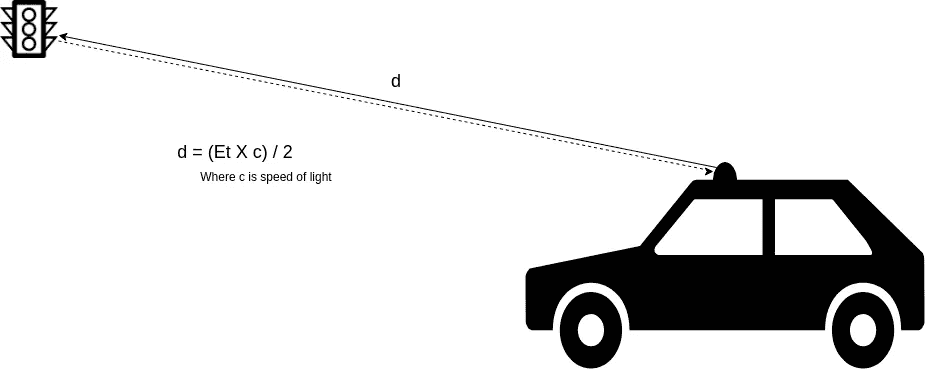
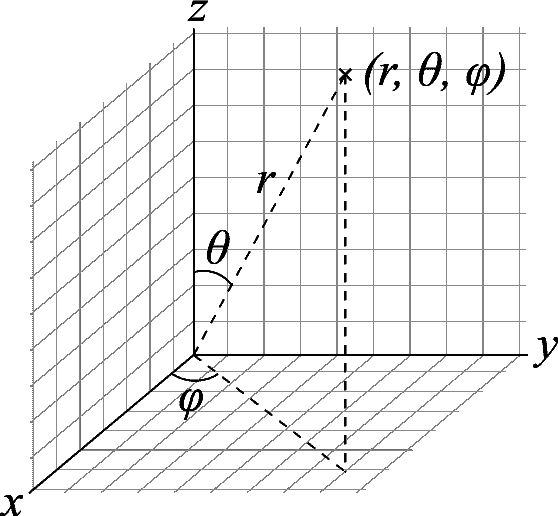
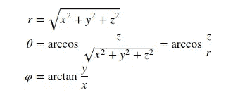
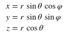
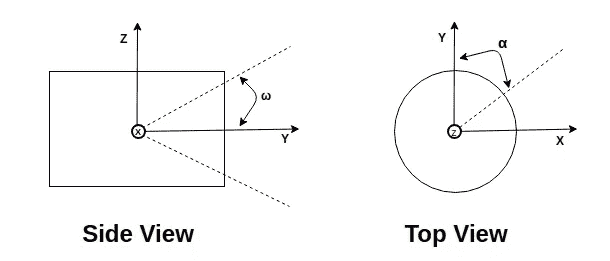
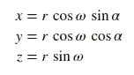
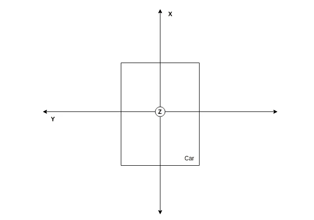

# 激光雷达基础知识:坐标系

> 原文：<https://medium.com/hackernoon/lidar-basics-the-coordinate-system-a26529615df9>

至关重要的是，我们[要熟悉](https://hackernoon.com/tagged/familiarise)激光雷达的坐标系统，以处理安装在自动驾驶汽车上的传感器生成的点云。在这篇文章中，我们将研究激光雷达使用的坐标系统。

激光雷达——光探测和测距——用于确定物体与我们之间的精确距离。

A LiDAR calculates the distance to an object using time of flight.

当发射激光脉冲时，其发射时间和方向被记录下来。激光脉冲在空气中传播，直到碰到一个障碍物，障碍物反射部分能量。在接收到该部分能量后，传感器记录采集时间和接收到的功率。障碍物的球面坐标是利用每次扫描后传感器返回的采集时间和接收到的功率(作为反射率)来计算的。

由于激光雷达传感器返回球坐标中的读数，让我们复习一下球坐标系统。

## 球面坐标系

在球坐标系中，一个点由一个距离和两个角度定义。为了表示这两个角度，我们使用方位角(θ)和极 angle(ϕ)惯例。因此，一个点是由(r,θ,ϕ).

从上图可以看出，方位角是在 X-Y 平面上从 X 轴测量的，极角是在 Z-Y 平面上从 Z 轴测量的。

从上图中，我们可以得到下面的将笛卡尔坐标转换为球坐标的方程。

我们可以使用下面的等式从球坐标推导出笛卡尔坐标。

## 激光雷达坐标系

激光雷达返回球面坐标中的读数。正如您在下图中看到的，与上面讨论的约定有一点点不同。

在传感器坐标系中，一个点由(半径 r，仰角ω，方位角α)定义。仰角，ω在 Z-Y 平面内，从 Y 轴开始测量。方位角，α在 X-Y 平面内，从 Y 轴开始测量。

方位角取决于激光发射时的位置，并在发射时记录。激光发射器的仰角在传感器中是固定的。使用光束返回所用的时间来计算半径。

笛卡尔坐标可以从下面的等式中导出。

笛卡尔坐标系易于操作，因此大多数时候我们需要使用上面的等式将球坐标转换为笛卡尔坐标系。

因此，有必要使用上述等式进行计算，将来自传感器的球面数据转换为笛卡尔坐标。激光雷达传感器的司机通常会为我们做这些。例如，威力登激光雷达传感器提供了一个 ROS 包- [威力登 _ 点云](http://wiki.ros.org/velodyne_pointcloud)用于转换坐标系。

A car coordinate system with LiDAR mounted on it.

上图显示了安装在汽车上的传感器的笛卡尔坐标系。

所以在这篇文章中，我们学习了激光雷达如何计算距离和涉及的坐标系统。

## 进一步阅读的参考资料:

*   奥利弗·卡梅伦(Oliver Cameron)的博客中有一篇关于激光雷达传感器正在改变无人驾驶汽车的文章值得一读。
*   在维基百科上阅读[更多关于球面坐标系的](https://en.wikipedia.org/wiki/Spherical_coordinate_system)。
*   威力登·VLP-16[手册](https://velodynelidar.com/docs/manuals/63-9243%20REV%20D%20MANUAL,USERS,VLP-16.pdf)是了解激光雷达工作原理的良好开端。