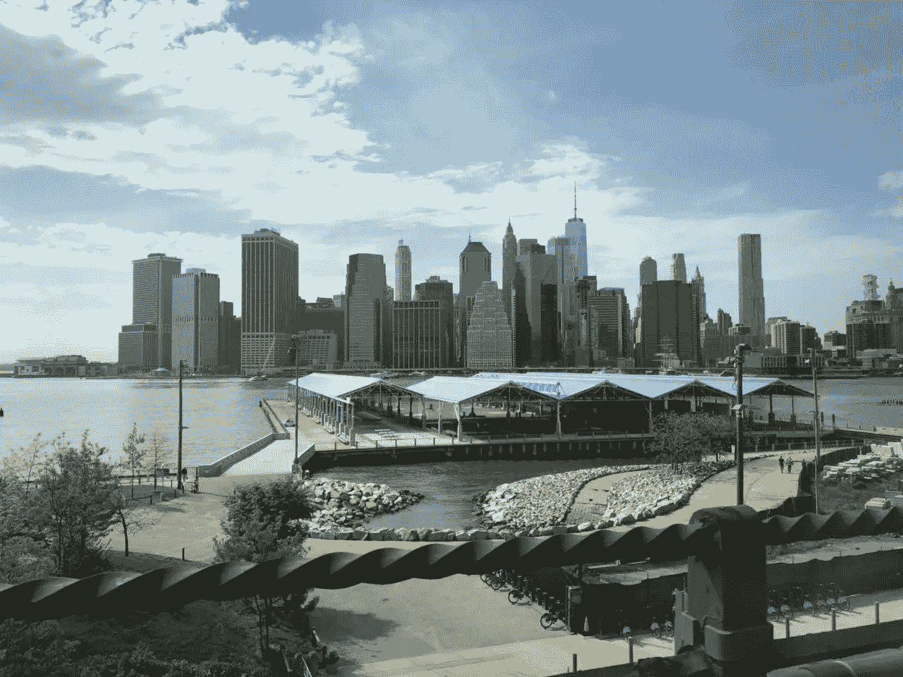
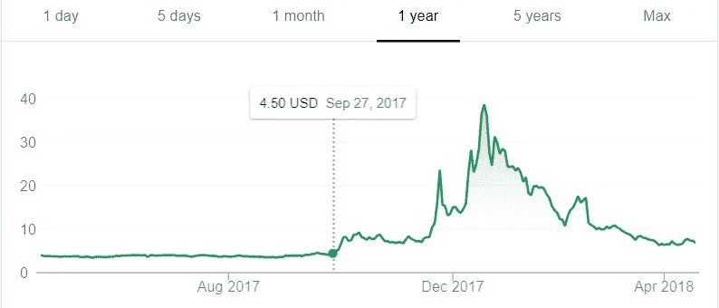
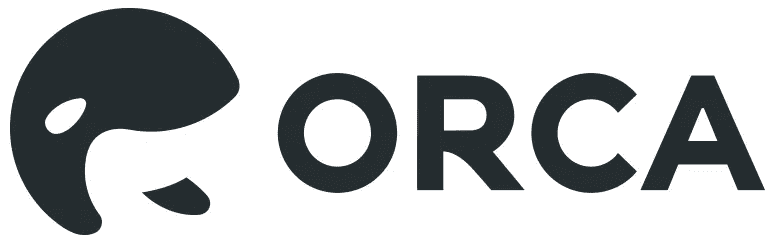

# 重塑加密货币文化的谎言——下一步是什么？

> 原文：<https://medium.com/hackernoon/lies-reshaping-cryptocurrency-culture-whats-next-4724ff407b29>

目前面临着巨大的压力，加密货币领域每天都受到前所未有的头条新闻的轰炸。上亿美元的黑客攻击、与密码相关的绑架、泵和转储操作、假代币、幽灵项目顾问——这类新闻甚至不再引起人们的注意。

持续的不确定性对用户群体构成了威胁。最终，他们应该成为区块链革命的恩人。看起来聚合的力量正在为变革创造动力。

**美国监管机构开始关注**

美国通常是评估资产分类的领头狗。加密货币相关事宜也不例外。

几周前，[纽约州司法部长向 13 家虚拟货币交易所发出了一份调查问卷。调查内容包括交易所业务模式、安全做法以及为防止市场操纵和内幕交易而采取的行动——在监管公开交易的金融工具时，这些领域受到了过度审查。](https://futurism.com/new-york-attorney-general-inquiry-cryptocurrency-practices/)

加密货币交易平台通常充当将常规国家发行的货币转换为数字货币的媒介。与传统金融机构相比，常设监管框架允许加密交易所在不太透明的环境中运营。当被问及调查工作时，纽约司法部长 E. Schneiderman 不得不说“[太多时候，消费者没有他们需要的基本事实来评估这些交易平台的公平性、完整性和安全性”。](https://futurism.com/new-york-attorney-general-inquiry-cryptocurrency-practices/)

截至目前，任何想要在纽约州进行虚拟货币交易的平台、实体或个人都必须申请 [Bitlicense](https://www.dfs.ny.gov/legal/regulations/bitlicense_reg_framework.htm) 。拒绝参与司法部长调查问卷的交易所之一——北海巨妖，此前曾生动地将 Bitlicense 监管框架描述为“一种如此邪恶、如此残酷的动物，甚至北海巨妖都没有勇气或力量面对它肮脏、巨大、尖尖的牙齿。”[上述描述于 2015 年的某个时候发表在北海巨妖的一篇博客文章中。](https://blog.kraken.com/post/253/farewell-new-york/)

最令人恐惧的美国监管巨头 SEC(证券交易委员会)一直在对那些试图积极影响股票价值、声称采用区块链技术的公司采取惩罚性行动。

最近受到 SEC 关注的受害者之一是 Riot Blockchain ，这是一家以前出售牛、马、猪荷尔蒙的公司。截至去年年底，Riot Blockchain 在决定更名时被称为 Bioptix。新成立的公司将运营工作转向加密货币开采和投资，甚至讨论了推出加密货币交易所的计划。10 月 4 日，该公司宣布了更名计划，股价从 9 月底的约 4 美元飙升至 2017 年 12 月 19 日的 38.60 美元，创下历史新高。

遗憾的是，并不是所有情况下都支持加密。Riot Blockchain 一直面临负面宣传，媒体指责该公司虚假承诺和糟糕的管理。此外，美国证券交易委员会刚刚向 Riot Blockchain 发出传票，进一步澄清该公司如何利用该公司新名称中隐含的区块链技术。

这不是美国证券交易委员会(SEC)采取的一项孤立举措，目的是更密切地关注加密货币和参与非法商业行为的区块链相关实体。调查工作也被称为 SEC 的 probe，[据报道早在 2018 年 2 月就已经启动](https://cointelegraph.com/news/wsj-sec-launches-cryptocurrency-probe)。

**日&韩选择自律**

纵观全球，亚洲人正在采取不同的方式。密码交易所正联合起来创建自律机构。第一个同意自我监管的国家是日本。日本 16 家加密货币交易所宣布成立合作组织，以在价值 5.3 亿美元的 Coincheck 平台被黑后挽回公众信任。

韩国似乎正在效仿日本同行，并提出了联合国内交易所的类似目标。当前使用的商业模式的拟议转型旨在提高生态系统内的透明度，并加倍实施反洗钱措施。

日本和韩国属于加密货币在国民中渗透率最高的国家。

**社区觉醒**

从历史上看，加密货币社区一直是无监管的自由放任原则的强烈支持者，但它正在慢慢改变态度。

最近的行动呼吁来自 Savedroid，它在成功筹集 5000 万美元后伪造了一个骗局退出。Savedroid 在他们的官方网站上留下了一个著名的喜剧系列《南方公园》的迷因，声称所有筹集的资金现在都没有了。为了让这个故事可信，Savedroid 的团队腾空了他们在法兰克福的办公楼，而他们的[首席执行官在推特上发布了一张照片](https://twitter.com/YassinHankir/status/986551967932735488)，暗示他已经离开了这个国家，信息中还附有一张纸条“谢谢，伙计们！通话完毕…”

第二天，Savedroid [发布了一段视频，安抚了社区](https://www.youtube.com/watch?v=o5_bwFf_byo&t)，并解释了他们伪造盗用资金的原因。“如果我们像过去 4 个月那样看待这个市场，就会发现有太多的骗局。< … >如果我们不寻求更好的监管，我们相信这会拖垮整个市场。”——告诉 Savedroid 的首席执行官亚辛·汉基尔。

Y.Hankir 明确声称，由于没有统一的行业标准，ICO 筹款的整个模式正面临灭绝。“我们需要切实可行的监管，切实加强值得信赖的 ico 市场”。

有趣的是，整个情况在 Reddit 上最受欢迎的在线论坛之一引起了强烈反响，讨论这是一种廉价的营销噱头还是真正的行动呼吁。

**提前思考**

为了防患于未然，合法的 ico 正在实施各种保护措施和公开披露，以有效传达项目背后的真实意图。ico 经常向潜在的最终用户和投机者推销他们基于路线图的愿景。

显然，由于技术创新的多面性，预测产品实现的道路是一项复杂的任务。团队透明和程序代码透明是即将到来的项目交流和展示他们的目标以及实现它的周围智能生态系统的一种方式。

“对我们来说，公众的看法是至关重要的，因为我们正在创建一个消费者应用程序。早期采用者的参与在决定如何构建我们的平台，首先实现哪些功能方面起着关键作用。我们的经营假设是有机会创造忠诚的顾客。早期采用者以后可能会转变为品牌大使，我们非常重视这个机会" **-虎鲸联盟** [**首席执行官 n . Avidan**](https://orcaalliance.eu/)

与社区和合作伙伴密切对话、定期更新发展动态、积极参与区块链活动和在线讨论板是提高品牌知名度和建立信任的策略。随着每月数百个新项目的启动，有效的沟通变得越来越重要。

— -

这个行业正在走向成熟。当生态系统的所有方面——监管者、用户、项目所有者和服务提供商——都开始同意需要一个共同的框架时，这就清楚地表明了主题的相关性。然而，问题依然存在:这些目标各异的行业支柱能以多快的速度同意并采纳这套新规则。