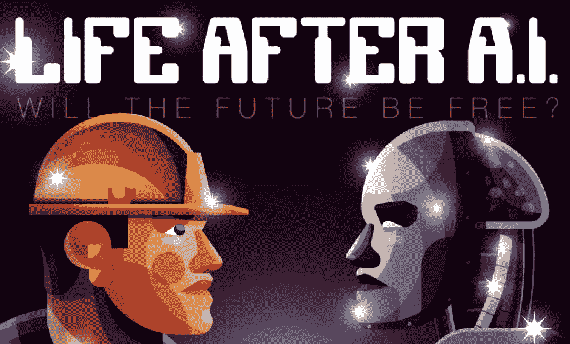
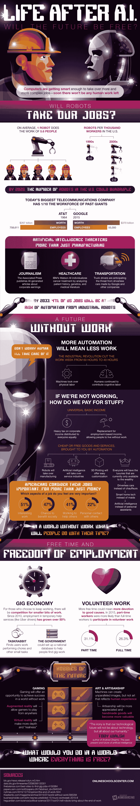

# 人工智能之后的生活

> 原文：<https://medium.com/hackernoon/life-after-ai-6da9f62b6d6c>

## 未来会免费吗？

当机器人革命首次冲击工业制造业时，人们害怕失去工作。今天，一个机器人可以做几乎六个人的工作，到 2025 年，美国的机器人数量可能会翻两番。那个老问题的答案，“机器人会取代我们的工作吗？”似乎是一个强调的“是！”但是工业机器人并不是人类工人的唯一威胁。

这一次以人工智能为前沿的新革命威胁的不仅仅是制造业。人工智能产生的文章由美联社发表。IBM 的沃森不仅可以击败人类的危险！冠军，但分析病人的历史，遗传学和医学文献，为癌症患者创造最佳的个性化治疗。随着多家公司制造无人驾驶汽车，或雇佣送货无人机，运输工人也面临自动化。

尽管我们的工作面临威胁，但未来并不那么暗淡。随着机器人接管制造业，人工智能管理服务业，3D 打印便于定制，总有一天每个人都将拥有目前只有富人才能拥有的奢侈品。只有当人们选择工作时，他们才需要工作。

查看这张信息图，了解更多关于人工智能之后的[生活。](https://www.onlineschoolscenter.com/will-the-future-be-free/)

