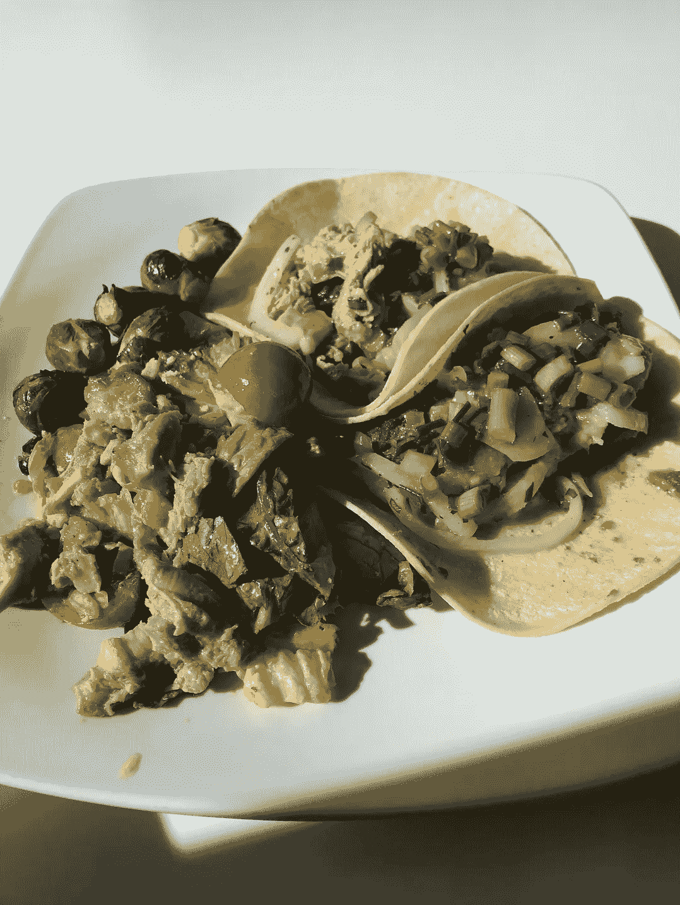
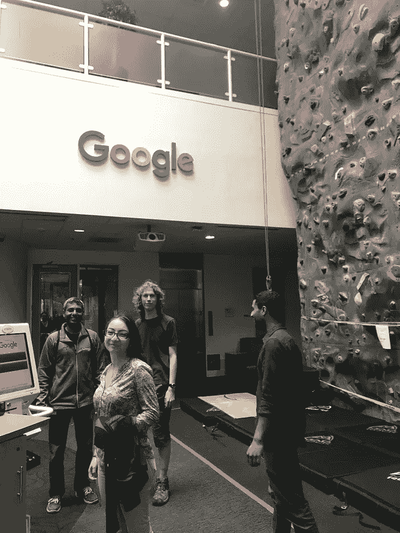
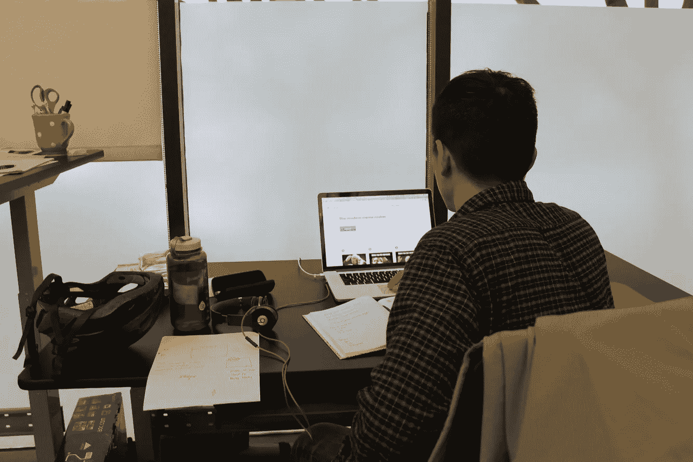

# 谷歌之后的生活:与创业生活的比较

> 原文：<https://medium.com/hackernoon/life-after-google-a-comparison-to-startup-life-831e74d5c6f8>

七个月前，我辞去了谷歌的产品管理工作，开始着手创办一家公司。在过去的四个月里，我和我的联合创始人一直致力于开发在线视频编辑器。在这篇文章中，我将比较跳槽前后的生活，以便其他大公司的产品经理知道如果他们考虑跳槽，他们将会面临什么。

## 交换

*   谷歌:谷歌班车，1 小时++。
*   启动:你从床上走到办公桌前所花的时间。偶尔还有牟尼。

## 职业发展

*   谷歌:你花了很多时间做绩效评估和取悦你的经理，这两者都很烦人。
*   初创公司:你花同样多的时间在增长技巧上，花同样多的时间在产品搜索上取悦支持者，这更有趣，但和 Perf 一样令人讨厌和随意。

## 午餐

*   谷歌:每天免费。
*   创业:你仍然每个月在谷歌吃几次饭，因为你所在的风投公司离旧金山办公室很近，而且谷歌人的血统很深。

Taco Tuesday at the Google SF office

## 与员工的对话

*   谷歌:“哦，你周末过得怎么样？”
*   创业:我已经知道了你周末的一切，因为我们每个小时都在一起聊天。

## 货币铸造

*   谷歌:如果你的产品赚钱，在你的公司工作可能就不好玩了。
*   创业:如果你的产品赚钱，每个人都想和你合作。

## 搜索如何工作

*   谷歌:即使你从事搜索工作，你也几乎不知道 SEO 排名是如何工作的，因为你不是排名工程师，而且有人真正理解排名吗？
*   创业:SEO 是 LYFE

## 速度

*   谷歌:文本修改要经过工程审查、产品审查、设计审查和阿丽亚娜批准。
*   启动:在写这句话的时候，文本已经在生产中被修改了。

## 股票

*   谷歌:乘以 1000，随时液化
*   创业:十年内可能价值数百万美元的垄断资金。

## 压

*   谷歌:我每周都会收到记者发来的多封邮件，并把它们转发给通讯团队，因为那是其他人的工作。翻白眼。
*   初创公司:我每周都会发送数百封未经请求的电子邮件，恳求记者们关注我的产品。

## 旅行

*   谷歌:用公司卡去苏黎世、德里、东京和特拉维夫出差，因为你在远程办公室有合作伙伴工程团队。
*   创业:走到快餐车公园吃午饭很刺激。

## 一百万用户

*   谷歌:可能是噪音。你按下发射键了吗？
*   创业:一个无拘无束的未来幻想。

## 工程

*   谷歌:为什么工程师要花这么长时间？它们太慢了。
*   创业:为什么我花了这么长时间？我太无聊了。

## 宗旨

*   谷歌:组织世界上的信息，并使其普遍可用和有用。
*   启动:WIP，但我认为它写在推介资料的第一张幻灯片上。

## 额外津贴

*   谷歌:收入达到六位数，但当他们不给你一份节日礼物时，你仍会感到恼火。
*   创业:你一周挣的钱比你以前一次同事奖金挣的还少。

Offices with climbing walls vs lucky to have an office at all

## 成功

*   谷歌:第八级
*   创业:30 岁以下 30 岁以下

## 增长

*   谷歌:你需要做的就是发布一个伟大的产品。如果它是一个伟大的产品，人们会使用它，货币化并不重要。
*   创业:你必须打造一个伟大的产品，让人们使用它并从中赚钱。你可以有一个人们不用的伟大产品，也可以有一个人们用了也不赚钱的伟大产品。无论哪种方式，你的产品都会死，尽管它很伟大。

## 日常的

*   谷歌:构建令人敬畏的软件，与令人惊叹的人一起工作，梦想未来，并在途中获得许多乐趣。
*   启动:相同:)

Sun setting on the Googleplex

感谢阅读！我很想听听你对离开这个男人去一家科技创业公司的看法。如果你喜欢这篇文章，给我们一些中等的爱，看看我们的[视频编辑网站](https://www.kapwing.com)，或者在 [Kapwing 博客](https://www.kapwing.com/blog)上关注我们的创业之旅，让我知道。