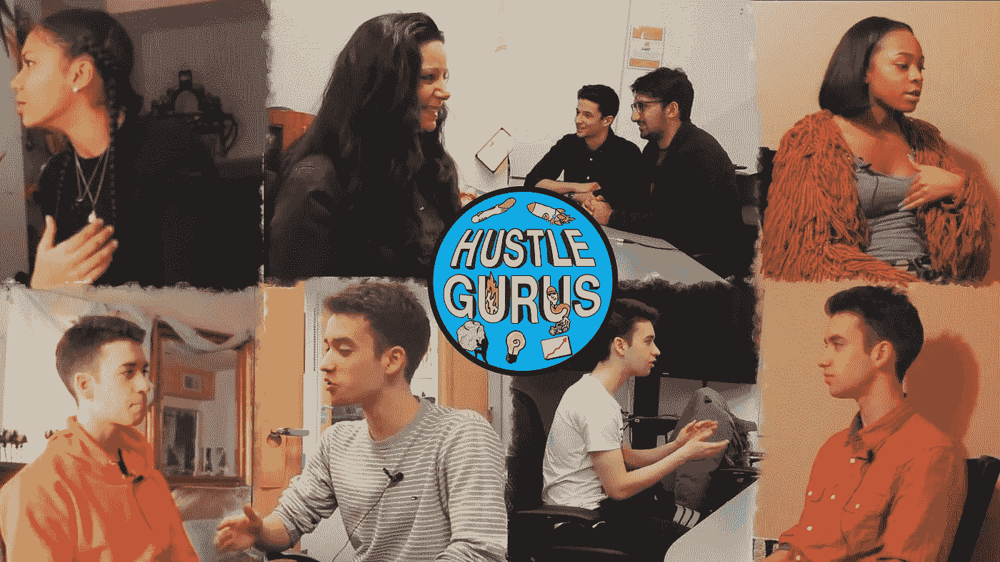
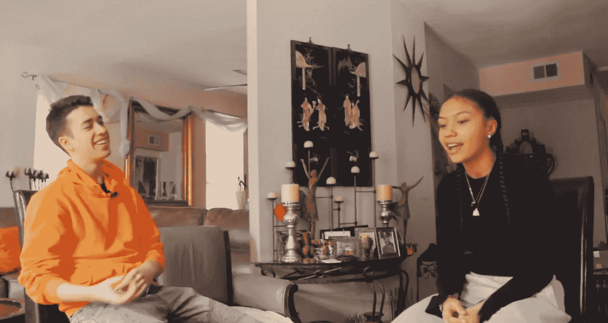

# 一个 17 岁的创始人和影响力营销人员的生活

> 原文：<https://medium.com/hackernoon/life-of-a-17-year-old-founder-influence-marketer-46233a78e32>

#千禧年运动

我看到许多人喜欢与千禧一代打交道。就我个人而言，我要感谢任何赞助者、组织和个人，感谢他们花时间帮助年轻人在生活中向前迈进。

今天，我将采访 [Matt L.F Smith](https://medium.com/u/5d8d4ea1dd09?source=post_page-----46233a78e32--------------------------------) ，他是 [Hustle Gurus](https://medium.com/u/bd4a0205710?source=post_page-----46233a78e32--------------------------------) 的创始人，这家公司利用你们城市的新兴品牌和创业公司，为有才华的年轻人提供有意义的工作机会。

我今天升职了，被雇佣在他们的网站上工作，你可以查看下面的文章。

让我们不要浪费时间，现在就开始面试吧！

17 year old Serial Entrepreneur and Influencer (left) [Matt L.F Smith](https://medium.com/u/5d8d4ea1dd09?source=post_page-----46233a78e32--------------------------------)

## 你做过哪些项目，结果如何？

我一直致力于创业，并试图建立自己的企业，在过去的 4 年里，我一度从事说唱事业，但主要是与创业相关的事情。

从我 14 岁开始，我就开始尝试和我在学校的一个朋友一起制作这种耳机，我想我们可以创造这种耳机——不仅可以听音乐，还可以帮助你集中注意力。

我们在有免费 3D 打印机的图书馆之间来回跑了大约 8 个月，打印出模型并设计耳机，我在那里真正做的最多的是了解到设计是多么困难，我开始了解到更多的是创造一些东西——和想出一些你脑海中有图像的东西。

所以在追捕失败后，我开始使用 YouTube 和音乐。

我在帮助我的朋友运营一个名为 SuperDuperGaming 的 YouTube 频道，他们在那里制作视频游戏视频，偶尔他们也会制作一个音乐视频，我决定在他们的一个音乐视频中说唱，只是作为一个笑话。

然后，我实际上比我想象的更喜欢它，慢慢地，但肯定地，我开始认真对待音乐，我在整个大二和大三的大部分时间里一直在做音乐，我打算和我的朋友一起做音乐。

我点击了 ETP，它现在实际上开始引起很多关注，但我没有坚持足够长的时间来达到这一点。

在音乐之后，我决定——我离开音乐的原因是因为我决定，嗯——创业是帮助改善人们生活质量的最佳方式，这种方式对我来说是最满意的——我试图在未来几十年里寻找我的生活，我努力想象如果我成为一名伟大的音乐家，我能为人们做些什么。

我只是看不到同样的影响，因为我建立了自己的创业公司，为世界上的问题创造了自己的解决方案。这并不是说我怀疑任何音乐家，很明显，这些做音乐的人——我的朋友可能会成为我余生的朋友，但我只是看到创业对我来说更好。

对人的帮助会更大。随着我的继续前进，我开始更多地与人们联系，并试图找到对我所在城市芝加哥的商业感兴趣的人。我遇到了几个人，我在一个名为 lets cook 的烹饪应用程序上工作，该应用程序应该从你的冰箱中取出食材，并将它们转化为潜在的食谱，就像我的朋友 Ali 不知道如何处理冰箱中的食物，所以那是我们真正开始创业、开发应用程序和软件的时候。我们真的想为人们的日常生活增加价值。我吸收了很多资料，把 Let's cook 带到一个孵化器里学以致用。在这个名为 Quarter0 的孵化器里，我接触到了很多导师，我们的导师直截了当地向我们展示，让我们做饭并不能真正解决任何世界问题。尽管如此，我还是学会了问好的面试问题，学会了如何与人交谈，学会了在试图了解人们的深层体验时以正确的方式提问，学会了如何让人们告诉他们真正困扰他们的是什么，这很有帮助，因为我做过无数次客户面试。

在我停止了“让我们做饭”的工作后，我开始了“重新联系”的工作，这是一个基于他们的风险投资，将他们所在地区的年轻企业家联系起来的项目。

我通常看到，年轻人试图寻找其他试图建立企业的人，这种情况普遍存在，因为“让我们一起做饭”很难建立团队。

我们非常努力地开发这款应用，不仅是为了吸引商界人士，也是为了吸引其他领域的人。

长话短说，重新连接最终导致团队解散，我们在让人们使用应用程序时遇到了问题。

毕竟这是一次很棒的学习经历！

## **告诉我们一些关于喧嚣大师的事情:**

嗯，这实际上有点类似于重新连接，我只是把我看到的最真实的事情，我们正在解决的需求和我认为我们可以让事情工作的方法。

所以，我认为重新连接失败的原因是因为我们从来没有得到足够的利基。

有如此多的企业家、风险企业和市场部门需要任何有针对性的东西，所以我想，如果我能创造一个初步的受众群体，让他们对我所在城市的年轻人产生初步的兴趣，并通过这种方式将他们联系起来，会怎么样。

所以我开始思考什么是最好的方法？

我得出的结论是，它将通过媒体和视频将是内容的一个强大部分[营销](https://hackernoon.com/tagged/marketing)如果不是——占主导地位的形式。

我决定制作一个 YouTube 频道，并专注于我的视频技能，然后建立一个基于视频、采访和《生活中的一天》的生态系统——年轻人和他们的年轻人领导的风险企业、企业、非营利组织和初创公司的视频，并将各种可能希望工作或成为该业务消费者的人联系起来。

我使用 Youtube 来托管我的内容，但一旦我创建了一个初始观众，我想创建一个 Hustle Gurus 自己的平台，在这个平台上可以无缝地与你所在城市的初创公司联系。

## **你对未来有什么期待？**

嗯，我已经决定，只要 Hustle Guru 成为一个成熟的平台，我就会一直为它工作。

也许这需要 3 年、5 年、7 年、10 年的时间？

但是，我真的很愿意穿过这个长长的大厅，真的很努力地工作，因为我希望 Hustle Gurus 带来年轻人。

当我谈到年轻人时，我指的是不同的年龄。刚进入[创业公司](https://hackernoon.com/tagged/startup)世界的人！

我等不及要看到纽约的喧嚣大师了，

旧金山的骗局大师，

喧嚣大师达拉斯，迈阿密，东京，首尔，开普敦！

任何地方！

我希望 Hustle Guru 成为有抱负的企业家和商业领袖的国际中心，以便他们能够在已经建立的业务基础上相互联系和支持！

我也想提供这个社区的自由民主化工具。

人们将能够展示他们的技能，而不需要证书，并有一个温和的商业生活的开始。

我追求多元化的青年和 50/50 的性别平衡。我希望这个平台能够代表世界上的多元化社区，我希望这个平台能够代表一种不在乎你的学位，而在乎你真正的技能、你的目标和动力的东西。

我希望它无处不在！

## 如果有人试图找到你，他们如何联系你？

个人邮箱:mattlfsmith@gmail.com

骗局大师电子邮件:hustlegurus@gmail.com

或者在 Hustle Gurus 网站【www.hustlegurus.com 联系我

## 谢谢你看我的文章！欢迎在下面留下评论或了解更多关于我的信息！！

## 如果您错过了我的上一篇文章:

*   不要轻视 B 计划，因为它可以成为你的 A 计划

## 关于我自己的更多信息:

我 16 岁|程序员|出版公司首席执行官|内容营销人员

*   如果你有兴趣和我一起跟进，请查看我的网站:[https://jdombele.wixsite.com/jayson](https://jdombele.wixsite.com/jayson)
*   如果你对我的 PitchUs 初创公司感兴趣，请查看下面的链接:[https://jdombele.wixsite.com/pitchus](https://jdombele.wixsite.com/pitchus)
*   想要了解政治、商业、科技等方面的新闻吗？https://documentedpress.wordpress.com/

*//我目前正在为我的文章寻找一名编辑，如果你感兴趣，请给我发电子邮件！jdapple4357@gmail.com//*

任何问题，业务查询或关注，请随时发送电子邮件给我@:jdapple4357@gmail.com

## 感谢您阅读营销与增长黑客出版物

在推特上关注我们。加入我们的[脸书集团](https://goo.gl/bCXZSJ?originalUrl=https://medium.com/r/?url=https%3A%2F%2Fwww.facebook.com%2Fgroups%2FloveMNG)。订阅我们的 YouTube 频道。关注我们，在您的收件箱中获取我们的最佳故事。

If you enjoyed this story, please recommend 👏 and share to help others find it!