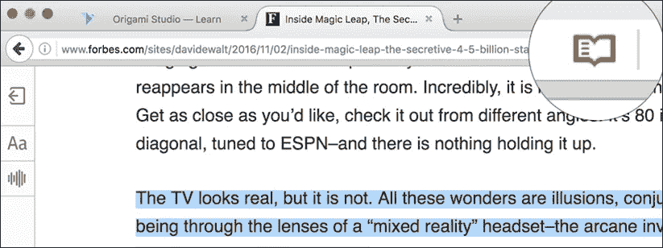
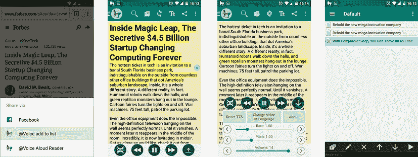

# 跟上科技新闻的生活窍门

> 原文：<https://medium.com/hackernoon/lifehacks-to-keep-up-with-tech-news-c92834b24687>

Photo by [rawpixel](https://unsplash.com/photos/WLDtOWLuSgA?utm_source=unsplash&utm_medium=referral&utm_content=creditCopyText)[,](https://unsplash.com/?utm_source=unsplash&utm_medium=referral&utm_content=creditCopyText) Edited by Avi Barel

# 高效阅读生活窍门？

那么，我们为什么需要高效的阅读生活窍门呢？嗯，我们生活在一个有趣的时代，我们周围每天 24 小时都有很多“噪音”，尤其是在互联网上，尤其是社交媒体上。但这还没有结束，因为我们必须处理来自即时消息应用程序、电子邮件、日历事件、新闻、技术新闻、工作相关任务以及个人生活任务的通知……那么，您如何保持工作效率，同时还能及时了解所有信息呢？我相信这个简单的生产力生活黑客将帮助你改善你的生活，节省宝贵的时间和提高你的网络体验！

你知道问题，我们总是被大量的数据和信息轰炸，这些数据和信息在短时间内吸引了我们的注意力，我们从来没有时间在那个时候专注于一件特定的事情，例如阅读长篇文章。我们总是想要 TL；直截了当的灾难恢复内容或短视频，因为我们总是在移动设备上。

说真的，想想看，你是怎么处理你的阅读清单的？你真的有时间阅读你收集的所有文章和网络内容吗？但是，如果有一种方法可以让你继续工作，甚至开车，并且仍然能够“阅读”文章呢？其实你可以！不是通过阅读，而是通过听你的文章，比如电子书、播客或广播电台。因此，有很多方法可以让你在不花时间阅读的情况下提高效率并阅读文章。如果使用 [pocket](https://getpocket.com/) 、 [google keep](https://www.google.com/keep/) 、 [OneNote](https://www.onenote.com/) 或者其他解决方案都没关系，现在就可以使用这个 Lifehack。

# 我在工作中的效率问题

我最喜欢的方法之一是 macOS 内置的“文本到语音”功能(PC 解决方案在下一节中)，你可以突出显示一个段落或整篇文章，只需按下 Option (Alt)键，结合 Esc 键和 wallah，你的 mac 就可以为你朗读了！我这样做已经很多年了，它帮助我节省了大量的时间，这样我就可以了解我感兴趣的所有事情，并且在我在办公室或者在家工作的时候仍然可以工作。只要确保你在办公室使用耳机，尤其是当你和同事共用办公室的时候。

Click on this icon to enable Firefox Read View

如果你正在使用 [Firefox](https://www.mozilla.org/en-US/firefox/new/) ，你甚至可以切换到“[阅读器视图](https://support.mozilla.org/en-US/kb/firefox-reader-view-clutter-free-web-pages)，你将获得专用的文本到语音阅读功能，这甚至更强大，因为你将能够控制阅读速度，就像你可以以 1.5 倍/2 倍的速度观看 YouTube 上的长篇演讲，节省一些宝贵的时间，同时你仍然可以享受演讲并理解一切。如果这还不够的话，Firefox 的 read view 中有如此多的其他语言可供你选择，并让你的 Mac 为你阅读其他语言的文章(就我而言，希伯来语也可以，但英语更好)。

在**的 Windows** 上，我使用了同样的方法，感谢讲述人(文本到语音)做了同样的事情！甚至有一个为 Linux 用户开发的应用程序叫做 Gespeaker(我在 Ubuntu 上试过)，它并不完美，但是它能完成任务…

Customize Firefox reader speed and languages

# 我的移动办公生活

所以几年前，我有了一个想法，开发自己的应用程序，在移动设备上做同样的事情。一个读取你保存的文章的应用程序(甚至更多我想内置的东西和功能)，但我发现已经有这样的应用程序，并不完全与我想开发的相同，但它完成了工作，让我更有效率！

正如你从我的文章中所知，我喜欢多任务处理，所以我不会在开车时听无聊的广播，而是用我的智能手机来读取我保存的文章，即使你不开车，这也是一个很好的解决方案，你可以在使用公共交通工具时使用这种生产力生活黑客，例如，我喜欢当我坐在咖啡店或餐厅，检查我的脸书订阅和查看我的电子邮件时，甚至当我在外面跑步时(在路上！).所以当我开车去上班时，我总是听播客或我保存的文章，而不是播客，当你的智能手机为你读一篇有趣的文章并为你节省大量阅读时间时，这太酷了，这感觉就像“一举两得”，特别是当你在交通堵塞时！那我该怎么做呢？嗯，在我的智能手机上，我使用了[@语音朗读器](https://play.google.com/store/apps/details?id=com.hyperionics.avar&hl=en)，它并不完美，但它确实有效！它甚至可以让你创建“播放列表”的文章，你想以后听！你也可以为你的 iPhone 找到一些替代品。

It feels like magic when your phone reads from your saved articles

一个 **奖励**——为了避免广告，你可以安装一个 YouTube 的替代应用程序，叫做 NewPipe(来自 [F-Droid AppStore](https://f-droid.org/en/) )，当 YouTube 在后台运行时，你可以听 YouTube 讲座，甚至 [TED 演讲](https://www.youtube.com/user/TEDtalksDirector)，所以即使你使用 [Waze](https://www.waze.com/) 或谷歌地图导航，你仍然可以随时享受聆听和学习新事物的乐趣！

# TL 呢；视频博士？

好吧，如果你不喜欢看文章，还有视频替代！例如，我的 feed 总是充满了视频，将有价值的信息总结成一个简短的视频剪辑。你可以关注脸书、LinkedIn 和 Twitter 上的热门内容提供商，我最喜欢的有: [TC](https://www.facebook.com/techcrunch/?fref=ts) 、 [Insider](https://www.facebook.com/techinsider/?fref=ts) 、 [The Verge、](https://www.facebook.com/verge/?hc_ref=NEWSFEED&fref=nf)、 [VOX](https://www.facebook.com/Vox/) 、 [Gizmodo](https://www.facebook.com/gizmodo/) 、 [Seeker Daily](https://www.facebook.com/testtubenetwork/) 和 [Big Think](https://www.facebook.com/BigThinkdotcom/?fref=ts) 。

正如我之前提到的，你总是可以以 1.5 倍甚至 2 倍的速度在 YouTube 上观看精彩的内容。如果这还不够，还有一家名为 [Wibbitz](http://www.wibbitz.com/) 的以色列初创公司，它有一个出色的解决方案，可以在几秒钟内自动从文本内容中创建优质视频。

那么你如何跟上你感兴趣的事物的发展呢？请在下面评论并告诉我，非常欢迎你与我分享你的生产力生活窍门…

*最初由 Avi Barel 于 2016 年 11 月 4 日*于[*StartUX*](http://www.startux.net/)*发布*

## 如果你喜欢这篇文章，请阅读我的其他文章:

[开放设计:设计师的免费软件工具](https://uxplanet.org/open-design-freeware-tools-for-designers-f7bdde99f2e0) [iPhone Vs . MacBook Pro](/adventures-in-consumer-technology/iphone-vs-macbook-pro-9902c7fc64d3)
[你的智能手机 vs .你的 PC](/adventures-in-consumer-technology/smartphones-will-replace-pcs-soon-541b5c8a4f48) [苹果，是时候将 iOS 与 MAC OS](https://uxplanet.org/apple-its-time-to-merge-ios-with-macos-4f04c947c19d)
[VR、AR & MR](https://uxplanet.org/the-differences-between-vr-ar-mr-27012ea1c5)
[苹果将彻底改造模块化计算机](/@4Barel/apple-is-going-to-reinvent-the-modular-computer-powered-by-an-iphone-1ccf758514df)
[跨平台 UX 指南(针对开发者&设计师)](https://uxplanet.org/cross-platform-guidelines-1c7675ec1d0c)
[设计思维作为创新的框架](/@4Barel/design-thinking-as-a-framework-for-innovation-e18e24cd4920)
[高效阅读的生活窍门！](/@4Barel/lifehacks-for-productive-reading-9d265b97c444)

> **通过下面的**拍手**帮助别人**找到我在 Medium 上的文章。
> 跟我上: [**推特**](https://twitter.com/4Barel) ， [**中**](/@4Barel) **，** [**脸书**](https://www.facebook.com/startux.net/) 和 [**LinkedIn**](https://www.linkedin.com/in/abarel/)

Follow StartUX page on Facebook for more TL;DR Tech & UX updates