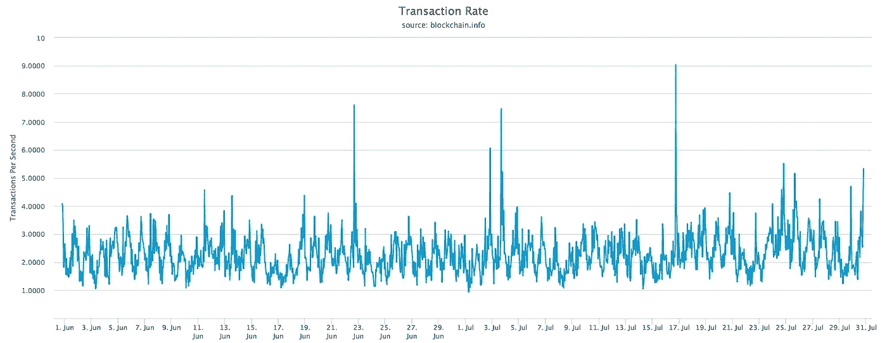
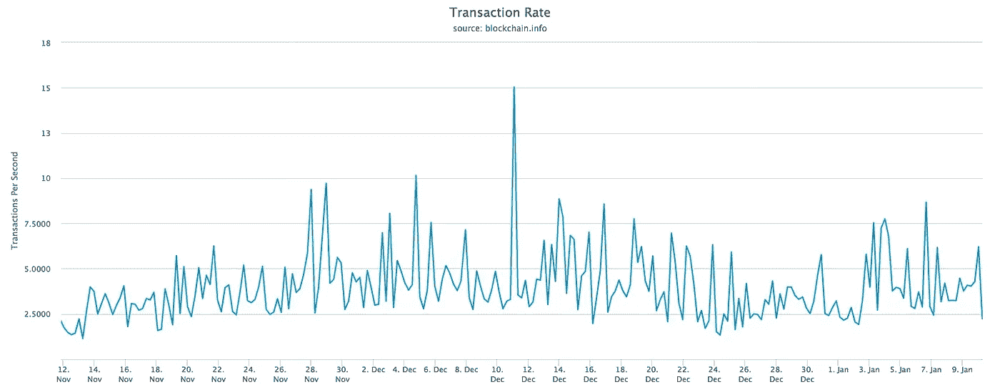
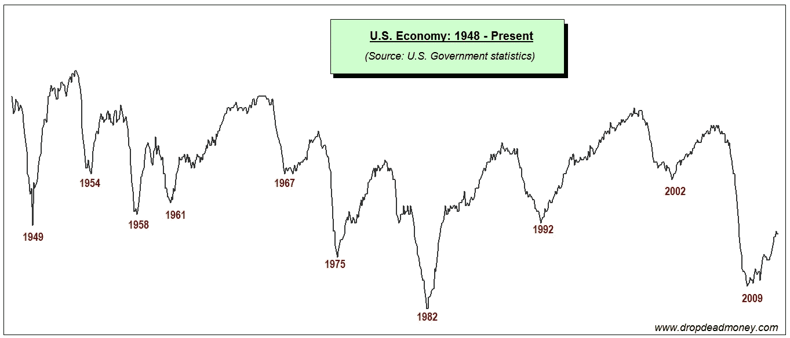

# 闪电网络和黄金标准怀旧

> 原文：<https://medium.com/hackernoon/lightning-network-and-gold-standard-nostalgia-db3ca0a42f43>

中本聪将比特币打造成了“一个点对点的电子现金系统”。仅凭这一点，我们就有理由认为比特币已经是一种广泛使用的交易媒介。然而，这一目标仍然难以实现。

失败的一个常见原因是可伸缩性。比特币网络每秒可以处理 7 笔交易(使用 segwit)。这个数字与 Visa 相比相形见绌，Visa 每秒能够支持多达 30，000 笔交易，平均每秒处理 2，000 笔交易。

进入闪电网络。2016 年，Joseph Poon 和 Thaddeus Dryja 为比特币提出了一个扩展解决方案，使其能够每秒处理几乎无限数量的交易。两年后，它开始工作了。Lightning network 已经在测试网络中投入使用，并按照宣传的那样运行。当然，仍然有一些错误和问题，但是也有一些有才华的开发人员在努力解决它们。闪电网(LN)来了。这是一个时间问题，而不是如果。

然而，当你仔细观察比特币网络中的交易模式时，几乎没有理由认为比特币会因为 LN 而得到更多的交易。如果可扩展性真的是人们不使用比特币交易的原因，那么我们应该预计网络会一直繁忙，内存池会一直满着，用户会没完没了地抱怨。

事实并非如此。在过去的 60 天里，每秒钟添加到内存池的平均事务量在 1–4 之间。

即使在 2017 年 11 月至 2018 年 1 月左右投机驱动的历史高点，比特币也没有严重超载。当然，情况远非理想，LN 可能会有很大的帮助，但是每秒钟既没有成百上千的事务被添加到 mempool 中。

当然，这很难说是对未来的一个坚如磐石的预示。如果比特币成功地真正巩固了自己作为广泛交易媒介的地位，那么有一天我们真的会看到这样的数字。

但很明显，至少在这个时间点上，可扩展性不是阻碍比特币实现的因素。出于这个原因，有理由认为 LN 不会突然将比特币变成一种广泛传播的交换媒介。它可能会提高比特币的功能，但它不是一颗神奇的药丸。

所以让我们把注意力集中在真正的问题上:为什么比特币没有被更多地交易？这仅仅是时间和适应的问题吗？还是更深层的东西？

要真正尝试回答这些问题，我们需要探索一个经典的辩论:金本位与菲亚特。

金本位很直观理解。流通中的每一张钞票都有其黄金重量作为后盾。如果一个人想要，他们有资格在他们国家的国家银行机构将他们的货币兑换成黄金。

直到 20 世纪 70 年代初(历史上有几个明显的例外)，金本位在世界范围内盛行。1971 年，理查德·尼克松正式结束了美元和黄金的关系，在美国建立了法币体系。世界其他地方也纷纷效仿。如今，各国货币的价值完全取决于对政府的信任。

关于哪种系统更好，没有绝对的答案。我将尝试介绍这两种系统的主要优点和缺点。

金本位货币与黄金的价值挂钩，而黄金的供应量增长缓慢，几乎被认为是固定的。这让金本位同时具备了它最大的优势和最大的弱点。

因为每一个金本位美元都有黄金做后盾，所以这种货币几乎不会遭受通货膨胀，更不用说恶性通货膨胀了。政府不能简单地印更多的钱，让个人拥有的货币贬值。许多人认为这很有吸引力，因为它承诺自由和个人控制。

另一方面，政府不能轻易实施货币政策。这使得金本位经济极易受到实际和货币冲击的影响。结果是短期价格不稳定。

很容易看出，自 20 世纪 70 年代左右(金本位制被放弃后不久)以来，美国经济经历了更长的冲击间隔，尽管冲击并没有变小。

简而言之，法定货币是一种制度，在这种制度下，我们相信政府会创造新的货币来适应经济状况。这使得美联储，在美元的情况下，努力防止短期经济冲击。他们做得并不完美，因为冲击仍然会发生，但这是一个比金本位更稳定的解决方案。

用稍微专业一点的术语来说，美联储将新创造的美元借给银行，然后银行根据部分准备金制度以 10:1 的比例贷出这些钱。要获得更深入的解释，请查看这个。

人们最常提到的法定货币的缺点之一是，由于供应不断扩大，货币会导致通货膨胀。这就是一百年前的美元远比今天的美元值钱的原因。菲亚特的支持者认为这不是一个缺点。凯恩斯本人认为，缓慢稳定的通货膨胀率对促进消费主义是必要的，然而，这是经济学家普遍接受的观点。

另一个缺点是货币市场不公平。中央银行表现为垄断，商业银行获得的联邦贷款利率比一般银行要高。

也许菲亚特最可怕的部分，是对央行做出正确决策的依赖。美联储做得相对较好，它被认为是一个透明和高效的机构。但在许多国家，情况并非如此。恶性通货膨胀已经在全球范围内造成了严重破坏，委内瑞拉可怕而悲惨的局势就是最新的例子。

回到比特币。

通常被称为数字黄金，从经济角度来看，比特币绝对令人着迷。它并不完全等同于黄金本身，因为它有一个*真正的*固定供应量(2100 万)，而不仅仅是一个近乎固定的供应量。此外，与黄金不同，比特币是高度可分的(只是 T2 区块链 T3 中的一个数字，没有物理实体)。这对于一种货币的普及至关重要。它本质上是更好的黄金版本，比金本位货币有更好的可分性。

“比特币标准”在未来取代法定货币的概念(由 Saifedean Ammous 提出)很有趣，也很诱人。然而，这忽略了这种系统固有的一个关键缺点*。也就是说，极端的短期价格波动就像金本位货币一样。*

*尽管如此，这仍然是一种可能性。尽管有这个缺点，如果有足够多的人选择用它进行交易，比特币确实具有广泛传播所需的可分性。一旦 LN 全面铺开，它也将具有可伸缩性来满足世界的需求。*

*如果这种适应*不*发生，那么比特币将一如既往地保持强大的价值储存能力。没有理由认为比特币不会继续成为更完美的黄金版本，即使它永远不会被完全采纳为交易媒介。*

*在这种情况下，世界将继续使用法定货币进行交易，直到发明出更好的去中心化解决方案。这种理论上的解决方案可能会纳入法定货币中的某些经济机制，如杠杆和旨在最小化冲击影响的不断增长的货币供应。*

*当然，为了适应，它需要比菲亚特更好。因此，它不能依赖不公平的货币市场，也不能依赖中央银行做出正确的决策。它或许应该彻底废除银行业霸权。理想情况下，它将提供与菲亚特相同的稳定性，但以更一致的方式。*

*如果实现的话，这将是从比特币的基本前提——让个人能够在没有第三方的情况下进行交易——到让整个经济体能够在没有监管实体的情况下运转的一种演变。*

*如果你喜欢/讨厌你读的东西，请在下面的评论区告诉我(我知道这是一个有争议的话题)。*

**要了解更多的确切性质我认为一个分散的交换媒介应该有查* [*这个*](/@TG34/stablecoins-an-economic-perspective-66d4b7a2e6c8) *出来。**