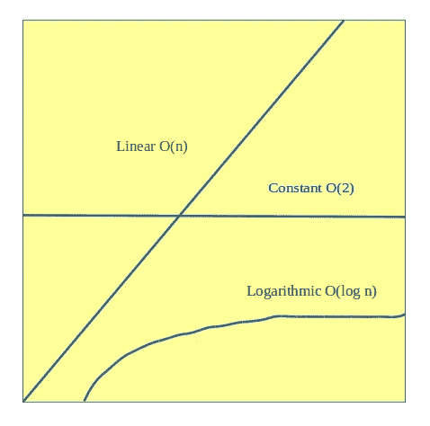

# 线性搜索 Vs 二分搜索法

> 原文：<https://medium.com/hackernoon/linear-search-vs-binary-search-ce7c56f8feb1>

所有程序员都熟悉线性搜索和二分搜索法。通常，我们使用它们来搜索任何元素及其位置。今天的讨论是关于这两种搜索算法的比较。

**1。连续:**

线性搜索遵循顺序，二分搜索法不遵循。线性搜索从起点到终点开始搜索。二进制搜索从中间点开始。

**2。已排序:**

对于二分搜索法，我们需要排序的元素。线性搜索不需要排序元素。

它搜索所有位置的所有元素，直到它得到想要的元素。

**3。对比:**

二分搜索法的比较次数少于线性搜索，因为二分搜索法从中间开始，总比较次数为 log *2* N

**4。时间复杂度:**

从下图，我们可以了解一个算法的时间复杂度。

线性搜索的时间复杂度为:

一个*。*最佳案例= O(1)

b *。*平均事例= n(n+1)/2n = O(n)

c *。*最坏情况= O(n)

线性搜索的时间复杂度为:

一个*。*最佳情况= O(1)

b *。*平均事例= logn(logn+1)/2logn = O(logn)

c *。*最坏情况= O(logn)

所以我们可以假设二分搜索法的时间复杂度小于线性搜索。

**5。空间复杂度:**

线性搜索的空间复杂度为 O(1)，二分搜索法为 O(1)。

所以我们可以假设，当我们需要更好的复杂度时，我们应该使用二分搜索法算法。我们不能在未排序的列表中搜索元素时应用二分搜索法。编码快乐！