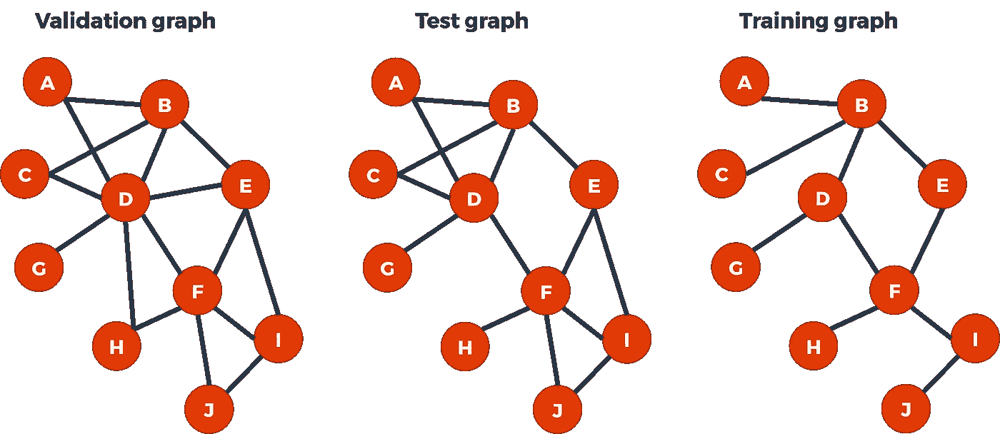
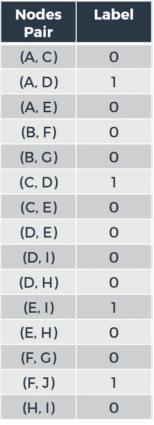
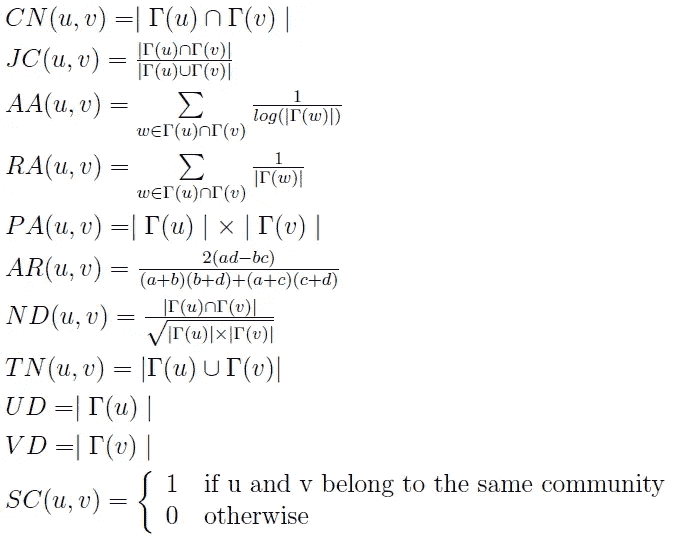
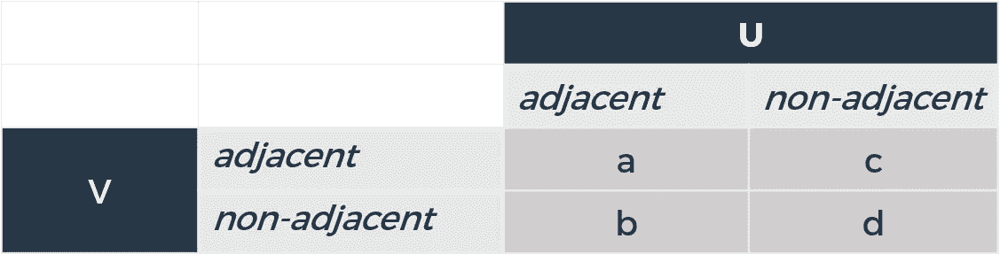
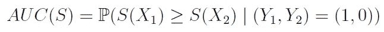
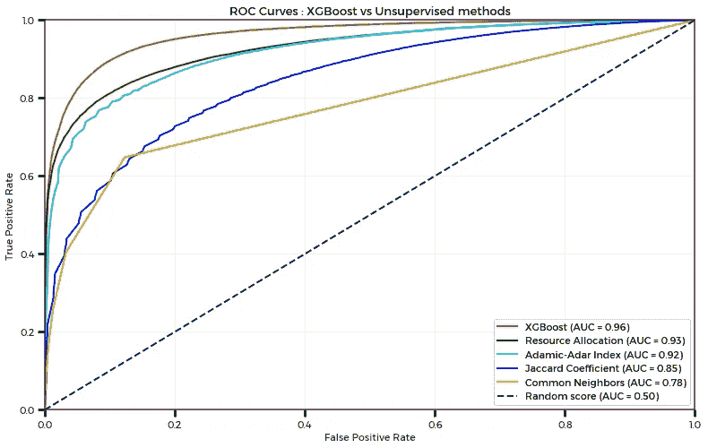
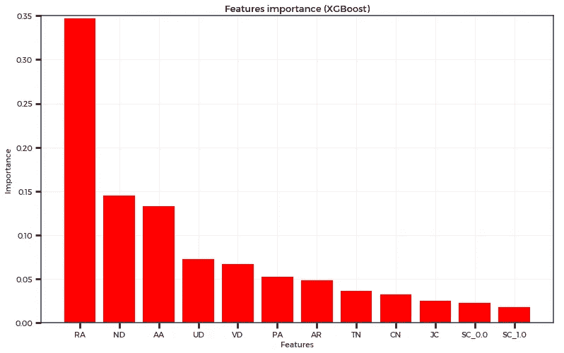

# 大规模网络中的链路预测

> 原文：<https://medium.com/hackernoon/link-prediction-in-large-scale-networks-f836fcb05c88>

## 从观测网络推断缺失链路的监督和非监督方法的比较。

*由* [*纪尧姆勒弗洛*](https://www.linkedin.com/in/guillaume-le-floch-b1b632138/) *(数据科学家在*[***Cdiscount***](http://cdiscount.com)*)*

Photo by [Clint Adair](https://unsplash.com/photos/BW0vK-FA3eg?utm_source=unsplash&utm_medium=referral&utm_content=creditCopyText) on [Unsplash](https://unsplash.com/search/photos/network?utm_source=unsplash&utm_medium=referral&utm_content=creditCopyText)

# 当你已经有很多链接的时候，预测新的链接有什么意义呢？

如果您已经决定阅读这篇文章，那么您现在要么对数据科学非常感兴趣，要么非常无聊。无论这是第一个还是第二个选择，我们很高兴有你在船上，并希望你将享受与我们一起度过链接预测问题。

更严肃地说，本文的目标是在一个图中找到准确预测未来连接的最佳选择，这个图也可以称为网络。不是一个小而无害的网络。不，我们说的是大规模网络。那些由数十亿个节点和边组成的大而可怕的问题，脸书、谷歌和 T21 在过去几年里每天都要处理。

> 当你已经有很多链接的时候，预测新的链接有什么意义呢？

我们已经从一英里外看到了这个问题，我们已经覆盖了你，不要担心。想要比我们已经拥有的更多，这是人类的天性(对数据科学家来说更是如此)。我们不满足于现在，我们也想知道未来。因此，我们需要找到一种尽可能准确地进行预测的方法。

[https://media.giphy.com/media/4cpqFamWB2dq0/giphy.gif](https://media.giphy.com/media/4cpqFamWB2dq0/giphy.gif)

此外，随着时间的推移，网络是一种动态结构。例如，脸书、推特、领英等社交网络。随着新连接的出现而永久改变，而其他一些连接则从图中删除。

对于这个特殊的例子，最大的挑战之一是向用户提供准确的推荐。他们可能在现实生活中认识某个人，但在他们最喜欢的社交网络上并不与那个人联系。因此，这种情况下的目标是预测(并推荐)这种关联(图中的链接)，以便修复可以被视为错误的内容。

链接预测可以帮助重建现实生活，但它实际上可以做的不止这些。我们观察到的并不总是理想的。一个例子是恐怖袭击:鉴于恐怖分子之间的关系，你可以建立一个网络，代表谁曾与谁合作过。链接预测可以帮助预测未来的关联，使政府能够监控嫌疑人，防止他们一起实施恐怖袭击。生物学是链接预测可以成为关键资产的另一个领域，因为人脑不足以预测分子之间的所有关联，让人工智能来做这项工作可以是一个巨大的推动。

简而言之，链接预测可以在许多不同的领域中用于各种目的。在本文中，我们将主要关注协作网络案例。我们将使用 [DBLP 数据集](https://snap.stanford.edu/data/com-DBLP.html)(参见[1]了解更多细节)。这是一个合作作者网络，如果两个作者至少一起发表一篇论文，他们就会联系在一起，因此我们将尝试在这里预测相关的未来合作(我们希望避免尴尬的情况)。

[https://media.giphy.com/media/26gJzrPTPiMNHrJLO/giphy.gif](https://media.giphy.com/media/26gJzrPTPiMNHrJLO/giphy.gif)

# 学习环境:无人监督与有人监督

在这一节中，我们将讨论在图表中进行预测的可能性。由于这是一个特殊的结构，我们需要在开始预测之前澄清几点。在练习之前，让我们从一些理论和符号开始。

## 稍微提醒一下图论

为了确保我们谈论的是相同的事情，让我们使用相同的图表词汇。即使你已经知道这一点，稍微提醒一下也没什么坏处:

*   从数学的角度来看，一个图可以定义为 *G = (V，E)* ，其中 *V* 是节点(或顶点)的集合， *E* 是边的集合。
*   如果这种关系是双向的，那么这个图就是无向图。脸书就是一个很好的例子:当某人是你的朋友时，你自然也是他的朋友。相反，如果链接从一个节点到另一个节点，则图是有向的，但它不是互惠的。Twitter 很好地说明了这一点，因为你可以追随某人，但这个人不一定会追随你。
*   我们可以将图的邻接矩阵(维数为 *|V|* × *|V|* )定义为
    *A =[*A _ ij*]*with(*I，* *j)* ∈ *V* 。对于无向和未加权的图形:

Sadly, Medium does not support MathJax (the engine generally used to parse LaTeX inline equations)…

*   序列是一系列连续的边: *{i_1，i_2}，{i* _2 *，i_3}，…，{i_K-1，i_K}。*
*   节点 *i* 和 *j* 之间的路径是边 *{i_1，i_2}、{i* _2 *，i_3}、…、{i_K-1，i_K}* 的序列，例如 *i_1 = i* 和 *i_K= j* ，序列中的每个节点都是不同的。
*   由于我们将大量使用**邻域**的概念，让我们将𝛤( *u* 表示为与节点 *u* 直接链接的节点集合(它们是它的“邻居”)。
*   两个节点之间的距离是从一个节点到另一个节点的最小边数(最短路径)。

将用于我们实验的 [DBLP 数据集](https://snap.stanford.edu/data/com-DBLP.html)具有以下属性:

*   **317080****节点**(研究人员)。
*   **1049866****边**(研究人员之间的合作权)。

是的，你是对的。这就是我们所说的大规模网络，这是执行学习任务的理想方式，无论是有人监督还是无人监督。这将为我们从实验中获得的结果提供稳定性和信心。

现在，让我们在接下来的部分探索学习过程。

## 训练集、测试集和验证集的创建

我们要进入的部分很棘手，所以系好安全带，我们现在不想失去你。在正常情况下，将数据集分成训练/测试/验证集并不是一个难以理解的概念。说到图形，就有点不一样了。如何拆分一个图来完成一个学习任务？首先，准确地记住我们的目的很重要:**我们想要预测节点之间的链接(边)**。

第一个资本信息如下:预测算法将把节点对作为输入，并评估节点是否呈现将来要链接的属性。在本文中，我们将只研究距离为 2 的节点。现在需要澄清的是输出:我们如何从图表中创建基本事实标签？这个想法是拿一个图，隐藏它的一些边，并监控算法产生的结果。对于隐藏链接，标签为 1，对于不存在的链接，标签为 0。还不够清楚吗？没问题，让我们用一个简单的例子来说明这个概念:

从左到右我们有:

*   用 *V = {A，B，C，D，E，F，G，H，I，J}* 和 *E_valid = {(A，B)表示为 *G_valid = (V，E_valid)* 的“验证图”；(A，D)；(B，C)；(B，D)；(B，E)；(C，D)；(D，E)；(D，F)；(D，H)；(D，G)；(英、法)；(E，I)；(F，H)；(F，I)；(F，J)；(I，J)}。*
*   我们隐藏了两条边的“测试图”: *G_test = (V，E _ test)*with*E _ test = E _ valid \ {(D，E)；(d，H)}从而 E_test* ⊂ *E_valid。*
*   我们又隐藏了四条边的“训练图”: *G_train = (V，E _ train)*with*E _ train = E _ test \ {(A，D)；(C，D)；(E，I)；(f，J)}从而 E_train* ⊂ *E_test。*

所以，正如你所看到的，它并不深，它只是一个包含一个子图的图，这个子图又包含一个子图…

如果您在这一点上仍然坚定地支持我们，那么您已经理解了我们的训练集(带有相应的标签)如下表所示。

毫无疑问，例如边 *(D，H)* 在这里具有标签 0，因为它不存在于测试图中，即使它最初存在于验证图中。

当我们评估所有 2 跳“缺失链路”节点对时，我们可以看到我们隐藏的边的标签为 1，而其余的边的标签为 0。让我们记住这只是一个最小的例子，尽管我们已经可以看到几个有趣的事实:

*   要评估的节点对数量增长很快，我们会让你想象一下在大规模网络中是什么样的(反正以后会看到)。
*   出现了**类不平衡**的问题:0 标签要多得多，所以我们将不得不在以后处理这个问题..

现在让我们来发现我们可以选择哪些无监督的方法来执行图中的链接预测，在这个过程中更深入地挖掘**邻域**和**局部相似性**的概念。

## 无监督学习:相似指数和邻域的概念

如果图中的节点没有属性，就像我们研究中的情况一样，唯一可用的信息来自图的拓扑结构。我们指的是节点的邻域:这个节点有多少个邻居？这些邻居本身有多少邻居？它们是如何组织的？当我们评估节点对时，我们还可以通过查看它们在图中的“距离”来查看节点 *u* 与节点 *v* 的相似程度，即它们本地邻域的相似程度。

所有这些导致了几个局部相似性指数，如共同邻居、Jaccard 相似性、Adamic-Adar 指数、资源分配等(更多信息可在[2]和[3]中找到)。这些指数将返回一个分数 *s* ∈ ℝ，用于执行预测。正如在[3]中所解释的，您还需要设置一个阈值，超过该阈值时，您将分配标签 1。我们意识到你可能会问哪种非监督的方法是执行预测的最佳方法。这是一个棘手的问题，因为在某些情况下，一种方法会优于其他方法，但在其他情况下，它会是另一种方法，等等。

如果我们实际上不必选择呢？如果我们让别的东西结合这些局部相似性指数来得到一个分数作为回报呢？你说对了，我们正直接走向监督学习的世界。

## 监督学习的特征工程

我们已经讨论了如何获得标签。现在我们需要特征来执行监督学习(二进制分类)。是的，你猜对了，这些功能将来自我们讨论的最新部分。基于 **Kolja Esders** 在【3】中的工作，我们将使用无监督分数作为我们预测模型的特征。我们还将使用**社区**的概念(更多细节可以在【4】中找到)。

以下特征将被包括在我们的学习/预测任务中:*【公共邻居(CN)】*， *Jaccard 系数(JC)* ， *Adamic-Adar 指数(AA)* ，*资源分配(RA)* ，*优先附加(PA)* ，*调整后的 Rand* (AR)和*邻居距离* (ND)，这些都是我们将添加到其中的局部指数它们被定义为:

关于*调整后的-Rand* ，这里有一个表格给出了 *a* 、 *b* 、 *c* 和 *d* 的含义:

在进入预测之前，我们只需要讨论一下评估指标，这将有助于我们确定有监督的学习是否比无监督的学习更好(剧透:从 Kolja Esders 和我们过去的经验来看，似乎是这样的)，这将在下一部分发生。

## 评估指标

在这项研究中选择的评价指标是一个众所周知的:AUC。因为它是一个二元分类问题，所以它是理想的，并且还将允许我们绘制该方法的 ROC 曲线，以说明算法结果之间的比较。这也将使我们不必为无监督方法设置阈值。

考虑两个独立且同分布的观测值(*X1*)； *Y1* )和*X2*； *Y2* )，评分方法 **S** 的 AUC 可以用以下方式书写:

换句话说，一个完美的算法(将得到 AUC 为 1)将给予标签为 1 的每个节点对比标签为 0 的节点对更高的分数。这只是分数顺序的问题，用哪个分数。

在下一节中，我们将在竞技场中面对面地展示几种算法，并比较它们的性能:

*   **资源分配**(无监督方法)
*   **Adamic-Adar** (无监督方法)
*   **雅克卡系数**(无监督方法)
*   **共同邻居**(无监督法)
*   **基于树的 XGBoost** (监督方法，非监督得分与其他特征的结合)

[https://media.giphy.com/media/e37RbTLYjfc1q/giphy.gif](https://media.giphy.com/media/e37RbTLYjfc1q/giphy.gif)

# 在 DBLP 数据集上的实验

在绘制 ROC 曲线和发布结果之前，我们将讨论数据处理。正如我们之前指出的，在处理大型网络时，会出现类别不平衡问题。因此，在找到我们的训练和测试图中所有的 2 跳缺失链接后，我们决定随机丢弃标签为零的样本，以便获得标签的 50/50 平衡。这就产生了这些数据集:

*   训练:277，742 个样本(节点对)。
*   测试:150，348 个样本(节点对)。

对于训练和测试来说，这些都是巨大的数据集，应该有助于我们避免过度拟合。当涉及到结果的相关性时，这也会给我们信心。

谈到他们，你耐心地等待他们，所以他们在这里:

他刚刚又去做了一次，是吗？强大的梯度提升算法又一次胜过了他所有的对手。我们承认这不是一场完全公平的比赛。这就是我们所说的“简单”图，因为我们使用 **XGBoost** 达到了 AUC 分数 **0.96** (非常接近完美)，但是像**资源分配**和 **Adamic-Adar 指数**这样的方法也表现得非常好，它们的 AUC 分数分别为 **0.93** 和 **0.92** 。正如我们所见，**共同邻居**在这种情况下更加有限，AUC 为 **0.78** ，所以如果你想结交新朋友，只计算共同朋友可能不是最佳策略！

基于树的提升算法也提供了“特征重要性”，这里一个有趣的事实是，相似性指标的特征重要性与其预测质量之间似乎存在相关性:

根据该图，资源分配是“最重要的特征”，也是我们之前看到的最好的无监督方法。它与 Adamic-Adar 指数非常相似，唯一的区别是分母的对数。在这方面，这可能会使 **RA** 比 **AA** 更具歧视性，因为它对那些自己有很多邻居的共同邻居更加不利。

# 讨论和未来工作

从我们看到的情况来看，使用结合了非监督方法的监督方法似乎更有效。这进一步证实了 Kolja Esders 的结论以及我们自己过去使用网络的经验。

这是一个“简单的”[网络](https://hackernoon.com/tagged/network),因为我们得到了非常高的 AUC 分数，但取决于你正在处理的图表的复杂性和噪声，这可能或多或少地难以准确预测未来的链接。在复杂的网络中，监督分数和非监督分数之间的差距也会扩大。

我们决定使用 XGBoost 算法，但当然也可以使用任何其他的[机器学习](https://hackernoon.com/tagged/machine-learning)算法，所以你可以尝试用你最喜欢的二进制分类器来重现这个实验！数据处理已经使用网络信息技术库实现，所以你会需要它(在这里找到更多)。

因为我们从来不会满足于我们所拥有的，所以未来的目标将是做出更好的预测。在模型中构建和添加新特征可能有助于提高性能，因为它会添加信息。在输入模型之前缩放数据也可以稍微提高性能。

这就是结局！我们希望您喜欢与我们一起经历大规模网络中的链路预测问题。由于除了本文之外还有代码和数据，所以请随意重现这种体验，如果可以的话，甚至可以改进它！感谢您的关注。

# 进一步阅读

*   J.杨和 j .莱斯科维奇(2012)。*根据地面实况定义和评估网络社区(ICDM*【http://snap . Stanford . edu/data/com-dblp . html】)。
*   大卫·李奔-诺埃尔和乔恩·克莱因伯格(2007)。*社交网络的链接预测问题。*
*   kol ja es ders(2015 年)。*大规模复杂网络中的链接预测*。卡尔斯鲁厄理工学院学士论文。
*   文森特·d·布隆德尔、让-卢普·纪尧姆、雷诺·兰比奥特和艾蒂安·列斐伏尔(2008 年)。*大型网络中社区的快速展开*