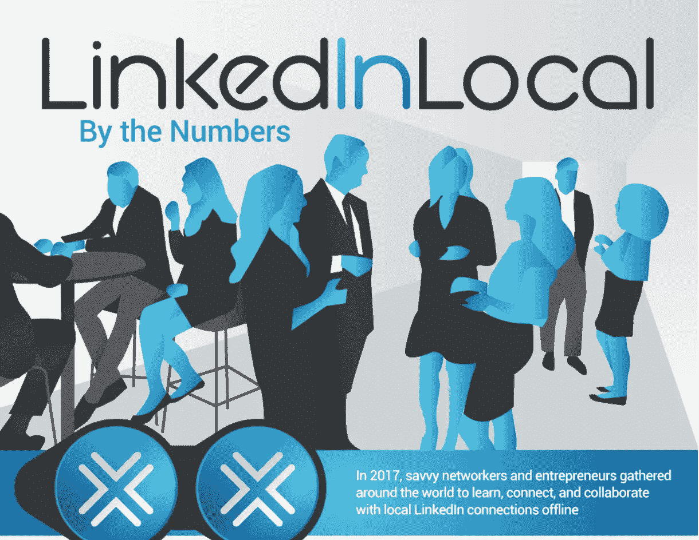
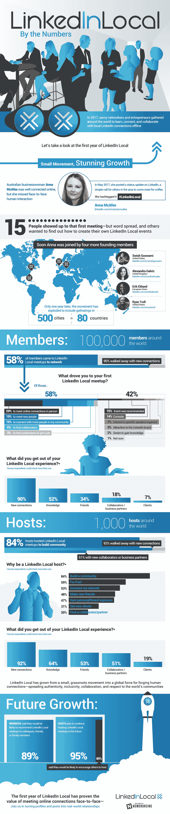

# LinkedInLocal:席卷全球的草根 IRL 运动

> 原文：<https://medium.com/hackernoon/linkedinlocal-the-grassroots-irl-movement-taking-the-world-by-storm-8ab3f747e1c9>

从一次简单的面对面聊天中可以发生非凡的事情。澳大利亚女商人安娜·麦卡菲(Anna McAfee)非常理解这一点，她在她的 LinkedIn 上发布了一条状态，呼吁该地区的其他人与她见面喝咖啡。2017 年 5 月的那个下午，只有 15 个人出现——但他们引发了一场全球运动。

她的状态贴附有#LinkedInLocal 标签，没多久其他人就明白了这个想法；准确地说，还有 10 万人被感染。LinkedIn Local 的理念覆盖了 80 个国家和 500 个城市，它将各行各业有思想的商人聚集在一起，以人的身份而不是简历的形式会面。在这些聚会中，参与者把他们的个人资料放在次要位置，而是通过他们对工作和个性的热情来为自己说话。在参与者中，90%的人离开时不仅有了新的联系，也有了新的朋友。

LinkedIn Local 鼓励通过协作和包容来建立更个性化的联系方式，这可能正是你想要的地方。这张信息图详细描述了 LinkedIn 本地运动令人难以置信的[增长，它在短短一年内走了多远，以及为什么它给任何行业的商人带来了全新的视角。](https://localx.org/success/linkedinlocal/)

