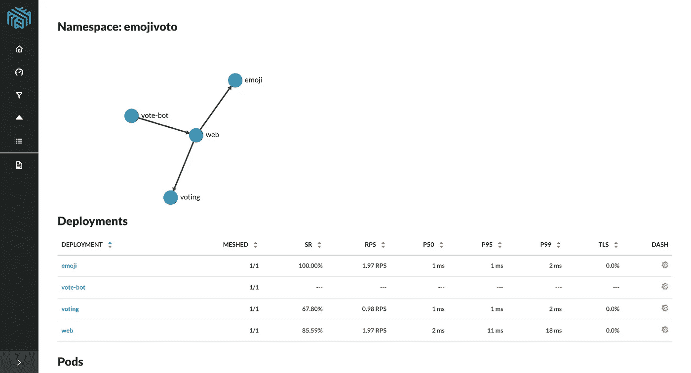
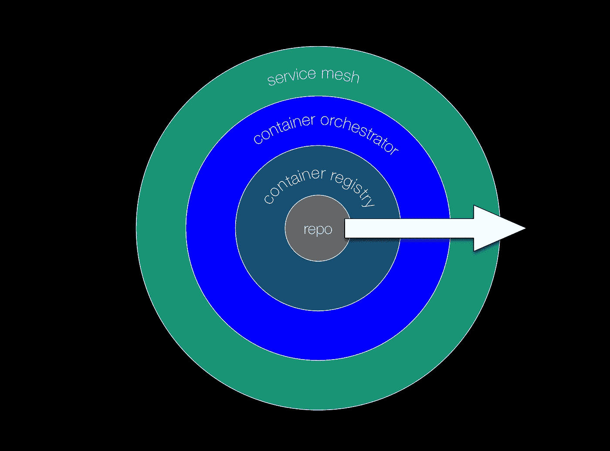
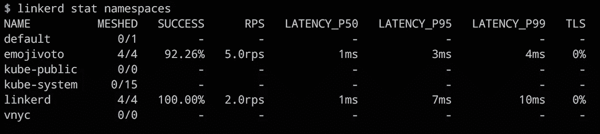
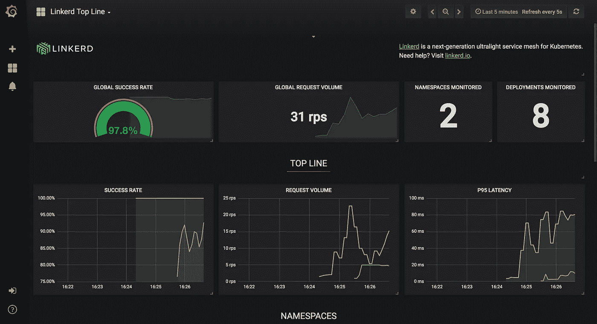

# Linkerd 2.0:为你我提供服务运营

> 原文：<https://medium.com/hackernoon/linkerd-2-0-service-ops-for-you-and-me-281cc5bd6424>

Screen shot of the Linkerd 2.0 dashboard showing details of a microservices app.

***TL；DR:****[*Linkerd 2*](https://linkerd.io/2/overview/)*. 0 是一个基于 Unix* [*哲学*](https://hackernoon.com/tagged/philosophy) *构建的可组合服务 sidecar。也就是说，它的目标不是做所有的事情和更多的事情，而是(或者:因为这个？)它真的很擅长做它正在做的事情:对您的容器化微服务进行即时观察和故障排除。**

*在微服务环境中，服务所有者编写代码，并且越来越多地负责保持他们编写的服务正常运行。我们非常恰当地称之为*服务运营*。对我来说，服务运营的想法实际上是我所订阅和提倡的[appos](http://news.appops.info)名称的一个子集。从实用的角度来看，这看起来怎么样？*

**

*The cloud native appops maturity model.*

*考虑到云原生 appops 成熟度模型，您首先要确保在 repo(现在通常是 Git)中拥有所有的代码和配置。然后你想把你所有的集装箱图像保存在一个安全的、私有的集装箱注册处，比如说[码头](https://quay.io)。您要确保您有一个合适的 CI/CD 管道，以可重现的方式生成所述容器映像。接下来，您可能会使用 Kubernetes，这是编排容器的去因子行业标准。现在，当您开始体验运行容器化微服务时的痛点时，问自己这样的问题:*

*   *如何识别哪个微服务表现不好？HTTP 和 gRPC 服务都有？*
*   *呼叫链中的哪项服务最慢？我在线路上看到了什么错误？*
*   *我如何对跨多个微服务的特定请求路径进行故障排除或优化？*

## ***认识 Linkerd 2.0***

*Linkerd 2.0 在这一发展阶段为您提供了帮助。它是按照 Unix 理念构建的，也就是说，它关注核心服务网格职责:系统范围的遥测、[安全性](https://hackernoon.com/tagged/security)和可靠性；这是盒子里的东西:*

*   *一个独立的所谓*服务边车*设计，增加服务。*
*   *零配置安装过程，无需更改应用程序代码。*
*   *开箱即用、预配置的 Grafana 仪表盘以及通过 Prometheus 实现的集成监控。*
*   *自动 TLS 管理，包括证书生成和分发。*
*   *可用的 Web 用户界面和强大的命令行界面(CLI):*

**

*The Linkerd 2.0 CLI in action, showing service-level communication stats across all namespaces.*

*对于其余的，如策略管理、可观察性等。，Linkerd 2.0 集成了 super smooth 与其他工具，如 Prometheus 和 Grafana。事实上，对于仪表板，它提供了开箱即用的嵌入式功能:*

**

*A pre-built Grafana dashboard you get for free from Linkerd 2.0.*

## *一个演示说超过 1000 字…*

*在接下来的内容中，我向你展示了在不到 5 分钟的时间内完成[设置](https://linkerd.io/2/getting-started/)后，与 Linkerd 2.0 的一点互动。我们将[使用`linkerd`命令行工具，使用 Linkerd 2.0 调试一个由几个微服务](https://linkerd.io/2/debugging-an-app/)组成的应用程序:*

* [## Linkerd 2.0 演示

### https://linkerd.io/2/debugging-an-app/漫游

asciinema.org](https://asciinema.org/a/201439) 

## 后续步骤…

好吧，从这里去哪里？嗯，我确实有一些建议:

*   今天，你可能想加入关于 Linkerd 2.0 的讨论。请在论坛或加入 [Linkerd Slack 社区](https://linkerd.slack.com/messages)(在#linkerd2 频道上)留下反馈、建议功能或寻求帮助。
*   通过我整理的 Katacoda 场景试用 [Linkerd 2.0，它可以通过您最喜欢的浏览器访问，您将在不到 10 分钟的时间内学会如何安装和使用 Linkerd 2.0。](https://www.katacoda.com/mhausenblas/scenarios/linkerd2)
*   在我 10 月初的 [Velocity NYC 讲座](https://troubleshooting.kubernetes.sh/)中，我将在其中一个实际操作部分使用 Linkerd 2.0。如果你在附近，打个招呼；)* 

*最后，我要说的是，Linkerd 2.0 是一个非常有用的工具，占用空间很小。作为服务运营，它可以帮助您更快、更有效地完成工作。*

*我对这里的可能性感到兴奋，并期待看到这个 [CNCF 项目](https://www.cncf.io/)背后的社区将在这些天你已经从中获得的基础上提供什么。此外，我相信对分布式跟踪、[第 7 层策略执行](https://discourse.linkerd.io/t/possible-to-enforce-l7-policies/773)或流量整形(想想:A/B 测试等)的支持。)在即将到来的事情列表中名列前茅，并且迫不及待地希望看到 Linkerd 2.0 继续可持续地健康发展。*

*干得好，伙计们，继续努力！*