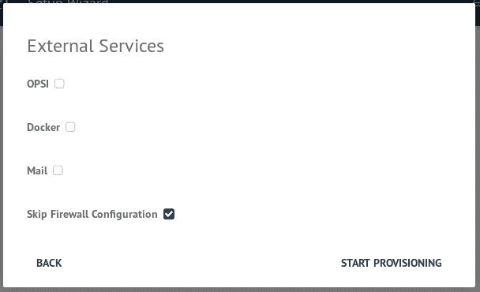
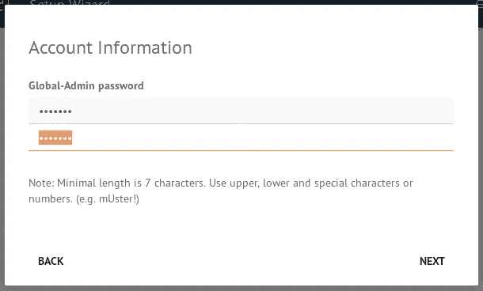
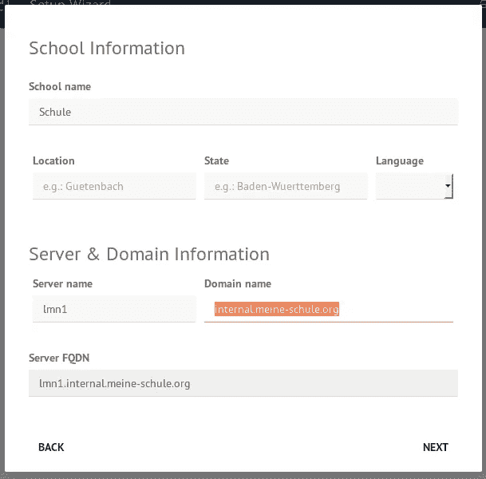
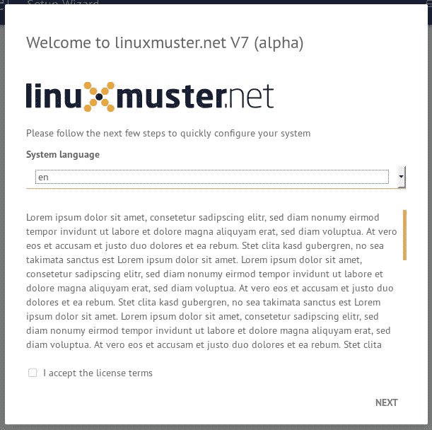
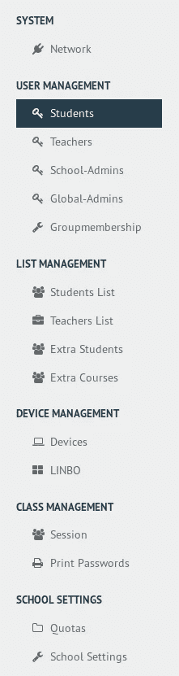
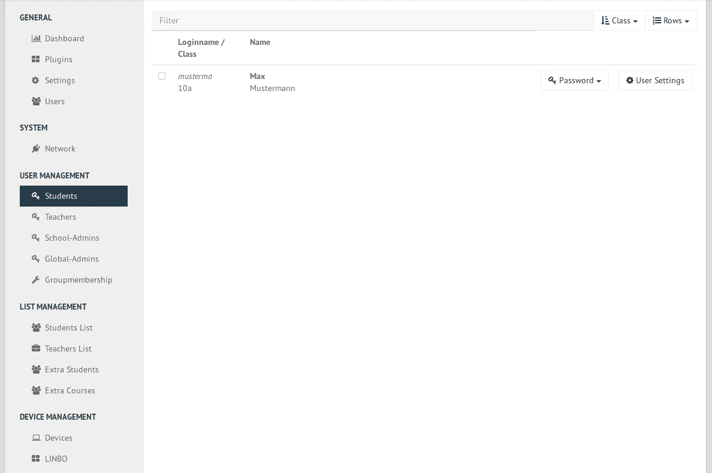
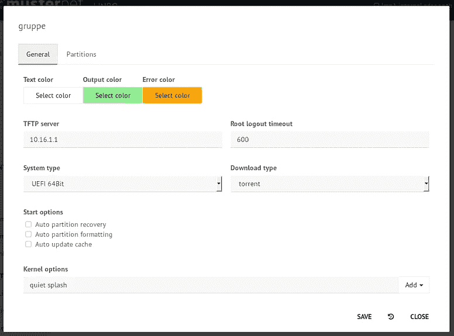
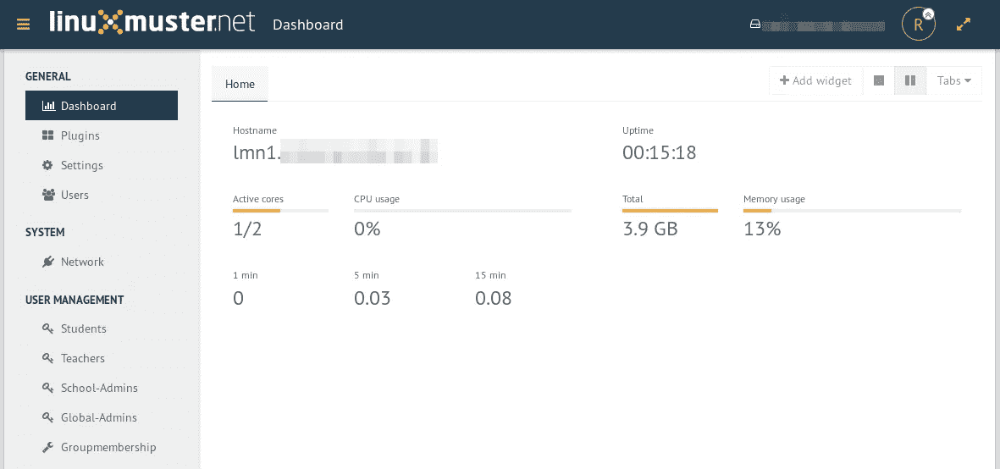

# linuxmuster.net V7——新网络界面一瞥

> 原文：<https://medium.com/hackernoon/linuxmuster-net-v7-first-glance-at-the-new-web-interface-239f56dad83c>

一段时间以来，开发人员一直在开发 linuxmuster.net 的新版本 7。这个版本将带来一些创新，可能是项目历史上最重要的版本之一。Ubuntu 将更新到 LTS (18.04)，将引入域控制器 Samba4，OPNSense 将接管版本 7 中的防火墙任务(以前为 IPFire)。此外，将会有一个新的基于 Ajenti 的网络界面。为了测试，并且只有部分功能，这个 web 界面在当前版本 6.2 中已经可用。今天我想先看看 linuxmuster.net V7 的新网页界面。

# 安装 linuxmuster.net V7 测试系统

安装的所有必要步骤都记录在项目的 [Github Wiki 中(尽管是德语)。在那里，您可以找到防火墙、服务器和新的 Dockerhost 设备，即现成的 Virtualbox 映像。为了深入了解新的 web 界面，我们需要防火墙和服务器的图像。下载后，我们可以将这两个图像导入到 Virtualbox 中。服务器已将网络预设为 10.0.0.0/16。它的 IP 是 10.0.0.1，而防火墙的 IP 是 10.0.0.254。因此，我们需要另一台计算机来查看网络界面。我们可以简单地用我们选择的操作系统创建另一个虚拟机。我们只需要一个位于子网 10 . 0 . 0 . 0/16 的浏览器。我只是用了另一个 Ubuntu VM。](https://github.com/linuxmuster/linuxmuster-base7/wiki)

# 新的学校控制台又名 webUI7

## 设置

在我们完成测试系统的设置后，我们可以通过 [http://10.0.0.1:8000 访问 linuxmuster.net 的新网络界面。](http://10.0.0.1:8000.)一开始我们只能以 root 用户身份登录(默认密码是 pattern！)，因为还不存在其他用户。登录后，将出现服务器初始设置助手。在这里，我们为学校服务器定义最重要的数据(例如，域名、管理员密码、邮件服务器设置等。).

安装完成后，服务器必须重新启动一次。此后，linuxmuster.net 网络界面只能通过 HTTPS 访问(https://10.0.0.1:8000)。

## 管理

新的 web 界面大致分为以下几个部分:

*   常规设置
*   用户管理
*   列表管理
*   设备管理
*   班级管理
*   学校的设置

根据用户拥有的权限，webUI 中只有部分区域可用。许多模块在当前版本 6.2 的初步版本中已经可用。新的是班级管理模块，教师可以使用它来管理诸如互联网接入、网页过滤、文件分发和课程收集等功能。

这里还有几张截图:

# 结论

LMNv7 仍处于早期开发阶段。过去几周发生了很多事情，免费学校服务器解决方案的新版本越来越稳定。对于新的网络界面来说尤其如此。我对新版本很好奇，因为它会比现在的版本允许更多(Samba4，更好的防火墙，…)。

*最初发表于*[*【openschoolsolutions.org】*](https://openschoolsolutions.org/linuxmuster-net-v7-first-glance-at-the-new-web-interface/)*。* ***注册*** *订阅我们的时事通讯，获取免费的 PDF 格式，并为您的课堂提供出色的开源应用程序，或者在 Twitter 上关注*[*@ OpenSchoolZ*](https://twitter.com/OpenSchoolZ)*。*