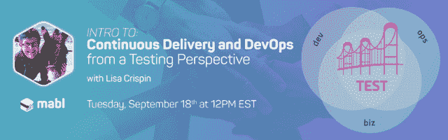

# Lisa Crispin 与 mabl 合作推动测试自动化创新

> 原文：<https://medium.com/hackernoon/lisa-crispin-teams-up-with-mabl-to-drive-innovation-in-test-automation-28d66491382d>

自从我们开始 mabl 以来，已经有 18 个月了，我们努力帮助全世界的软件团队更容易地进行测试自动化。我们已经走了这么远，我们试图[尽可能接近我们的用户](https://www.mabl.com/blog/delivering-excellent-experiences-the-mabl-way)，让他们参与我们的[mabl slack 之友](https://mabl.slack.com/)频道，进行用户调查，并在世界各地的会议上与他们见面。所有这些都有助于将 mabl 产品塑造成今天的样子，有几十个客户将它作为他们主要的自动化测试服务。

即使做了所有这些努力，我们相信我们可以为软件团队和测试社区做更多的事情，而不仅仅是仔细倾听和构建一个产品。我们决定是时候:

**1)** 更积极地与团队合作
**2)** 扩大社区反馈的范围，将其反馈回 mabl 产品
**3)** 围绕持续交付，在测试团队内部建立对趋势的进一步认识。

这就是为什么我们非常激动地欢迎 Lisa Crispin 加入 mabl 团队。你们很多人都很好奇 Lisa 的头衔是什么，她会做什么，所以我想我应该分享一些更多的细节。

# 丽莎在 mabl 的角色是什么？

Lisa 关注的核心将是她一生都在做的事情——通过在会议上公开演讲的机会与测试社区分享她的经验和知识，如[敏捷测试日](https://agiletestingdays.com/)、 [CAST](https://www.associationforsoftwaretesting.org/conference/cast-2018/) 会议，以及世界各地的其他测试活动。尽管在 mabl 工作，她不会专注于 mabl，而是继续关注敏捷、[连续交付](https://www.mabl.com/blog/what-is-cicd)，以及采用这些趋势的团队如何改进他们的测试过程。我们还将利用 Lisa 在其他小型活动中的公开演讲经验，包括 Meetups 和 [DevOpsDays](https://www.devopsdays.org/) 来扩大她对无法参加大型会议的观众的影响。

Lisa 作为测试社区的实践者已经建立了声誉，尤其是当它与敏捷开发实践相关时，这是她将继续关注的一个焦点。我们向世界各地的 mabl 客户提供 Lisa 的专业知识，不仅从她如何使测试更有效的经验中学习，而且 Lisa 也从他们如何使有效的软件交付的经验中学习。这将是一个双向的学习体验，因此客户和 Lisa 都将从彼此身上汲取价值，努力为全球用户改进测试过程和质量。

# 社区参与

正如我们从已经构建的关键功能中了解到的那样，我们的路线图大部分是由用户决定的。[数据驱动测试](https://help.mabl.com/docs/data-driven-testing)，文件上传，以及[断言测试中不存在的](https://help.mabl.com/docs/working-with-the-not-present-assertion)项都是我们用户的建议。然而，这些只是我们可以构建到 mabl 中的功能的冰山一角。

Lisa 不仅将与 mabl 用户接触，还将与社区广泛接触，以征求反馈并帮助优先考虑使自动化测试更容易的特性。到目前为止，我们已经利用我们团队的额外时间完成了这项工作，但 Lisa 将与我们的用户和社区进行更密切的接触，以真正了解他们目前面临的使用案例和挑战。她将探索我们可以构建到 mabl 中的更广泛的主题，并深入研究机器学习可以在哪些方面帮助测试人员完成今天的一些更多手动任务。Lisa 的目标是加速测试自动化生命周期中的创新。

作为开始，她下个月将主持她的第一次 mabl 网络研讨会。Lisa 将帮助您学习 DevOps 和持续交付的语言，以便您可以更好地与您的团队沟通。您将看到一些例子来更好地理解持续交付和持续部署管道。Lisa 将介绍一些工具和技术，可以帮助您的团队拥抱 DevOps 文化，并学习测试人员如何帮助在“开发”、“运营”和业务涉众之间建立桥梁。您将了解到在“DevOps”中有一个“测试”——我们称之为 **DevTestOps。**

# 走向

正如你可能知道的，我们已经花了很多心思在 Lisa 如何帮助测试社区，同时也推动测试自动化的创新上。如果您对 Lisa 可能对您有帮助的其他方面有任何建议，我们很乐意听到您的反馈！Lisa 现在正式加入，她的头衔是**测试倡导者，**，但我们只是称她为 mabl 团队的一员。你可以在 [Slack](https://mabl.slack.com/) 或 [Twitter](https://twitter.com/lisacrispin) 上找到她。

*原载于*[*www.mabl.com*](https://www.mabl.com/blog/lisa-crispin-teams-up-with-mabl-to-drive-innovation-in-test-automation)*。*