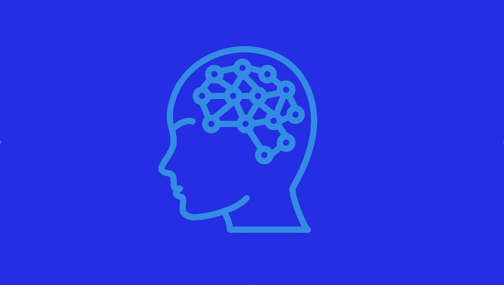

# 学习自然语言处理的免费资源列表

> 原文：<https://medium.com/hackernoon/list-of-free-resources-to-learn-natural-language-processing-5bc4b76db552>

自然语言处理(NLP)是计算机系统理解人类语言的能力。自然语言处理是人工智能的一个子集。网上有多种资源可以帮助你发展自然语言处理的专业知识。

在这篇博文中，我们为初学者和中级水平的学习者列出了一些资源。

# 面向初学者的自然语言资源

初学者可以遵循两种方法，即传统的机器学习和深度学习来开始自然语言处理。这两种方法截然不同。出于好奇，[这里是](https://towardsdatascience.com/why-deep-learning-is-needed-over-traditional-machine-learning-1b6a99177063)这两者之间的区别。

# 传统机器学习

传统的机器学习算法很复杂，往往不容易理解。这里有一些资源可以帮助您开始使用机器学习来学习 NLP:

*   Jurafsky 和 Martin 的《语音和语言处理》是传统自然语言处理领域广受好评的圣经。你可以在这里访问[。](https://web.stanford.edu/~jurafsky/slp3/)
*   对于一个更实际的方法，你可以试试[自然语言工具包。](http://www.nltk.org/book/)

# 深度学习

深度学习是机器学习的一个子领域，并且由于人工神经网络的引入，它远远优于传统的机器学习。新手可以从以下资源入手:

*   CS 224n:这是入门使用深度学习进行自然语言处理的最佳课程。该课程由斯坦福大学主办，可在访问[。](http://web.stanford.edu/class/cs224n/)
*   Yoav Golberg 的免费和付费书籍是自然语言处理深度学习的绝佳入门资源。免费版可以在这里[获得](https://u.cs.biu.ac.il/~yogo/nnlp.pdf)，完整版可以在这里[获得](https://www.amazon.com/Language-Processing-Synthesis-Lectures-Technologies/dp/1627052984)。
*   在 Jacob Einsenstein 关于 GATECH 的 NLP 类的笔记中可以找到对所有算法的全面介绍，该类涉及几乎所有的 NLP 方法。你可以在 GitHub [上点击](https://github.com/jacobeisenstein/gt-nlp-class/blob/master/notes/eisenstein-nlp-notes.pdf)获取笔记。

# 从业者的自然语言资源

如果您是一名数据科学家，您将需要三种类型的资源:

1.  快速入门指南/了解最新热点
2.  方法的特定问题调查
3.  定期关注的博客

# 快速入门指南/了解最新热点

*   可以从 Otter 等人的自然语言处理深度学习调查开始。你可以在这里访问它[。](https://arxiv.org/abs/1807.10854)
*   Young 等人的一篇调查论文试图总结基于深度学习的自然语言处理中的一切，并建议从业者从自然语言处理开始。你可以在这里查阅论文[。](https://arxiv.org/abs/1708.02709)
*   可以参考[这篇](https://arxiv.org/abs/1808.03314)文章了解 LSTMs 和 RNNs 的基础知识，它们在自然语言处理中用的很多。另一个被更多引用(和高度评价)的 LSTMs 调查是这里的。这是一篇有趣的论文，用来理解 RNNs 的隐藏态是如何工作的。这是一本令人愉快的读物，可以在[这里](https://github.com/locuslab/TCN)阅读。我总是向没有读过的人推荐以下两篇博文:

1.  [http://colah.github.io/posts/2015-08-Understanding-LSTMs](http://colah.github.io/posts/2015-08-Understanding-LSTMs)
2.  [https://distill.pub/2016/augmented-rnns/](https://distill.pub/2016/augmented-rnns/)

*   卷积神经网络(Convnets)可以用来理解自然语言。您可以通过阅读本文[这里](https://arxiv.org/abs/1801.06287)来想象 Convnets 在 NLP 中是如何工作的。
*   白等人在[这篇](https://arxiv.org/abs/1803.01271)论文中重点介绍了 Convnets 和 RNNs 的相互比较..它所有的 pytorch(我已经停止或者减少，在很大程度上，阅读不是用 pytorch 写的深度学习代码
*   )代码是开源的[这里](https://github.com/locuslab/TCN)给你一种哥斯拉 v/s 金刚或者福特野马 vs 雪佛兰 Camaro 的感觉(如果你喜欢(ed)那种类型的东西)。谁会赢！。

# 方法的特定问题调查

从业者需要的另一类资源是这类问题的答案:“我必须训练一个算法来做 X，我可以应用的最酷(并且容易获得)的东西是什么？”。

这是你需要的:

## 文本分类

人们解决的第一个问题是什么？主要是文本分类。文本分类的形式可以是将文本分为不同的类别，或者检测文本中的情绪/情感。

我想强调一下这篇平行的 Dots [博客](https://blog.paralleldots.com/data-science/breakthrough-research-papers-and-models-for-sentiment-analysis/)中描述的不同的情感分析调查。虽然这项调查是针对情感分析技术的，但它可以扩展到大多数文本分类问题。

我们的(ParallelDots)调查技术含量稍低，旨在引导您使用酷资源来理解一个概念。我向您推荐的 Arxiv 调查论文技术性很强，需要您阅读其他重要论文才能深入理解某个主题。我们建议的方法是使用我们的链接来熟悉一个主题，并从中获得乐趣，但之后一定要阅读我们指向的完整指南。(奥克利博士的[课程](https://www.coursera.org/learn/learning-how-to-learn)谈到了分块，在深入之前，你首先尝试在这里和那里获得小块)。记住，玩得开心固然很好，但是除非你详细了解这些技巧，否则将很难在新的情况下应用这些概念。

另一项关于情感分析算法的调查(由联合大学和 UIUC 的人进行)是[在这里](https://arxiv.org/abs/1801.07883)。

迁移学习革命已经冲击了深度学习。就像在图像中，在 ImageNet 分类上训练的模型可以针对任何分类任务进行微调，在维基百科上为语言建模训练的 NLP 模型现在可以在相对较少的数据量上转移学习文本分类。这里有两篇来自 OpenAI 和 Ruder 以及 Howard 的论文讨论了这些技术。

1.  [https://arxiv.org/abs/1801.06146](https://arxiv.org/abs/1801.06146)
2.  [https://S3-us-west-2 . Amazon AWS . com/open ai-assets/research-covers/language-unsupervised/language _ understanding _ paper . pdf](https://s3-us-west-2.amazonaws.com/openai-assets/research-covers/language-unsupervised/language_understanding_paper.pdf)。

Fast.ai 有一个更友好的文档来应用这些方法[这里](http://nlp.fast.ai/classification/2018/05/15/introducting-ulmfit.html)。

如果你正在转移学习两个不同的任务(不是从维基百科语言建模任务转移)，这里[提到了使用 Convnets 的技巧](https://arxiv.org/abs/1801.06480)。

依我看，这种方法将会慢慢采用所有其他的分类方法(从视觉中发生的事情简单推断)。我们还发布了我们在[零镜头文本分类](https://arxiv.org/abs/1712.05972)上的工作，它在没有任何数据集训练的情况下获得了很好的准确性，并且正在研究它的下一代。我们已经构建了我们的自定义文本分类 API，通常称为自定义分类器，您可以在其中定义自己的类别。你可以在这里查看免费的。

## 序列标记

序列标注是一项用不同属性标注单词的任务。这些包括词性标注、命名实体识别、关键词标注等。

我们写了一篇有趣的关于任务方法的评论，比如这里的。

这类问题的一个极好的资源是今年 COLING 的研究论文，该论文给出了训练序列标记算法的最佳指南。你可以在这里访问它[。](https://arxiv.org/abs/1806.04470)

## 机器翻译

*   最近 NLP 最大的进步之一是发现了可以将文本从一种语言翻译成另一种语言的算法。谷歌的系统是一个疯狂的 16 层 LSTM(不需要退出，因为他们有大量的数据进行训练)，并提供最先进的翻译结果。

媒体专家夸大其词，声称“脸书不得不关闭发明了自己语言的人工智能”。这是其中的一些。

1.  [https://gadgets . ndtv . com/social-networking/news/Facebook-shuts-ai-system-after-bots-create-own-language-1731309](https://gadgets.ndtv.com/social-networking/news/facebook-shuts-ai-system-after-bots-create-own-language-1731309)
2.  [https://www . Forbes . com/sites/tonybradley/2017/07/31/Facebook-ai-creates-its-own-language-in-creek-preview-of-our-potential-future/# 1d1ca 041292 c](https://www.forbes.com/sites/tonybradley/2017/07/31/facebook-ai-creates-its-own-language-in-creepy-preview-of-our-potential-future/#1d1ca041292c)

*   有关机器翻译的详细教程，请参考菲利普·科恩的研究论文[这里](https://arxiv.org/abs/1709.07809)。使用深度学习进行机器翻译(我们称之为 NMT 或神经机器翻译)的具体回顾是这里的。

我最喜欢的几篇论文在这里

*   Google 的这篇[论文告诉你，当你拥有大量资金和数据时，如何端到端地解决一个问题。](https://arxiv.org/abs/1609.08144)
*   脸书的[卷积 NMT 系统](https://arxiv.org/abs/1705.03122)(只是因为它很酷的卷积方法)和它的代码在这里作为库[发布](https://github.com/facebookresearch/fairseq)。
*   [https://marian-nmt.github.io/](https://marian-nmt.github.io/)是一个在 C++中快速翻译的框架[http://www.aclweb.org/anthology/P18-4020](http://www.aclweb.org/anthology/P18-4020)
*   [http://opennmt.net/](http://opennmt.net/)让每个人都能训练自己的 NMT 系统。

## 问题回答

依我看，这将是下一个“机器翻译”。有许多不同类型的问答任务。从选项中选择，从段落或知识图中选择答案，并基于图像回答问题(也称为视觉问题回答)，并且有不同的数据集来了解最先进的方法。

*   [小队数据集](https://rajpurkar.github.io/SQuAD-explorer/)是一个问答数据集，测试算法阅读理解和回答问题的能力。微软今年早些时候发表了一篇论文，声称他们已经在任务[中达到了人类水平的精确度。论文可以在](https://blogs.microsoft.com/ai/microsoft-creates-ai-can-read-document-answer-questions-well-person/)[这里](https://www.ailab.microsoft.com/experiments/ef90706b-e822-4686-bbc4-94fd0bca5fc5)找到。另一个重要的算法(我觉得是最酷的)是 Allen AI 的 [BIDAF](https://allenai.github.io/bi-att-flow/) 及其改进。
*   另一组重要的算法是视觉问答，它回答关于图像的问题。来自 VQA 2017 年挑战赛的 Teney 等人的[论文](https://allenai.github.io/bi-att-flow/)是一个很好的资源。你也可以在 Github [这里](https://github.com/markdtw/vqa-winner-cvprw-2017)找到它的实现。
*   现实生活中对大型文档的抽取式问题回答(如 Google 如何在最初几个结果中突出显示对您的查询的回答)可以使用迁移学习(因此只有很少的注释)来完成，如 ETH 论文[此处](https://arxiv.org/abs/1804.07097)所示。一篇非常好的批评问答算法“理解”的论文是[这里](https://arxiv.org/abs/1808.04926)。如果你在这个领域工作，必须阅读。

## 释义、句子相似性或推论

比较句子的任务。自然语言处理有三个不同的任务:句子相似性，释义检测和自然语言推理(NLI)，每一个都比上一个需要更多的语义理解。 [MultiNLI](https://www.nyu.edu/projects/bowman/multinli/) 及其子集斯坦福 NLI 是 NLI 最著名的基准数据集，最近成为研究的焦点。还有用于释义检测的 MS 释义语料库和 Quora 语料库，以及用于 STS(语义文本相似度)的 SemEval 数据集。在这里可以找到这个领域的高级模型的好调查[。NLI 在临床领域的应用非常重要。(了解正确的医疗程序、药物的副作用和交叉效应等。).](https://arxiv.org/abs/1806.04330)[如果你想在某个特定领域应用这项技术，那么这篇来自应用 NLI 医学领域的教程](https://arxiv.org/abs/1808.06752)是一本很好的读物。

这是我在这个领域最喜欢的论文列表

*   交互空间上的自然语言推理——它强调了一种非常聪明的方法来放置 DenseNet(句子表示上的卷积神经网络)。事实上，这是一个实习项目的成果，让它更酷！你可以在这里看论文[。](https://arxiv.org/pdf/1709.04348.pdf)
*   Omar Levy 小组的这篇研究论文表明，即使简单的算法也能完成这项任务。这是因为算法还没有学会“推理”。
*   BiMPM 是一个预测释义的很酷的模型，可以在这里访问。
*   我们也有一个新的工作用于释义检测，该工作在句子表示之上应用关系网络，并且已经在今年的 AINL 会议上被接受。这里可以看[。](https://peerj.com/preprints/26847)

## 其他领域

这里有一些更详细的调查报告，可以帮助你了解在制作 NLP 系统时可能遇到的其他任务的研究情况。

*   **语言建模(LM)——**语言建模是学习一种语言的无监督表示的任务。这是通过预测给定前 N 个单词的句子的第(n+1)个单词来实现的。这些模型在现实世界中有两个重要的用途，自动完成和作为如上所述的文本分类的迁移学习的基础模型。这里的[是](https://arxiv.org/abs/1708.07252)的详细调查。如果你有兴趣学习如何在手机/基于搜索历史的搜索引擎中自动完成列表，这里的[是你应该读的一篇很酷的文章。](https://arxiv.org/abs/1804.09661)
*   **关系提取—** 关系提取是提取句子中实体之间关系的任务。给定的句子“A 与 r 和 B 相关”，给出了三元组(A，r，B)。这个领域的研究工作的概况是[这里](https://arxiv.org/abs/1712.05191)。[这里](https://arxiv.org/abs/1706.04115)是一篇我觉得真的很有意思的研究论文。它使用 BIDAFs 进行零触发关系提取(也就是说，它可以识别它甚至没有被训练识别的关系)。
*   **对话系统—** 随着聊天机器人革命的开始，对话系统风靡一时。许多人(包括我们)将对话系统作为诸如意图检测、关键词检测、问题回答等模型的组合，而其他人则试图对其进行端到端建模。这里是 JD.com 团队对对话系统模型的详细调查。我还想提一下 Parl.ai，这是脸书 ai 为此开发的一个框架。
*   **文本摘要—** 文本摘要用于从文档(段落/新闻文章等)中获取压缩文本。).有两种方法可以做到这一点:提取和抽象的总结。提取摘要给出文章中具有最高信息含量的句子(以及几十年来可用的内容)，而抽象摘要旨在像人类一样编写摘要。爱因斯坦人工智能公司的这个[演示](https://www.salesforce.com/products/einstein/ai-research/tl-dr-reinforced-model-abstractive-summarization/)将抽象概括带入了主流研究。这里有一个广泛的技术调查。
*   **自然语言生成(NLG)——**自然语言生成是计算机旨在像人类一样写作的研究。这可能是故事，诗歌，图片说明等。除此之外，目前的研究已经能够在图像字幕上做得很好，其中 LSTMs 和注意机制相结合已经给出了在现实生活中可用的输出。技术调查可在[这里](https://arxiv.org/abs/1703.09902)获得。

# 要关注的博客

这里有一个博客列表，我们强烈推荐给那些对跟踪 NLP 研究中的新东西感兴趣的人。

爱因斯坦艾—[https://einstein.ai/research](https://einstein.ai/research)

谷歌人工智能博客—[https://ai.googleblog.com/](https://ai.googleblog.com/)

http://www.wildml.com/

DistillPub—[https://distill.pub/](https://distill.pub/)(DistillPub 是独一无二的，博客和出版物都是)

塞巴斯蒂安·路德—[http://ruder.io/](http://ruder.io/)

如果你喜欢这篇文章，你一定要关注我们的博客。我们经常在这里看到资源列表。

那都是乡亲们！享受让神经网络理解语言。

你也可以在这里阅读成为数据科学家应该知道的机器学习算法。

我们希望你喜欢这篇文章。请[注册](http://user.apis.paralleldots.com/signing-up?utm_source=blog&utm_medium=chat&utm_campaign=paralleldots_blog)免费的 ParallelDots 账户，开始你的 AI 之旅。你也可以在这里查看并行人工智能 API[的免费演示。](https://www.paralleldots.com/text-analysis-apis)

点击可以阅读[原文。](https://blog.paralleldots.com/data-science/nlp/free-natural-language-processing-resources/)