# 钦奈的 SaaS 公司列表

> 原文：<https://medium.com/hackernoon/list-of-saas-companies-in-chennai-644a0d6d048>

*Source:* [*Shutterstock*](https://www.shutterstock.com/g/ufuksezgen)

多年来，钦奈已经发展成为印度的 SaaS 中心。

但每次，当有人询问钦奈的 SaaS 公司名单时，都没有可用的名单。这是钦奈所有 SaaS 公司的列表，按字母顺序排列。

***免责声明:*** *我在*[***fresh works***](https://www.freshworks.com/)*为 Freshsales CRM 工作，但这个列表是为了帮助钦奈的 SaaS 社区。意见是我自己的，而不是我的雇主的观点。*

# [阿尼马克](https://www.animaker.com/)

Animaker 是一款基于云的视频制作应用，有来自 180 多个国家的 150 多万用户使用。有了 Animaker，您可以创建解说视频、社交媒体视频、垂直视频和视频信息图，以满足营销、教育和内容领域对视频日益增长的需求。

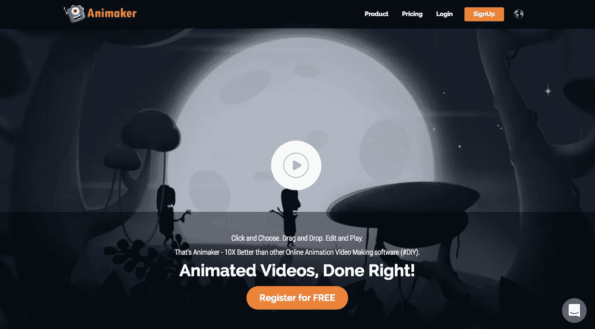

**创始人:** [Srinivasa Raghavan](https://www.linkedin.com/in/rsraghavan/) ， [Loganathan Kodiyarasu](https://www.linkedin.com/in/loganathank/)

**成立于:** 2015 年

**筹集的资金:**自举

投资者:零

**团队规模:** ~60 人

# [**承押人**](https://www.chargebee.com/)

Chargebee 是一个基于订阅的 SaaS 和电子商务业务的循环计费平台。它通过与领先的支付网关集成，使您能够自动收款、开具发票、电子邮件通知和客户管理。

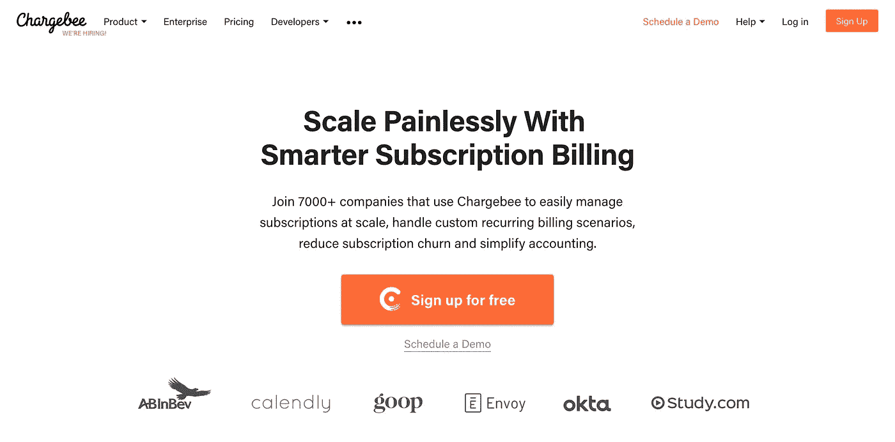

**创始人:** [克里希·苏布拉马年](https://www.linkedin.com/in/krishs/)，[拉贾拉曼·桑塔纳姆](https://www.linkedin.com/in/rajaramansanthanam/)，提亚古，[萨拉瓦南·KP](https://www.linkedin.com/in/saravanan-kp-09792838/)

**成立于:** 2011 年

筹集的资金:2420 万美元

投资者: Accel Partners，Tiger Global，Insight Venture Partners

**团队规模:** 120+人

# [云雀](https://www.getcloudcherry.com)

CloudCherry 是一个体验管理平台，它打破了组织倾听客户声音的方式。通过 CloudCherry 灵活、可定制的自助式解决方案，如今的企业可以参与当今复杂的客户旅程的每一步，并通过各种方式倾听客户的心声。

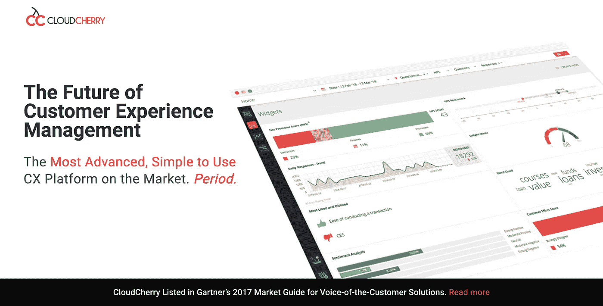

创始人:纳根德拉·CL，普莱姆·K·维斯瓦纳特，斯里拉姆·苏布拉曼尼安，维杰·拉克什马南，[维诺德·穆图克里希南](https://www.linkedin.com/in/vinodmkrishnan/)

**成立于:** 2014 年

筹集资金:700 万美元

**投资者:**思科投资、Vertex Ventures、IDG Ventures、钦奈天使

**团队规模:** ~80 人

# [客户实验室](https://www.customerlabs.co/)

CustomerLabs 是一个管理营销运营的数字营销基础设施平台。它允许企业跨平台跟踪和同步客户数据，而无需为各种分析、广告和营销平台编写任何代码。

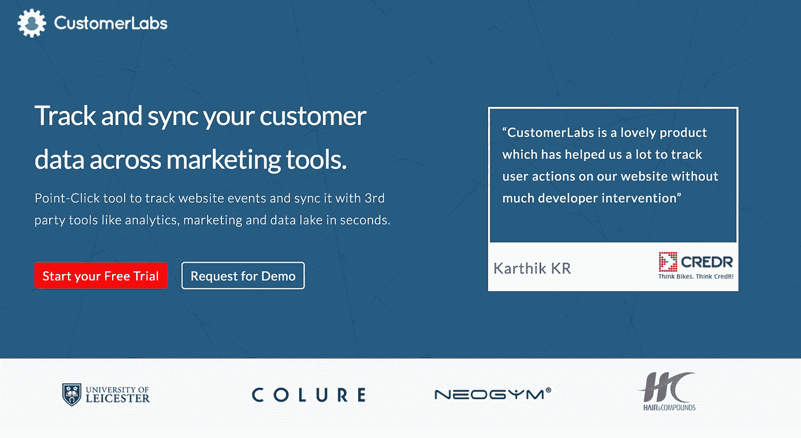

**创始人:** [阿西姆·阿里](https://www.linkedin.com/in/asimalil/)，[毗湿奴·万卡耶拉](https://www.linkedin.com/in/vishnuvvn/)

**成立于:** 2013 年

筹集到的资金: 5 万美元

**投资者:**时代互联网

**团队规模:** < 10 人

# [Facilio](https://facilio.com/)

物联网和 ML 驱动的应用旨在实时统一您的建筑性能。

Facilio 是一个一体化的应用程序套件，它统一了大型建筑组合的设施和可持续性管理。它有助于使人、机器和建筑协同工作，创造美好的设施体验，从而不再有孤立的数据、落后的维护团队或低效的可持续发展绩效。

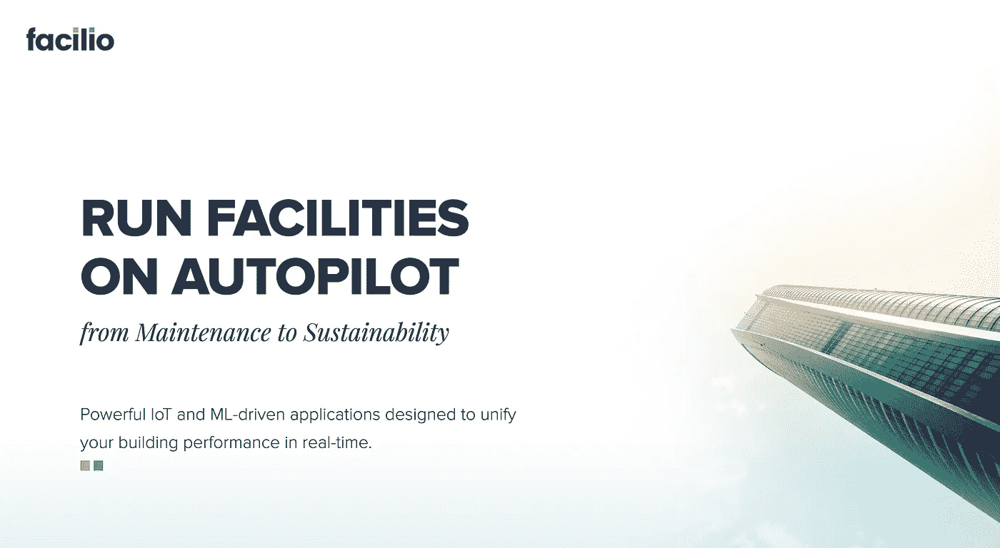

**创始人:** [帕布·拉玛钱德朗](https://www.linkedin.com/in/rprabhu78/)，[拉贾韦尔·萨勃拉曼尼亚](https://www.linkedin.com/in/rajavel-subramanian/)和[约根德拉巴布·文卡塔病](https://www.linkedin.com/in/yogendrababu/)

**成立于:** 2017 年

筹集的资金:150 万美元

**投资者:** Accel Partners

**团队规模:** ~24

# [四风筝](https://www.fourkites.com/)

FourKites 是一个实时供应链可见性平台，财富 500 强公司和第三方物流信赖它来跟踪装运位置和温度，并主动管理异常情况。FourKites 使用专有的预测算法来计算货物到达时间，使客户能够降低运营成本，提高准时性能，并加强他们的最终客户关系。

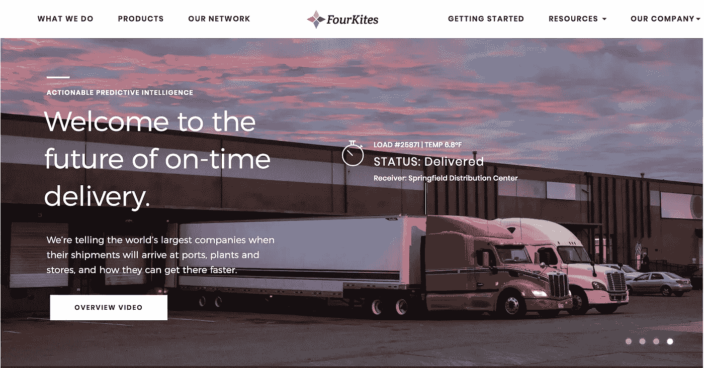

**创始人:** [马修·埃伦奇卡尔](https://www.linkedin.com/in/mattelenjickal/)

**成立于:** 2014 年

**筹集资金:**5150 万美元

**投资方:** HBS 天使、海德公园天使、海德公园风险投资伙伴、奥特、贝恩资本风险投资、奥古斯特资本

**团队规模:** ~160 人

# [Freshworks(原 Freshdesk)](https://www.freshworks.com/)

Freshworks 为支持和销售创造解决方案，吸引并取悦客户和员工。

Freshdesk 是一家基于云的客户支持软件公司，现已更名为 Freshworks，这将是其母公司，整合其商业软件产品套件——Freshdesk、Freshservice、Freshsales、Freshcaller、Freshchat、Freshmarketer 和 Freshteam。

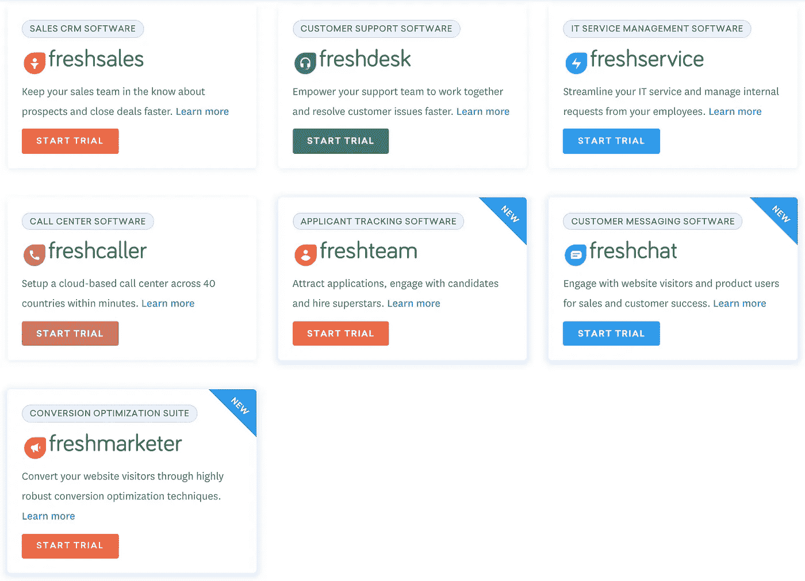

**创始人:**[Girish Mathrubootham](https://www.linkedin.com/in/girish1/)， [Shan Krishnasamy](https://www.linkedin.com/in/shankrishna/)

**成立于:** 2010 年

筹集的资金:1.49 亿美元

投资者: Accel Partners，Tiger Global Management，CapitalG，红杉资本

**团队规模:** 1200+人

# 快乐盒子

HappyFox 是一个托管在云上的服务台票务系统，支持多种客户支持渠道，如电子邮件、语音和实时聊天。HappyFox 是一个全球服务台，提供 35 种语言。

HappyFox 的与众不同之处在于它专注于用户体验和简单性，被成千上万各种规模的成功公司所使用。

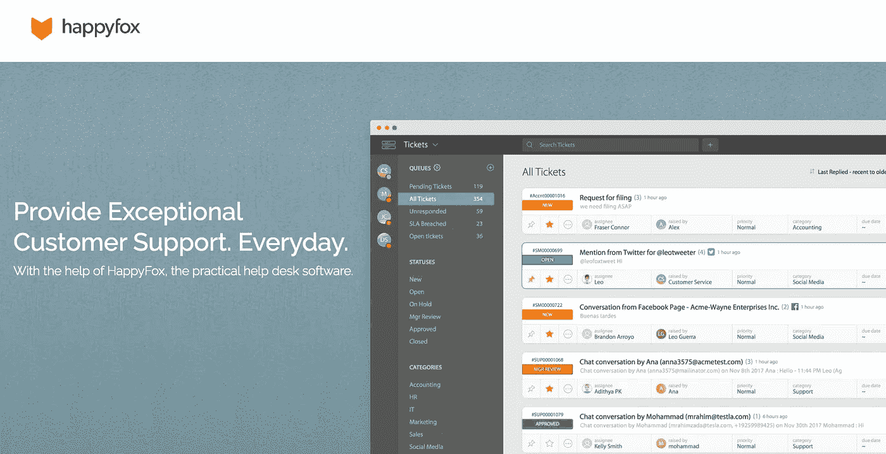

**创始人:**沙林·贾恩

**成立于:** 2011 年

**筹集的资金:**自举

投资者:无

**团队规模:** ~20 人

# [河马视频](http://www.hippovideo.io/)

河马视频是一款简单快捷的视频录制和分享软件，适合最忙碌的人。您可以轻松创建、编辑、存储、共享和跟踪视频。付费版可以让你无限期录音，可以导出到 MP4 或者存储/上传到 Google Drive、YouTube、Vimeo 和 Google Classroom。河马视频，轻松创建或录制视频免费在一个按钮开始。

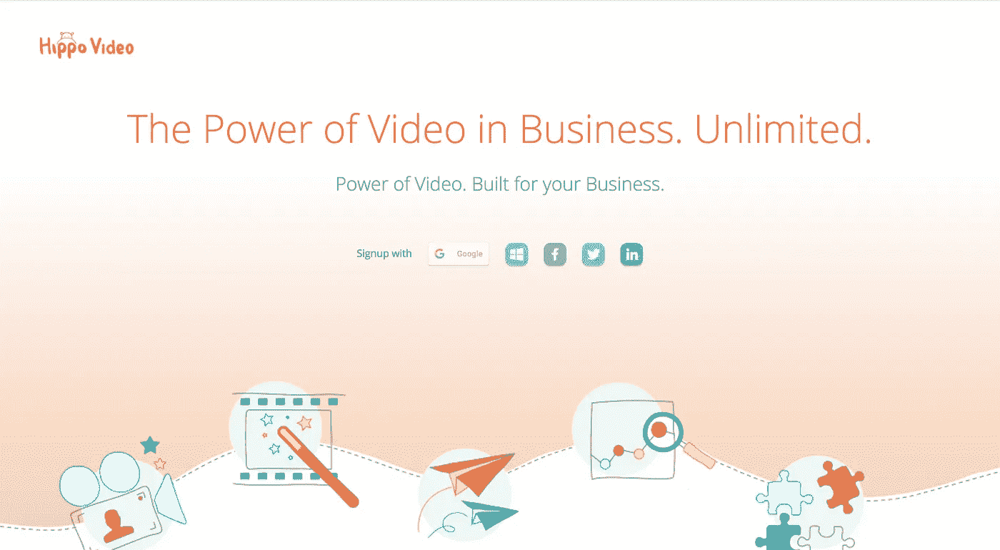

**创始人:** [卡尔提·玛利亚潘 S](https://www.linkedin.com/in/karthi-mariappan-s-2a3b163/) ，[尼拉姆昌德·贾恩](https://www.linkedin.com/in/nilamchand/)，[斯里尼瓦桑·克里希南](https://www.linkedin.com/in/srinivasan-krishnan-01b2325a/)

**成立于:** 2016 年

**筹集的资金:**未披露金额—种子轮

**投资方:**凯投资

**团队规模:** < 10 人

# [Indix](https://www.indix.com/)

Indix 建立了一个产品平台，提供产品信息和商务服务，而成本只是其他产品的一小部分。

Indix 将 AI 与最大的可用产品数据集合相结合:价格、可用性和卖家信息，以及基于代码的标识符和属性。企业使用 Indix 平台来提高其数字产品目录的规模和质量，并开发购买和销售产品的创新方法。

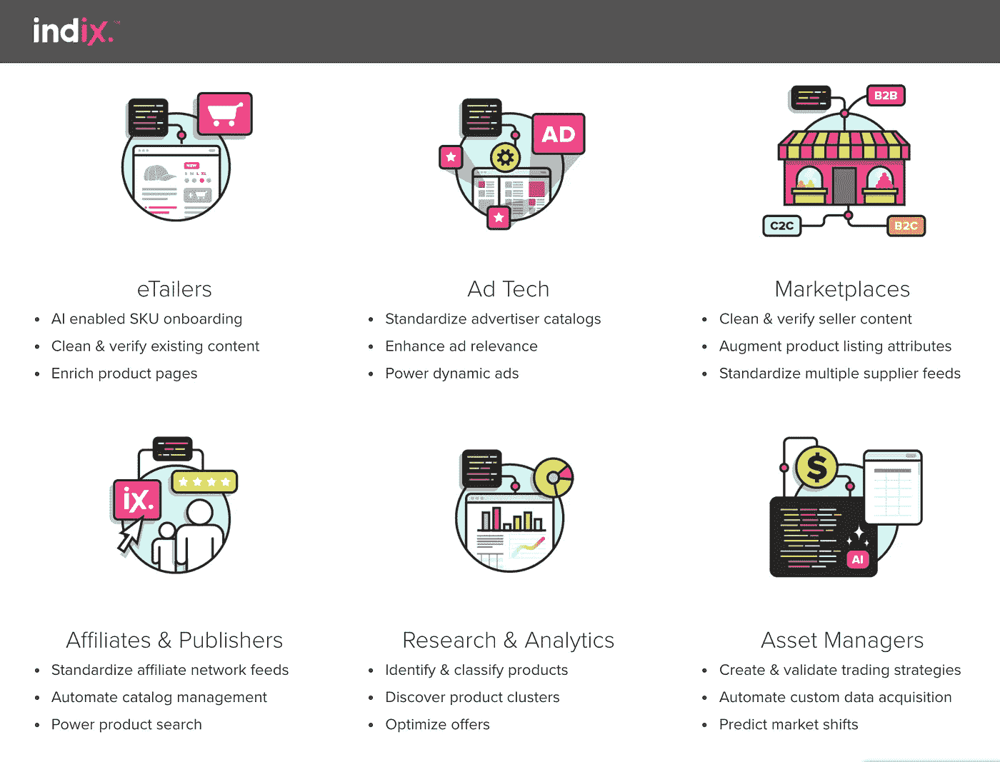

**创始人:** [拉杰什·穆帕拉](https://www.linkedin.com/in/codingnirvana/)，[桑杰·帕萨萨拉思](https://www.linkedin.com/in/sanjayparthasarathy/)，[萨蒂亚·卡利基](https://www.linkedin.com/in/satyakaliki/)，[斯里达尔·文卡特什](https://www.linkedin.com/in/sridhar-venkatesh-827b751/)

**成立于:** 2010 年

**筹集的资金:**3090 万美元

**投资者:**阿瓦隆风险投资公司、安泰米斯集团、NGP 资本、Nexus Venture Partners

**团队规模:** ~70 人

# [KiSSFLOW](https://kissflow.com/)

KiSSFLOW 是一个工作自动化平台，专为中小型企业设计，用于自动化其内部工作流程和业务流程。

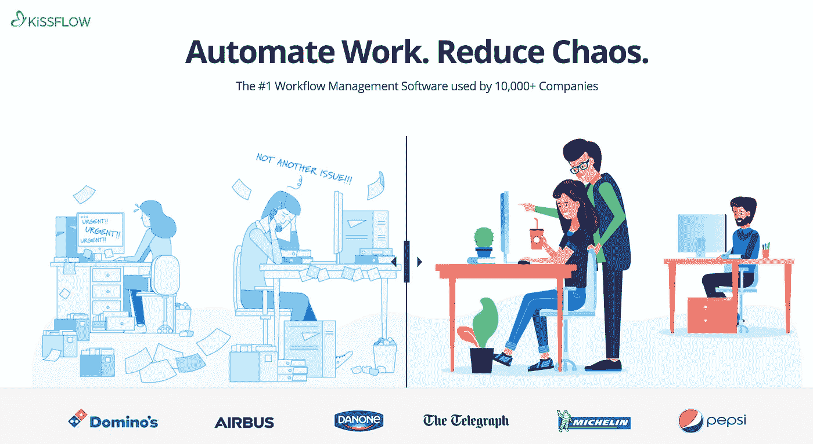

**成立于:** 2013 年

**创始人:**T42【苏雷什·桑班丹

**筹集资金:**100 万美元

**投资者:**未披露

**队伍规模:~** 150 人

# 克兰蒂

Klenty 是一款软件产品，可帮助 B2B 销售代表进行大规模的展望、拓展和跟进，从而提高销售流程的生产率，并通过减少人工工作量来提高销售/会议转化率。

使用 Klenty，您可以了解谁对您的产品/服务更感兴趣，并从理想的潜在客户那里获得更快的响应。您可以创造更多的销售结束会议和机会，从而使您的销售过程顺畅高效。

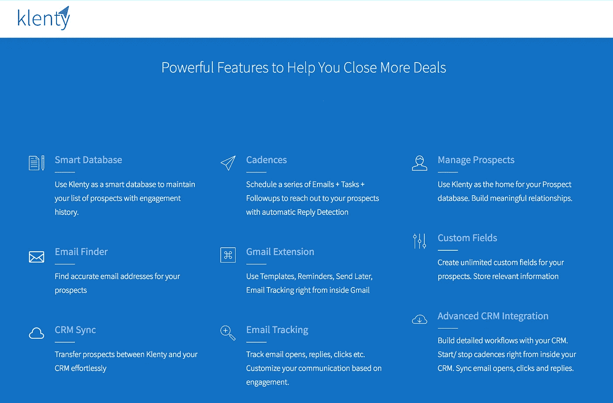

**创始人:** [普拉文·库马尔](https://www.linkedin.com/in/praveenkumaram/)，[文加特·克里什纳拉吉](https://www.linkedin.com/in/vengat-krishnaraj-8139065/)

**成立于:** 2015 年

**筹集的资金:无**

**投资者:**无

**团队规模:** ~20 人

# [奥克托泽](http://www.octoze.com/)

Octoze 的旗舰产品是一个基于 SaaS 的平台，帮助学校，学院和大学更有效地运行。它使管理人员、教学人员、家长和学生能够更好地相互交流，并为个人和机构带来更好的结果。这将学习管理、ERP 和报告结合在一个易于使用的基于云的平台中。

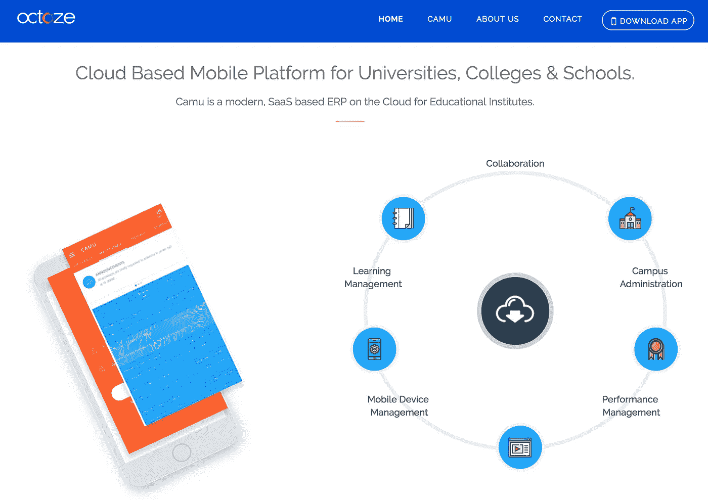

**创始人:** [斯瓦米纳森阿鲁纳恰拉姆](https://www.linkedin.com/in/swaminathan-arunachalam-b124875/)，[文卡特什瓦拉拉奥](https://www.linkedin.com/in/venkateshwarar/)，穆利库马尔

**成立于:** 2014 年

**筹集的资金:**自举

**投资者:**无

**团队规模:** ~40 人

# [Paperflite](http://paperflite.com/)

Paperflite 是一个移动优先的销售支持平台。它有助于管理营销内容，并为您的销售团队实时安排最合适的资产，使他们能够向您的潜在客户提供完美的推介。

Paperflite 是一种全新但又非常熟悉的方式，可以通过各种渠道分享、跟踪和组织您的所有内容。Paperflite 为您提供更高质量的线索，并让您能够以全新的方式使用现有内容粉碎您的目标。

**成立于:** 2016 年

**创始人:** [维诺斯·库马尔](https://www.linkedin.com/in/vinothjohnpeter/)[阿南特·巴特](https://www.linkedin.com/in/anant-bhat-ab6b248a/)，[耶加·库马尔潘](https://www.linkedin.com/in/yegakumarappan/)

筹集资金: 40 万美元

**投资者:**金奈天使

**团队规模:** ~20 人

# [棒棒糖](https://pipecandy.com/)

PipeCandy 使用数据科学技术为 B2B 销售代表发现正确的前景，并帮助他们根据各自行业的具体细微差别对前景进行细分。

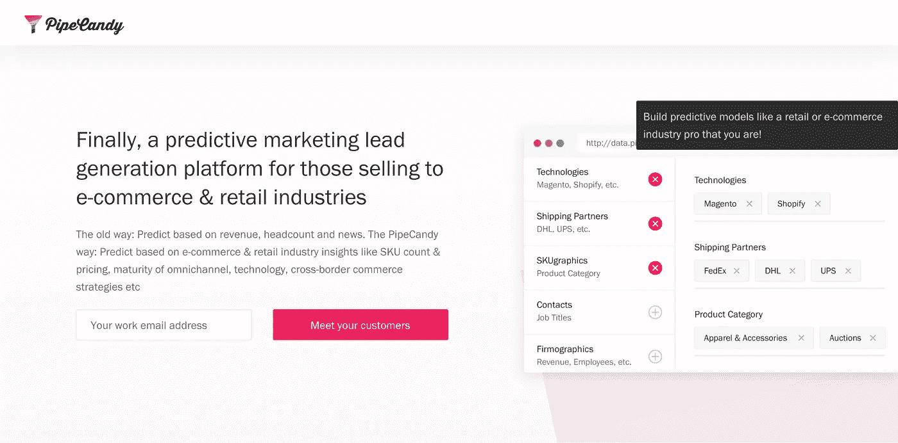

**创始人:** [阿什温·拉马撒米](https://www.linkedin.com/in/ashwinramasamy/)，[施里坎特·贾加纳坦](https://www.linkedin.com/in/shrikanth-jagannathan-7b31402/)和[穆拉利·维韦卡南丹](https://www.linkedin.com/in/murali-vivekanandan-536a/)

**成立于:** 2016 年

筹集的资金:110 万美元

**投资方:**印度天使网络、IDG 风投、Axilor 风投和 Emergent 风投

**团队规模:** ~30 人

# [拉姆科系统公司](http://www.ramco.com/)

Ramco Systems 是一家云企业软件公司，专注于为 HCM 和工资单、ERP 和 M&E MRO 国防和民航领域的企业提供多租户企业软件，采用移动优先理念和基于内存的规划和优化引擎。

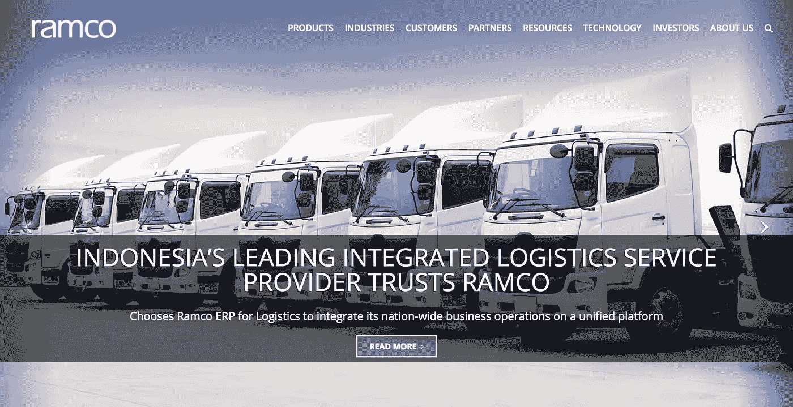

创始人:国王

**成立于:** 1999 年

**融资额:**5200 万美元(上市后股本)

**投资者:**安讯士共同基金、高盛、HDFC 控股、阿曼萨控股、J . O .汉布罗资本

**团队规模:** ~3000 人

# [ReferralYogi](https://referralyogi.com/)

ReferralYogi 是一个总部位于 SaaS 的客户宣传平台，承诺为企业带来可持续的收入增长。这有助于他们识别推广者，鼓励推荐，管理推荐人，并为他们的品牌创造社会效应。

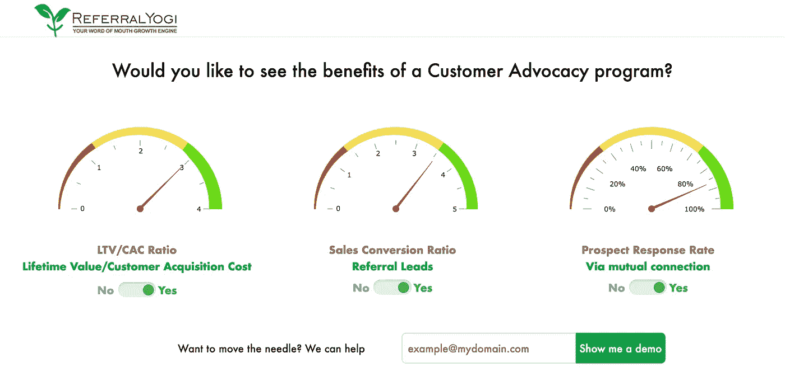

创始人:甘地·戈皮纳特，斯里拉姆·文卡查拉姆

**成立于:** 2017 年

筹集的资金

投资者:无

**团队规模:**10<

# [塔加利](https://www.tagalys.com/)

创建、策划和发布转换优化的电子商务产品列表页面，无需工程支持

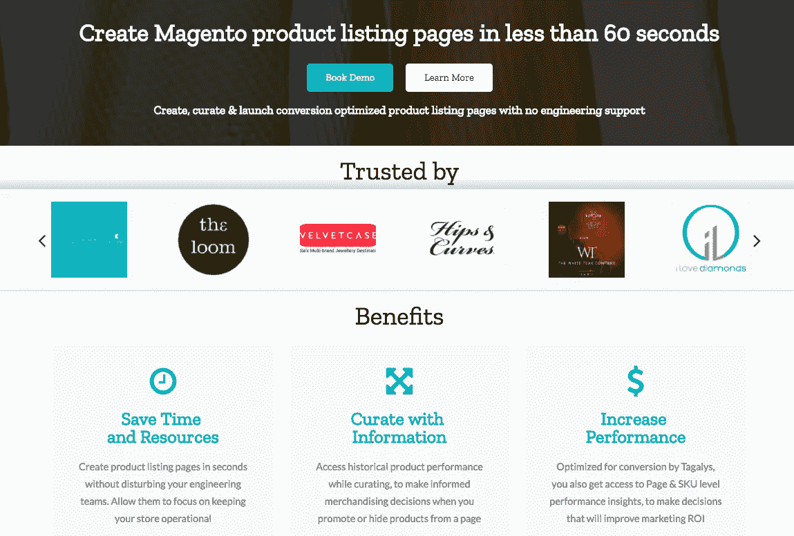

成立于:2015 年

**创始人:** [安东尼·卡图卡兰](https://www.linkedin.com/in/kattukaran/)，[帕拉尼亚潘·切拉潘](https://www.linkedin.com/in/palaniappanc/)

筹集的资金:无

**投资者:**无

**团队规模:** < 10 人

# [未计量的](https://unmetric.com/)

Unmetric 是一个专注于品牌的社交媒体智能平台。领先品牌相信它能够了解竞争对手的努力，基于数据揭示见解，并开启新的社交战略。Unmetric 结合了人和技术的力量，跟踪和分析所有主要社交渠道的 30 个行业的 30，000 多个品牌的在线行为。

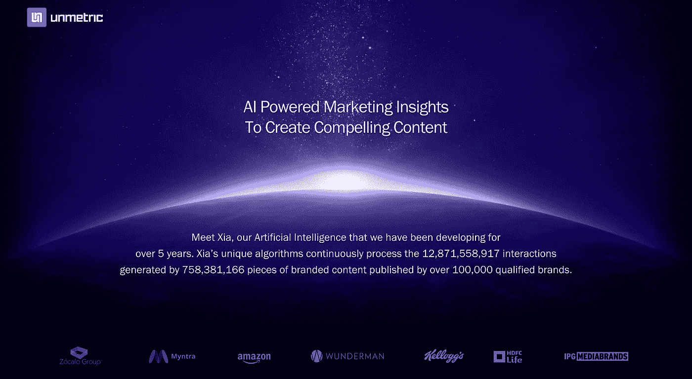

**创始人:** [乔·瓦格斯](https://www.linkedin.com/in/joevarghese/)，[库马尔·克里什纳萨米](https://www.linkedin.com/in/kumarkrishnasami/)，[拉克什马南(力士)纳拉扬](https://www.linkedin.com/in/lakshmanannarayan/)

**成立于:** 2011 年

筹集的资金:870 万美元

投资者: Nexus Venture Partners，JAFCO Asia

**团队规模** : ~85 人

# [Xobin](https://xobin.com/en)

Xobin 的招聘软件套件降低了 70%的招聘成本，并帮助您将招聘质量提高一倍。利用 Xobin 的智能招聘软件解决方案，寻找、评估人才并将其纳入您的团队。

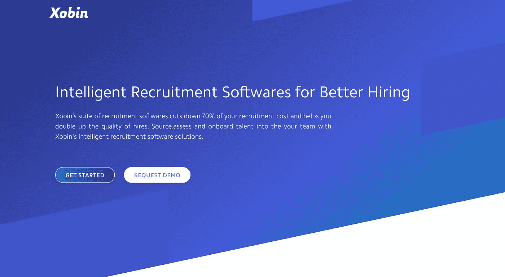

**创始人:** [Amrit Acharya](https://www.linkedin.com/in/amrit-aacharya/) ， [Guruprakash Sivabalan](https://www.linkedin.com/in/gurusiva/)

**成立于:** 2016 年

**筹集资金:**金额未披露(种子轮)

**投资者:** Axilor Ventures

**团队规模** : 11 人

# [Zoho](https://www.zoho.com/)

Zoho 提供了一套商业、协作和生产力应用程序。该公司提供 30 多种在线应用，从 CRM 到邮件、办公套件、项目管理、发票、电子邮件营销、社交媒体管理等等。

该套件包括 Zoho Writer、Zoho CRM、Zoho Sheet、Zoho Show、Zoho Projects、Zoho Meeting、Zoho Creator、Zoho Docs、Zoho Invoice、Zoho People、Zoho Mail、Zoho Assist、Zoho Reports、Zoho Recruit、Zoho Support、Zoho Books、Zoho Bug Tracker、Zoho Campaigns、Zoho Sites、Zoho Connect 等等。

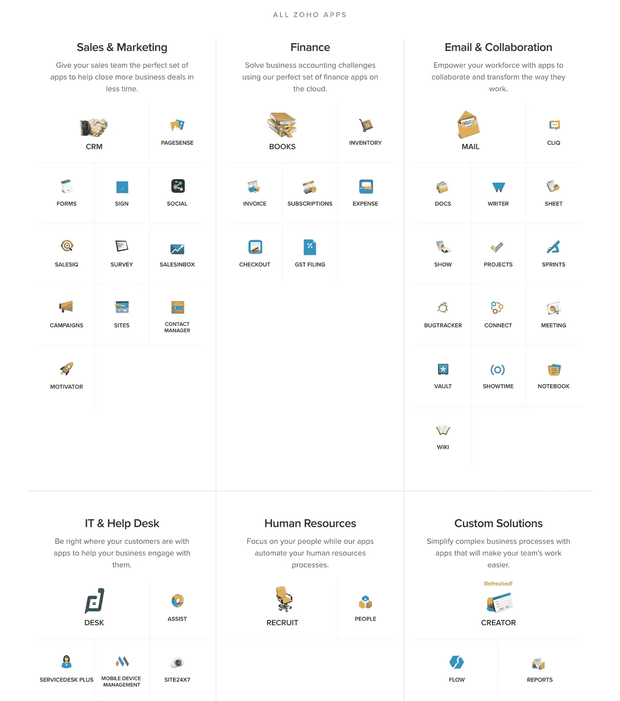

成立于: 1996 年

**创始人:**斯里达尔·温布和托尼·g·托马斯

**筹集资金:**自举

投资者:无

**团队规模:** 5500+人

[**在 Linkedin 上联系我**](https://www.linkedin.com/in/nivasravichandran/)

***免责声明:*** *我在*[***fresh works***](https://www.freshworks.com/)*工作，负责 Freshsales CRM，但是这个列表是为了帮助 SaaS 钦奈社区而列出的。意见是我自己的，而不是我的雇主的观点。*

如果我漏掉了钦奈的任何一家 SaaS 公司，或者如果你想修改任何一家公司的任何信息，请留言，我会做必要的更新。