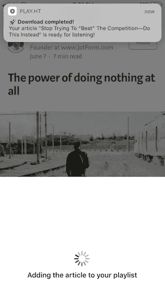

# 在线听文章、新闻、笔记或任何文本

> 原文：<https://medium.com/hackernoon/listen-to-any-articles-news-notes-or-text-online-849ea584e95d>

## 一个在阅读不可能的时候创造学习机会的 app

> **TL；DR——我们开发了一个应用程序，可以让你将任何文章转换成音频并高速收听，让你更快地掌握信息和学习。可以从这里下载 app—**[**【https://play.ht/mobile】**](https://play.ht/mobile/)

# 问题

几乎所有的信息都是书面的。当我们不能吸收更多的信息时，在一个阅读阈值之后，我们停止学习。或者也许我们正忙于一项活动——比如锻炼、通勤、慢跑等。，但我们的头脑仍然可以学习。在这种时候，没有办法通过阅读来学习。

# 通过倾听来学习

从根本上说，听信息能让你更高效、更快地学习，而阅读则需要你全神贯注。而且，几乎每一条信息都以书面形式存在并要求我们阅读，当阅读不可能时，我们就失去了几个学习机会。

# 用于学习的文本到语音转换

文本到语音(TTS) [技术](https://hackernoon.com/tagged/technology)已经存在了 30 多年，但只有机器学习方面的最新进展才使得该技术听起来更自然、更像人类——使其成为将书面内容转换为点播音频的可行解决方案。

当然，TTS 有它的怪癖和缺点。例如，有时声音单调，一些缩写和名称的发音不正确/怪异等。最重要的是，与人类的声音相比，这个声音听起来仍然像机器人。但与它在学习中提供的可能性相比，这些怪癖是微不足道的。

当你的唯一目标是学习，而你关心的只是了解和掌握信息时，那么当阅读不是一个选项时，这个应用程序给你一个通过倾听来学习的机会。

# 如何使用该应用程序

**第一步:**从我们的网站这里下载应用—[**https://play.ht/mobile**](https://play.ht/mobile/)**/**

一旦你下载了应用程序，你将有一个空的播放列表。然后，您需要将文章导入到您的播放列表中，以便能够收听它们。

**第二步:**将文章导入您的播放列表。

## 这里有 1 分钟的视频，向你展示如何在应用程序中导入文章来听。

# 在 iPhone 上收听

Listening on iPhone

# 在 Android 上收听

Listening on Android

第三步:倾听:)

# 离线收听

轻按播放列表中任何文章上的“**转换并允许离线使用**”选项，将音频文件下载到您的手机上，以便您可以随时离线收听。

> **专业提示:当连接到 Wifi 时这样做，这样你就不会用完你的 3G/4G 数据。**

# 改变速度以听得快/慢

通过调整听力速度来匹配您的学习速度，如下所示:

Change listening speed

# 不要等待文章转换

如果你要转换一篇很长的文章，可能需要一段时间。你不必等待，一旦文章被转换并准备好收听，应用程序就会通知你。

Notification showing that article is ready for listening.

# 给我们反馈

如果你遇到一个错误，故障，有一个功能的建议或反馈如何可以改善应用程序，请让我们知道。以下是您在应用程序中联系我们的方式。

# 这款应用的下一步是什么？

当我们根据您的反馈改进应用程序时，我们准备了以下功能:

1.  增加收听书籍和文档(PDF、EPUB、TXT 等)的功能
2.  连接 Pocket 和 Instapaper 帐户，导入您的文章进行收听
3.  我们将添加更多的声音，并让您控制不同的文章选择不同的声音

# 给出版商、博客作者、读者和黑客 Noon 作者的重要提示

> 如果你想让你的文章能被你的读者所理解，那么看看我们的音频播放器吧，你可以把它嵌入到你的文章中，这样读者也可以选择收听——https://play.ht/app-landing/