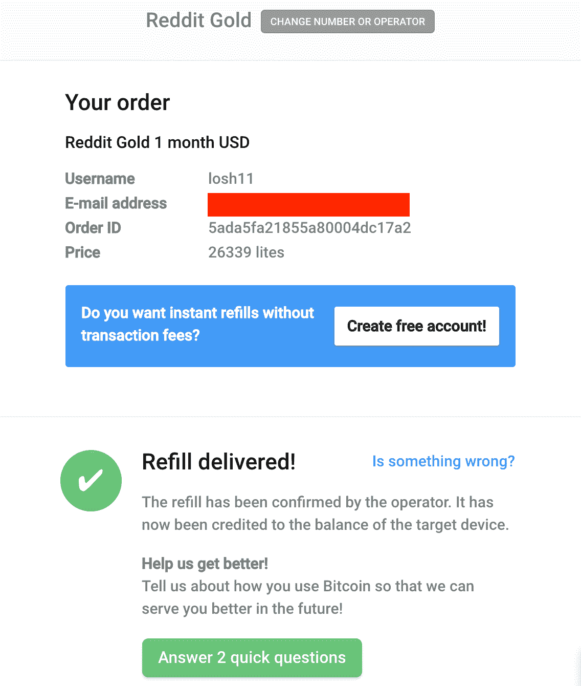
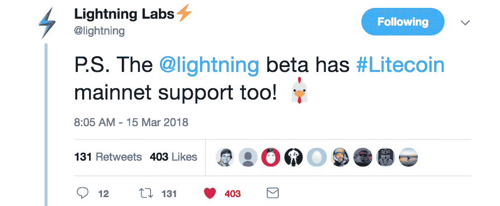
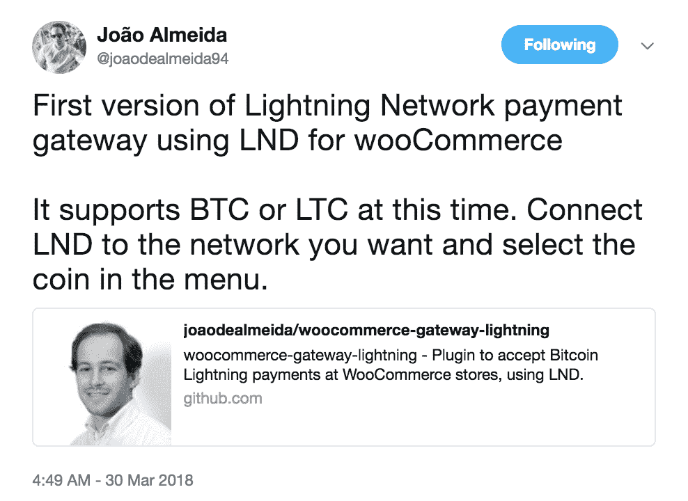
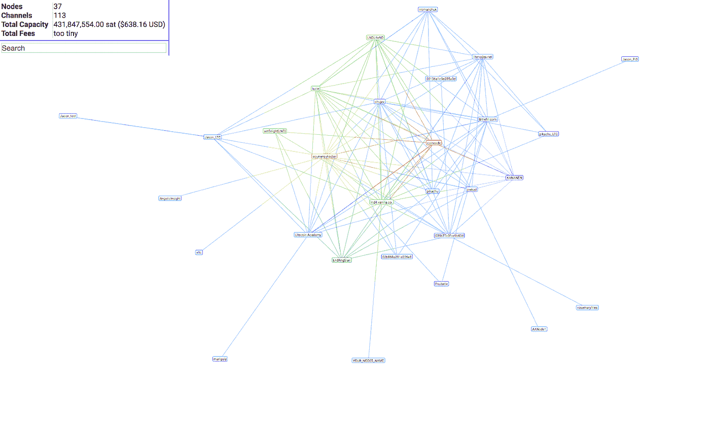

# 莱特币加入比特币与 Mainnet 闪电网购

> 原文：<https://medium.com/hackernoon/litecoin-joins-bitcoin-with-mainnet-lightning-network-purchases-a6fe5a366189>

2018 年 4 月 20 日， [ecurrencyhodler](https://twitter.com/ecurrencyhodler) 在闪电网上通过 [Bitrefill](https://en.bitrefill.com/) 用莱特币购买了 1 个月的 reddit 黄金并给 [Loshan1212](https://twitter.com/loshan1212) 小费。

然而，这并不是 LN 上发生的第一笔莱特币交易。Bitrefill 证实一个匿名的人在三月初付费给他们的预付费手机充值。然而，这两次购买意义重大，因为它标志着第二种加密货币通过主网加入比特币。

莱特币经常被描述为比特币的“弟弟”，它能够如此迅速地加入闪电网络，是因为它的发展紧跟比特币的步伐。事实上，每个运行 lnd 或 c-lightning 实现的 LN 节点都自动内置了 Litecoin 支持。

通过为这些客户提供比特币和莱特币支持，企业很容易接受这两种货币的闪电网络支付。例如[钢铁钱包公司 Billfodl](http://bit.ly/steelwallet) ，是另一家使用 c-lightning 在 Lightning 网络上手动处理比特币和莱特币发票的企业。

支持两种货币的 Lightning Network 客户端的其他优势还包括可轻松移植的 Litecoin 业务逻辑工具。例如，[joodealmeida 94](https://twitter.com/joaodealmeida94)早在三月底就宣布发布面向 lnd 客户端的 woocommerce 插件支付网关。

这并不是莱特币唯一一次受益于与比特币保持如此密切的关系。事实上，这是凯西决定选择莱特币作为交易所新的基础资产类别的主要原因之一。

> *“经过长时间彻底的研究过程，我们选择了莱特币，以确定符合我们标准的资产类别:安全、可靠、可扩展的链上和链下、低开采费用，最好符合已公布的比特币核心路线图。”*[*——凯西*](https://www.abra.com/blog/decentralized-investment-platform/)

目前，Litecoin 的闪电网络上有 37 个可见节点，并且每天都在快速增长。

