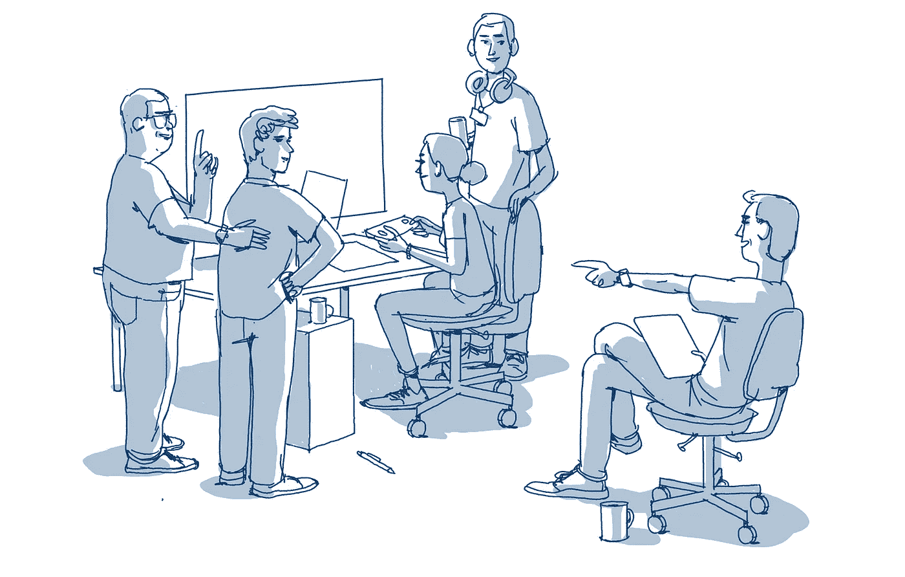
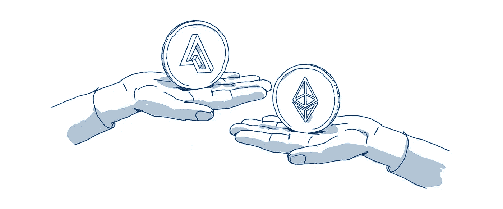
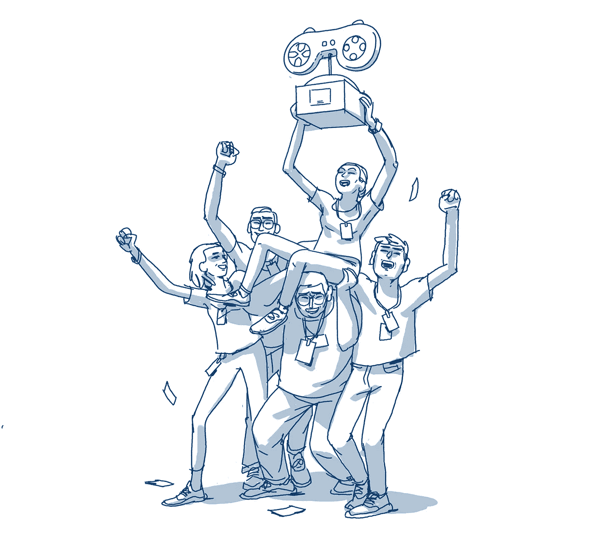

# 刘的游戏:未来游戏融资的故事

> 原文：<https://medium.com/hackernoon/lius-game-a-story-of-game-financing-in-the-future-b6ed85dda3c4>

下面不是一个真实的故事，而是一个在不远的将来即将出现的不太现实的场景的描述。

42 岁的刘(音译)是一名经验丰富的游戏开发人员，她刚刚和一些老同事成立了一家新公司。他们对新游戏有一个很棒的想法，他们估计需要大约两年时间和 500 万美元才能完成。

> 传统上，游戏融资市场由相对少数的个人和公司主导。游戏制作的高风险本质——高成本、多学科交叉和竞争激烈的市场导致缺乏成功的确定性——导致了这种情况。

她考察了融资情况，发现自己有多种选择:

1.  *——但他们通常只与老牌开发商和 AAA 游戏打交道，而不是刘想要制作的独立游戏。*
2.  ****孵化器***——刘经验丰富，已经有了一个小工作室。此外，他们的种子基金远远不足以支付她的费用。*
3.  ****传统风险投资***——她接触了几家，但发现他们犹豫不决，因为他们不熟悉游戏市场，看不到机会。*
4.  ****资金/政府支持***——他们对她的团队地点、发行地点以及她能制作的游戏类型都有严格的要求。*

*她环顾了一下其他开发者正在做的事情，看到了 Kickstarter 上的传统众筹模式。经过进一步研究，她意识到这种方式的众筹只能让她给资助者一个象征性的回报。*

> *此外，围绕游戏建立一个社区对她来说非常重要。她希望以一种长期、真实的方式吸引她的游戏玩家。*

*一天，她的一个朋友告诉她，有一个平台可以让她将区块链技术集成到她的游戏中，并创建代币，她可以在众筹中出售代币，为她的游戏筹集资金。*

*这是她对囤积的介绍。*

> *传统的众筹用小玩意和小饰品奖励资助者——甚至可能是一件 t 恤！在 Kickstarter 等平台上主持这些销售的公司知道，资助者在很大程度上受到一种感觉的激励，即他们支持他们相信的产品和团队。*
> 
> *然而，Hoard 上的众筹将使游戏开发者能够向他们的资助者提供游戏或其生态系统固有的令牌。代币持有者基本上拥有参与新创造的经济的权利。*

## *举办众卖会*

*刘决定在平台上发起一场众筹。她设计了一个将在她和她的团队将要构建的游戏世界中使用的令牌——该令牌可用于购买游戏商品和服务。代币持有者还会有特殊的战利品箱，里面会不时空投一些独特的物品。只有 5000 万代币将被创建，其中大部分将在大规模销售期间分发到社区。*

*她宣布众筹和游戏的概念。消息传开了——不仅仅是因为游戏的想法是创新和独特的(确实如此),还因为游戏玩家知道代币会给他们带来真正的游戏内好处。几天后，她筹集了 500 万美元来资助这个项目。*

**

## *创建社区*

*游戏开发正在进行中，然而，这并不仅仅意味着资助者在静静地等待它的完成。他们创建了在线社区来分享他们的兴奋，并与其他游戏玩家讨论他们对这个项目的期望。刘和她的团队是这些小组的积极参与者，她甚至聘请了一名全职的社区经理来回答问题和提供更新。*

*众筹结束 6 周后，刘决定向代币持有者空投一个特殊的代币，以示感谢。这个代币给了他们一个在最近的 playstation 上她的团队的早期游戏的重制版本。由于需求量很大，一些持有者选择卖掉这种空投代币。*

***众筹**半年后，刘决定再做一次空投。这一次是 Twitter 对某些网址的提示，很快寻宝活动就开始了。成千上万的人在网上玩迷你游戏，交换、组合和获得新的代币。*

*这款游戏离完成还有一年时间，然而，已经产生了大量的游戏新闻和宣传，以及数以百计的推文。*

> *正如区块链空间最近的代币销售所发现的，高度参与的社区的产生是众筹最大的结果之一。正是这个社区的参与和热情以及不同渠道的信息共享，使得对这些令牌的需求甚至在项目完成之前就开始增长。*
> 
> *当项目最终完成时，它已经建立了这样一个充满激情的社区，不仅在一级市场，而且在二级市场，投机者都好奇观察新经济的增长。*

## *对创始团队的好处*

*刘的团队也因此受益匪浅。为众筹基金开发的一小部分代币被分发给团队成员。刘和他的团队开展的活动，如空投活动，有助于建立社区对代币的热情和需求，团队和社区已经看到他们持有的代币价值增加。*

**

> *在一个通常不存在游戏收入分成的经济体中，这一点非常重要。大部分利润回到出版商和投资者手中，这是可以理解的，因为他们首先承担了大部分风险。*

> *此外，拥有代币系统意味着开发者可以利用各种活动来吸引代币持有者，这可以延长游戏的寿命，并导致团队长期参与项目。*

*上面强调的经历并不是虚构的，它描述了游戏行业在不久的将来会发生什么。*

## *这种新模式的好处是:*

*   *支持开发更小的利基游戏，为游戏玩家提供更多选择。*
*   *更公平地分配游戏收益，因为玩家和开发者直接连接，无需中介。*
*   *更多社区驱动的和引人入胜的游戏。*
*   *通过即时社区的促进，降低游戏开发者的营销团队成本。*

## *这个市场到底有多大？*

*截至 2018 年 3 月 14 日，Kickstarter 上的“游戏”类别是该网站承诺最高的类别，迄今为止已经筹集了超过 7 亿美元。其中，[2016 年中期的一份报告](http://icopartners.com/2017/01/kickstarter-2016-deep-dive-games-category/)称，视频游戏已经筹集了大约 1.86 亿美元。*

*第一个也是最成功的众筹游戏之一是[明星公民](https://en.wikipedia.org/wiki/Star_Citizen)，自 2013 年以来，它已经筹集了超过 1.48 亿美元。根据科隆大学的一项研究，选择参与视频游戏众筹的人主要有:*

*   *相信这个项目的支持者推动着某些游戏的完成*
*   *希望拥有成品一部分的消费者*
*   *“影响者”或“理想主义者”，他们将众筹视为影响整个视频游戏行业变革的一种方式*

*与我们的团队、合作伙伴和社区一起，Hoard 希望通过为支持者提供一种更有意义的方式来互动和拥有项目的成功，从而为游戏开发者提供一种更好的方式来吸引他们的支持者。*

> *“Hoard 提供了一个有趣的机会，通过拉近游戏开发者与实际社区的距离，为游戏开发筹集资金。”
> ——IO Interactive 公司首席执行官哈坎·阿布拉克*

*我们希望你能和我们一起创造这个新的未来。*

## *想了解更多关于囤积的信息吗？*

*   *查看 [**我们的网站**](https://hoard.exchange) ，了解更多关于我们的 [**团队**](https://www.hoard.exchange/#teamSection)[**顾问**](https://www.hoard.exchange/#advisorSection) 。*
*   *观看我们的 [**入门视频**](https://www.youtube.com/watch?v=rljhLcG1m8s&t=2s) 。*
*   *阅读我们的 [**众筹论文**](https://www.hoard.exchange/docs/Hoard%20Crowdfunding%20Paper.pdf) 。*
*   *[**注册**](https://www.hoard.exchange/#contributePeriodSection) 接收更新。*
*   *在 [**Twitter**](https://twitter.com/hoardexchange) 上加入对话。*

***其他博文:***

*   *[引入囤积:促进以太坊游戏资产的真正所有权](https://blog.hoard.exchange/introducing-hoard-facilitating-true-ownership-of-gaming-assets-on-ethereum-5ecd84a9b7fb)*
*   *虚拟游戏物品的真实所有权有什么了不起的？*