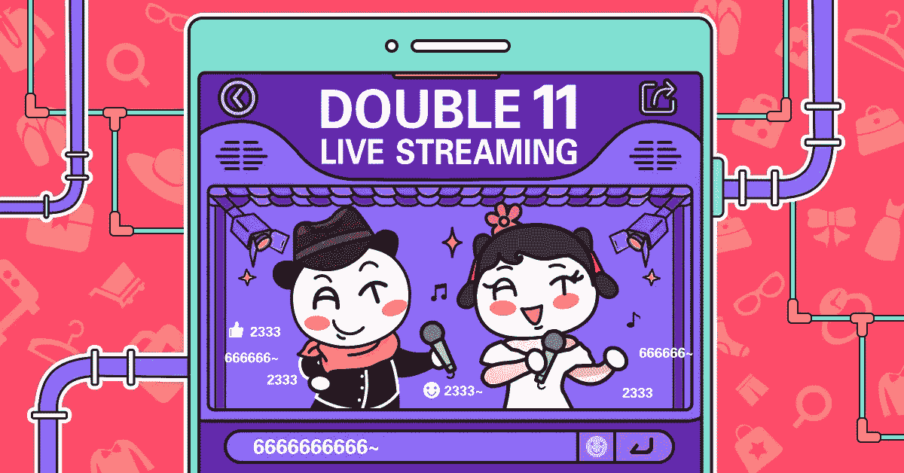
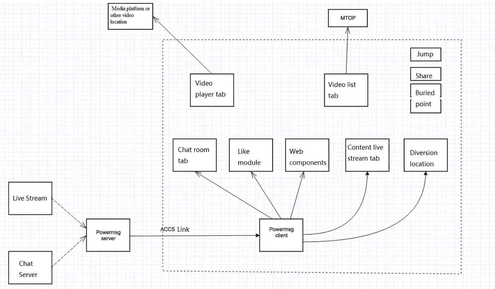
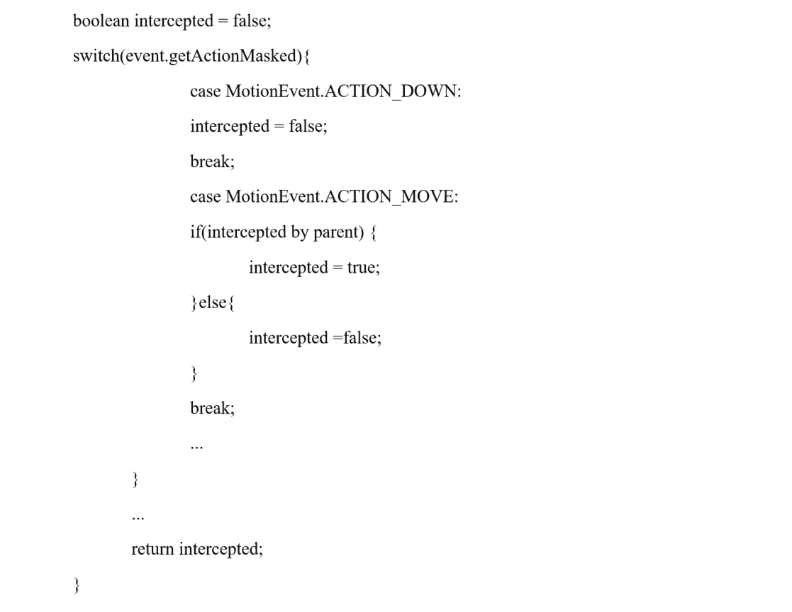
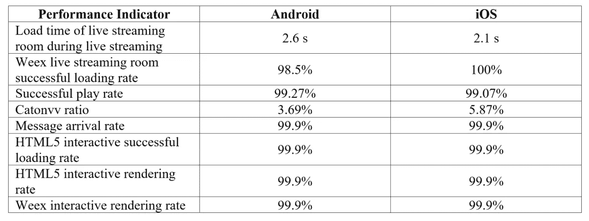

# 向 200 万用户直播

> 原文：<https://medium.com/hackernoon/live-streaming-to-2-million-users-d1aba226da43>

*阿里巴巴光棍节倒计时晚会通过定制界面向全世界开放*

阿里巴巴的双 11 全球购物节在流行文化中获得了标志性的地位，其倒计时晚会是线上和线下世界的重要连接点。2017 年，阿里巴巴的视频流媒体网站优酷的任务是向数百万用户直播春晚的舞台活动，这对优酷的直播、移动和架构团队构成了不小的挑战。

尽管优酷直播有成熟的在线业务，但这个项目提出了许多需要解决的新问题。除了直播实际的晚会活动本身，还计划了许多其他互动活动，包括点赞/分享赠品、测验、宝藏活动和数字红包分享。

让活动规划变得更加困难的是，并不是所有需要的投资都及时收到了，因此流媒体网站的需求仍然非常动态。此阶段的另一个重要问题是事件流模板的要求，这导致了现有站点结构的问题。

因此，我们决定使用 Weex 技术——一种类似 React Native 的轻量级用户界面框架——来构建一个全新的优酷直播界面。新的界面将保留所有当前的功能和操作功能，同时增加对各种光棍节互动活动的支持。

(进一步了解阿里巴巴的 Apache 项目**Weex**:[http://weex.apache.org/index.html](http://weex.apache.org/index.html))

# 包装现有的本机组件

这个全新界面的初始工作包括划分功能模块，并确定哪些功能模块将通过 Weex SDK 或 AliWeex SDK 中包含的默认组件来实现。此外，还需要确定哪些本地 Java 模块需要将其本地代码封装到 Weex 组件中，以供 Weex 前端开发人员使用。

*Diagram showing the technical structure and functions of the Youku live stream*

经过初步评估，直播室的功能模块划分如下:

**直播室画面**

这是使用 Weex 前端代码构建的。

**选择选项卡**

包含文本和图片的视频列表，使用 Weex 前端代码构建。

**聊天标签**

这包括大量的聊天气泡效果和复杂的运算逻辑。最初的 Java 代码被包装成一个 Weex 组件。

**内容直播标签**

包括图形投影、文本、视频、产品链接和其他复杂的逻辑。最初的 Java 代码被包装成一个 Weex 组件。

**视频播放器组件**

优酷直播视频播放器的原始 Java 代码被包装成一个 Weex 组件。

**喜欢标记**

该组件在被单击时，或者在收到来自服务器的“赞”通知时，会生成大量的浮动动画。最初的 Java 代码被包装成一个 Weex 组件。

**定制选项卡**

一个定制的 WebView 模块被包装成一个 Weex 组件。它包括各种功能:

1.  阿里巴巴百川加载淘宝商品，边看直播边启用购买功能。

2.一个交互式的 HTML5 页面实现了数字红包分享，竞猜等。

3.优酷星球投影的 HTML5 页面等。

**其他功能模块，如超链接、分享、追踪等，也被包装成 Weex 模块，供 Weex 前端开发者使用。**

经过功能模块的设计和划分，整个直播室界面完全模块化。它可以根据需求进行组合、分解和定制。

无论直播房间的设计未来如何变化，只要新编码的直播房间皮肤与各种定制的 Weex 组件相结合，就可以基于项目约束组装或拆卸所需的直播流。

# 交互式活动支持

采用了优酷直播平台来执行主持人话题编辑，提供流皮肤，并支持幸运 dip 事件。特定的完整输入将被集成到交互事件模型中，然后使用 PowerMsg 发送到服务器，PowerMsg 是一个使用 HTTP 持久连接的主题订阅系统。一旦客户端收到类似的交互消息，这些消息将通过 Weex globalEvent 直接传递给 Weex 前端代码。Weex 前端代码分析完单词后，会显示主持人的话题，并根据相关指令打开宝箱和幸运蘸酱页面。

这不同于将 Weex 页面降级为 HTML5 页面的传统方法。每当我们的降级逻辑遇到异常加载或其他异常时，它会将 Weex 直播流房间降级为原生直播流房间。这就构成了降级逻辑的新形式。

# 挑战和解决方案

在开发直播房间的过程中，遇到了一些定制 Weex 组件的标签栏框架和手势冲突的问题。

在 Weex 标签栏和定制 Weex 组件的集成过程中，由于两者之间的手势冲突，标签切换失败。要么水平和垂直手势都被当前标签占用，阻止用户在标签之间切换，要么水平和垂直手势都被标签栏占用，导致垂直滑动在当前标签中失败。

父视图和子视图能够同时滑动的滑动冲突也是一个问题。对此的解决方案是在父视图 onInterceptTouchEvent()上构建一个拦截器，如下所示:

最终商定的解决方案是编写一个定制的 Weex DIV 标记，并使用它来包装定制的 Weex 组件，该组件使用垂直滑动手势并将它们传输到定制的 Weex 组件。水平滑动手势绕过定制的 Weex DIV，被发送到 Weex 标签栏，解决了滑动手势冲突的问题。

然而，直播 Weex 前端代码使用了 ExpressionBinding 来优化滑动性能，我们的自定义 DIV 标签导致了 ExpressionBinding 失败。为了克服这个问题，WXComponent 的手势识别代码被重写，覆盖了最初随 WXComponent 提供的默认手势识别代码。这导致 ExpressionBinding 再次生效。ExpressionBinding 的执行顺序如下所示:

触摸开始-> panstart ->表达式绑定 panstart ->表达式绑定 panmove ->表达式绑定 panend ->触摸结束-> panend

ExpressionBinding 的核心概念是检测 Java 代码中的‘pan start’事件，然后执行 Weex Javascript 代码传下来的手势处理逻辑，而不是将手势发送到 Weex 前端代码，等待 Javascript 处理手势。

我们的自定义 DIV 标记和自定义 Weex 组件使得 ExpressionBinding 无法检测 panstart 事件。因此，我们重写的 WXGesture 模块发送 WXGestureType。HighLevelGesture.HORIZONTALPAN 或 WXGestureType。HighLevelGesture.VERTICALPAN 在适当的时候向 WXComponent 发送事件，手动触发 ExpressionBinding 中标识代码的执行。之后，ExpressionBinding 就能够与定制的 DIV 标签和定制的 Weex 组件协作了。

# 优化屏幕旋转

最初，优酷直播房间的屏幕旋转是通过直接旋转 Android 活动来实现的，然后使视频水平适应整个屏幕，然后旋转 Android 活动以将视频视图恢复到其初始大小，并允许重新显示布局的其余部分。

但是，新的 Weex 直播流房间大大增加了屏幕旋转的复杂性。垂直和水平屏幕之间的转换变得极其缓慢，以至于每次转换都会导致屏幕在正常显示之前变黑一段时间。

对此问题采用的解决方案如下:

当从垂直屏幕切换到水平屏幕时，从其父视图组中删除视频视图，然后将其直接添加到当前窗口的 décorView 中。

从水平屏幕切换到垂直屏幕时，从 décorView 中删除视频视图，然后将其添加到旧的父视图组，最后重置各种布局参数。

这些优化极大地增强了屏幕旋转体验，即使在几年前生产的低端设备上也可以快速水平和垂直旋转。

# 圆角视频

为了实现真正独特的直播体验，使用了圆角视频。这是通过在自定义视频标签上覆盖天猫电视图像来实现的，因此视频仅通过圆形框显示。

*he Singles’ Day live stream with overlaying Tmall TV screen*

这种实现在 iOS 设备上工作得很好，但在 Android 设备上失败了，在 Android 设备上，视频的原始边角仍然可见，并且视频和图片级别也存在问题。

通过向定制的 Weex 视频组件添加“borderRadius”属性，在 UED 设计中设置电视画面圆角的适当角度，起草一个定制的视频标签，并将该值传递给本机 Java 代码，解决了这个问题。然后，在 Weex 750px 转换后，圆角直接在本机代码中应用于 VideoView。

结果是，拍摄的圆角视频与电视画面的圆角完美匹配，两者看起来就像是一个图像。

# 提高渲染和加载速度

## 1.优化装载时间

Weex live streaming 默认为垂直方向，但也可以使用水平方向。原有的 Weex 逻辑同时初始化竖屏和横屏布局，比较耗时，增加了加载时间。

为了解决这一问题，Weex 直播室被修改为仅初始化垂直屏幕所需的组件，并延迟加载水平屏幕所需的组件，仅在需要时创建和初始化所需的方向。

## 2.优化冗余布局

可以通过减少布局层次、删除所有冗余视图来进行优化以提高性能。此外，Weex 直播室还进行了大量级别/视图简化。两者的结合极大地改善了装载体验。

## 3.优化的“喜欢”动画

直播流“喜欢”图标是一个定制的 Weex 组件。当用户手动点击“喜欢”或从服务器接收到“喜欢”消息时，服务器传送的浮动图标如红心或其他图像在用户界面中被动画化。

这个功能通常工作正常。然而，如果有太多的用户同时观看春晚，Android 设备上的“赞”动画会明显滞后。

为了解决这个问题，我们创建了一个代码开关，可以减少或隐藏低性能设备上移动的“Like”图标。相反，只有当喜欢的数量达到目标阈值时，或者在更长的时间间隔之后，动画才会出现，从而降低设备上的渲染需求。

# 降低服务器需求

采取以下措施有助于降低对服务器的要求，并确保更流畅的实时流。

## 1.静态资源优化

Weex Javascript 捆绑包和其他静态资源在春晚之前被推送到优酷用户的设备上，这导致了:

减少了节日之夜服务器的资源检索压力。

由于挂起的请求资源位于本地存储上，因此显著提高了渲染速度。

增加了页面加载的成功率。

## 2.请求合并

由于某些 API 请求非常复杂，Weex 和 Java 代码都会请求这些 API，并且请求的时间是不确定的。

为了帮助解决这个问题，我们编写了一个 API request Weex 定制模块，它可以适应 API 请求和数据池功能的操作。当发出一个请求时，对同一接口的类似请求会在短时间内被缓存。当第一个请求的数据返回时，所有缓存的请求方都会得到通知。

这个微不足道的优化将服务器的 QPS 压力降低了超过 10 万个单位。

## 3.受限服务器接口请求

在联欢晚会那天，只要求最低限度的服务器 API。例如，没有发送“订阅实时预览”的请求。

# 倒计时晚会结果

优酷直播非常成功，带来了:

超过 655 万用户点击进入天猫。

高达 200.9 万的并发在线观众。

为了更密切地监控直播性能，我们在直播室和优酷直播视频播放器的关键点添加了用户跟踪和统计代码。下表显示了结果。

# 其他成就

随着活动的成功，Weex 直播室按照原始的原生直播室建造了一个全新的皮肤。现已全面纳入优酷 Live 运营，旧的原生流媒体平台已移至线下。

春晚期间为 Weex 直播房间设计的各种用户互动方式现在已经成为优酷直播的常规操作手段。

2017 天猫光棍节倒计时晚会是优酷历史上第一次如此大规模的采用 Weex 框架。这也促成了阿里巴巴直播历史上最高的在线观看次数。

由于 Weex 直播室在光棍节的成功，Weex 现在负责优酷的所有直播运营，包括 2018 年除夕活动和即将到来的 2018 年春节联欢晚会。更多互动和有趣的产品功能将很快发布，以及更流畅的实时流媒体的核心更新，敬请关注。

# 阿里巴巴科技

关于阿里巴巴最新技术的第一手、详细、深入的信息→在**脸书**上搜索**“阿里巴巴科技”**

【www.facebook.com/AlibabaTechnology 