# NEX 的实时更新，备受期待的 ICO——近地天体平台上的分散交流

> 原文：<https://medium.com/hackernoon/live-updates-on-nex-highly-anticipated-ico-decentralized-exchange-on-neo-platform-7739998f890>

Photo by [Robert Katzki](https://unsplash.com/photos/jbtfM0XBeRc?utm_source=unsplash&utm_medium=referral&utm_content=creditCopyText) on [Unsplash](https://unsplash.com/search/photos/abstract?utm_source=unsplash&utm_medium=referral&utm_content=creditCopyText)

大家好，这篇文章为您提供了关于 NEX 的实时和有用的更新，这是一个分散的交换，也称为 NEO 平台上的 DEX。这可能就像以太广场的以太三角洲。所有基于 NEO 的代币(NEP5 代币)都可以在这个交易所直接从你的钱包里交易。

*2018 年 2 月 25 日更新*

NEX 通过为 NEO 平台构建一个类似 chrome 扩展的 Metamask，使 NEO 更接近被采用。他们称之为***NEX*贝塔钱包的延伸，但很快就想出了一个好听的名字**。

> 这种基于浏览器的钱包将允许用户与分散式应用程序(dApps)进行交互，以及发送和接收 NEO，GAS 和 NEP-5 令牌。

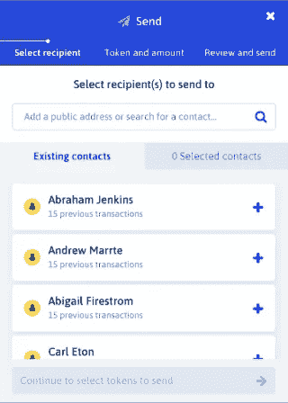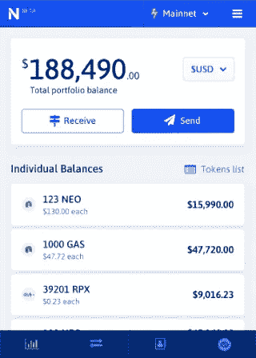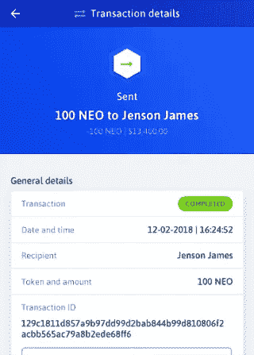

*2018 年 2 月 25 日更新*

霓虹团队终于透露了消息。不要陷入任何骗局，永远不要把你的 NEO/GAS 或任何东西转让给声称发行代币的人。只信任 neonexchange 的 twitter 或网站上的信息。

以下是代币销售的推广阶段。他们有一个参与抽奖的机会——考虑到巨大的需求和避免微小的个人上限，这是公平的。如果没有填好(这是非常不可能的)，他们会给更多的人一个机会。

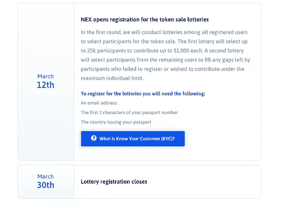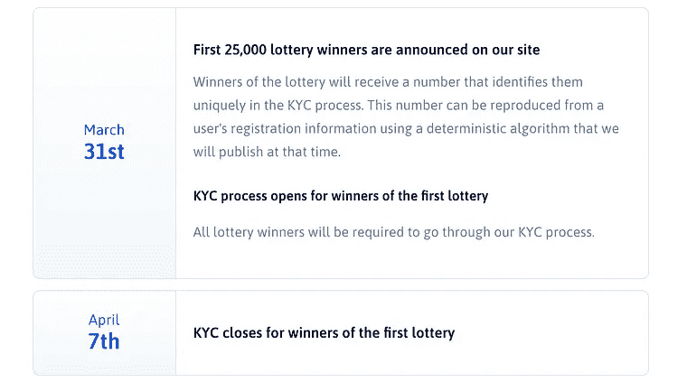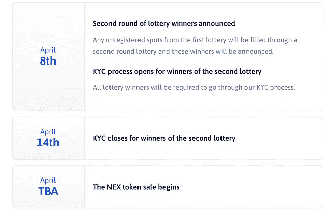

KYC 是两轮彩票中奖者(每个参与者)的必填项，NEX 的价格在两轮中是相同的。

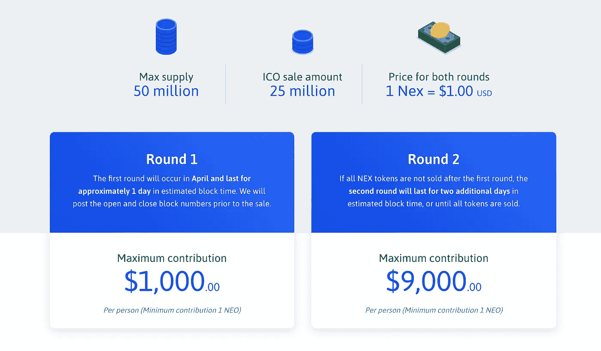

令牌分发如下所示

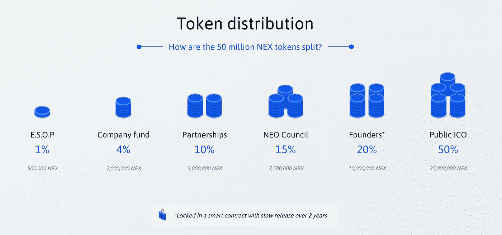

*2018 年 2 月 22 日更新*

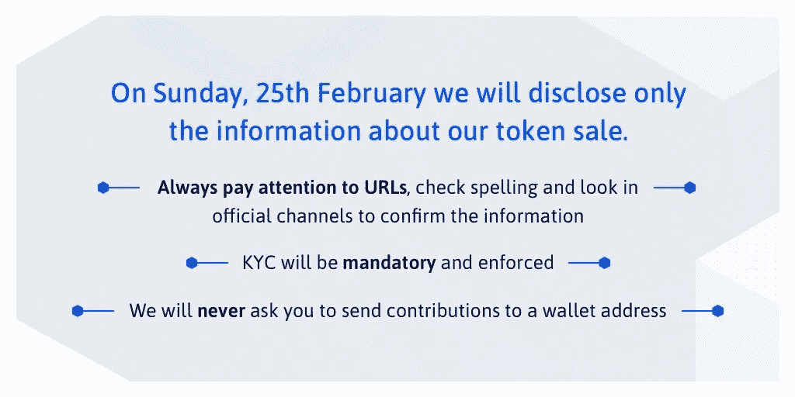

*2018 年 2 月 19 日更新*

> 下周日，2 月 25 日，我们将在[http://www.neonexchange.org](https://t.co/jqH4mLSCeD)和[https://medium.com/neon-exchange](https://t.co/fshIB1SyU2)发布我们的代币销售信息以及所有最新的详细信息。仔细阅读，做好准备！

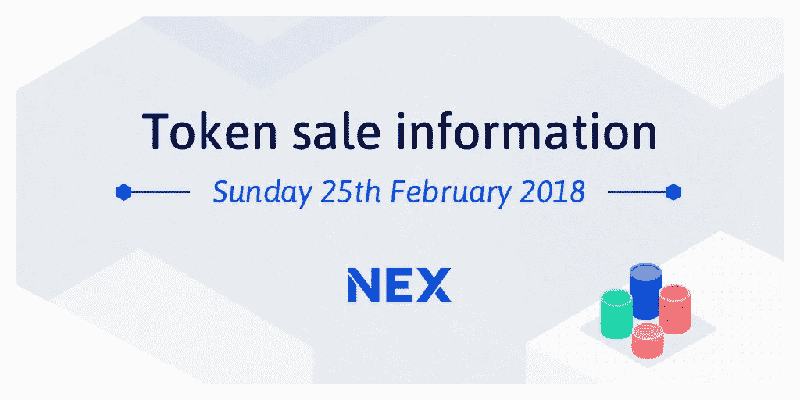

*2018 年 2 月 8 日更新*

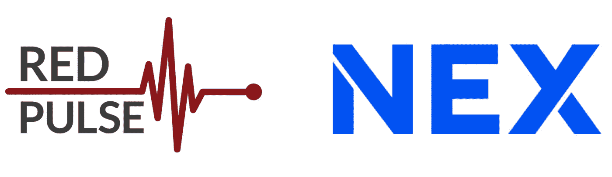

Red Pulse 将是首批与 NEX 一起将传统经济用户与先进的区块链技术联系起来的应用程序之一，允许 Red Pulse 平台上的专业人员轻松地在无缝体验中使用菲亚特的 RPX token。

*2018 年 2 月 2 日更新*

> 再强调一下:NEX 只有三个官方信息来源:
> 
> [https://twitter.com/neonexchange](https://t.co/eeID6oyeAx)
> 
> [https://medium.com/neon-exchange](https://t.co/fshIB1SyU2)
> 
> [https://neonexchange.org](https://t.co/22I2XwGWdb)

这篇文章只是他们的更新列表，而不是官方信息来源。

*2018 年 1 月 22 日更新*

## 对伊森·法斯特的采访

Ethan Fast the co-founder of NEX and City of Zion and the creator od the NEON wallet and discuss the NEX token sale and the importance of DEXs. NEX is a high powered decentralized exchange which is shaping up to be a formidable player in the space

NEX 或 NeonExchage 即将推出 ICO，他们的代币销售细节从今天开始被取笑。

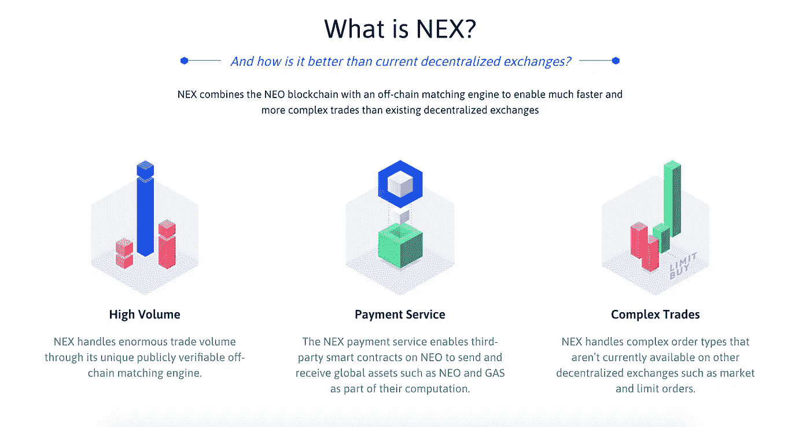

以下是他们今天，也就是美国东部时间 1 月 13 日下午 2:00 通过 [twitter](https://twitter.com/neonexchange/status/952256164070387712) 给我们的初步预览。

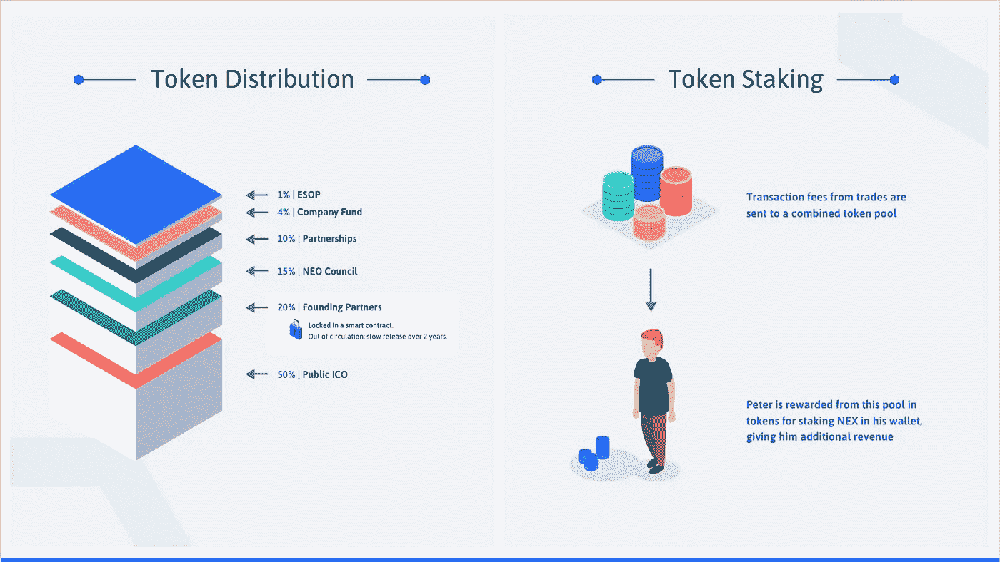

优秀 ico 最常见的做法是

1.  要求用户注册加入白名单
2.  提交 KYC/反洗钱文件
3.  处理文件和 id 以验证所有符合性清单
4.  批准白名单，并设定最大贡献的上限，以避免鲸鱼积累。

所以我们希望 NeonExchange 也能做到这一点。我将通过这篇文章以及在 twitter 上发布实时更新。所以，请在[媒体](/@vvkr) & [推特](https://twitter.com/confusedcoin)上关注我，以便快速更新。