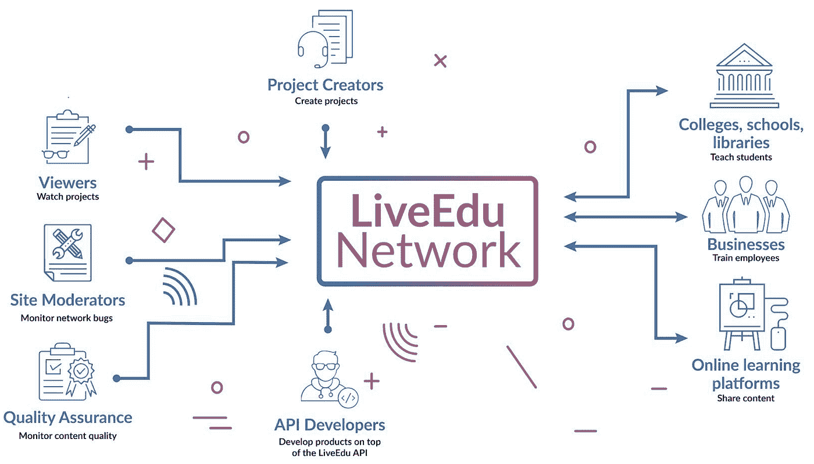
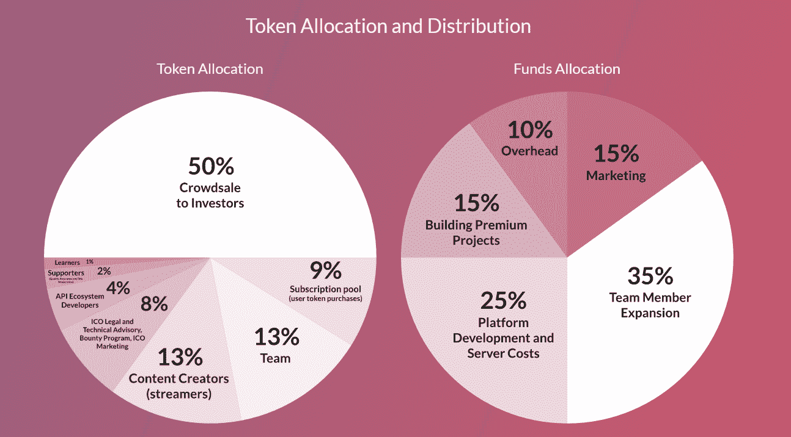
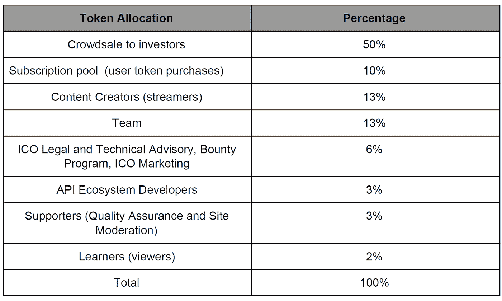

# LiveEdu ICO 评论

> 原文：<https://medium.com/hackernoon/liveedu-ico-review-66ffaf1bfe51>

Image Caption: Before reading this review, please read our disclaimer at the bottom of the article or [here](https://thebestoficos.com/disclaimer.html#). This Paid Story is brought to you by LiveEdu.

## 分散式学习平台

# 介绍

LiveEdu 是一家远程分布的公司，团队成员来自美国、欧洲和亚洲。母公司在加州旧金山合法注册。LiveEdu Inc .拥有英国子公司 Livecoding Ltd(通过该公司运行其 ICO)。他们的产品是一个分散的 P2P 学习平台，帮助人们学习新技术的技能，他们的平台专注于教有经验的人如何构建完整的产品。

让这家公司如此有趣的是，他们有一个教育专家组成的资深团队，他们经历了 [Y Combinator](http://www.ycombinator.com) (S15)，拥有过百万用户的**。**

**该公司正在寻求筹集资金，以换取他们的教育令牌(EDU)，令牌使用户能够观看优质内容，它还充当所有金融交易的支付系统，以及内容创作者、API 开发者、QA 和版主的奖励系统。**

**[他们的 ICO 将于**2018 年 1 月 15 日**](https://tokensale.liveedu.tv/) 开始。他们的公司希望通过视频和直播来教育人们的技术技能，这两种方式都是通过该平台托管的。这家名为 LiveEdu Inc .的公司自 2015 年开始运营。在这些年里，他们为 194 个国家的 500 多万观众提供了视频内容。他们的公司拥有超过 10，000 条制作内容的流媒体。平均每个流媒体有 20 个视频，他们的平台上有超过 200，000 个视频，并且通过录制的视频和流媒体快速增长。**

# **这个想法**

**随着新技术的快速发展，据估计，在未来 15 年内，由于人工智能和其他技术的接管，高达 40%的人口可能会失去工作。这意味着，如果世界人口不学会如何学习，数十亿人将失业，或者更糟，无法就业。**

**LiveEdu 的首席执行官 Michael J. Garbade 博士自 2015 年以来就有创建技术技能发展视频平台的愿景。创建 LiveEdu 的原因是因为他认为没有人从头到尾教人们如何开发产品。**

> **“没有一个项目学习平台可以教已经通过初级阶段的大学生和专业人士如何构建完整的产品。”—迈克尔·嘉宝德，LiveEdu 首席执行官**

**他们的使命是创建世界上最大的项目学习网络，重点关注:**

1.  **人工智能**
2.  **网络安全**
3.  **游戏开发**
4.  **数据科学**
5.  **加密货币**
6.  **编程；编排**
7.  **设计**
8.  **增强现实/虚拟现实**

**该平台采用订阅模式，用户可以使用 EDU 令牌(premium)观看视频。该平台还允许用户在观看完整版本之前预览视频。无需中间人即可快速完成交易的能力激发了 LiveEdu 使用自己的代币作为支付系统。**

# **令牌**

**LiveEdu 运行的是标准的 ERC20(以太坊)令牌。他们正在建立一个类似于 Steemit 的环境。由于他们的平台是用户、企业、开发者、版主和内容创作者的网络协作，他们觉得区块链是解决这一问题的最佳方式。这也和其他社交网络 ico 很像，比如 [Kik 的 KIN](http://www.kinecosystem.org) 。**

****

**LiveEdu network, taken from LiveEdu White Paper page 4 found [here (PDF)](https://tokensale.liveedu.tv/static/docs/LiveEdu-white-paper.pdf)**

**他们的代币也是该平台的一种会员资格，从市场上回购代币为其持有者提供 20%的年收入，并使持有者能够在网络上对关键决策进行投票。**

**LiveEdu 还与加密货币社区的成员建立了牢固的关系，例如，LiveEdu 与 Bancor 合作，使用户能够在该网络内将 Edu 令牌转换为其他令牌，从而提供了难以置信的流动性机会。**

# **ICO 详细信息**

**LiveEdu 的 ICO 会发生在 2018 年 1 月 15 日到 2018 年 2 月 10 日之间。代币销售将在筹集 400 万美元后的 48 小时内结束。ICO 将在头两天分别获得 20%和 17%的奖金，之后每天下降 1%。**

**他们的 Pre-ICO 从 2017 年 11 月运行到 2017 年 12 月。在这个阶段，LiveEdu 团队允许人们购买 Edu 来交换 BTC、瑞士联邦理工学院和法定货币。**

# **资金用途**

**LiveEdu 的 ICO 的硬上限是 1000 万美元，而他们的投资窗口到期计时器是 400 万美元后的 48 小时。所以拿出资金使用预算当然可以半信半疑。**

**尽管如此，该公司仍然提供了他们可能计划如何使用资金的详细分析:**

****

**Fund and Token allocation found on [LiveEdu ICO Website](https://tokensale.liveedu.tv/?_ga=2.255977419.1367046379.1515622258-621322744.1514656036).**

**假设 ICO 为 1000 万美元，分配给每项任务的金额看起来非常合理，我们只希望资金使用明细也包括直接分配给项目创始人和投资者的代币金额。Ripple 目前正面临着巨大的批评，因为它不仅混淆了这笔金额，还给了自己大量的代币。**

**同样值得一提的是，ICO 筹集的资金有一个特定的目标:该公司希望用这笔资金建立 10，000 个项目，或者为他们关注的 8 个技术主题中的每个主题建立大约 1250 个项目。以每季度 700 个左右的速度。**

**LiveEdu 计划利用这笔资金开发这个平台，并在**

*   **营销主管**
*   **销售主管**
*   **生产部经理**
*   **课程负责人**

**他们的策略是增加网站上内容创作者的数量，以及提高项目质量和流媒体视频的基础设施。**

# **令牌分发**

**代币将通过下表分发:**

****

**Token allocation, found on page 25 of LiveEdu White Paper**

**该平台将在团队内分发 13%的代币。从这 13%中，团队成员可以立即销售 25%，其余 75%在未来 3 年内销售(每年最多 25%)。这类似于无悬崖期和 4 年授权期的股东协议。类似地，另外 13%的代币将分配给内容创作者，这将在 3 年内分配。为了让创作者获得代币，他们必须生成内容。**

**关于这个 ICO 的一个有趣的部分是，铸造的代币总量目前还不知道，它将取决于实际筹集的金额。白皮书与代币价值挂钩已经过时，但是，他们发布了一个新的帖子，解释说代币与每 EDU 代币 0.1 美元挂钩。他们采用 ETH 和 BTC 30 天的平均值来确定其价格，但目前他们采用的 ETH 和 BTC 的价格是:**

*   **1 BTC(～16，000 美元)= 160，000 EDU(或每 EDU 约 0.10 美元)**
*   **1 埃特(约 1000 美元)= 10000 EDU(或每 EDU 约 0.10 美元)**

**这意味着在 ICO 关闭之前，无法知道分发的令牌总数，令牌的最大数量目前未知(取决于 ICO 成功与否)。**

**相反，该公司决定在批量定价的基础上给予折扣。这似乎与“价格和支付时间套利”购买具有相同的效果，因为投资者将能够通过大量购买和出售来滥用这一点。。**

# **如何购买 EDU**

**EDU 令牌可以用以太坊(ETH)和比特币(BTC)购买。这是稳定令牌(在他们的 ICO 时期)，所以加密货币之间的转换是稳定的。EDU 代币将在其 ICO 之后通过 [Etherdelta](https://etherdelta.com/#EDU-ETH) 交易所上市。然而，你可以通过购买瑞士联邦理工学院或 BTC 来投资 ICO。至少需要投资 3 美元。**

**以下是 EDU 令牌的转换:**

*   **1 埃特(约 1000 美元)= 10000 EDU(或每 EDU 约 0.10 美元)**
*   **1 BTC(～16，000 美元)= 160，000 EDU(或每 EDU 约 0.10 美元)**

**他们的网站上有一个清晰的购买 EDU 代币的步骤指南，点击这里。令牌目前在[以太三角洲](https://etherdelta.com/) ( [最近被黑](http://mashable.com/2017/12/21/etherdelta-hacked/))交易所上市，这意味着一些 EDU 已经在流通，并正在申请扩大到更多。**

# **区块链测试**

**在论文的开始，他们提到他们正在开发一个分散的平台。这是一种误导，因为 LiveEdu 仍然控制着整个平台，没有分散信任或通过分散消除交易对手风险。内容创作者仍然必须相信 LiveEdu 会为他/她的服务付费，或者当他想要兑现他的代币时，他们不会人为地抬高/压低 LiveEdu 代币的价格，实质上给予他们完全的集中控制。他们还提到产品开发和项目决策将通过投票实现民主化，但也没有给出任何细节。**

**白皮书展示了使用区块链技术的良好用例，即他们有一个社交网络，其中的行为通过令牌平台货币化。**然而**，仍然有一些有效的问题需要回答，为什么这种方法比传统的基于法令的方法更好，特别是因为内容创作者希望在创作内容时获得可实现的货币报酬。**

**此外，社交网络作为一种通过令牌化货币化的区块链应用模式，通常涉及自由市场微观经济，其中价格由内容创作者和消费者自己控制，但在 LiveEdu 中，我们根本无法洞察微观经济机制，因此仍然怀疑这种适合区块链的说法是否有证据支持。**

**LiveEdu 表示，令牌化将解决他们的市场先有鸡还是先有蛋的问题，这肯定是真的，但是，他们应该更加清楚他们的实际区块链实现如何与平台上完成的操作联系起来。特别是为什么需要工作证明风格的分散化，因为如果分散化不是奖励机制的核心，所有这些都可以在非区块链应用程序上毫无问题地复制。他们没有这方面的规范，因此没有办法确定平台-操作-区块链-应用模型是否实际应用于该技术，或者以何种方式将 Steemit 类型的令牌应用以技术方式应用于网络。**

**由于一家声誉良好的公司正在监督 ERC20 令牌的开发及其实施，我们希望看到一份技术白皮书来介绍这些声明并回答这些问题，因为它们在当前的商业白皮书中没有涉及。然而，在我们审查这样一份文件之前，这些问题需要得到重视。**

# **技术**

**关于令牌细节本身的细节非常少。由于 new alchemy 正在监督这方面的技术开发，他们无疑在该领域拥有专业知识，但是我们仍然希望看到关于智能合同如何在网络中的行动方面工作的细节。可以有把握地认为，EDU 将成为一个 ERC20 的象征，但除此之外，我们对智能合约的内容一无所知。**

# **牵引力**

**这个 ICO 最好的一个方面是，这已经是一个老牌公司，有用户群，有经验，有互相了解的团队，有完全开发的产品。我们最喜欢的一些 ico 了解他们的受众、他们的产品，并有真正的理由为他们的平台开发区块链解决方案。通常是因为他们的平台有大量的数字资产被转移(数据和货币)，以及强大的网络效应。LiveEdu 肯定是这些公司之一(另一个例子是 Kik 的 Kin，拥有超过 3 亿用户)。**

**到今天为止，LiveEdu 已经被超过 100 万的用户使用，这些用户来自 194 个国家，他们有一个图书馆，里面有超过 13，000 个内容创作者制作的超过 200，000 个****视频**。对于一家成立仅 3 年的公司来说，这的确令人印象深刻。该公司还得到了世界上最大、最负盛名的加速器 Y Combinator 的加速。因此，这个团队和想法都经过了严格审查，并得到了世界上一些顶级科技风险投资家的投资。****

# ****组****

****LiveEdu 的团队相当令人印象深刻，也是这家公司最有趣的方面之一。这使得一家希望培养人才的公司将由懂教育、技术和软件的人组成。LiveEdu 的创始人是 Michael J Garbade 博士，核心开发团队包括:Alex Zhukov 和 Ilya Toka。****

****LiveEdu 的首席执行官 Michael J. Garbade 博士拥有 MBA 学位、物理学硕士学位以及金融(风险投资)博士学位。在 LiveEdu 之前，他已经开了多家公司，既懂软件(他是 python 工程师)，也懂财务。他曾在亚马逊和通用电气这样的大公司成功工作过。****

****Alex Zhukov 也是一名软件开发人员，专攻 django、python、js、go 等。他是一名自学成才的软件开发人员，拥有物理学硕士学位。最后，Ilya Toka 是一名拥有丰富前端经验的 JavaScript 开发人员。****

# ****透明度和清晰度****

## ****货币铸造****

****目前还不清楚 LiveEdu 是否计划完全摆脱目前基于菲亚特的货币化系统，并以令牌取代它。****

## ****批评****

****LiveEdu 声称，他们的平台不与现有的在线平台直接竞争(白皮书，第 5 页)。然而，这很难说是真的，目前有其他平台为多种技能水平的人提供在线教育，如汗学院，麻省理工学院开放课件，Coursera 等。虽然其中一些不是通过流媒体服务提供的，但它们确实为作业、测验和论坛提供了互动体验。我们认为真正让 LiveEdu 与众不同的，不是来自用户的技能水平，我们觉得不可思议的是它从头到尾专注于创造产品的事实，这种学习方式要更新得多，我们比别人想得好得多。****

****该公司提到，ICO 将为令牌持有者提供对网络决策进行“投票”的机会，但白皮书对这意味着什么以及具体如何运作极其含糊。此外，这不应与任何类型的公司投票或典型投资者优先股附带的任何此类活动相混淆。他们有一篇博客文章详细介绍了令牌是如何制造和使用的，但是我们建议将这些细节包含在白皮书中。****

****我们也不确定该公司如何试图维持令牌的价格，对于将用于维持稳定令牌的技术没有很好的解释，这通常是一项非常困难的工作，通常需要令牌创建者以某种形式的资产来支持它。此外，由于 livedu 代币在网络上的行为可以被任意改变(没有看到智能合同规范),因此奖励 livedu 代币的机制的模糊性留下了许多问题，即他们是否可以完全控制定价，从而人为地按照他们的喜好抬高代币的价格，完全剥夺了我们从供求市场中期望的任何自由市场定价，这可以完全消除社交网络区块链的好处。****

****此外，白皮书对用户从固定支付转向其他支付的好处含糊不清。他们提到了 paypal 的问题，但没有提到 stripe，然后他们提到欧洲和亚洲难以获得法定支付工具。然而，在这些国家获得比特币往往比获得法定支付工具更难。因此，该公司似乎正在以“自己购买加密货币，然后在这里消费”的形式将他们的法定支付处理费转嫁给用户。****

****最后，我们希望白皮书上有版本号。目前，在 ICO 之前和之后的白皮书中有所更改，并且在阅读新版本时没有声明这些更改。使得难以找到一致性。****

# ****结论****

****LiveEdu 是一家潜力巨大的公司，制作视频帮助人们从头到尾制作产品似乎是学习的正确方式。在我们这样一个快速发展的世界里，很明显，快速学习新技能将成为任何希望在 2018 年保持竞争力的人的必需品。****

****也就是说，我们对加密货币的使用有很多疑问。在 ICO 期间，代币将以稳定的价格出售给投资者，之后的定价将取决于交易所，很难估计之后会发生什么。“fiat”解决方案似乎也同样适用，不需要使用 ERC20 令牌。****

****由于他们令人难以置信的血统(Y Combinator ),我们没有理由认为这家公司不能既实现他们的技术目标，又能通过他们的投资者名单和广泛的营销努力获得资金。该公司在上市前的第三季度也达到了[100 万美元的软资本。开了一个好头。](/liveedu-ico/liveedu-reaches-1m-soft-cap-in-presales-public-sale-starts-monday-5pm-utc-60ed8710d455)****

****LiveEdu 还在他们的白皮书中对每 Edu 的加密货币价格进行了大量修改，以反映最近在 ETH 和 BTC 经历的波动性。****

****我们想知道他们为什么需要创建加密货币和 ICO，白皮书省略了许多关于区块链测试的解释(为什么是区块链？)，技术如何与众不同，以及为什么 ICO 是适合他们的投资类型。****

****想帮忙吗？
**在 Bountey 上支持我们！**[**https://www.bountey.com/bestoficos**](https://www.bountey.com/bestoficos)****

*****想在 ICOs 中保持最新？* ***访问我们在***[***https://thebestoficos.com***](http://thebestoficos.com/)****

*****有一个有趣的故事？* ***写我们在 info@bestoficos.com*******

# ****放弃****

****免责声明:本网站及其包含的信息无意成为投资、金融、税务或法律建议的来源。本网站不能代替专业建议和独立的事实验证。在没有首先评估你自己的个人财务状况，也没有咨询财务专家的情况下，千万不要使用这个网站上的想法和策略。本网站的所有内容仅供参考，按“原样”提供，不保证完整性、准确性、及时性或使用本网站所获得的结果。这只是一个存根，您对本网站的访问和使用取决于您是否接受并遵守[全部免责声明。](https://thebestoficos.com/disclaimer.html)免责声明适用于所有希望访问或使用本网站的访问者、用户和其他人。****