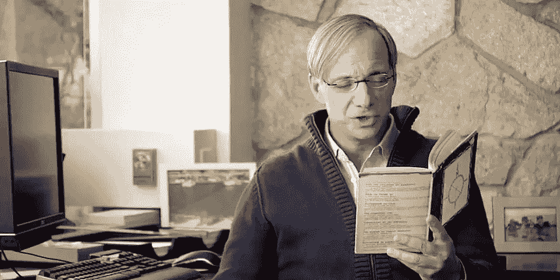

# 过有原则的生活

> 原文：<https://medium.com/hackernoon/living-a-principled-life-d7f83cef3ad1>

## 对原则的思考，雷伊·达里奥著

布里奇沃特资本公司的创始人和前首席执行官雷伊·达里奥可能是我心目中最大的英雄。自从他第一次在 Bridgewater online 上发布使用的原则以来，我一直在遵循他的生活和工作哲学，通过他最近出版的关于这一主题的书，我能够获得关于这些原则如何形成的背景的宝贵见解。

我坚信彻底透明和彻底寻求真相的精神，这是我的控股公司的基本原则。在 In Formation，我们有一个正式的流程来提议、批准、修改和否定我们在业务中做出每一项决策所依据的原则，我们花了很多时间来做这些事情，因为我们觉得通过建立一个坚实的运营原则基础，我们正在投资建造一台可以在没有我们的情况下运行的机器(这应该是任何企业家的最终目标)。

正式流程超出了本故事的范围，但我想更广泛地谈谈我在 Bridgewater 的背景，我从雷伊·达里奥的书中学到的东西，我们如何看待信息中的一般原则，以及我们试图建立什么来进一步正式化流程。

## 我对布里奇沃特的采访

我第一次知道雷伊·达里奥是在我们开始雇佣信息公司来建造 Anastasia VR 的时候。我们在威灵顿招聘，但我想学习进行面试的最佳方式，所以我开始回复[招聘人员每天发来的大量冷冰冰的电子邮件](/in-formation-holdings/stop-f-cking-emailing-me-b367ee3dfbcd)，并回到美国几周，尽可能多地参加面试。

在我最忙的时候，我每天安排 2-3 次面试，但是 Bridgewater 对他们精英研究技术部的面试是一整天。这可能是我有幸经历过的最棒的一次面试经历。我的大部分面试问题，无论是技术性的还是非技术性的，都是受到这次面试中所提问题的启发。

在这短暂的时间里，以及之后的一些跟进，包括与一些团队成员的早餐，我开始了解他们公司的精神，我被迷住了。与我所有的其他面试不同，我真的觉得我可能会因为最终拒绝他们的邀请而错过一个机会。

他们以一种面试中不常见的方式挑战我。当我说一些可疑的话时，他们大声叫出来。当我讲述我在以前的工作中如何使用讽刺来处理设施纠纷的故事时，他们非常准确地告诉我，他们认为我所做的没有效果，以及在布里奇沃特应该如何处理类似的事情。当我在我不相信的范围之外发表声明时，他们会通知我。

尽管我与布里奇沃特团队成员接触的总时间可能不到 12 个小时，但在那段时间里，我学到的关于如何管理团队的知识比我一生中学到的都多。这是深刻的。

## 形成我自己的一套生活原则

为了开始建立我自己的原则，我从雷的开始。我通读了他出版的《生活原则》，并且仔细阅读。我把它们打印在纸上，双倍行距，并在每一个句子上都做了注释。

正如雷可能会建议的那样，我没有轻信他们的话。我不同意他的许多原则。特别是，我发现他对进化论的理解相当平淡和幼稚，而进化论是他的一些原则的焦点。

也就是说，这个框架是有意义的，其中有很多很好的见解，即使他的论证并不总是准确的。

所以我采纳了这些原则的一个子集，也许是全部原则的 1/3，并开始了我自己原则的谷歌文档。这个项目将继续推动我的很多决策，直到今天。

正如雷在他的书中指出的那样，情况的种类远远多于情况的种类，每当我们遇到一种情况，我们可能已经从历史中找到了一种可以借鉴的典型情况。于是我开始记录我遇到的情况。

有些情况完全是新奇的，是我过去从未遇到过的事情，但正如雷所说，大多数只是“那些情况中的另一种”。随着我继续记录情况，我开始能够将它们组织成原型，或者我一次又一次遇到的常见情况。

有了原型，我开始能够看到我应用于那些情况的原则中的模式，我开始能够看到那些原则如何导致不同类型的结果的模式。我正在建立*自己的一套独特的原则*。

此外，我意识到我正在应用的模式是我如何看待生活中的情况，以及我如何发展这套原则，并开始将它们形成自己的元原则。我发现了一些东西。

## 我从雷伊·达里奥的书中学到了什么

当雷伊·达里奥的书出版时，这是一种意想不到的享受。我尽快在亚马逊上预订了这本书，并在几个晚上内从头到尾读了一遍。

看到雷遭遇失败并从错误中学习以发展他的原则的方式，反映了我在形成自己的原则时已经做的许多事情，所以我确信我是在正确的道路上。

雷有着特殊的背景。他白手起家，成为世界上最富有的 100 人之一。我也是白手起家，虽然我为自己目前所取得的成就感到自豪，但我与他所建立的东西相差甚远。我渴望得到他所能做到的一小部分。

他关注的是一个与我完全不同的领域。经济和金融领域广泛涵盖了所有垂直领域的资本主义力量。他利用技术来做决定，但我不会把他描述成一个技术专家。

然而，随着技术继续渗透到[更多人生活的更多方面](/in-formation-holdings/2018-startup-trends-hacking-the-attention-hackers-or-the-attention-arms-race-f08ec02ee1c3)，技术正在成为主导力量之一。统治世界的将是未来的技术专家，而不是银行家，我们将是掌握着钥匙的人。

雷表达的谦逊是我们都可以学习的。这并不是一些人表达的 T4 式的谦逊，他们把自己树立为智慧的典范，他的记录本身就是如此。这是一种真正的谦逊，超越了对他人的表达，而是深入到他自己的内心。是他自己内心的一种谦卑驱使他不断迭代和改进自己处理生活的方式。

他的原则来自于许多具体的错误，虽然这本书详细介绍了几个较大的错误，但可以肯定的是还有数百个错误。每个人都给了他一个学习和成长的机会，并作为他自己的个人机器和他的业务机器的一部分，制定新的规则，以顺利运行。

也许比任何事情都重要的是，这些原则应该是一份活的文件。虽然它可以在任何给定的时间拍摄，但它必须一直发展，并受到批评和修改。

很容易把雷的原则看作是上天赐予的东西，但事实并非如此。它随着时间的推移而发展，并通过不断的发展而成为现在的样子。

这让我放心，尽管我自己的原则相对较小，还处于早期发展阶段，但它们正朝着正确的方向前进。也许要花一年，也许要花十年，才能让雷的原则达到稳定和成熟的程度，但即使那样，也不会“完全”

随着现实的变化，随着我们对现实的理解的变化，我们必须不断地准备好接受新的真理，并以谦逊和接受的态度处理它。雷教我的。

## 进入:PrincipleHub，GitHub 为现实生活

在 In Formation，我们正在内部开发一个叫做 PrincipleHub 的工具，我们可能有一天会把它变成一个产品，也可能不会。PrincipleHub 背后的基本思想是，我们需要记录我们在生活和业务中遇到的情况，并从中学习。

它本质上是我们传统上在谷歌文档中所做的事情的形式化。由于我们已经在内部建立了一套如何组织和更改这些文档的规则，我们已经有了一个如何工作的蓝图。我们也有一个相当大的数据库来做种子。

我们正试图为生活和经营企业构建程序，就像 Github 收集运行计算机的程序一样。我们希望有一天开源或以其他方式发布这个软件，但首先，我们需要在内部和一小群思想开放的人一起运行它，这样我们就可以了解什么可行，什么不可行，PrincipleHub 的元原则。

Bridgewater 也有一些系统可以做到这一点，我们从一个稍微不同的、更集中的方向来处理这个问题，目的是建立一些具有广泛适用性的东西。

如果您有兴趣加入试点计划，请在评论中发表意见！