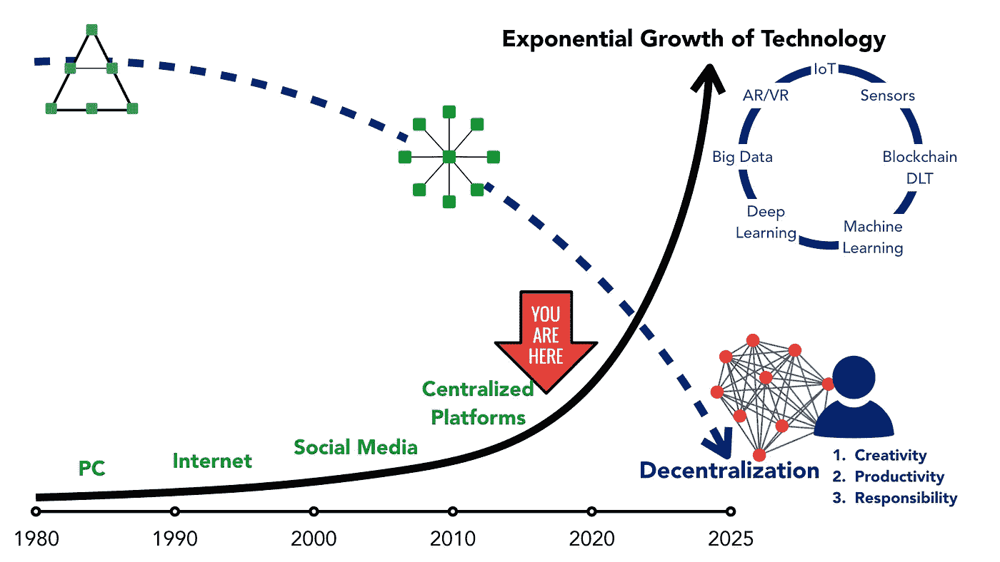

# 在未来分散化的世界中生活和工作

> 原文：<https://medium.com/hackernoon/living-working-in-the-decentralized-world-of-tomorrow-23ac3e8e345>

## ***当你想做某事时，去找一个忙碌的人***

Photo by [Denin Williams](https://unsplash.com/photos/hVF_04fzKO4?utm_source=unsplash&utm_medium=referral&utm_content=creditCopyText) on [Unsplash](https://unsplash.com/search/photos/running-kite?utm_source=unsplash&utm_medium=referral&utm_content=creditCopyText)

在最近的一次会议上，有人向我提到了生产率和工作量之间的联系，此后我一直在思考这个问题。

这很有违直觉。在某种程度上，这毫无意义。当然,“忙碌的人”是你最不想做的人。然而，当我与朋友和同事讨论这个建议时，他们都同意这个建议是有道理的。尤其是在我们这个技术驱动、分散的世界中。

但是思考*为什么*会这样要棘手得多。我没有一个明确的答案，但这里有一些初步的想法。

# **技术、颠覆、分散**

数字技术的指数级增长极大地破坏了主导二十世纪经济和社会生活的中央集权组织和系统。

最明显的是，信息技术已经改变了组织的运作方式。这种持续破坏的结果是打破了传统的等级制度和既定的角色和程序。所有组织现在都处于不断变化的状态中，因为它们都在努力适应新技术的连续浪潮。

联网设备的扩张进一步加速了这种向更扁平、更分散的世界的范式转变。互联网促进了新“平台”公司的出现，如挑战传统运营方式的 Spotify 和 Airbnb。此前主宰音乐、酒店和其他大部分行业的强大“中间商”(中介)尤其受到了影响。

纵观区块链和分布式账本技术、人工智能、传感器和自动化的最新发展，这种将活动、功能和运营从中央集权机构重新分配出去的过程无疑将继续下去。

> *数字技术从内部颠覆，从外部挑战，正在改变一切。*

# **数字化生活**

“我们”(消费者、普通大众)迅速接受去中心化趋势的原因很简单。在最好的情况下，中央集权系统缓慢而官僚。他们严重依赖授权的程序和过程(这是建立和保持信任和一定程度的透明度所必需的)。然而，在最坏的情况下，这样的系统容易出错、腐败和被黑客攻击。

当然，我不否认旧的中央集权世界及其遗留影响仍然无处不在。但事情正在慢慢改变，新技术预示着一个更快、更透明、更有活力的世界。更具包容性和流动性的社区正在取代中央集权的等级制度。

这里我们到达了临界点: ***数字化转型在个人层面影响着我们所有人*** *。这不仅仅是一些抽象的变化，远离我们的日常生活。*

以下是在未来分散化的世界中生活和工作的三个非常明显的影响。

## ***#创意***

技术带来了颠覆，而这种颠覆带来了新的机遇。抓住这些机会需要创造力，因为现有的模板不太可能成功。

这种创造力对不同的人意味着不同的东西。它可能意味着在建立一个独特的“职业”或生活方式的创造力，也可能意味着在工作场所更大的创造力。

也许这就是分权、社区和网络的真正力量所在。在一个开放、扁平和“最佳创意获胜”的文化中工作，会为变得更有创造力提供强大的激励。

此外，新技术消除了边界以及地理和文化距离。这种包容性使得社区/网络更加高效和有效。

> *分散社区/网络的力量在于多样性和包容性。*

分享、协作和利用彼此的想法和工作的能力可以产生前所未有的创造力，最终有助于解决世界上最紧迫的问题。

## ***#生产率***

权力下放、创造力和社区/网络思维将带来更大的生产力。遗留系统、中介和流程往往会减慢速度。

在分散的系统中，人们可以分享他们的工作，并即时表达自己。直接反馈和对话也意味着我们不断改进自己和我们的工作。

## ***#责任***

但是仅仅依靠新技术是远远不够的。我们都必须愿意并且能够接受新的“秩序”。

在这里，我不仅仅指获得技术或精通技术。它远不止于此。我们必须成为技术的“负责任的”用户和新社区和网络的“负责任的”成员。我们必须在这个新兴的世界及其新的价值观中更加投入、更加投入和参与。

所有这些都需要改变心态。我们大多数人都接受过教育，并为一个中央集权的世界做好了准备。我们理解层级、程序和流程的重要性。但是在一个分散的系统中，取悦一个组织/系统的“意愿”必须被“个人”和“合作”的创造力所取代。

我们必须学会成为负责任的合作者。我们必须学会支持和批评。自学和批判性思维是确保社区/网络正常运行的必要技能。我们不能躲在程序和流程的组织面纱后面。我们必须是积极和负责任的成员，能够跳出框框思考。

# 忙碌起来！

这让我回到了最初的问题:

**“*为什么当你想完成某件事时，一个忙碌的人是最好的求助对象？”***

去中心化的数字世界的核心原则是自由和责任。真正忙碌的人会明白这一点。他们理解“积极”、“合作”、“批判”的力量

忙碌的人只是更符合数字世界的价值观。他们拥抱存在的可能性和机会，因此，他们更有可能为快速变化的世界提供更好的解决方案。

一个真正忙碌的人可能比其他人“时间更少”，但他们拥有比空闲时间更重要的东西。他们对快速去中心化世界的价值观和需求有着深刻而直观的理解。

这种理解是在未来的数字世界中取得成功的关键。这就是为什么当我们想做某事时，我们会求助于一个忙碌的人。

非常感谢您的阅读！请按住👏*下面，还是留下评论吧。*

每周都有新的故事。因此，如果你关注我，你不会错过我关于数字技术如何改变我们生活、工作和学习方式的最新见解。