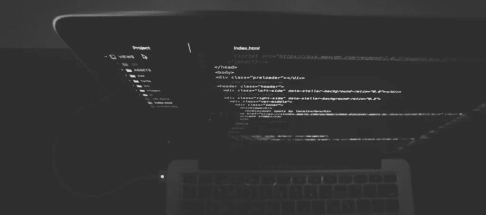

# 本地开发 Kubernetes 服务(无需等待部署)

> 原文：<https://medium.com/hackernoon/locally-developing-kubernetes-services-without-waiting-for-a-deploy-f63995de7b99>



Photo by [Nate Grant](https://unsplash.com/photos/QQ9LainS6tI?utm_source=unsplash&utm_medium=referral&utm_content=creditCopyText) on [Unsplash](https://unsplash.com/?utm_source=unsplash&utm_medium=referral&utm_content=creditCopyText)

在 [Datawire](https://www.datawire.io) ，我们所有的云服务都在 Kubernetes 上开发和部署。当我们开始开发服务时，我们注意到将代码更改到 Kubernetes 中是一个相当乏味的过程。通常，我们必须:

*   将代码更改保存到磁盘
*   重建包含代码的映像
*   标签图像
*   将图像推送到容器注册表
*   更新清单以指向新映像
*   运行`kubectl apply`

我们首先[自动化了这些步骤](https://forge.sh)，但是两行代码变更带来的延迟仍然令人烦恼(特别是对于我们这些习惯于解释语言实时重载的人)。

所以我们后退一步，问自己我们希望开发过程是什么样子的？我们得出了两个答案。首先，我们希望开发和生产环境保持一致。第二，我们希望在开发期间测试代码变更时零延迟。

# 集装箱化发展

我们经历了试图找出为什么在开发中工作的服务在生产或我们的持续集成系统中不工作的痛苦。不可避免地，这些痛苦归结于环境差异。我们热衷于创造环境一致性，以尽量减少这种情况发生的机会。

幸运的是，容器为这个问题提供了一个很好的解决方案。我们创建了一个用于开发和生产的标准 Docker 映像。这个 Docker 映像包含运行服务所需的所有依赖项。Docker 客户机还允许我们将本地文件系统挂载到容器中，这允许我们在容器中运行代码时，使用我们最喜欢的编辑器编辑代码。

这种方法在开发过程中给了我们一个快速的反馈周期，同时在不同的环境之间创建了一致性。从事该服务的任何开发人员都能够使用相同的映像，这也是在生产中运行的相同映像。

# 远程服务

我们喜欢快速开发的容器方法。然而，我们的一些服务依赖于其他正在运行的服务，我们也想要一种开发多容器应用程序的方法。

我们首先开始试验 minikube，但认为它不太适合，因为容器部署过程仍然会增加延迟。此外，minikube 需要大量的 RAM 用于我们的一些服务(例如，需要 JVM 的服务)。

我们还研究了 Docker Compose，它很容易尝试，因为我们已经在使用容器了。我们决定不使用 Compose，因为它从根本上为我们的应用程序(Docker)引入了不同于生产环境(Kubernetes/AWS)的运行时环境。这意味着我们必须维护两个不同的开发和生产环境。当我们开始考虑我们在云中运行的应用程序(例如 AWS RDS)时，这个问题变得更加尖锐。

然后，我们试验了一种面向网络的方法。我们已经熟悉了端口转发作为一种在集群中访问应用程序的方式，所以我们问自己是否有办法扩展这个概念。我们只需要找出一种方法让本地服务访问 Kubernetes 集群，反之亦然。

# 远程呈现

我们在[网真](https://www.telepresence.io)中实现了这个概念，我们在今年早些时候开源了它。网真用一个双向网络代理代替了在 Kubernetes 集群中运行的普通 pod。这个 pod 将 Kubernetes 环境中的数据(例如，环境变量、机密、配置映射、TCP 连接)代理到本地进程。本地进程透明地覆盖其网络，以便 DNS 调用和 TCP 连接通过代理路由到远程集群。

这里有一个例子。克隆以下存储库:

`$ git clone [https://github.com/datawire/hello-world-python](https://github.com/datawire/hello-world-python)`

该存储库包含一个使用 Flask web 框架的简单 Python 应用程序:

```
#!/usr/bin/pythonimport time
from flask import Flask
app = Flask(__name__)START = time.time()def elapsed():
    running = time.time() - START
    minutes, seconds = divmod(running, 60)
    hours, minutes = divmod(minutes, 60)
    return "%d:%02d:%02d" % (hours, minutes, seconds)[@app](http://twitter.com/app).route('/')
def root():
    return "Hello World (Python)! (up %s)\n" % elapsed()if __name__ == "__main__":
    app.run(debug=True, host="0.0.0.0", port=8080)
```

它还包含一个 Dockerfile，指定如何构建运行时容器:

```
FROM python:3-alpine
WORKDIR /service
COPY requirements.txt .
RUN pip install -r requirements.txt
COPY . ./
EXPOSE 8080
ENTRYPOINT ["python3", "app.py"]
```

让我们在本地构建开发环境:

`$ cd hello-world-python`

`$ docker build -t hello-world-dev .`

让服务在 Kubernetes 中运行(我们使用 Datawire 映像，因此您不必推送至 Docker 注册表):

`$ kubectl run hello --image=datawire/hello-world-python --port=8080 --expose`

现在，让我们测试一下这个服务。在另一个终端中，让我们在 Kubernetes 集群上启动一个 pod 来与服务对话。

```
$ kubectl run -i --tty alpine --image=alpine -- sh
$ wget -q -O - [http://hello:8080](http://hello:8080)
Hello World (Python)! (up 0:00:45)
```

通常，当您编写这个服务时，您必须经历一个构建容器、将其推送到注册中心以及重新部署的过程。让我们看看网真是如何工作的。确保您位于 hello-world-python 目录中，并键入:

`$ telepresence --swap-deployment hello --docker-run --rm -it -v $(pwd):/service hello-world-dev:latest`

该命令做三件事:

1.  它会将您现有的“hello”部署与远程呈现代理进行交换。
2.  它调用“docker run”来启动您的本地开发容器。
3.  它将您的本地文件系统(包含您的 Git 存储库)挂载到容器中，因此您可以进行实时编码。

我们可以通过修改`app.py`来测试这一点。在您喜欢的编辑器中打开`app.py` ，将“Hello，World”字符串更改为您喜欢的任何内容。现在，从远程 Kubernetes pod 重新运行`wget`命令:

```
$ wget -q -O - [http://hello:8080](http://hello:8080)
Hello New World (Python)! (up 0:03:12)
```

现在，您可以在本地编辑代码，更改会立即反映到 Kubernetes 集群中的客户端，而无需重新部署、创建 Docker 映像等等。

如果您使用支持自动重新加载的服务器，Telepresence 将使该功能再次发挥作用，您可以编辑服务器代码、保存并立即测试该功能。

# 结论

远程呈现简化了我们的编码周期。我们已经将它[开源](https://github.com/datawire/telepresence)，并为 Mac OS X 和 Linux 创建了 [OS 原生包。我们希望您能尝试一下，看看它是否能让您的生活变得更轻松。欲了解更多信息，请访问](https://www.telepresence.io/reference/install)[https://www . tele presence . io](https://www.telepresence.io)。