# 使用 Encfs 锁定和加密应用

> 原文：<https://medium.com/hackernoon/locking-and-encrypting-apps-with-encfs-c1484e77f479>

> 为了更好地突出语法和复制粘贴代码片段的能力，请在 [grimoire.science](https://grimoire.science/locking-and-encrypting-apps-with-encfs/) 上查看这篇文章。

共享系统的一个问题是，有时多个应用程序被多人使用。通常，这可以通过在系统中增加多用户支持来解决。毕竟*、*、nix 和 de rivate 都被[设计成](https://www.wikiwand.com/en/History_of_Unix)供多个用户同时使用。

但是，在某些情况下，单个应用程序保持锁定直到提供密码才有意义。在任何情况下， [encfs](https://wiki.archlinux.org/index.php/EncFS) 都是较好的加密方法之一(只要用户的能力高于 shad ows 安全),并且无论如何都是加密应用程序数据的好方法。加密的理由各不相同，但不管是为了让黑客的日子更难过，还是为了阻止云存储提供商四处窥探，它总是一个好主意。即使多个用户不会共享一个帐户，加密也能防止`root users`或`admins`对您的数据过于敏感。

pop u lar [gnome-keyring](https://wiki.archlinux.org/index.php/GNOME/Keyring) 和其他安全的后续操作方法并不适合这种情况，因为它们中的大多数都是一次性解锁的，并且不与特定的相似程序相关联。

在这里，我们将创建几个简单的 bash 脚本，以通用和灵活的方式锁定和加密应用程序，允许多个用户在共享应用程序的情况下加密他们自己的隐私。完整的脚本位于我的[点文件](https://github.com/HaoZeke/Dotfiles/blob/master/dotfiles/common/.local/bin/cryptHelpers/unlockEncfsApp.sh)中。

# 要求

大多数 UNIX 系统及其衍生系统(包括 MacOS、Ubuntu 和其他 Debian 版本、基于 RPM 的系统等)都有这种基本要求。

我个人运行的是 Arch Linux，但那只是一种偏见。

要求是:

1.  [**痛击**](https://www.gnu.org/software/bash/)

这是 shell 脚本中的 shell 子脚本所需要的。几乎无处不在。

2. [**EncFS**](https://github.com/vgough/encfs)

这个汉负责加密部分。虽然这里介绍的所有内容都只需要基本程序本身，但是新用户也可能会因拥有一个 GUI 界面而受益。我提供 Gnome Encfs 管理器。

3.**一个 ASKPASS 程序**

这些是最著名的怪异错误。然而，这里我们将重点关注 [zen ity](https://www.wikiwand.com/en/Zenity) 和 [git](https://git-scm.com/) 作为退路。

仅此而已。该方法的其他变体可能使用[鞋](https://grimoire.science/locking-and-encrypting-apps-with-encfs/shoesrb.com/)来获得更好的 GUI 效果。也可以使用其他的`askpass`程序和助手，比如 pop ul ar[X11-ssh-ask pass](https://github.com/sigmavirus24/x11-ssh-askpass)程序。

# 程序结构

我们的基本结构很简单。

1.  安装了加密的文件夹
2.  应用程序正在运行

此外，我们希望以下功能:

1.  在没有终端(GUI，没有终端用户查询)的情况下执行
2.  为应用程序生成新存储的一种自动生成方式
3.  挂载点的存储名

# 预赛

在开始创作脚本之前，我喜欢先用自然的外壳来解释。在这种情况下，这种方法包括检查以下内容:

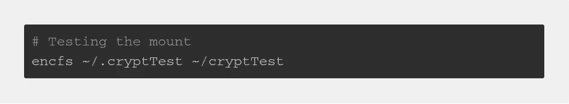

Shell trials

*   这促使我创建目录，如果它不存在的话，这将无法在 shell 脚本中正确处理。

此外，`encfs`的手册页向我展示了通过`--extpass`标签授予对外部 au then 行动管理器的支持。

# 履行

随着这些先决条件的排除，是时候开始编写脚本了。特别需要 bash shell 的部分将包含 she bang。

永远记住用它开始脚本，并且只放一次，就在文件的顶部。

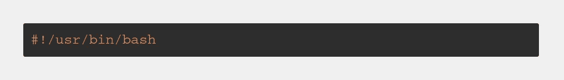

The shebang

# 设置变量

最初我们可以简单地设置一个解锁字符串，如下所示:

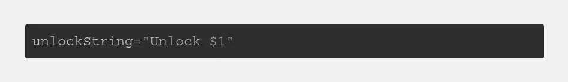

Using a variable for the unlock dialog

# 选择 ASKPASS 程序

由于脚本在没有 tend ing 的情况下也会很快变得笨拙，我们将首先添加一个适合运行外部事务的简单变量。

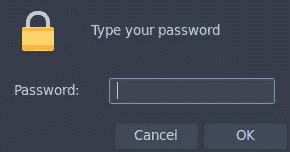

Zenity Prompt

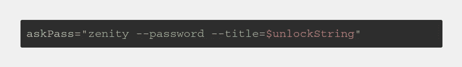

Zenity implementation

正如前面提到的，禅意是最好的选择，然而，它可能不会在任何地方都适用。所以我们需要撤退。

Git 或多或少在任何地方都是可用的，而且拥有一个非常简洁的工具也是如此。

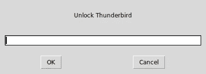

Git Askpass Prompt

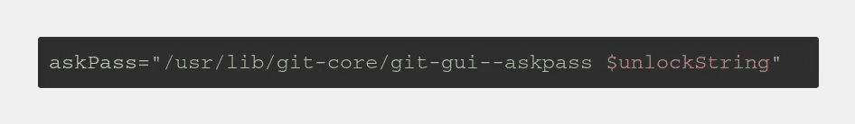

Git Askpass Implementaion

然而，最好将它们都包装起来，以便根据可用性选择一个或另一个。所以，我们写了一个简单的测试。

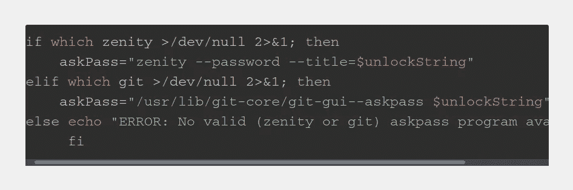

The test logic

老实说，美国的时代是 T1，而不是 T2，这有点不可思议。然而，在这里我选择了简单，因为它看起来更快。上面的更可移植(POSIX com pli ant)的版本将使用`command -v`。欲了解更多细节，请检查[该堆栈交换问题](https://stackoverflow.com/questions/592620/how-to-check-if-a-program-exists-from-a-bash-script)。

# 创建挂载点

[Gnome Encfs 管理器](https://launchpad.net/gencfsm)默认在卸载存储时移除挂载点，然而，这会导致终端输入需要被抑制，因此在运行 Encfs 之前创建目录。

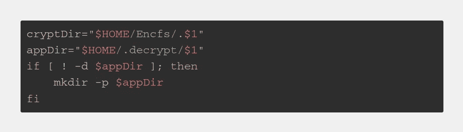

Variables and directories

## 警告

上述剪贴宠物不处理以下情况:

*   藏毒点已经准备好了
*   藏起来的东西不存在

这些将在本文档的[改进](https://grimoire.science/locking-and-encrypting-apps-with-encfs/#improvements)部分中进行处理。

# 上马就跑

现在我们可以简单地安装我们的仓库并运行程序了。

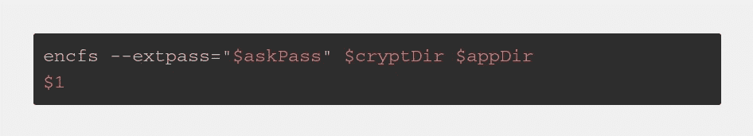

A basic mount and run

## 警告

在此阶段，脚本不具备处理以下情况的能力:

*   阿尔安装操作失败(密码错误)
*   冲突文件是加密的

该脚本在不测试挂载结果的情况下运行程序，这将导致很多错误和奇怪的错误。这些边缘情况由[处理认证](https://grimoire.science/locking-and-encrypting-apps-with-encfs/#handling-authentication)中的代码处理。

# 丰富

本节讨论对上述基本脚本的几个改进。

# 给唱片命名

这实际上并不是很重要的一点，然而，我希望应用程序目录以第**个字母开始。我还想将加密的数据存储在一个隐藏的文件夹中。**

无论如何，脚本的这一部分使用了 bash 脚本扩展。在这个
点上，我们也可以让`unlockString`变得更整洁一点。

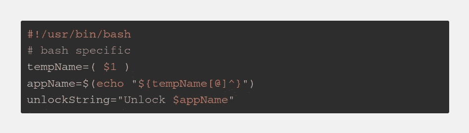

Bash substitutions for prettier names

现在我们有了名称，我们只需修改目录。

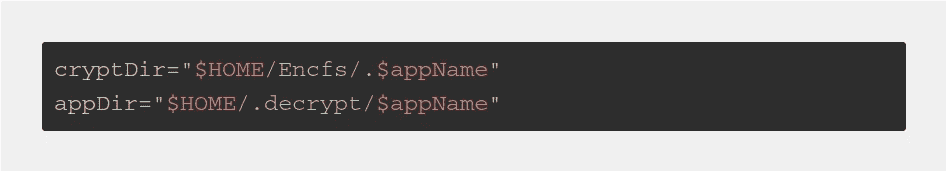

Renaming the directories

# 搬运已安装的设备

为了确保脚本甚至能够处理成功运行命令的情况，需要检查挂载点当前是否已挂载。

如果它已装载，我们将卸载它。

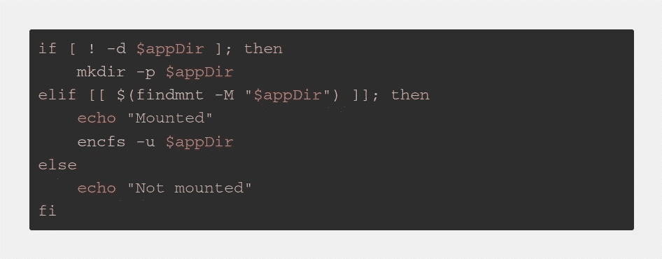

Testing for mounts

此外，对于仓库尚未存在的情况，我们还需要创建另一个目录。如果要安装武器，我们也要杀死应用程序(为了安全)。这个部分由[这个栈交换线程](https://stackoverflow.com/questions/9422461/check-if-directory-mounted-with-bash)辅助。

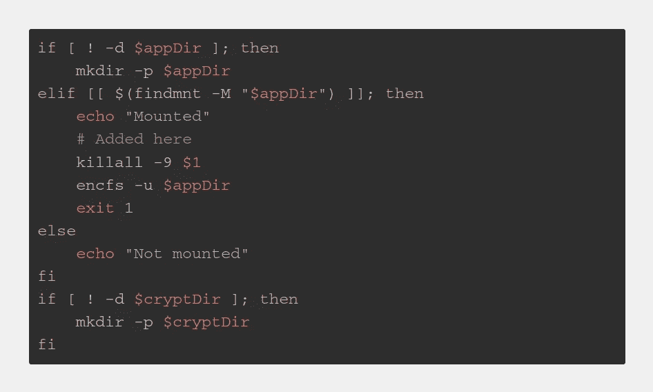

Mount handling with directory creation

# 处理认证

最后，我们将处理脚本执行和堆栈执行，但密码是正确的情况。此外，我们将通过`$?`变量处理控制流量的管理。

非常简单，`$?`变量保存了先前命令的结果。因此，它可以用来控制流量。这里的答案[启发了我。](https://unix.stackexchange.com/questions/22726/how-to-conditionally-do-something-if-a-command-succeeded-or-failed)

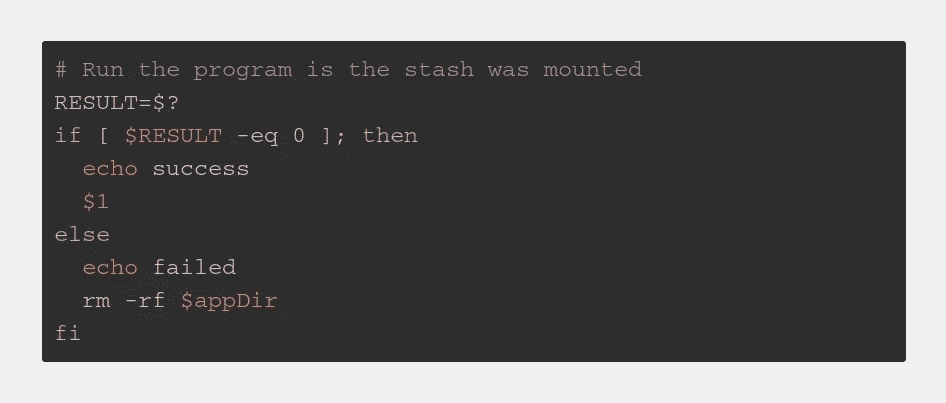

The results variable and flow of control

# 把所有的放在一起

有关最新版本，请查看[我的点文件](https://github.com/HaoZeke/Dotfiles/blob/master/dotfiles/common/.local/bin/cryptHelpers/unlockEncfsApp.sh)。

因为 Medium 不能处理语法高亮，所以这里也把它作为一个要点。

The entire script.

# 未来方向

第一次应该有一个非终极的方法来打开藏毒点。此外，为各种应用制定规则和配置方案可能也很有趣。

*最初发表于* [*魔法书*](https://grimoire.science/locking-and-encrypting-apps-with-encfs/) *。*