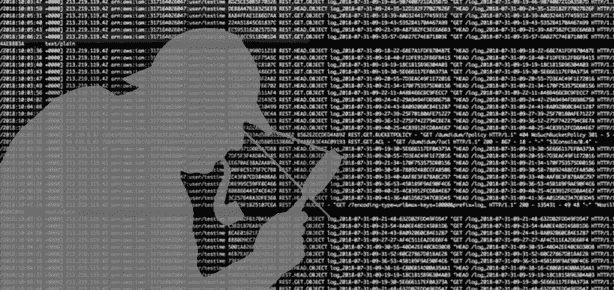
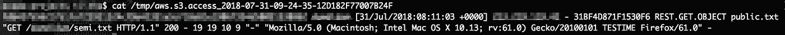
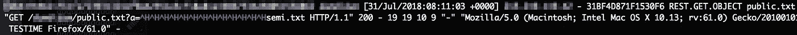
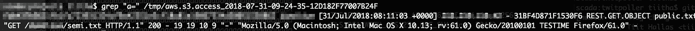
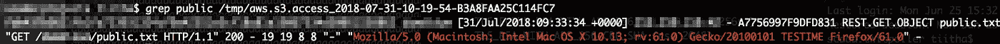
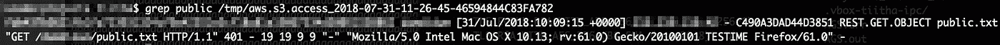

# 日志规避:如果你能，记录我！

> 原文：<https://medium.com/hackernoon/log-evasion-log-me-if-you-can-51a3b7fc1770>



关于日志记录，有不同的方法:尽可能详细地记录每个输入，或者在保存之前清理日志事件和用户输入。这两种方法各有利弊。无论您选择哪种方法，在分析这些日志事件时记住您的选择是很重要的。仅仅..路上不要有任何意外。

我将尝试用下面的 AWS S3 服务器访问日志例子来说明我的观点。尽管我带来了一个基于 S3 的例子，但是请记住，还有其他应用服务器具有类似的“日志记录特性”。因此，请确保您对您的系统如何处理事件日志有一个很好的了解。

# 序言

1.  我创建了我的 S3 桶并启用了服务器访问日志记录。可以参考[亚马逊的教程](https://docs.aws.amazon.com/AmazonS3/latest/user-guide/server-access-logging.html)。
2.  为了分析 S3 访问日志，我将日志文件下载到我的本地存储库中，并使用 GNU 命令行工具来分析事件。为了获取日志文件，我写了一个 [ruby 脚本](https://bitbucket.org/tiitha/poc-ruby/src/master/aws_logs.rb)，搜索新的日志文件，并通过 [AWS S3 REST API](https://docs.aws.amazon.com/AmazonS3/latest/API/Welcome.html) 下载它们。
3.  我已经上传了两个文件到 bucket:public . txt 是一个公开的文档，semi.txt 是一个不与所有人共享的文档。这对理解后面的例子很重要。
4.  请记住，这只是一个演示，而不是一个简单的攻击载体。

# 记录事件

AWS S3 服务器访问日志格式与 Apache web 服务器访问日志非常相似。其中一个重要的区别是 **AWS S3 服务器访问日志被保存为原始数据**！在将事件保存到日志文件之前，不会进行数据验证，也不会对不可打印的符号进行转义。这不是一个错误，但是在以后分析日志文件或者选择日志分析工具时，这是一个需要记住的重要方面。如果您的日志包含未转义的原始数据，那么您的分析工具必须准备好应对恶意内容或针对日志的攻击。

# 等待..有什么好大惊小怪的？

我来举几个例子解释一下。当从 AWS S3 存储桶请求文件时，HTTP GET 请求被发送到 AWS，文件的内容将被返回，事件将被记录到服务器访问日志中。

```
GET /*<bucket_name>*/public.txt HTTP/1.1
Host: s3.eu-central-1.amazonaws.com
User-Agent: Mozilla/5.0 (Macintosh; Intel Mac OS X 10.13; rv:61.0) Gecko/20100101 TESTIME Firefox/61.0
```

将被写入日志事件如下:

```
*<bucket_owner> <bucket_name>* [30/Jul/2018:17:16:55 +0000] 328.496.13.534 — *<request_id>* REST.GET.OBJECT public.txt "GET /*<bucket_name>*/public.txt HTTP/1.1" 200 – 19 19 7 7 "-" "Mozilla/5.0 (Macintosh; Intel Mac OS X 10.13; rv:61.0) Gecko/20100101 TESTIME Firefox/61.0" -
```

到目前为止一切顺利。但是正如我提到的，在 AWS S3 日志中，不可打印的字符没有被转义。这意味着当使用命令行工具分析日志时，您必须记住，不可打印的符号可能会被解释为转义序列，并且屏幕上的事件可能不会像写入文件时那样。这可能会在查看日志文件时造成混乱。让我们通过提出另一个请求来说明这一点。

```
GET /*<bucket_name>*/public.txt?a=*<08><08><08><08><08><08><08><08><08><08><08><08><08>*semi.txt HTTP/1.1
Host: s3.eu-central-1.amazonaws.com
User-Agent: Mozilla/5.0 (Macintosh; Intel Mac OS X 10.13; rv:61.0) Gecko/20100101 TESTIME Firefox/61.0
```

请求中的 *< 08 >* 字符是十六进制表示退格的 [ascii 符号](https://www.asciitable.com)。文件仍然像以前一样被返回。屏幕上日志事件中的日志事件有些不同



Log event for the unescaped backspaces

由于应用程序服务器在将事件写入日志文件之前没有退出退格键，终端将其解释为一个命令，并从显示中删除了 13 个字符。理解这一点很重要:删除只发生在屏幕上**:日志文件仍然包含原始文本和反斜杠字符。终端从您的视图中删除了字符。相同的文件与'六'或十六进制编辑器将揭示真相**



Log event seen in VI

使用“grep”时，情况可能会更加混乱。



Grepping the unescaped characters

如您所见，我标记了参数名称，当显示在屏幕上时，该名称将被删除。想象一下，当您在事故中偶然发现这类事件时:窃取实际上并不存在的东西(例如用户名或其他用户输入值)。

# 退格..就这样吗？

不完全是。用 ASCII 字符毒害日志文件并不是破坏命令行日志分析的唯一可能性。另一种方法是使用 [ANSI 转义序列](http://ascii-table.com/ansi-escape-sequences-vt-100.php)。您可能已经使用这些转义序列和颜色代码为您的终端创建了您喜欢的 CLI 屏幕。这里也可以应用相同的方法。想象一个如下的请求:

```
GET /*<bucket_name>*/public.txt HTTP/1.1
Host: s3.eu-central-1.amazonaws.com
User-Agent: **<*1b*>[31;49m**Mozilla/5.0 (Macintosh; Intel Mac OS X 10.13; rv:61.0) Gecko/20100101 TESTIME Firefox/61.0***<1b>*[0;49m**
```

查看用户代理前后的转义码，其中 *< 1b >* 是转义码的十六进制表示。当抓取日志时，您会在屏幕上看到以下输出



Coloured events

## 好吧，呜哇杜:给提示着色。就这样吗？

不完全是。ANSI 转义序列允许你做更多的事情，而不仅仅是给终端中的字符着色。日志文件中的代码可以在屏幕上重新定位你的光标，重新配置你的终端设置，以及用它做许多其他“有趣”的事情。回到日志回避，考虑下面的请求:

```
GET /*<bucket_name>*/public.txt HTTP/1.1
Host: s3.eu-central-1.amazonaws.com
User-Agent: <*1b*>[21D401*<1b>*[18CMozilla/5.0 (Macintosh; Intel Mac OS X 10.13; rv:61.0) Gecko/20100101 TESTIME Firefox/61.0
```

转义序列是指“*左移 21 位，写****401****，右移 18 位*”。或者换句话说:更改响应代码。



Response changed with escape sequence

当浏览您的日志时，您可能会发现自己对结果很满意，所有的请求都用 *HTTP-40x* 进行了响应。想象一下当对手告诉你他确实看到了文件时会有多惊讶。

或者，如果对手将转义序列***<1b>【2A***("*将光标上移两行"*)附加到用户代理头值，光标将指向日志事件的开头，从而用下一个事件覆盖该事件。或者换句话说:当使用像' *cat* 或' *more* '这样的 GNU 命令行工具时，您的日志事件将被隐藏起来。这些只是几个例子，展示了在分析日志时要考虑什么。

# 我现在该怎么办？

输入验证总是很重要的！不仅在编写应用程序时，而且在记录应用程序行为时也是如此。在我带来的例子中，如果您在记录日志事件时或者在将日志事件加载到您的分析环境时进行验证，这主要是一个品味问题。请记住，您必须在某个地方完成它，并分别设计日志分析环境的其余部分。

这两种方法都有优点和缺点，例如，当有人试图用意想不到的输入来毒害您的日志时，理解这一点是很有用的。无论如何——不要以原始格式保存数据，您可以考虑对不可打印的符号进行转义，不列入白名单或忽略它们。

不时地从您的日志中搜索这种不可打印的符号也将是有益的，以查看是否有人试图逃避您的日志系统。