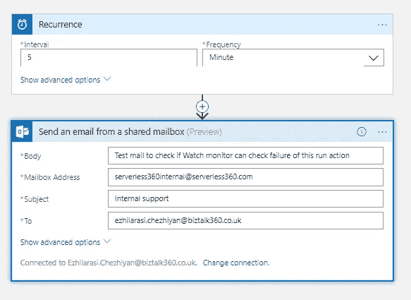
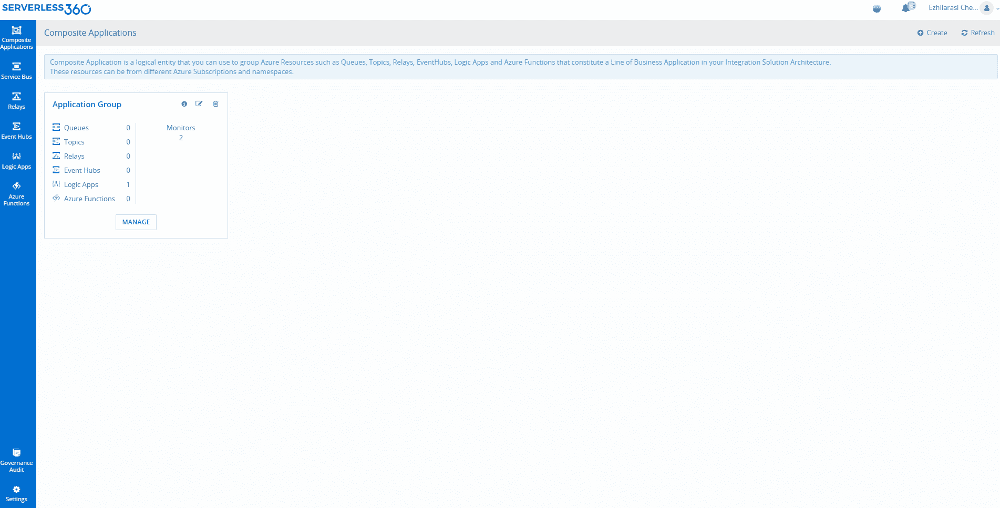
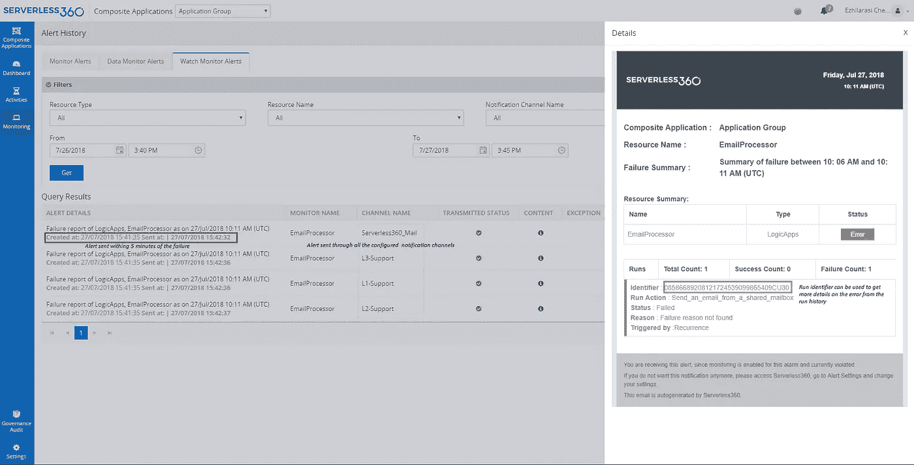
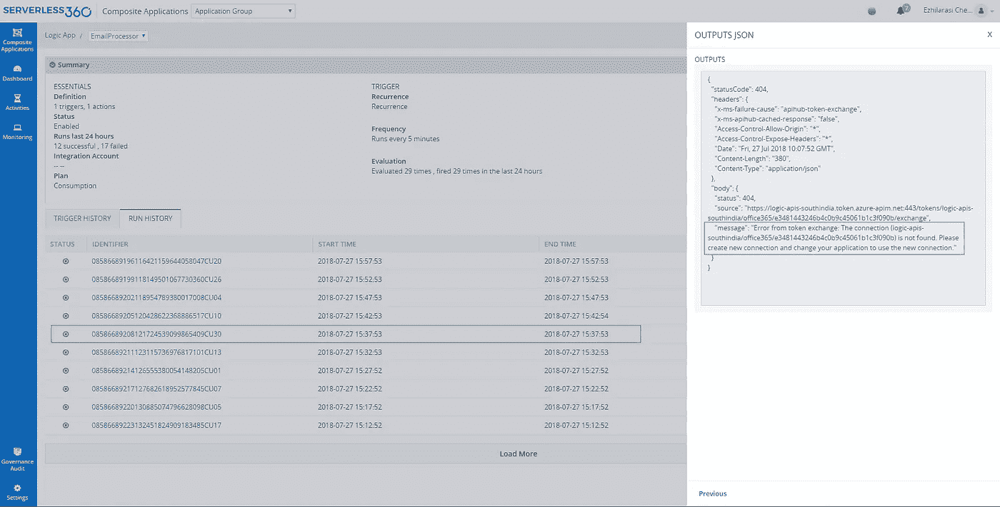

# 运行操作失败的逻辑应用程序监视监视器

> 原文：<https://medium.com/hackernoon/logic-apps-watch-monitor-for-run-action-failures-8f18ba98ef06>

这个用例是我们的一个潜在客户所面临的生产层面问题的简化版本。他们有一个逻辑[应用](https://hackernoon.com/tagged/app)在他们的业务流程中扮演着关键角色。问题是他们没有意识到逻辑应用程序中的一个**运行动作**的失败。由于 OAuth 令牌未按预期从身份验证提供程序刷新，特定运行操作失败。

因此，我们通过[无服务器 360](http://serverless360.com/?utm_source=Serverless360_blog) 中的【手表】[监控](https://hackernoon.com/tagged/monitoring)功能提出了一个解决方案。

每个逻辑应用程序都有一个或多个触发器定义，随后是一系列定义工作流的运行操作。可能会出现这样的情况:触发器可能会成功，但其中一个运行操作可能会失败。这将中断工作流，立即通知运行操作失败并提供详细信息将对启动工作流有很大帮助。

创建了一个名为“EmailProcessor”的逻辑应用程序，其重复触发器的频率为 5 分钟。它有一个从共享邮箱帐户发送电子邮件的运行操作。我们已经使用对共享邮箱帐户具有必要权限的电子邮件 id 对此进行了身份验证。

# 逻辑应用监视监视器

此逻辑应用程序现在与 Serverless360 复合应用程序相关联，并且“监视”监控已启用。从这一刻起，将持续监视逻辑应用程序，并在故障发生 5 分钟内将警报转发到配置的通知通道(这是 Serverless360 中的默认通知频率，不要与上面设置的逻辑应用程序频率相混淆)。

这个逻辑应用程序预计会以 5 分钟的频率向收件人电子邮件触发电子邮件。与客户提到的不同，我们在逻辑应用程序运行操作中没有遇到任何故障。在我们的例子中，OAuth 令牌被正确刷新。

因此，我们强迫工作流创建一个 OAuth 错误。因此，我们可以检查 Serverless360“监视”监视器是否可以生成警报。因此，我们删除了逻辑应用程序将用来获取 OAuth 令牌的 API 连接。现在，获取令牌的尝试肯定会失败，反过来，run 操作也会失败。因此，我们收到了来自 Serverless360 的 Logic Apps watch monitor 警报——“Logic App，EmailProcessor 的故障报告”。

借助 Serverless360，您可以深入查看 logic 应用程序的运行历史，并使用运行标识符识别运行，从而更清楚地了解故障。失败运行操作的输出将详细说明失败原因。

运行操作在 2018-07-27 15:37:53 失败

Logic Apps watch monitor 检测到故障并在 2018-07-27 15:41:35 生成警报，最重要的是，警报被转发到通知渠道以采取纠正措施。

同样，您可能需要在 Azure Function 中获得调用失败的通知。借助 Serverless360，现在可以近乎实时地获得逻辑应用和 Azure 功能调用失败的通知。

您可以使用 Serverless360 的其他有趣用例可以在[这里](https://www.serverless360.com/blog/tag/use-case)找到。

*Serverless360 是一个操作、管理和监控 Azure 无服务器组件的单一平台工具。它提供了 Azure Portal 中没有且可能没有的高效工具。免费试用* [*无服务器 360*](https://www.serverless360.com/?utm_source=Serverless360-Blog)*30 天！*

*原载于 2018 年 7 月 30 日*[*www.serverless360.com*](https://www.serverless360.com/blog/logic-apps-watch-monitor)*。*