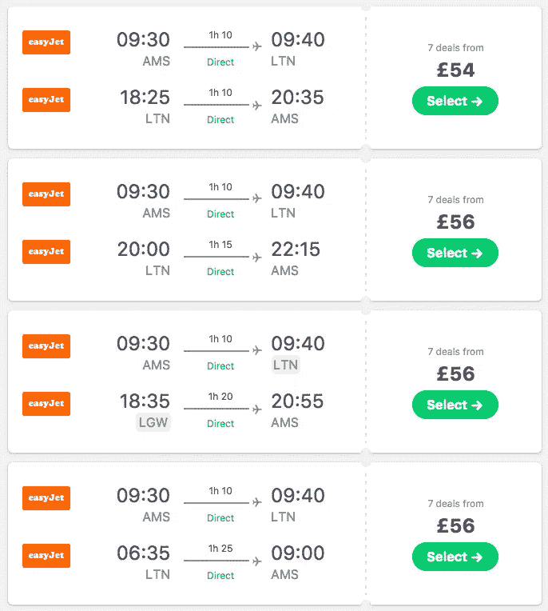
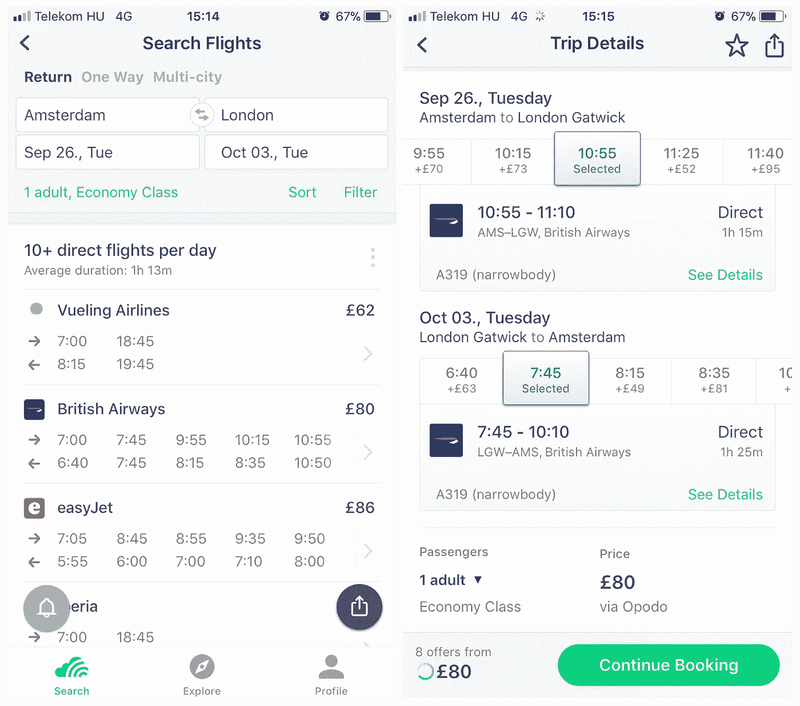

# 从新的角度看待你的产品

> 原文：<https://medium.com/hackernoon/look-at-your-product-from-a-new-perspective-f0709760614b>

*安德烈·希波什，* [*Skyscanner 工程*](https://medium.com/u/401f3b3c958f?source=post_page-----f0709760614b--------------------------------) 的产品经理

Look at your product from a new perspective

2015 年，我们重新设计并完全重写了我们的航班应用程序。在大量的研究、规划、可用性测试会议和编码时间之后，我们对这一变化感到非常兴奋，迫不及待地想看看用户和市场对此会有什么反应。在 2015 年 10 月发布后，我们看到了第一批评论，我们很满意。我们预计由于这一重大变化，收视率会有小幅下降，幸运的是，几天后，我们的所有指标都比以前提高了一个级别。

只有一个问题:荷兰的收视率似乎没有回升。我们不明白为什么会发生这种情况，所以我们开始深入研究。我们开始分析用户行为，比较新旧应用程序的模式，并得出结论:我们让荷兰的体验变得更加艰难，因此他们悲伤和沮丧的评论完全合理。

# 怎么了?

信不信由你，我们引入的改变是一个合乎逻辑和自然的决定。当用户首先选择出港航班，然后选择进港航班时，我们将返程路线显示为一个产品，而不是按航段选择，出港和进港组合显示为一个选项。大部分旅游网站都是这样，那有什么问题呢？在大多数情况下，这是一个更加无缝的体验，但在少数情况下，这使得选择更加复杂。不幸的是，在荷兰，这是大多数搜索的情况。

看看荷兰，阿姆斯特丹是他们最繁忙的机场，它与数百个机场有直接联系。最受欢迎的航线每天有 50-100 多个直飞航班。例如，从阿姆斯特丹到伦敦的单向搜索显示 10 月份某个休闲星期一的 200 多个结果。这是我们问题的根本原因:在按航段选择布局中，用户必须从 100+个出港航班中选择，然后是 100+个进港航班。当我们列出所有航班组合时，噩梦就开始了，因此旅行者被迫从 1000 多条路线中进行选择。这不是一件容易的工作。不是一个快乐的旅行者。

# 更多的认知负荷，更多的痛苦

我们倾向于认为选择是用户旅程中的一个步骤:搜索和预订之间的必要过渡。但是如果我们仔细看看一个旅行者在浏览结果列表时心里在想什么，我们可以看到这是一个相当繁重的任务 [*信息处理、分析并最终做出决定*](https://en.wikipedia.org/wiki/Buyer_decision_process) *。*

为了能够做出决定，旅行者首先必须处理和分析数据，因此他们在结果列表中上下滚动。由于一种被称为 [*信息偏差*](https://en.wikipedia.org/wiki/Information_bias_(psychology)) 的一般判断模式，人们觉得他们获得的信息越多，他们的决策就越好，因此他们试图尽可能多地吸收信息。然而，信息的使用和存储——无论是在内存中还是在外部环境中——都需要大量的注意力。基本上，当你打开 28 个浏览器标签时，你的大脑感觉就像你的笔记本电脑的反应一样:当有太多的东西要处理时，你的大脑开始受伤并变慢。

# 简单点

在这项研究中，我们意识到，我们需要更好地了解我们的结果集的性质，以及用户在特定搜索中需要面对的选择问题。下面是一个很好的练习:

当你计划度假时，你如何向你的伴侣解释飞行路线？你看着结果，勾勒出你的选择:“*这条路线上有很多相同价格的直飞航班，所以我们可以选择我们想去的时间。”*

或者:*“只有周二和周五有直飞航班，所以在那几天离开是值得的，而不是浪费大量时间在转机上。”这是一个比显示 1000 个结果更好的总结，不是吗？*

我们开始解决我们在阿姆斯特丹-伦敦搜索中看到的问题，并尝试了几种解决方案，直到我们找到一种真正提高选择体验质量的解决方案。

Timetable widget

在阿姆斯特丹-伦敦的搜索中，旅行者需要考虑什么？首先，有 1000 多个结果，没问题。查看前 20-30 个结果，价格非常相似，航线由低成本航空公司主导。由于这是一条直达路线，旅程的持续时间是相同的。那么有什么不同呢？起飞时间明显不同，而且不同的航空公司去伦敦不同的机场。基本上，旅行者需要选择他们想乘坐哪家航空公司的航班去哪个机场，然后他们需要选择出发时间。这就是我们的解决方案所支持的。这个所谓的时刻表小部件出现在结果列表上方，显示可用的航空公司、最便宜的价格以及所有的出发时间。选择一家航空公司后，会出现一个按航段选择的视图。

上面的解决方案给出了结果的快速概览，并突出了主要的决策点。引入它后，我们的转换数字和评级上升了，因为我们减少了认知负荷，使选择不那么痛苦。

# 理解我们展示的东西

从这个项目中学到的一个巨大的教训是，构建一个选择体验不仅仅是精心制作用户界面，让体验尽可能地简单和无缝:我们还需要尽可能多地了解我们的内容。内容的特性会给用户带来独特的选择问题。如果一个人构建了一个通用的解决方案，你将会错过让用户的生活变得更容易的机会。定制内容体验的力量在于，你可以为所有使用你产品的用户提供价值，不管他们对你的产品了解多少。

当你的用户使用你的产品时，了解他们在想什么是管理好产品的关键。它可以给你新的想法，新的灵感，并突出什么是最关键的问题要解决。您可以构建任何新功能，但是用户可能不会使用它，因为他们正在努力处理信息。在我们的案例中，了解用户在使用我们的产品时需要对他们的航班行程做出什么决定是至关重要的。

如果你对这个发现给我们的工程方法带来了什么变化感兴趣，请阅读之前的一篇文章，来自 Zsombor Fuszenecker 的 [*从路线到部件*](/@SkyscannerEng/from-itineraries-to-widgets-9b89ca72fda4) 。

# 和我们一起看世界

我们的许多员工都有机会利用我们的 Skyscanner 员工体验计划(请参阅)，这是一项自筹资金、自行组织的计划，在 24 个月的时间里，在我们 10 个全球办事处中的一些办事处工作 30 天。如果员工在他们称之为家的国家之外的办公室工作，他们还有机会每年在自己的国家工作 15 天。

喜欢这个声音吗？看看我们目前的 [Skyscanner 产品工程职位。](https://www.skyscanner.net/jobs/productengineering/)

[We’re hiring!](https://www.skyscanner.net/jobs/productengineering/)

# 关于作者

我叫安德里亚·希波什，是 Skyscanner 航班选择体验项目的首席产品经理。我喜欢做研究，挖掘细节，发现隐藏的模式，并提出让人们生活更轻松的解决方案。

在 Skyscanner 工作之外，我喜欢玩棋盘和纸牌游戏、阅读或发现地方。

Andrea Sipos, Skyscanner