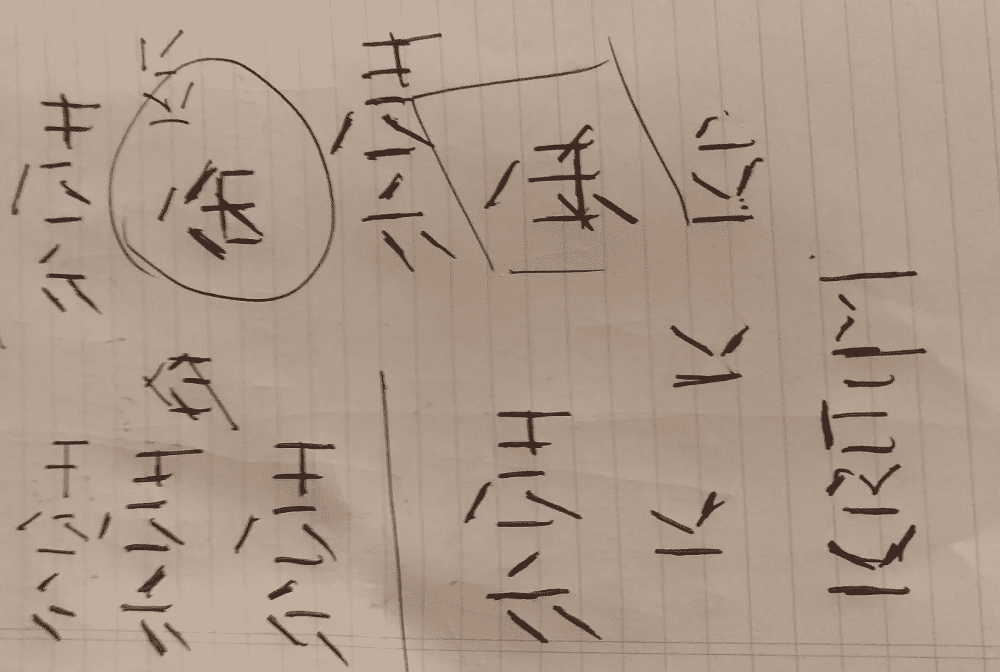
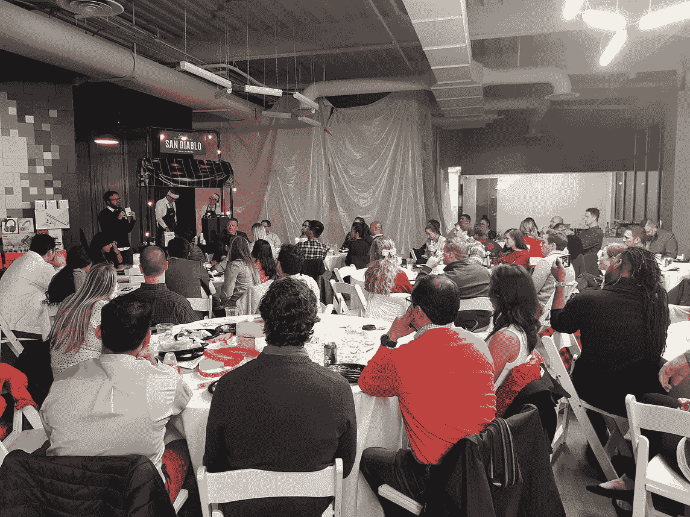

# 一位技术官对 2017 年的回顾

> 原文：<https://medium.com/hackernoon/looking-back-at-2017-a550fb945e81>

现在是凌晨 12 点 18 分，我在两天内第四次浏览 Bret Victor 的[发明原理讲座](https://vimeo.com/36579366)。我有点失望，我晚了 6 年 653，000 次浏览。不过，这是我第四次在另一个屏幕上看到文字记录，我这边还有新年剩下的酒。

今年的除夕夜太棒了。我在我的新公寓举办了一次聚会&我们玩得非常开心！

Moved to a new apartment in December.

Just Dance!

这个派对让我想起了辛辛那提，在那里我和朋友们一起度过了周末，并以一篇写得很好的决心帖子结束了这一年。

这一次不同。

**我删除了我之前所有的媒体文章。**

2018 年将会更加一成不变。*(稍后更)*

> 迭代。改造。

“brainstorming”

今年，**1.5 年后见到了父母。**最重要的是，我在当选为尼泊尔最大的电信服务提供商尼泊尔电信的**董事总经理后，见到了我的母亲。**

Making us proud, everyday!

**夹转 5。**我于 2014 年加入支付创业公司，在加州做暑期实习生。该公司在墨西哥已经成为一个家喻户晓的名字(*“Clip”*)，并为成千上万的小企业提供了通过接受信用卡来销售更多产品的能力。

今天，我们在墨西哥、加利福尼亚和犹他州已经从十几个人发展到 200 多人。我对公司在过去几年的成就感到无比自豪。

**尼泊尔代码在 2017 年达到新的高度。**我们在尼泊尔启动了两个奖学金项目，在 Janakpur 举办了有史以来第一次数字会议，为慈善事业筹集资金&从旧金山湾区开始，创建了许多分会中的第一个。

We started writing memos [too](https://github.com/Code4Nepal/bay-area).

**2017 年，我第一次真正了解了加密货币，区块链的发展。**

我从 2015 年开始投入到这个领域，但只是在今年，我切换到完全沉浸在[技术](https://hackernoon.com/tagged/technology)中。

我们致力于构建一个原型(概念验证)，但由于技术限制，不得不暂停该项目。

我们回到绘图板，重新评估我们的想法和愿景。关于接下来会发生什么，我们有很多可以分享的，敬请期待 2018 年*(不过说真的！)*。

与此同时，如果你对这个不断增长的空间感兴趣，[打个招呼吧！](https://twitter.com/intent/tweet?text=@prashishh%20I%20want%20to%20learn%20more%20about%20)

**我上了 Udacity 的深度学习课程。**

为了提高我们的机器学习技能，我们决定从事一些业余爱好项目。不幸的是，我们无法完成它们，因为我们花了整整一年的时间来讨论，而不是去做。**我们更多地钻研问题陈述，而不是实现。**它把我们引入了一个兔子洞，我们出不来了。

我们感兴趣的项目有:预测加密货币价格，估计车辆行驶时间，识别涂鸦&讲故事，以及根据通货膨胀预测政府的成功。

如果你有兴趣合作，[留言给我！](https://twitter.com/intent/tweet?text=@prashishh%20Sounds%20interesting,%20I%20can%20collaborate%20on%20)

今年，我还有机会在旧金山湾区组织了有史以来第一次人工智能(AI)黑客马拉松。

签署获奖证书很有趣！

#GlobalAIHackathon in Pubnub, San Francisco.

我挑战自己去控制我的财务和投资。目标是了解股票市场&获得比所有指数基金更高的回报。

These were the kind of conversation we used to have on a daily basis.

到了年底，我获得了 3 倍于平均水平的收益。阅读盈利报告和技术分析是一种有趣的体验。我会继续这样做。

我几个月没吃肉了。问任何我认识的人我有多爱吃肉。如果今年我为一件事感到骄傲，那就是它，毫无疑问！

这个过程并不像我想象的那么令人生畏。我想有一天你突然醒来，发现自己变了一个人的故事是真实的，这是有原因的。)。

我还没有完全转向绿色，但是我已经大大减少了我的肉类摄入量。我 2018 年的目标是少吃乳制品&鸡蛋，经常锻炼。

我给你留下我今年最喜欢的读物，并再次祝你新年快乐！

# 2017 年最喜欢的读物:

 [## 通过建造一个来了解区块链

### 了解区块链如何工作的最快方法是建造一个

hackernoon.com](https://hackernoon.com/learn-blockchains-by-building-one-117428612f46)  [## 一年靠 10 万美元生活是什么样子

### 导致参议院通过全面税收改革计划的辩论的一个核心问题是，哪些美国人…

www.npr.org](https://www.npr.org/2017/12/03/567602293/what-living-on-100-000-a-year-looks-like)  [## 不要听信炒作——为什么比特币 1 万美元的价格没有反映出它的真实价值。

### 以下是过去几天的一些财经新闻标题:

分散。今天](https://decentralize.today/dont-fall-for-the-hype-why-bitcoin-s-10-000-price-doesn-t-reflect-its-true-value-6b42a59fce0a)  [## 不要再纠结于“团队”

### 听起来熟悉吗？

hackernoon.com](https://hackernoon.com/stop-obsessing-over-the-teams-454fae465d63)  [## 计算机视觉一年

### 然而，随着类别数量的增加，更大数据集的引入可能会为…提供新的度量标准

www.themtank.org](http://www.themtank.org/a-year-in-computer-vision)  [## 网上出问题了

### 我是詹姆斯·布赖德。我是一名关注科技和文化的作家和艺术家。我通常写在自己的博客上，但是…

medium.com](/@jamesbridle/something-is-wrong-on-the-internet-c39c471271d2)  [## 我是如何为了 15600 美元的奖金黑进谷歌的 bug 追踪系统的

### 硬通货的简单错误

medium.freecodecamp.org](https://medium.freecodecamp.org/messing-with-the-google-buganizer-system-for-15-600-in-bounties-58f86cc9f9a5)  [## 算法并不总是答案

### 几年前，我在一家以数据为中心的公司面试图书编辑，该公司让我签署了一份保密协议，所以我…

mobile.nytimes.com](https://mobile.nytimes.com/2017/11/24/opinion/sunday/holidays-gifts-algorithms-online-dating.html?referer=https://getpocket.com/recommendations)  [## 以太坊到底是怎么运作的？

### 介绍

medium.com](/@preethikasireddy/how-does-ethereum-work-anyway-22d1df506369)  [## 我们的非营利组织需要一种更便宜的方式来发送电子邮件。所以我们设计了一个。

### 每周，我都会给 100 万注册 freeCodeCamp.org 的人发一封电子邮件。

medium.freecodecamp.org](https://medium.freecodecamp.org/our-nonprofit-needed-a-cheaper-way-to-send-email-blasts-so-we-engineered-one-167322e3f28e)  [## 汇丰银行正在一点一点地扼杀我的业务——如何计划你的银行搞砸

### 2012 年我成立了自己的公司。在为别人工作了几十年后，我觉得是时候了。我有…

medium.com](/@photonstorm/hsbc-is-killing-my-business-piece-by-piece-d7f5547f3929)  [## 你现在已经完全优化了

### 当你醒来的时候，已经是早上 6 点了，你想。你不确定，所以你问 Alexa。已经 6 点 15 分了——你一定是要了……

thebolditalic.com](https://thebolditalic.com/you-are-now-fully-optimized-716f482b17f5)  [## 有人有资格申请 H-1B 签证吗？

### 六个月前，我中了彩票——为外国技术工人办理 H-1B 签证的彩票。我称我的激动…

mobile.nytimes.com](https://mobile.nytimes.com/2017/11/23/opinion/immigration-visa-h1b-trump-.html)  [## 区块链、协议和代币销售入门

### 区块链正在改变全球经济的基础，每个人都吓坏了。

hackernoon.com](https://hackernoon.com/a-primer-on-blockchains-protocols-and-token-sales-9ebe117b5759)  [## Storj:不是黑仔的 Dropbox

### Storj 是一种“存储硬币”,拥有超过 3000 万美元的 ICO 资金。如果 Storj 被……成千上万的投资者将会被激怒

shitcoin.com](https://shitcoin.com/storj-not-a-dropbox-killer-1a9f27983d70)  [## 资助区块链的发展

### 区块链是数字有机体。随着生物体通过 DNA 的变化而进化，区块链协议也在进化…

medium.com](/@FEhrsam/funding-the-evolution-of-blockchains-87d160988481)  [## 在网飞工作

### 在网飞 2015 工作:在 Netfilx 工作是什么感觉？Brendan Gregg 描述了他在网飞的工作和经历…

www.brendangregg.com](http://www.brendangregg.com/blog/2015-01-20/working-at-netflix.html)  [## 优步的首席执行官在玩火

### UberCab 当时被称为 Uber cab，于 2010 年 5 月在旧金山开始服务。坎普先生和卡兰尼克先生…

www.nytimes.com](https://www.nytimes.com/2017/04/23/technology/travis-kalanick-pushes-uber-and-himself-to-the-precipice.html)  [## 特雷罗，“吉拉烂透了”，和工具功能障碍

### 我喜欢特雷罗，因为你很少会把事情搞砸。你只是不使用特雷罗的“更多…

hackernoon.com](https://hackernoon.com/trello-jira-sucks-and-tool-dysfunction-e80c8000a431)  [## 比特币、以太坊、区块链、代币、ico:为什么有人要关心？

### 密码市场正在变得越来越活跃。无视重力的价格反弹…

hackernoon.com](https://hackernoon.com/bitcoin-ethereum-blockchain-tokens-icos-why-should-anyone-care-890b868cec06)  [## Neuralink 和大脑的神奇未来——等等，为什么

### 注意:如果你想打印这篇文章或者离线阅读，PDF 可能是最好的选择。你可以在这里买到。还有…

waitbutwhy.com](https://waitbutwhy.com/2017/04/neuralink.html)  [## 黑客偷了我的网站…我花了 30，000 美元把它拿了回来

### 真实的故事。

medium.freecodecamp.org](https://medium.freecodecamp.org/hackers-stole-my-website-and-i-pulled-off-a-30-000-sting-operation-to-get-it-back-143d43ee3742)  [## 硅谷:现实检验

### 全国上下都在说:奇怪又毫无意义的 400 美元 wi-fi 榨汁机公司 Juicero 是硅的完美象征…

slatestarcodex.com](http://slatestarcodex.com/2017/05/11/silicon-valley-a-reality-check/)  [## WTF？我花了 1207.40 美元买书？

### 几天前，我订购了 61 本书，其中大部分你可能从未听说过。我甚至没有退缩当亚马逊…

medium.com](/the-mission/wtf-i-just-spent-1-207-40-on-books-6e5639e1f7bc)  [## 我们如何建造 r/Place

### 每年的愚人节，我们不搞恶作剧，而是创建一个探索人类互动方式的项目…

redditblog.com](https://redditblog.com/2017/04/13/how-we-built-rplace/)  [## Stripe 如何教员工编码

### 代码是 Stripe 的核心:我们构建 API、软件工具和基础设施，供其他软件使用…

stripe.com](https://stripe.com/blog/teaching-employees-to-code)  [## 5000 美元，没有任何附加条件

### 当我在大学的时候，我面临着一大堆毫无吸引力的工作机会，需要把我的简历打磨成…

medium.com](/@nayafia/5-000-no-strings-attached-9e7b95d33e50)  [## 独裁主义者如何获胜

### 如何理性思考明天

umairhaque.com](https://umairhaque.com/how-authoritarians-win-12904f9bb651) 

# 2017 年最喜欢的书:

 [## 艰难事物的艰难之处在于

### 很多人都在谈论创业有多棒，但只有本·霍洛维茨直言不讳地承认创业有多难…

www.goodreads.com](https://www.goodreads.com/book/show/18176747-the-hard-thing-about-hard-things)  [## 新兴国家

### 《创业国度》有 5929 个评分和 676 条评论。穆罕默德·马克拉姆说:الكتابمنالسخافةبحيثلاأتوقعاتمامهالالأ…

www.goodreads.com](https://www.goodreads.com/book/show/6885191-start-up-nation)  [## 自我是敌人

### 《自我是敌人》有 14361 个评分和 932 条评论。若昂说:认识我的人都知道我是……的超级粉丝

www.goodreads.com](https://www.goodreads.com/book/show/27036528-ego-is-the-enemy)  [## 货币互联网

### 货币互联网有 762 个评分和 95 个评论。乔治说:安德烈亚斯·m·安东诺普洛斯的《货币互联网》是…

www.goodreads.com](https://www.goodreads.com/book/show/31869077-the-internet-of-money)  [## 谈写好文章

### 《论写作》因其合理的建议、清晰的思路和热情的风格而受到好评。这是一本给…的书

www.goodreads.com](https://www.goodreads.com/book/show/53343.On_Writing_Well)  [## 我在建筑学校学到的 101 件事

### 我在建筑学校学到的 101 件事有 3313 个评分和 188 个评论。内特说:我们都听说过我们…

www.goodreads.com](https://www.goodreads.com/book/show/1958355.101_Things_I_Learned_in_Architecture_School)  [## 撤销项目

### 撤销项目有 20，764 个评分和 2，025 个评论。崔西说:这本非虚构小说不像其他的迈克尔·刘易斯…

www.goodreads.com](https://www.goodreads.com/book/show/35631386-the-undoing-project) 

# 2017 年最喜欢的演讲:

如果你在 2017 年看到任何好的帖子或书籍，请在下面评论。